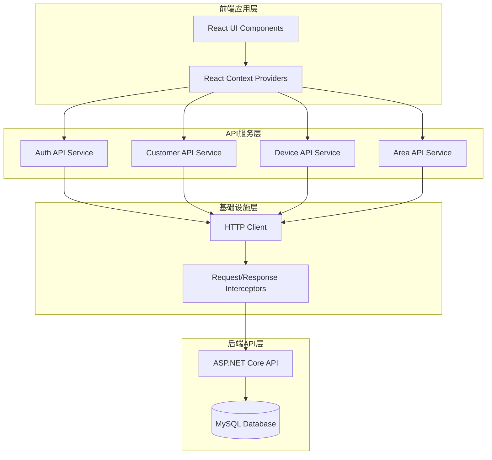

## 产品概述

将IoT平台前端应用从完全依赖模拟数据的状态，迁移到与真实后端API接口进行通信的状态。

## 核心功能

- 前端安装HTTP客户端库（axios），创建统一的API服务层
- 替换所有Context中的模拟数据请求为真实API调用
- 实现JWT认证和权限控制的完整集成
- 同步前后端数据结构，解决类型不一致问题
- 保持现有UI界面不变，仅替换数据来源

## 技术栈选择

- **前端框架**: React + TypeScript (保持现有)
- **HTTP客户端**: axios (新增)
- **API架构**: RESTful API (后端已实现)
- **认证方式**: JWT Bearer Token (后端已配置)

## 实现方案

### 核心策略

采用分层架构，在现有React Context层和真实API之间构建API服务层，实现平滑迁移：

1. **基础设施层**: 创建axios实例配置，包含JWT认证拦截器
2. **API服务层**: 按功能模块封装后端API调用
3. **适配器层**: 转换前后端数据格式，解决ID类型差异
4. **Context层**: 逐步替换模拟数据方法为API调用

### 关键技术决策

1. **ID类型转换**: 后端使用`long`类型，前端使用`string`类型。解决方案：在API服务层进行转换
2. **认证集成**: 使用axios拦截器自动处理JWT Token
3. **错误处理**: 统一错误处理机制，保持用户界面友好
4. **数据缓存**: Context层保持现有状态管理，API调用作为数据源

### 性能与可靠性

- **分页加载**: 所有列表数据使用后端分页
- **错误重试**: 对关键API实现自动重试机制
- **加载状态**: 保持现有UI加载状态不变
- **离线降级**: 关键数据在localStorage缓存，网络失败时降级显示

### 架构设计



### 实现细节

#### 1. HTTP客户端配置

创建统一的axios实例，配置baseURL、超时设置和拦截器：

- 请求拦截器：自动添加JWT Token
- 响应拦截器：统一错误处理和Token刷新

#### 2. API服务模块化

按功能模块组织API服务：

- `authApi.ts`: 登录、登出、当前用户信息
- `customerApi.ts`: 客户管理相关API
- `deviceApi.ts`: 设备管理相关API
- `areaApi.ts`: 区域管理相关API
- `commonApi.ts`: 通用工具函数和类型定义

#### 3. 数据格式适配

创建数据适配器函数，处理前后端字段差异：

- ID类型转换: `string` ↔ `long`
- 日期格式标准化
- 枚举值映射

## 目录结构

```
g:/IoTPlatform/Web/
├── src/
│   ├── app/
│   │   ├── contexts/
│   │   │   ├── AuthContext.tsx              # [MODIFY] 替换login/logout等模拟方法
│   │   │   ├── DeviceContext.tsx            # [MODIFY] 替换设备CRUD操作
│   │   │   └── AreaContext.tsx              # [MODIFY] 替换区域数据获取
│   │   ├── services/
│   │   │   ├── api/
│   │   │   │   ├── httpClient.ts            # [NEW] HTTP客户端配置和拦截器
│   │   │   │   ├── authApi.ts               # [NEW] 认证相关API封装
│   │   │   │   ├── customerApi.ts           # [NEW] 客户管理API封装
│   │   │   │   ├── deviceApi.ts             # [NEW] 设备管理API封装
│   │   │   │   ├── areaApi.ts               # [NEW] 区域管理API封装
│   │   │   │   ├── commonApi.ts             # [NEW] 通用API工具函数
│   │   │   │   └── types/
│   │   │   │       ├── index.ts             # [NEW] API类型定义导出
│   │   │   │       ├── auth.types.ts        # [NEW] 认证相关类型
│   │   │   │       ├── customer.types.ts    # [NEW] 客户相关类型
│   │   │   │       ├── device.types.ts      # [NEW] 设备相关类型
│   │   │   │       └── area.types.ts        # [NEW] 区域相关类型
│   │   │   └── adapters/
│   │   │       ├── authAdapter.ts           # [NEW] 认证数据适配器
│   │   │       ├── customerAdapter.ts       # [NEW] 客户数据适配器
│   │   │       ├── deviceAdapter.ts         # [NEW] 设备数据适配器
│   │   │       ├── areaAdapter.ts           # [NEW] 区域数据适配器
│   │   │       └── index.ts                 # [NEW] 适配器统一导出
│   │   ├── pages/
│   │   │   ├── CustomersPage.tsx            # [MODIFY] 客户页面数据源替换
│   │   │   ├── DevicesPage.tsx              # [MODIFY] 设备页面数据源替换
│   │   │   └── AreaManagementPage.tsx       # [MODIFY] 区域页面数据源替换
│   │   └── App.tsx                          # [MODIFY] 添加API配置初始化
│   └── main.tsx                             # [MODIFY] 添加环境变量配置
├── .env                                     # [NEW] 环境变量配置文件
└── package.json                             # [MODIFY] 添加axios依赖
```

### 关键代码结构

#### HTTP客户端配置接口

```typescript
// src/app/services/api/httpClient.ts
import axios, { AxiosInstance, InternalAxiosRequestConfig } from 'axios';

export interface ApiConfig {
  baseURL: string;
  timeout: number;
  withCredentials: boolean;
}

export interface ErrorResponse {
  code: number;
  message: string;
  timestamp: number;
}

export const createHttpClient = (config: ApiConfig): AxiosInstance => {
  const client = axios.create(config);
  
  // 请求拦截器 - 添加JWT Token
  client.interceptors.request.use(
    (config: InternalAxiosRequestConfig) => {
      const token = localStorage.getItem('token');
      if (token) {
        config.headers.Authorization = `Bearer ${token}`;
      }
      return config;
    },
    (error) => Promise.reject(error)
  );
  
  // 响应拦截器 - 统一错误处理
  client.interceptors.response.use(
    (response) => response.data, // 直接返回data部分
    (error) => {
      // 统一错误处理逻辑
      return Promise.reject(error);
    }
  );
  
  return client;
};
```

#### API响应类型定义

```typescript
// src/app/services/api/types/common.types.ts
export interface ApiResponse<T> {
  code: number;
  message: string;
  data: T;
  timestamp: number;
}

export interface PagedResponse<T> {
  items: T[];
  totalCount: number;
  page: number;
  pageSize: number;
  totalPages: number;
}

export interface ApiError {
  code: number;
  message: string;
  details?: Record<string, string[]>;
}
```

## 代理扩展

### SubAgent

- **code-explorer**
- 目的：在实施过程中帮助探索和验证前后端代码结构，确保API调用的正确性
- 预期结果：快速定位需要修改的文件，验证API响应格式，辅助调试数据映射问题