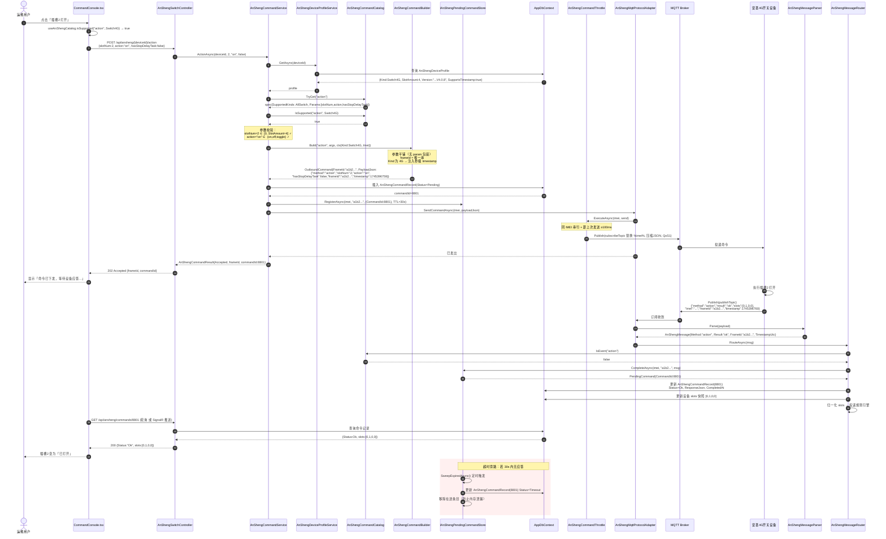
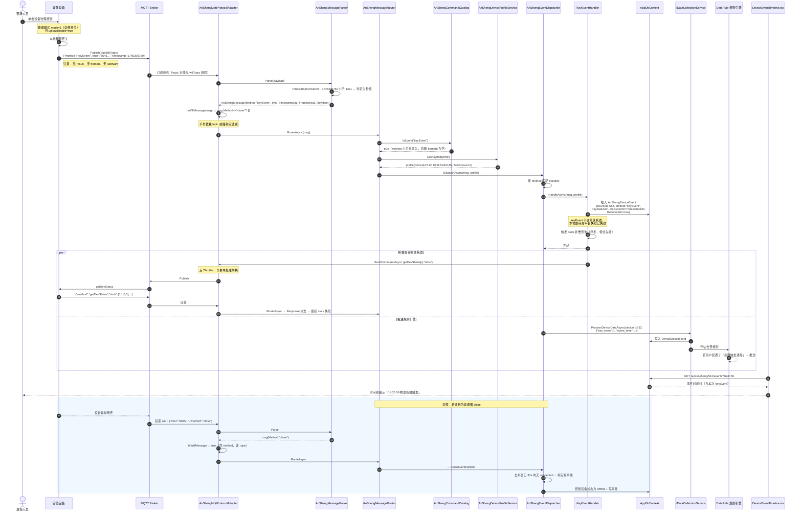
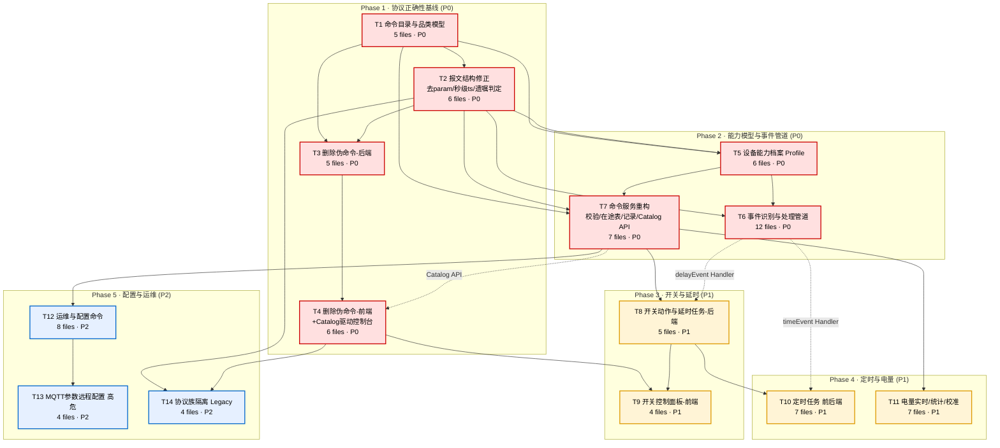

# 安圣二开设备（开放式硬件）MQTT 协议集成 — 全面梳理与重新设计

> 文档类型：架构设计文档（不含业务代码实现）
> 协议依据：`H:\IoTPlatform\asopen.md`（安圣开放式硬件开发协议，5320 行，40 个命令/事件章节）
> 代码基线：IoTPlatform（.NET 8 + EF Core + MQTTnet；Web/ 为 React 18 + TS + Vite + Tailwind）
> 作者：架构师 高见远
> 状态：待评审

---

## 目录

1. [协议全景表](#1-协议全景表)
2. [差异清单](#2-差异清单)
3. [重新设计决策](#3-重新设计决策)
4. [目标架构](#4-目标架构)
5. [数据结构定义](#5-数据结构定义)
6. [任务分解](#6-任务分解)
7. [风险与待明确事项](#7-风险与待明确事项)

---

## 0. 前置结论（阅读本文档前必须理解的 4 个事实）

在展开细节之前，先给出 4 条推翻现有实现前提的关键事实。它们决定了本次不是"补几个命令"，而是**协议层重构**。

### 事实 A：二开协议的命令参数是**平铺在顶层**的，没有 `param` 包装

协议文档全部 40 个章节的命令示例，参数均与 `method` 同级：

```json
{ "method": "action", "slotNum": 1, "action": "on", "hasStopDelayTask": false, "frameId": "1745396239780" }
```

而现有 `AnShengCommandBuilder.BuildCommand()` / `AnShengMessage.Param` 均按 `{"method":"x","param":{...}}` 结构收发。
**影响：现有代码下发的任何带参命令，二开设备都无法解析。** 这是 1 号阻断级缺陷。

### 事实 B：`willTopic` 与 `publishTopic` 允许是**同一个主题**

协议文档「MQTT参数配置例子·例子一」：

```json
"publishTopic":"/iot/server/iot-board", "willTopic":"/iot/server/iot-board",
"will":"{\"imei\":\"%imei%\",\"method\": \"close\"}"
```

即遗嘱和正常上报可以走同一条 topic。现有 `AnShengMqttProtocolAdapter.OnMessageReceivedAsync` 用
`topic.StartsWith("/devtoser/will")` 判定遗嘱，在此配置下会把**所有上报误判为在线消息**，或反之全部误判为离线。
**正确判据只能是 payload 里的 `method == "close"`。**

### 事实 C：4 类设备的命令支持度差异巨大，文档用 5 张支持表明确划分

文档中每一组命令前都有一张 `| 4G喇叭 | 4G开关 | WiFi喇叭 | WiFi开关 |` 支持表（列顺序固定），共 5 组：

| 组 | 文档行 | 4G喇叭 | 4G开关 | WiFi喇叭 | WiFi开关 | 覆盖命令 |
|---|---|:---:|:---:|:---:|:---:|---|
| G1 通用命令 | 183 | ✓ | ✓ | ✓ | ✓ | getDevInfo, getDevStatus, connected, keyEvent, getKeyConfig, setKeyConfig, reboot, getAutoReport, setAutoReport |
| G2 MQTT 参数 | 1277 | ✓ | ✓ | ✓ | ✓ | getMqtt, setMqtt |
| G3 开关/延时/电量计 | 1699 | ✗ | ✓ | ✗ | ✓ | action, actions, getDelayTasks, startDelayTask, stopDelayTask, delayEvent, getEMRealtime, getCalParams, setCalParams, resetCalParams, autoCal |
| G4 定时/统计/日志/485 | 2939 | ✗ | ✓ | ✗ | ✗ | getTimeTasks, setTimeTasks, getSlotTimeTasks, setSlotTimeTasks, timeEvent, getEMStatistics, clearEMStatistics, getLogs, send485, recv485 |
| G5 时间/物联卡 | 4917 | ✓ | ✓ | ✗ | ✗ | setTime, getSimCheck, setSimCheck, simCheck |

**关键推论：喇叭类设备（4G喇叭/WiFi喇叭）根本不支持任何开关动作命令。** 现有前端「二开设备命令」Tab 用
`d.model.includes('Speaker') || d.model.includes('Switch')` 把喇叭和开关混在同一个面板、同一套命令模板里，是设计错误。

### 事实 D：`orderStart` / `orderEnd` / `orderUp` **不属于本协议**

在 `asopen.md` 全文中，`orderStart`、`orderEnd` 出现 0 次；`orderUp` 仅作为 `setAutoReport` 的配置字段
`orderUpSec` 出现。它们属于第一批集成的**充电桩/电量计协议族**（另一份文档）。
因此本次重构必须做**协议族隔离**，而不是把它们和二开命令混在同一个 Builder / 同一个枚举里。

---

## 1. 协议全景表

> 图例
> **方向**：⬇ 下行命令（平台→设备） / ⬆ 上行应答（设备→平台，与命令 frameId 配对） / 🔔 设备事件（设备主动上报，无对应下行）
> **平台现状**：`已实现` / `错误实现`（方法名或报文结构错误） / `未实现` / `不适用`
> **品类列顺序与协议文档一致**：4G喇叭 / 4G开关 / WiFi喇叭 / WiFi开关

### 1.1 G1 通用命令（全品类支持）

| # | method | 方向 | 4G喇叭 | 4G开关 | WiFi喇叭 | WiFi开关 | 关键参数（下行） | 关键返回（上行） | 平台现状 |
|---|---|---|:--:|:--:|:--:|:--:|---|---|---|
| 1 | `getDevInfo` | ⬇⬆ | ✓ | ✓ | ✓ | ✓ | `frameId?` | `version`, `slotAmount`, `phaseAmount`, `imei`, `timestamp` | **错误实现**（结构带 `param`；模型缺 `slotAmount`/`phaseAmount`） |
| 2 | `getDevStatus` | ⬇⬆ | ✓ | ✓ | ✓ | ✓ | `q?`（`slots`,`EMdata`,`tasks` 组合，v4.0.20+）, `frameId?` | `netType`, `iccid`, `signal`, `temperature`, `gps`, `slots[]`, `tasks[]`, `EMdata[]` | **错误实现**（模型缺 `iccid`/`gps`/`tasks`；`q` 参数未支持） |
| 3 | `connected` | 🔔 | ✓ | ✓ | ✓ | ✓ | — | `method`, `imei`, `timestamp` | **未实现**（落入 parser default 分支） |
| 4 | `keyEvent` | 🔔 | ✓ | ✓ | ✓ | ✓ | — | `method`, `imei`, `timestamp`（**无 slotNum、无 frameId**） | **未实现** |
| 5 | `getKeyConfig` | ⬇⬆ | ✓ | ✓ | ✓ | ✓ | `frameId?` | `mode`(0/1/2), `uploadEnable` | **未实现** |
| 6 | `setKeyConfig` | ⬇⬆ | ✓ | ✓ | ✓ | ✓ | `mode`(必), `uploadEnable`(必) | `mode`, `uploadEnable` | **未实现** |
| 7 | `reboot` | ⬇⬆ | ✓ | ✓ | ✓ | ✓ | `frameId?` | `result` | **错误实现**（方法名正确，但被归类为 `OpenDeviceCommand`，且走 `param` 包装） |
| 8 | `getAutoReport` ⚠测试中 | ⬇⬆ | ✓ | ✓ | ✓ | ✓ | `frameId?` | `getDevStatusSec`, `getDevStatusQ`, `orderUpSec`, `rs485Sec`, `rs485BaudRate`, `rs485SendWaitMs`, `rs485Array[]` | **未实现** |
| 9 | `setAutoReport` ⚠测试中 | ⬇⬆ | ✓ | ✓ | ✓ | ✓ | `getDevStatusSec`(必,0或≥30), `getDevStatusQ?`, `orderUpSec`(必), `rs485Sec`(必), `rs485BaudRate`(必), `rs485SendWaitMs?`, `rs485Array?` | 回显全部字段 | **错误实现**（现有仅发 `getDevStatusSec`/`orderUpSec`/`rs485Sec`，缺必填 `rs485BaudRate`；且带 `param` 包装） |

### 1.2 G2 MQTT 参数（全品类支持）

| # | method | 方向 | 4G喇叭 | 4G开关 | WiFi喇叭 | WiFi开关 | 关键参数（下行） | 关键返回（上行） | 平台现状 |
|---|---|---|:--:|:--:|:--:|:--:|---|---|---|
| 10 | `getMqtt` | ⬇⬆ | ✓ | ✓ | ✓ | ✓ | `frameId?` | `mqttParams`（含 host/port/username/password/clientID/…） | **未实现** |
| 11 | `setMqtt` | ⬇⬆ | ✓ | ✓ | ✓ | ✓ | `mqttParams`(必,object), `reboot?`(bool) | `result` | **未实现**（高危命令，见 §7） |

### 1.3 G3 开关动作 / 延时任务 / 电量计（仅开关类支持）

| # | method | 方向 | 4G喇叭 | 4G开关 | WiFi喇叭 | WiFi开关 | 关键参数（下行） | 关键返回（上行） | 平台现状 |
|---|---|---|:--:|:--:|:--:|:--:|---|---|---|
| 12 | `action` | ⬇⬆ | ✗ | ✓ | ✗ | ✓ | `slotNum`(必,int,1起,`0`=全部), `action`(必,`on`/`off`/`toggle`), `hasStopDelayTask?`(bool) | `slots[]`（int 数组，0=关 1=开） | **未实现**（被错误地实现为 `setSwitch`） |
| 13 | `actions` | ⬇⬆ | ✗ | ✓ | ✗ | ✓ | `slotNums`(必,int[],1起), `action`(必), `hasStopDelayTask?` | `slots[]` | **未实现** |
| 14 | `getDelayTasks` | ⬇⬆ | ✗ | ✓ | ✗ | ✓ | `frameId?` | `tasks[]`：`enable`,`sAction`,`eAction`,`secs`,`cnt` | **未实现** |
| 15 | `startDelayTask` | ⬇⬆ | ✗ | ✓ | ✗ | ✓ | `slotNum`(必), `enable`(必), `sAction`(必,`on`/`off`/`toggle`/`none`), `eAction`(必), `secs`(必) | `result` | **未实现** |
| 16 | `stopDelayTask` | ⬇⬆ | ✗ | ✓ | ✗ | ✓ | `slotNum`(必) | `result` | **未实现** |
| 17 | `delayEvent` | 🔔 | ✗ | ✓ | ✗ | ✓ | — | `slotNum`, `slots[]`, `frameId`, `timestamp` | **未实现** |
| 18 | `getEMRealtime` | ⬇⬆ | ✗ | ✓ | ✗ | ✓ | `frameId?` | `data[]`（每插槽 `v`/`c`/`p`/`e`） | **未实现**（前端有模板但后端不支持该 method 的正确构造） |
| 19 | `getCalParams` | ⬇⬆ | ✗ | ✓ | ✗ | ✓ | `frameId?` | `calParams`{`RL`:double} | **未实现** |
| 20 | `setCalParams` | ⬇⬆ | ✗ | ✓ | ✗ | ✓ | `calParams`(必,object,含 `RL`) | `calParams` | **未实现** |
| 21 | `resetCalParams` | ⬇⬆ | ✗ | ✓ | ✗ | ✓ | `frameId?` | `calParams` | **未实现** |
| 22 | `autoCal` | ⬇⬆ | ✗ | ✓ | ✗ | ✓ | `power`(必,double,负载功率) | `calParams` | **未实现** |

### 1.4 G4 定时任务 / 电量统计 / 日志 / RS485（仅 4G 开关支持）

| # | method | 方向 | 4G喇叭 | 4G开关 | WiFi喇叭 | WiFi开关 | 关键参数（下行） | 关键返回（上行） | 平台现状 |
|---|---|---|:--:|:--:|:--:|:--:|---|---|---|
| 23 | `getTimeTasks` | ⬇⬆ | ✗ | ✓ | ✗ | ✗ | `frameId?` | `tasks[]`（每插槽 `{loopTimeTasks[],timeTasks[]}`） | **未实现** |
| 24 | `setTimeTasks` | ⬇⬆ | ✗ | ✓ | ✗ | ✗ | `tasks`(array，按插槽 1..n) | `result` | **未实现** |
| 25 | `getSlotTimeTasks` | ⬇⬆ | ✗ | ✓ | ✗ | ✗ | `frameId?`（**文档未明确 slotNum，见 §7-R3**） | `loopTimeTasks[]`, `timeTasks[]` | **未实现** |
| 26 | `setSlotTimeTasks` | ⬇⬆ | ✗ | ✓ | ✗ | ✗ | `loopTimeTasks?`, `timeTasks?`（**文档未明确 slotNum**） | `result` | **未实现** |
| 27 | `timeEvent` | 🔔 | ✗ | ✓ | ✗ | ✗ | — | `taskIndex`, `slotNum`, `slots[]`, `task`(object), `imei`, `timestamp`（**无 result、无 frameId**） | **未实现** |
| 28 | `getEMStatistics` | ⬇⬆ | ✗ | ✓ | ✗ | ✗ | `q?`（`all`/`month`/`day`/`hour`/`hourSum`/`total`，可逗号组合） | `data[]`：`total`,`hourSumData[48]`,`hourData[]`,`dayData[]`,`monthData[]` | **未实现** |
| 29 | `clearEMStatistics` | ⬇⬆ | ✗ | ✓ | ✗ | ✗ | `slotNum?`（不传或 0 = 全部） | `result` | **未实现** |
| 30 | `getLogs` | ⬇⬆ | ✗ | ✓ | ✗ | ✗ | `num?`（最近 N 条，不传=全部） | `logs[]`：`type`(`action`/`delayTask`/`timeTask`/`loopTimeTask`/`keyEvent`), `act`, `state` | **未实现** |
| 31 | `send485` ⚠测试中 | ⬇⬆ | ✗ | ✓ | ✗ | ✗ | `baudRate?`, `sendWaitMs?`, `dataArray`(必,hex string[]) | `result` | **未实现** |
| 32 | `recv485` ⚠测试中 | 🔔 | ✗ | ✓ | ✗ | ✗ | — | `data`(hex string), `num`(从1起), `frameId`（自动上报时为空） | **未实现** |

### 1.5 G5 时间 / 物联卡（仅 4G 款支持）

| # | method | 方向 | 4G喇叭 | 4G开关 | WiFi喇叭 | WiFi开关 | 关键参数（下行） | 关键返回（上行） | 平台现状 |
|---|---|---|:--:|:--:|:--:|:--:|---|---|---|
| 33 | `setTime` | ⬇⬆ | ✓ | ✓ | ✗ | ✗ | `timestamp`(必,int,**秒级**) | `result` | **未实现** |
| 34 | `getSimCheck` | ⬇⬆ | ✓ | ✓ | ✗ | ✗ | `frameId?` | `enabled`, `leftDays`, `dataBalance` | **未实现** |
| 35 | `setSimCheck` | ⬇⬆ | ✓ | ✓ | ✗ | ✗ | `enabled`(必), `leftDays`(必), `dataBalance`(必,MB) | 回显 | **未实现** |
| 36 | `simCheck` | 🔔 | ✓ | ✓ | ✗ | ✗ | — | `result`, `imei`（**文档字段较简，见 §7-R4**） | **未实现** |

### 1.6 遗嘱（LWT）与协议外命令

| # | method | 方向 | 说明 | 平台现状 |
|---|---|---|---|---|
| 37 | `close` | 🔔(LWT) | 遗嘱报文体：`{"imei":"%imei%","method":"close"}`。由 MQTT Broker 在设备异常断连时投递到 `willTopic`。**`willTopic` 可与 `publishTopic` 相同**，只能凭 `method` 判定 | **错误实现**（按 topic 前缀判定） |
| 38 | `orderStart` | ⬇⬆ | **不在 asopen.md 中**，属充电桩协议族 | 已实现（应隔离到 Legacy 协议族） |
| 39 | `orderEnd` | ⬇⬆ | 同上 | 已实现（应隔离） |
| 40 | `orderUp` | ⬇⬆/🔔 | **不在 asopen.md 中**（仅 `orderUpSec` 为配置字段），属充电桩协议族 | 已实现（应隔离） |
| 41 | `setSwitch` | — | **协议中不存在** | **错误实现，需删除** |
| 42 | `getSwitchStatus` | — | **协议中不存在** | **错误实现，需删除** |
| 43 | `setSwitchConfig` | — | **协议中不存在** | **错误实现，需删除** |
| 44 | `getSwitchConfig` | — | **协议中不存在** | **错误实现，需删除** |

### 1.7 覆盖率统计

| 指标 | 数量 |
|---|---|
| asopen.md 定义的 method 总数 | **36**（含 6 个设备事件：connected / keyEvent / delayEvent / timeEvent / recv485 / simCheck） |
| 平台已实现且报文结构正确 | **0** |
| 平台已实现但报文结构错误（`param` 包装 / timestamp 单位） | **4**（getDevInfo, getDevStatus, reboot, setAutoReport 部分） |
| 平台完全未实现 | **32** |
| 平台实现了但协议中不存在的伪命令 | **4**（setSwitch, getSwitchStatus, setSwitchConfig, getSwitchConfig） |
| **有效协议覆盖率** | **0 / 36 = 0%**（严格口径：无一条命令的报文结构与协议完全一致） |

---

## 2. 差异清单

### 2.1 阻断级（BLOCKER）— 导致命令无法被设备识别或行为完全错误

| ID | 缺陷 | 位置 | 现状 | 协议要求 | 影响 |
|---|---|---|---|---|---|
| **B1** | 命令参数被包进 `param` 对象 | `AnShengCommandBuilder.BuildCommand()`；`AnShengMessage.Param` | `{"method":"x","param":{"a":1},...}` | `{"method":"x","a":1,...}` 参数平铺顶层 | **所有带参下行命令设备无法解析**，返回失败或静默丢弃。同时上行应答的业务字段也不会出现在 `param` 里，解析侧全部取空 |
| **B2** | 4 个伪命令 | `AnShengCommandBuilder.BuildSetSwitch/BuildGetSwitchStatus/BuildSetSwitchConfig/BuildGetSwitchConfig`；`AnShengCommandService`；`AnShengController` `/switch`、`/switch-status`、`/switch-config`；`anshengApi.ts`；`AnShengManagementPage.tsx` | 下发 `setSwitch` 等 | 设备只认 `action`/`actions`/`getDelayTasks`/`startDelayTask`/`stopDelayTask` | 设备返回 `method unsupported`；**整个二开设备控制功能不可用** |
| **B3** | `timestamp` 单位错误且类型错误 | `AnShengCommandBuilder`（`ToUnixTimeMilliseconds().ToString()`）；`AnShengMessage.Timestamp : string` | 毫秒级、字符串 | **秒级、int**；且 **WiFi 款设备不支持该字段** | 设备时间判定异常；`setTime` 若沿用毫秒会把设备时钟设到 ~57000 年 |
| **B4** | 遗嘱判定依赖 topic 前缀硬编码 | `AnShengMqttProtocolAdapter.OnMessageReceivedAsync`：`topic.StartsWith("/devtoser/will")` | 按 topic 区分在线/离线 | `willTopic` 与 `publishTopic` **允许相同**（文档例子一），必须凭 `method=="close"` 判定 | 按官方推荐配置接入时，**所有上报被误判为离线**（或离线永远检测不到），设备在线状态全错 |
| **B5** | 未做品类能力校验 | 全链路缺失 | 任何设备都能收任何命令 | 喇叭类（4G喇叭/WiFi喇叭）**不支持全部 G3/G4 命令**；WiFi 款不支持 G4/G5 | 向喇叭下发 `action` → 无响应且无有效错误提示；运维无法定位 |
| **B6** | Topic 模板与官方推荐不一致且无法按设备配置 | `AnShengMqttProtocolOptions`：`/devtoser/pub/+`、`/devtoser/will/+`、`/sertodev/{imei}` | 全局固定 3 个模板 | 官方例子为 `/iot/server/iot-board[/%imei%]`、`/iot/client/iot-board/%imei%`；且 topic 由 `setMqtt` 写入设备，**可能一批一套** | 与实际现场设备 topic 对不上就完全通不了；不同批次设备无法共存 |

### 2.2 功能级（FUNCTIONAL）— 协议能力缺失，功能不完整

| ID | 缺陷 | 现状 | 影响 |
|---|---|---|---|
| **F1** | 6 个设备事件未识别 | `AnShengMessageParser.GetCategory()` 未覆盖 `connected`/`keyEvent`/`delayEvent`/`timeEvent`/`recv485`/`simCheck`，全部落入 `CommandResponse` 默认分支 | 设备上线、按键、延时到期、定时触发、485 数据、物联卡预警**全部丢失**；无法触发告警/规则引擎 |
| **F2** | `AnShengDevStatus` 模型字段缺失 | 缺 `iccid`、`gps`、`tasks[]`、`slotAmount`、`phaseAmount` | 无法展示物联卡号、定位、订单任务；无法知道设备有几路开关 → 前端只能写死"开关编号 1" |
| **F3** | 32 个协议命令未实现 | 见 §1 全景表 | 定时任务、电量统计、校准、按键配置、MQTT 参数、日志、RS485、对时、物联卡预警**整块能力空白** |
| **F4** | 延时任务（delay task）概念缺失 | 无任何模型/接口 | `action.hasStopDelayTask` 参数无从设置；`delayEvent` 无处消费 |
| **F5** | 电量计统计数据无落库通道 | `getEMStatistics` 返回 `hourSumData[48]`/`hourData[]`/`dayData[]`/`monthData[]` 等**多时间粒度序列**，现有 `DeviceDataRecord` 是单点时序表 | 统计数据无法入库，只能一次性返回给前端 |
| **F6** | `setAutoReport` 缺必填参数 | 现有仅发 `getDevStatusSec`/`orderUpSec`/`rs485Sec` | 缺必填 `rs485BaudRate`，设备可能拒绝该命令 |
| **F7** | `getDevStatus` / `getEMStatistics` 的 `q` 省流参数未支持 | 未实现 | 4G 流量成本无法优化；4G 卡流量超标风险 |
| **F8** | 协议族混淆 | `orderStart`/`orderEnd`/`orderUp`（充电桩协议）与二开命令共用同一个 Builder/Parser/枚举 | 前端命令面板把充电桩命令展示给二开设备；用户误操作 |
| **F9** | 前端设备品类判定靠 `model.includes('Speaker'/'Switch')` | `AnShengManagementPage.tsx` | 型号字符串（如 `Air780E`、`SWITCH-EC618X-R24-O-V4.0.8`）不保证含这些关键字；判定不可靠 |
| **F10** | 认领时 `Category` 写死 `"安圣充电桩"` | `AnShengController.Claim` | 二开喇叭/开关被错误归类 |

### 2.3 健壮性级（ROBUSTNESS）— 生产环境风险

| ID | 缺陷 | 现状 | 影响 |
|---|---|---|---|
| **R1** | frameId↔commandId 映射为进程内静态字典 | `AnShengCommandService.FrameIdCommandIdMap`（`static ConcurrentDictionary`） | ① 多实例部署时，A 实例下发、B 实例收到应答 → 关联丢失；② 无 TTL，**永久内存泄漏**；③ 进程重启后所有在途命令失联 |
| **R2** | 无命令超时与重试 | 下发后不等待、不超时 | 设备离线时命令"石沉大海"，调用方永远拿不到失败结论 |
| **R3** | 无 100ms 命令间隔控制 | 无 | 协议文档明确要求"一次给一台设备发送多个命令，每个命令之间最好间隔 100ms，防止命令粘连"；批量下发会导致设备丢包 |
| **R4** | frameId 生成用毫秒时间戳字符串 | `DateTimeOffset...ToUnixTimeMilliseconds()` | 高并发下同毫秒可能重复，导致应答错配 |
| **R5** | 未压缩 JSON | 使用带缩进/默认序列化 | 协议建议生产环境用压缩 JSON 节省 4G 流量 |
| **R6** | `result` 错误码未结构化 | 仅透传字符串 | 无法区分 `method unsupported`（品类不支持）与业务失败，前端提示不精确 |
| **R7** | 设备能力（slotAmount/phaseAmount/固件版本）未持久化 | 每次要重新查 | 无法做下发前校验（如 `slotNum` 越界）；`q` 参数的版本门槛（v4.0.20+）、`uploadEnable` 的版本门槛（v5.0.1+）无法判定 |
| **R8** | 事件与命令应答的判据不严谨 | 靠 method 名 | `delayEvent` 带 `frameId`、`recv485` 自动上报时 `frameId` 为空、`keyEvent`/`timeEvent`/`connected` 完全无 `frameId` — 需要按"method ∈ 事件集 或 frameId 为空/未在在途表中"综合判定 |
| **R9** | Will 消息与真实离线之间无去抖 | 无 | 网络抖动导致设备频繁上下线刷屏 |

---

## 3. 重新设计决策

### D1. 错误命令（setSwitch 等）：删除 vs 兼容映射

**推荐：直接删除，不做兼容映射（Option A）。**

| 方案 | 说明 | 评价 |
|---|---|---|
| A. 直接删除 | 移除 4 个伪命令的 Builder / Service 方法 / Controller 端点 / 前端 API 与模板 | ✅ **推荐** |
| B. 保留端点，内部映射到 `action` | `POST /switch {switchId,on}` → 内部转 `action{slotNum,action}` | ❌ 不推荐 |
| C. 保留并标记 `[Obsolete]`，双写一个版本 | 渐进迁移 | ⚠️ 备选 |

**理由**：
1. 这些命令**从未成功工作过**（B1+B2 双重缺陷，设备一次都没能正确响应），因此不存在"存量用户依赖"，兼容层保护的是一个空集。
2. 语义无法对齐：伪命令的 `switchId` 语义是"第几个开关"，而 `action.slotNum` 的 `0` 有"全部插槽"的特殊含义，且 `action` 还有 `toggle` 和 `hasStopDelayTask`，`setSwitch{on:bool}` 表达不了。强行映射会固化一个残缺语义。
3. `setSwitchConfig`/`getSwitchConfig` 更是无对应物 —— 它试图表达的"开关配置"在协议里分散在 `setKeyConfig`（按键）、`setSlotTimeTasks`（定时）、`startDelayTask`（延时）三个正交概念中，一对一映射在概念上不成立。

**取舍**：删除是 breaking change，前端 `anshengApi.ts` 的 4 个函数与页面 Tab 需同批改造。缓解措施：本次前后端**同一个 Phase 内同步改**（见 T3+T4 同 Phase），不留中间态；旧端点返回 `410 Gone` + 明确指引信息，保留一个版本周期后彻底移除（这是 C 方案的轻量化取用）。

---

### D2. 命令构造器组织方式

**推荐：`ICommandSpec` 声明式规格 + 单一泛型 Builder（Option C）。**

| 方案 | 说明 | 评价 |
|---|---|---|
| A. 一个大 `AnShengCommandBuilder`，36 个 `BuildXxx` 方法 | 现状的放大版 | ❌ 单文件 1500+ 行，无法校验品类 |
| B. 按功能分 5 个 Builder（Common/Mqtt/Switch/Schedule/Sim） | 按协议分组拆类 | ⚠️ 可接受，但品类校验会在 5 处重复 |
| C. **声明式命令注册表 + 单一构造器** | 每个命令用一条 `AnShengCommandSpec` 记录（method、支持品类位掩码、参数 schema、是否事件、最低固件版本），`AnShengCommandBuilder` 只做一件事：查表 → 校验 → 平铺序列化 | ✅ **推荐** |

**设计要点**：

```csharp
// 伪代码
public sealed record AnShengCommandSpec(
    string Method,
    AnShengDeviceKind SupportedKinds,        // [Flags] 位掩码
    IReadOnlyList<AnShengParamSpec> Params,  // 名称/类型/必填/取值域
    AnShengMessageKind Kind,                 // Command | Event
    string? MinFirmware = null);             // 如 "4.0.20"

public static class AnShengCommandCatalog
{
    // 36 条静态声明，单一事实来源（Single Source of Truth）
    public static readonly IReadOnlyDictionary<string, AnShengCommandSpec> All;
    public static bool IsSupported(string method, AnShengDeviceKind kind);
}
```

**理由**：
1. **单一事实来源**：品类支持矩阵（§1 的 5 张表）在代码中只表达一次，后端校验、前端命令面板（通过 `GET /api/ansheng/catalog` 下发）、文档生成三处共用，杜绝三处不一致。
2. **平铺序列化天然正确**：构造器统一走 `Dictionary<string,object?>` → `method` + 参数平铺 + `frameId` + 条件性 `timestamp`，从结构上消灭 B1。
3. **新增命令成本 = 加一行声明**，不需要改 Builder 逻辑，符合开闭原则。

**取舍**：失去强类型 IntelliSense（`BuildAction(1,"on")` 变成 `Build("action", new {...})`）。缓解：对**高频命令**（action / actions / getDevStatus / getDevInfo / startDelayTask / stopDelayTask / reboot）额外提供强类型薄封装方法，内部仍走 Catalog 校验；低频命令走通用路径。这是 B+C 的折中，兼顾开发体验与一致性。

---

### D3. 设备品类 / 能力建模与校验

**推荐：两级模型 —「静态品类枚举」+「动态能力快照」，在 Service 层做单点校验（Option B）。**

#### 第一级：静态品类 `AnShengDeviceKind`（[Flags] 枚举）

```csharp
[Flags]
public enum AnShengDeviceKind
{
    None        = 0,
    Speaker4G   = 1 << 0,   // 4G喇叭
    Switch4G    = 1 << 1,   // 4G开关
    SpeakerWiFi = 1 << 2,   // WiFi喇叭
    SwitchWiFi  = 1 << 3,   // WiFi开关

    AllSpeaker  = Speaker4G | SpeakerWiFi,
    AllSwitch   = Switch4G  | SwitchWiFi,
    All4G       = Speaker4G | Switch4G,
    AllWiFi     = SpeakerWiFi | SwitchWiFi,
    All         = All4G | AllWiFi,
}
```

品类支持表直接映射为 Catalog 中的位掩码：G1/G2 = `All`；G3 = `AllSwitch`；G4 = `Switch4G`；G5 = `All4G`。

#### 品类判定策略（三级回退，**不依赖型号字符串包含判断**）

| 优先级 | 来源 | 说明 |
|---|---|---|
| 1 | 管理员认领时手工选择（`DiscoveredAnShengDevice.Kind` / `AnShengDeviceProfile.Kind`） | **权威**，一次确定，可后续修改 |
| 2 | `getDevStatus.netType`（`4G`/`WiFi`）+ `getDevInfo.slotAmount` 是否存在 | 自动推断：`netType=4G` 且 `slotAmount>0` → `Switch4G`；`netType=WiFi` 且无 `slotAmount` → `SpeakerWiFi`。仅作为**认领页的默认选中项**，不覆盖人工选择 |
| 3 | `getDevInfo.version` 前缀（如 `SWITCH-EC618X-...`） | 兜底提示，**不作为判定依据**（协议未定义型号命名规范，见 §7-R2） |

#### 第二级：动态能力快照 `AnShengDeviceProfile`

持久化 `slotAmount`、`phaseAmount`、`version`、`netType`、`iccid`、`lastDevInfoAt`，用于：
- `slotNum` 越界校验（`1 <= slotNum <= slotAmount`，`0` 合法表示全部）
- 固件版本门槛判定（`q` 参数需 ≥ v4.0.20，`uploadEnable` 需 ≥ v5.0.1）
- 前端 UI 渲染 N 路开关而非写死 1 路

#### 校验落点：**Service 层单点**

```
Controller（只做 DTO 校验）
      ↓
AnShengCommandService.SendAsync(deviceId, method, args)
      ├─ 1. 加载 AnShengDeviceProfile（含 Kind）
      ├─ 2. Catalog.IsSupported(method, profile.Kind) → 否则 throw UnsupportedByKindException
      ├─ 3. 参数 schema 校验（必填/类型/取值域/slotNum 越界）
      ├─ 4. 固件版本门槛校验
      └─ 5. → Builder → Adapter
```

**理由**：校验放 Controller 会随端点增多而散落；放 Adapter 则太晚（Adapter 不该有业务知识）。Service 层是唯一同时持有"设备档案"和"命令语义"的位置。

**取舍**：Profile 需要一次 `getDevInfo`+`getDevStatus` 才完整。缓解：认领流程中**强制**触发一次 `getDevInfo` + `getDevStatus`，把结果写入 Profile 后才允许认领完成；Profile 缺失时校验降级为"仅按 Kind 校验，跳过 slotNum 越界"，并在响应中带 `warning`。

---

### D4. 事件上报处理管道

**推荐：Parser 分类 → `IAnShengEventHandler` 责任链 → 双出口（时序落库 + 领域事件）（Option B）。**

#### 分类判据（解决 R8）

```
IsEvent(msg) := msg.Method ∈ { connected, keyEvent, delayEvent, timeEvent, recv485, simCheck, close }
IsResponse(msg) := !IsEvent(msg) && msg.FrameId 非空 && 在途命令表中存在该 FrameId
IsAutoReport(msg) := !IsEvent(msg) && (msg.FrameId 为空 || 在途表中不存在)
```

> 注意：`delayEvent` 虽带 `frameId`，但语义上是事件（延时到期触发），**method 白名单优先于 frameId 判断**。
> `recv485` 自动上报时 `frameId` 为空、由 `send485` 触发时非空 —— 两种情况都按事件处理，非空 frameId 额外做一次应答关联。

#### 管道结构

```
MQTT Payload
   → AnShengMessageParser.Parse()           // 只做 JSON → AnShengMessage（保留 RawJson）
   → AnShengMessageRouter.Route()           // 判定 Event / Response / AutoReport
        ├─ Response   → AnShengPendingCommandStore.Complete(frameId, msg)  → 唤醒等待者
        ├─ AutoReport → 归一化 → IDataCollectionService.ProcessDeviceDataAsync
        └─ Event      → IAnShengEventHandler 链（按 Method 分发）
                          ├─ ConnectedEventHandler   → 置在线 + 触发 Profile 刷新
                          ├─ CloseEventHandler(LWT)  → 去抖后置离线
                          ├─ KeyEventHandler         → 写事件表 + 发领域事件
                          ├─ DelayEventHandler       → 更新延时任务镜像 + 更新 slots 快照
                          ├─ TimeEventHandler        → 更新定时任务镜像 + 写事件表
                          ├─ Recv485EventHandler     → 写 485 数据表
                          └─ SimCheckEventHandler    → 触发告警
```

**双出口设计**：所有事件除各自处理外，**统一再写一条 `AnShengDeviceEvent` 记录**（事件溯源表），并向平台既有 `DataRule` 规则引擎投递一条归一化数据点。这样：
- 运维可在"设备事件时间线"里看到完整历史；
- 用户可对 `keyEvent`、`simCheck` 配置告警规则，无需为每种事件写专用告警代码。

**理由**：
1. 责任链让每种事件的处理逻辑独立可测，新增事件不改路由代码。
2. 与既有 P2 数据桥（`ProtocolConfigService.OnProtocolAdapterDataReceived` → `IDataCollectionService`）**并存而非替换**：AutoReport 分支完全走既有通路，事件分支是新增旁路，改动面可控。

**取舍**：引入事件表会增加写入量（`keyEvent` 可能高频）。缓解：`AnShengDeviceEvent` 表按 `OccurredAt` 分区/加保留期（默认 90 天）；对 `recv485` 这类高频数据不写事件表，只写专用 485 数据表。

---

### D5. 电量计数据存储

**推荐：分层存储 —— 实时走既有时序表，统计走独立聚合表（Option C）。**

| 数据源 | 特征 | 存储方案 |
|---|---|---|
| `getDevStatus.EMdata[]` / `getEMRealtime.data[]` | 每插槽 `v`/`c`/`p`/`e`，单点瞬时值 | **复用既有 `DeviceDataRecord`**，通过 `SensorFieldMappings` 归一化：`slot{n}_voltage`→电压、`slot{n}_current`→电流、`slot{n}_power`→`ElectricPower`、`slot{n}_energy`→`ElectricKWh` |
| `getEMStatistics.data[]` | 多粒度序列：`total`(标量)、`hourSumData[48]`(固定 48 槽)、`hourData[]`/`dayData[]`/`monthData[]`（**带 `date` 键、可能不连续**） | **新建 `AnShengEmStatistic` 聚合表**，一行 = (DeviceId, SlotNum, Granularity, PeriodKey, Kwh)，`Granularity ∈ {HourSum, Hour, Day, Month, Total}` |

**表设计要点**：
- 唯一键 `(DeviceId, SlotNum, Granularity, PeriodKey)` → **幂等 UPSERT**。因为 `getEMStatistics` 是全量快照式返回（`dayData` 保留最近 30 条、`monthData` 最近 12 条），重复拉取必然重复，必须靠唯一键去重。
- `hourSumData` 是**长度 48 的隔天累加数组**，语义上不是时间序列而是"日内半小时分布画像"，`PeriodKey` 用 `00:00`~`23:30` 的槽位字符串。
- 设备侧数据**会被清空**（`clearEMStatistics`、"新订单启动会清空累计电量"）。因此平台侧**只做累积保留，不跟随设备清空**；`clearEMStatistics` 只清设备，平台记录一条"清零标记"事件用于对账。

**理由**：
1. 把周期性聚合数据塞进单点时序表会导致同一时刻多条冲突记录，且无法表达"不连续的日期序列"。
2. 拆表后统计查询（月报/日报）直接命中聚合表，无需在时序表上做昂贵的 GROUP BY。
3. 实时数据继续走既有通路，**零改动复用** `DataRule` 告警引擎和现有图表。

**取舍**：两套存储 → 前端"总用电量"可能有两个口径（时序表累积 vs 统计表 `total`）。缓解：明确规定**统计表为权威口径**，时序表仅用于实时曲线与告警；前端总量卡片统一读统计表。

---

### D6. 定时 / 延时任务的平台侧镜像与一致性

**推荐：设备为权威源（Device-as-Source-of-Truth），平台只做只读镜像 + 显式同步（Option A）。**

| 方案 | 说明 | 评价 |
|---|---|---|
| A. **设备权威 + 平台镜像** | 平台存一份快照供展示；每次 set 后立即 get 回读覆盖；提供手动"从设备同步"按钮 | ✅ **推荐** |
| B. 平台权威 + 下发对账 | 平台存目标态，后台定时比对并纠偏 | ❌ 不推荐 |
| C. 完全不存，每次实时查 | 无镜像 | ⚠️ 备选 |

**理由**：
1. 设备可以**脱离平台自主改变任务状态**：普通定时任务 `weekDays` 为空数组时"处理完后 `enable` 会变为 `false`"—— 设备自己改了状态。若平台是权威源，会不断把它改回 `true`，形成"平台与设备打架"。
2. 任务 `id` 由设置时分配（`"id": "1779345917718"`），`setTimeTasks` 是**整表覆盖**（`tasks` 按插槽 1..n 全量下发）。这天然是"读-改-写"模型，与"平台权威增量对账"模型不匹配。
3. 4G 设备流量宝贵，B 方案的周期性对账会持续烧流量。

**一致性保障机制**：

| 机制 | 说明 |
|---|---|
| **写后回读** | 任何 `setTimeTasks`/`setSlotTimeTasks`/`startDelayTask`/`stopDelayTask` 成功后，**自动追加一次对应的 get 命令**（间隔 ≥100ms，满足 R3），用返回值覆盖镜像。镜像行带 `SyncedAt` |
| **事件驱动刷新** | 收到 `timeEvent` → 用报文中的 `task` 对象**就地更新**对应 `taskIndex` 的镜像行（`timeEvent` 已携带完整 task 对象，无需再查）；收到 `delayEvent` → 将该 `slotNum` 的延时任务镜像置为已结束 |
| **陈旧标记** | 镜像行超过 N 小时（默认 24h）未同步 → 前端显示"数据可能过期，点击同步"，**不自动发命令** |
| **乐观并发** | 镜像行带 `RowVersion`；编辑时若 `SyncedAt` 已变化则提示用户刷新后重试，避免两个管理员并发整表覆盖导致丢任务 |
| **整表覆盖警示** | 前端编辑定时任务时明确提示"保存将整表覆盖设备上该插槽的全部定时任务"，防止误删 |

**取舍**：镜像可能过期，用户看到的不一定是设备实时状态。这是**有意的取舍**——用一点点数据新鲜度换取零流量开销和零"打架"风险，并通过显式的"陈旧"视觉提示把不确定性交还给用户判断。

---

### D7. frameId ↔ commandId 映射与多实例部署

**推荐：抽象 `IAnShengPendingCommandStore`，默认内存实现，可切换分布式实现（Option B）。**

| 方案 | 说明 | 评价 |
|---|---|---|
| A. 保持内存 `ConcurrentDictionary` + 加 TTL | 最小改动 | ⚠️ 单实例可用 |
| B. **接口抽象 + 双实现（Memory / Distributed）** | 通过 `IDistributedCache` 或 DB 表实现跨实例 | ✅ **推荐** |
| C. frameId 自编码承载路由信息 | `frameId = "{instanceId}-{seq}"`，实例间转发 | ⚠️ 备选 |

**设计**：

```csharp
public interface IAnShengPendingCommandStore
{
    Task RegisterAsync(string imei, string frameId, PendingCommand cmd, TimeSpan ttl);
    Task<PendingCommand?> CompleteAsync(string imei, string frameId, AnShengMessage response);
    Task<int> SweepExpiredAsync();   // 后台清理，标记超时命令为 Timeout
}
```

- **Key 设计**：`ansheng:pending:{imei}:{frameId}`。**必须带 imei 前缀** —— 协议允许 frameId 为"递增数值字符串（如 `00001`）"，不同设备的 frameId 极易碰撞。现有实现只用 frameId 作 key，是潜在的跨设备错配 bug。
- **TTL**：默认 30s（可按命令配置，`getLogs`/`getEMStatistics` 这类大响应给 60s），到期由后台 `SweepExpiredAsync` 标记 `Timeout` 并回填命令记录，解决 R1 内存泄漏与 R2 无超时。
- **frameId 生成**：改为 `{unixSeconds}{4位递增序号}` 或直接 `Guid.NewGuid().ToString("N")[..16]`，解决 R4 同毫秒碰撞。协议对 frameId 内容无约束（"时间戳字符串或递增数值字符串"仅为建议）。
- **跨实例回执**：`CompleteAsync` 在分布式实现下从共享存储取出 `PendingCommand`（含 `CommandId`），直接更新 DB 中的命令记录状态；调用方若在另一实例上 `await`，通过**轮询命令记录状态**或 SignalR 推送获知结果（不做跨实例的 `TaskCompletionSource` 唤醒，过度设计）。

**理由**：当前项目未见明确的多实例部署证据，直接上分布式方案是过度设计；但接口抽象的成本极低（一个接口 + 一个内存实现），把"未来要不要多实例"从架构决策降级为配置选择。

**取舍**：分布式实现下"下发后同步等待应答"的体验会退化为轮询。缓解：默认 `Fire-and-track` 语义（下发即返回 `frameId` + `commandId`，前端订阅结果），只对少数需要同步返回的查询命令提供 `waitForResponse=true` 选项，且明确该选项在多实例模式下需配合 SignalR。

---

### D8. `timestamp` 单位与 WiFi 款不兼容

**推荐：`timestamp` 声明为"可选、秒级 int"，按品类条件性写入；接收侧宽松解析（Option B）。**

#### 发送侧规则

| 场景 | 是否写 `timestamp` | 值 |
|---|---|---|
| 目标为 4G 款（`Speaker4G`/`Switch4G`） | **写** | `DateTimeOffset.UtcNow.ToUnixTimeSeconds()`（int，非字符串） |
| 目标为 WiFi 款 | **不写** | — |
| 品类未知（Profile 缺失） | **不写** | 安全优先：多一个字段可能导致 WiFi 设备解析失败，少一个字段对 4G 设备无害（协议中 `timestamp` 在所有命令表里均非必填） |
| `setTime` 命令 | **必写** | `timestamp` 是该命令的**业务必填参数**（不是元数据），值为目标时间的秒级戳。该命令仅 4G 款支持，与上面规则自洽 |

> 关键区分：`setTime.timestamp` 是**参数**，其余命令的 `timestamp` 是**元数据**。Catalog 中 `setTime` 的 `timestamp` 显式声明为 `Required` 参数，避免被元数据注入逻辑覆盖。

#### 接收侧规则（宽松解析）

```csharp
// 伪代码：AnShengTimestampConverter
// 输入可能是 int(秒) / long(秒) / string("1745396759") / 缺失
// 判据：值 < 1e11 视为秒级；>= 1e11 视为毫秒级（容错第一批设备/固件差异）
DateTime? Parse(JsonElement? el);
```

模型上 `Timestamp` 改为 `DateTime? TimestampUtc`（已转换的强类型），并**额外保留** `long? RawTimestamp` 供排障。

#### WiFi 款无 timestamp 的下游影响与对策

| 影响点 | 对策 |
|---|---|
| 数据落库缺时间 | 落库时间统一用**平台接收时刻**（`ReceivedAt`），`DeviceTimestampUtc` 作为可空的辅助列。所有时序查询/图表以 `ReceivedAt` 为准 |
| 无法做设备时钟漂移检测 | WiFi 款跳过该检测，仅对 4G 款启用（`|DeviceTs - ServerTs| > 300s` 告警） |
| 事件排序 | 统一按 `ReceivedAt` 排序 |

**理由**：把"是否发 timestamp"作为**品类能力的一部分**纳入 D3 的能力模型统一管理，而不是散落的 `if (netType == "WiFi")`；接收侧宽松解析则是对现网可能存在的固件差异做防御。

**取舍**：以 `ReceivedAt` 为准会引入网络延迟误差（通常 <1s），且设备离线缓存后批量补报时，多条数据的 `ReceivedAt` 会挤在同一时刻。缓解：当 `DeviceTimestampUtc` 存在且与 `ReceivedAt` 偏差 > 60s 时，判定为"补报数据"，落库时以 `DeviceTimestampUtc` 为准并打 `IsBackfilled` 标记。

---

## 4. 目标架构

### 4.1 文件清单

> 路径均相对于 `H:\IoTPlatform\`。标记：🆕 新建 / ✏️ 修改 / ❌ 删除

#### 4.1.1 协议层 — 目录 `Infrastructure/Protocol/AnSheng/`

| 标记 | 路径 | 职责（一句话） |
|---|---|---|
| 🆕 | `Infrastructure/Protocol/AnSheng/AnShengDeviceKind.cs` | `[Flags]` 品类枚举（4G喇叭/4G开关/WiFi喇叭/WiFi开关）及组合常量 |
| 🆕 | `Infrastructure/Protocol/AnSheng/AnShengCommandSpec.cs` | 单条命令的声明式规格（method、支持品类、参数 schema、事件标记、最低固件） |
| 🆕 | `Infrastructure/Protocol/AnSheng/AnShengCommandCatalog.cs` | 36 条命令规格的静态注册表，品类支持矩阵的唯一事实来源 |
| ✏️ | `Infrastructure/Protocol/AnSheng/AnShengCommandBuilder.cs` | 改为查 Catalog → 校验 → **参数平铺**序列化（去掉 `param` 包装）；条件性注入秒级 `timestamp` |
| ✏️ | `Infrastructure/Protocol/AnSheng/AnShengMessageTypes.cs` | 移除 `Param` 包装与 `OpenDeviceCommand` 枚举值；`Timestamp` 改为 `DateTime?`+`RawTimestamp`；补全 `AnShengDevStatus` 字段；新增全部响应/事件强类型 |
| ✏️ | `Infrastructure/Protocol/AnSheng/AnShengMessageParser.cs` | 只负责 JSON→`AnShengMessage`（保留 `RawJson`）；分类逻辑外移到 Router |
| 🆕 | `Infrastructure/Protocol/AnSheng/AnShengMessageRouter.cs` | 判定 Event / Response / AutoReport 三分支并分发（实现 D4 判据） |
| 🆕 | `Infrastructure/Protocol/AnSheng/AnShengTimestampConverter.cs` | 秒/毫秒/字符串宽松解析为 `DateTime?`（实现 D8 接收侧） |
| 🆕 | `Infrastructure/Protocol/AnSheng/AnShengDataNormalizer.cs` | 将 `getDevStatus`/`getEMRealtime` 响应归一化为 `SensorFieldMappings` 可识别的键值对 |
| 🆕 | `Infrastructure/Protocol/AnSheng/AnShengFirmwareVersion.cs` | 解析 `SWITCH-EC618X-R24-O-V4.0.8` 形态版本串，支持 `>= 4.0.20` 比较 |
| 🆕 | `Infrastructure/Protocol/AnSheng/Legacy/AnShengLegacyCommandBuilder.cs` | 隔离充电桩协议族（`orderStart`/`orderEnd`/`orderUp`，保留 `param` 包装语义） |

#### 4.1.2 适配器层 — 目录 `Infrastructure/Protocol/Adapters/`

| 标记 | 路径 | 职责 |
|---|---|---|
| ✏️ | `Infrastructure/Protocol/Adapters/AnShengMqttProtocolAdapter.cs` | 去掉 topic 前缀判定遗嘱的硬编码，改为凭 `method=="close"`；接入 Router；下发前串行化并保证同设备 ≥100ms 间隔 |
| ✏️ | `Infrastructure/Protocol/Adapters/AnShengMqttProtocolOptions.cs` | topic 模板改为**可多组配置**（`TopicProfiles[]`），支持 `%imei%` 与 `{imei}` 两种占位符；保留默认组兼容现网 |
| 🆕 | `Infrastructure/Protocol/Adapters/AnShengCommandThrottle.cs` | 按 IMEI 的下发节流器，保证同设备命令间隔 ≥100ms（实现 R3） |

#### 4.1.3 领域模型 — 目录 `Models/`

| 标记 | 路径 | 职责 |
|---|---|---|
| 🆕 | `Models/AnShengDeviceProfile.cs` | 设备能力档案：Kind、slotAmount、phaseAmount、version、netType、iccid、gps、同步时间 |
| ✏️ | `Models/DiscoveredAnShengDevice.cs` | 新增 `Kind`（推断值）、`SlotAmount`、`Version`、`Iccid` 字段 |
| ✏️ | `Models/AnShengDeviceConfig.cs` | 补齐 `setAutoReport` 全部字段（`GetDevStatusQ`、`Rs485BaudRate`、`Rs485SendWaitMs`、`Rs485Array`） |
| 🆕 | `Models/AnShengDeviceEvent.cs` | 设备事件溯源表（connected/keyEvent/delayEvent/timeEvent/simCheck/close） |
| 🆕 | `Models/AnShengCommandRecord.cs` | 命令下发记录（frameId、method、参数、状态 Pending/Ok/Failed/Timeout、请求与响应报文） |
| 🆕 | `Models/AnShengDelayTask.cs` | 延时任务镜像（slotNum、enable、sAction、eAction、secs、cnt、SyncedAt） |
| 🆕 | `Models/AnShengTimeTask.cs` | 定时任务镜像（slotNum、TaskKind=Normal/Loop、id、enable、weekDays、时刻字段、action、uploadEnable、SyncedAt、RowVersion） |
| 🆕 | `Models/AnShengEmStatistic.cs` | 电量统计聚合表（DeviceId、SlotNum、Granularity、PeriodKey、Kwh），唯一键去重 |
| 🆕 | `Models/AnShengRs485Record.cs` | RS485 收发数据记录（方向、hex data、num、frameId） |
| 🆕 | `Models/AnShengKeyConfig.cs` | 按键配置镜像（mode、uploadEnable、SyncedAt） |
| 🆕 | `Models/AnShengSimCheckConfig.cs` | 物联卡预警配置镜像（enabled、leftDays、dataBalance、SyncedAt） |
| ✏️ | `Data/AppDbContext.cs` | 注册以上新实体、唯一索引、`IHasAppCode` 过滤 |

#### 4.1.4 服务层 — 目录 `Services/`

| 标记 | 路径 | 职责 |
|---|---|---|
| ✏️ | `Services/AnShengCommandService.cs` | 统一下发入口：加载 Profile → Catalog 校验 → 参数校验 → Builder → Adapter → 登记在途；移除 4 个伪命令方法 |
| ✏️ | `Services/Interfaces/IAnShengCommandService.cs` | 接口按 §1 全景表重排：通用/开关动作/延时/定时/电量/配置/运维 六组 |
| 🆕 | `Services/AnShengPendingCommandStore.cs` | `IAnShengPendingCommandStore` 的内存实现（带 TTL + 后台清扫） |
| 🆕 | `Services/Interfaces/IAnShengPendingCommandStore.cs` | 在途命令存储抽象（Register/Complete/Sweep），支持切换分布式实现 |
| 🆕 | `Services/AnShengEventDispatcher.cs` | 事件责任链调度器，按 method 分发到各 Handler |
| 🆕 | `Services/AnShengEventHandlers/ConnectedEventHandler.cs` | 设备上线：置在线 + 触发 Profile 刷新（getDevInfo + getDevStatus） |
| 🆕 | `Services/AnShengEventHandlers/CloseEventHandler.cs` | 遗嘱离线：去抖后置离线（实现 R9） |
| 🆕 | `Services/AnShengEventHandlers/KeyEventHandler.cs` | 按键事件：写事件表 + 投递规则引擎 |
| 🆕 | `Services/AnShengEventHandlers/DelayEventHandler.cs` | 延时到期：更新延时任务镜像 + 更新 slots 快照 |
| 🆕 | `Services/AnShengEventHandlers/TimeEventHandler.cs` | 定时触发：用报文内 `task` 对象就地更新定时镜像 |
| 🆕 | `Services/AnShengEventHandlers/Recv485EventHandler.cs` | 485 数据：写 `AnShengRs485Record` |
| 🆕 | `Services/AnShengEventHandlers/SimCheckEventHandler.cs` | 物联卡预警：写事件表 + 触发告警 |
| 🆕 | `Services/AnShengDeviceProfileService.cs` | Profile 的读取/刷新/品类推断（实现 D3 三级回退） |
| 🆕 | `Services/AnShengScheduleService.cs` | 定时/延时任务的镜像读写 + 写后回读同步（实现 D6） |
| 🆕 | `Services/AnShengEnergyService.cs` | 电量实时归一化 + `getEMStatistics` 聚合表 UPSERT（实现 D5） |
| ✏️ | `Services/AnShengDiscoveryService.cs` | 认领前置校验改为强制拉取 `getDevInfo`+`getDevStatus`；品类自动推断 |
| ✏️ | `Services/ProtocolConfigService.cs` | AutoReport 分支接入新 Normalizer；事件分支旁路到 `AnShengEventDispatcher` |
| ✏️ | `Services/DataCollectionService.cs` | `SensorFieldMappings` 补充 `slot{n}_voltage/current/power/energy`、`temperature`、`signal` 映射 |

#### 4.1.5 API 层 — 目录 `Controllers/`、`DTOs/`

| 标记 | 路径 | 职责 |
|---|---|---|
| ✏️ | `Controllers/AnShengController.cs` | 保留 discover/discovered/claim；`command` 端点改走 Catalog 校验；新增 `catalog` 端点；`switch`/`switch-status`/`switch-config` 返回 `410 Gone` |
| 🆕 | `Controllers/AnShengSwitchController.cs` | 开关动作：`action`、`actions`、延时任务 CRUD |
| 🆕 | `Controllers/AnShengScheduleController.cs` | 定时任务：整表读写、单插槽读写 |
| 🆕 | `Controllers/AnShengEnergyController.cs` | 电量实时、统计查询、清空统计、校准参数 |
| 🆕 | `Controllers/AnShengMaintenanceController.cs` | 运维：reboot、setTime、getLogs、MQTT 参数、按键配置、物联卡预警、send485 |
| ✏️ | `DTOs/Requests/AnShengRequests.cs` | 删除 `SwitchControlRequest`/`SwitchStatusQueryRequest`/`SwitchConfigRequest`；新增见 §5 |
| ✏️ | `DTOs/Responses/AnShengResponses.cs` | 新增 Catalog / Profile / 任务 / 统计 / 事件响应 DTO |

#### 4.1.6 前端 — 目录 `Web/src/app/`

| 标记 | 路径 | 职责 |
|---|---|---|
| ✏️ | `Web/src/app/services/api/types/ansheng.types.ts` | 删除 `SwitchControlRequest`/`SwitchConfigRequest`/`SwitchQueryParams`；新增 Kind、Catalog、Profile、任务、统计类型 |
| ✏️ | `Web/src/app/services/api/anshengApi.ts` | 删除 4 个伪命令 API；新增 catalog/profile/action/delay/schedule/energy/maintenance 分组 API |
| ✏️ | `Web/src/app/pages/AnShengManagementPage.tsx` | 拆薄为壳页面，Tab 改为：待认领 / 设备总览 / 命令控制台 |
| 🆕 | `Web/src/app/features/ansheng/hooks/useAnShengCatalog.ts` | 拉取并缓存命令目录，提供 `isSupported(method, kind)` |
| 🆕 | `Web/src/app/features/ansheng/components/CommandConsole.tsx` | **按设备 Kind 动态渲染**可用命令（替代写死的两套模板数组），参数表单由 Catalog schema 驱动 |
| 🆕 | `Web/src/app/features/ansheng/components/SwitchControlPanel.tsx` | 按 `slotAmount` 渲染 N 路开关，支持 on/off/toggle、多选 `actions`、延时任务 |
| 🆕 | `Web/src/app/features/ansheng/components/ScheduleEditor.tsx` | 定时任务编辑（普通/循环两类），带"整表覆盖"警示与陈旧提示 |
| 🆕 | `Web/src/app/features/ansheng/components/EnergyStatisticsPanel.tsx` | 电量统计图表（月/日/半小时/总量） |
| 🆕 | `Web/src/app/features/ansheng/components/DeviceEventTimeline.tsx` | 设备事件时间线 |
| 🆕 | `Web/src/app/features/ansheng/utils/deviceKind.ts` | Kind 展示名、图标、能力提示的前端映射 |

#### 4.1.7 需删除的内容

| 标记 | 位置 | 内容 |
|---|---|---|
| ❌ | `AnShengCommandBuilder.cs` | `BuildSetSwitch` / `BuildGetSwitchStatus` / `BuildSetSwitchConfig` / `BuildGetSwitchConfig` |
| ❌ | `AnShengCommandService.cs` + `IAnShengCommandService.cs` | `SendSwitchCommandAsync` / `GetSwitchStatusAsync` / `ConfigureSwitchAsync` |
| ❌ | `AnShengMessageTypes.cs` | `AnShengMessageCategory.OpenDeviceCommand`；`AnShengMessage.Param` |
| ❌ | `AnShengRequests.cs` | `SwitchControlRequest` / `SwitchStatusQueryRequest` / `SwitchConfigRequest` |
| ❌ | `ansheng.types.ts` | `SwitchControlRequest` / `SwitchConfigRequest` / `SwitchQueryParams` |
| ❌ | `anshengApi.ts` | `controlSwitch` / `getSwitchStatus` / `configureSwitch` |
| ❌ | `AnShengManagementPage.tsx` | `OPEN_DEVICE_COMMAND_TEMPLATES` 常量与 `opendevice` Tab 的伪命令分支逻辑 |

### 4.2 类图

```mermaid
classDiagram
    direction LR

    %% ───────── 协议规格层 ─────────
    class AnShengDeviceKind {
        <<enumeration>>
        None
        Speaker4G
        Switch4G
        SpeakerWiFi
        SwitchWiFi
        AllSpeaker
        AllSwitch
        All4G
        AllWiFi
        All
    }

    class AnShengMessageKind {
        <<enumeration>>
        Command
        Event
    }

    class AnShengParamSpec {
        +string Name
        +AnShengParamType Type
        +bool Required
        +List~string~ AllowedValues
        +double Min
        +double Max
        +Validate(object value) ValidationResult
    }

    class AnShengCommandSpec {
        +string Method
        +AnShengDeviceKind SupportedKinds
        +IReadOnlyList~AnShengParamSpec~ Params
        +AnShengMessageKind Kind
        +string MinFirmware
        +bool RequiresSlotNum
        +Supports(AnShengDeviceKind kind) bool
    }

    class AnShengCommandCatalog {
        <<static>>
        +IReadOnlyDictionary~string, AnShengCommandSpec~ All
        +TryGet(string method) AnShengCommandSpec
        +IsSupported(string method, AnShengDeviceKind kind) bool
        +IsEvent(string method) bool
        +ListFor(AnShengDeviceKind kind) IReadOnlyList~AnShengCommandSpec~
    }

    %% ───────── 报文层 ─────────
    class AnShengMessage {
        +string Method
        +string Result
        +string Imei
        +string FrameId
        +DateTime TimestampUtc
        +long RawTimestamp
        +JsonElement RawJson
        +DateTime ReceivedAt
        +bool IsOk()
        +Deserialize(Type target) object
    }

    class AnShengDevStatus {
        +string NetType
        +string Iccid
        +int Signal
        +double Temperature
        +string Gps
        +List~int~ Slots
        +List~AnShengSlotTask~ Tasks
        +List~AnShengEmData~ EmData
        +int SlotAmount
        +int PhaseAmount
    }

    class AnShengEmData {
        +double V
        +double C
        +double P
        +double E
    }

    class AnShengSlotTask {
        +int SlotNum
        +string Type
        +string Status
        +int TimeSec
        +double PowerKwh
        +double TotalKwh
        +int TotalSec
        +string CloseReason
        +double Voltage
        +double Current
        +double Power
    }

    class AnShengTimestampConverter {
        <<static>>
        +Parse(JsonElement el) DateTime
        +ToDeviceSeconds(DateTime utc) long
    }

    %% ───────── 构造与解析 ─────────
    class AnShengCommandBuilder {
        -AnShengCommandCatalog _catalog
        +Build(string method, IDictionary args, BuildContext ctx) AnShengOutboundCommand
        -Flatten(IDictionary args) JsonObject
        -InjectTimestamp(JsonObject obj, AnShengDeviceKind kind) void
        -NewFrameId() string
    }

    class AnShengOutboundCommand {
        +string Method
        +string FrameId
        +string Imei
        +string PayloadJson
        +TimeSpan Ttl
    }

    class AnShengMessageParser {
        +Parse(string payload) AnShengMessage
    }

    class AnShengMessageRouter {
        -IAnShengPendingCommandStore _pending
        -AnShengEventDispatcher _events
        -AnShengDataNormalizer _normalizer
        +RouteAsync(AnShengMessage msg) Task
        -Classify(AnShengMessage msg) AnShengRouteKind
    }

    class AnShengDataNormalizer {
        +Normalize(AnShengMessage msg) IDictionary~string, object~
    }

    %% ───────── 适配器 ─────────
    class IProtocolAdapter {
        <<interface>>
        +StartAsync() Task
        +StopAsync() Task
        +SendCommandAsync(string sn, string payload) Task
        +DataReceived EventHandler
        +CommandResponse EventHandler
    }

    class AnShengMqttProtocolAdapter {
        -AnShengMqttProtocolOptions _options
        -AnShengMessageParser _parser
        -AnShengMessageRouter _router
        -AnShengCommandThrottle _throttle
        +OnMessageReceivedAsync(topic, payload) Task
        +SendCommandAsync(string imei, string payload) Task
        -IsWillMessage(AnShengMessage msg) bool
    }

    class AnShengCommandThrottle {
        -ConcurrentDictionary~string, SemaphoreSlim~ _gates
        -int MinIntervalMs
        +ExecuteAsync(string imei, Delegate send) Task
    }

    %% ───────── 在途命令 ─────────
    class IAnShengPendingCommandStore {
        <<interface>>
        +RegisterAsync(string imei, string frameId, PendingCommand cmd, TimeSpan ttl) Task
        +CompleteAsync(string imei, string frameId, AnShengMessage resp) Task~PendingCommand~
        +SweepExpiredAsync() Task~int~
    }

    class AnShengPendingCommandStore {
        -IMemoryCache _cache
        -ILogger _logger
    }

    class PendingCommand {
        +long CommandId
        +string Imei
        +string FrameId
        +string Method
        +DateTime SentAt
        +DateTime ExpiresAt
    }

    %% ───────── 服务层 ─────────
    class IAnShengCommandService {
        <<interface>>
        +SendAsync(long deviceId, string method, IDictionary args) Task~AnShengCommandResult~
        +ActionAsync(long deviceId, int slotNum, string action, bool stopDelay) Task~AnShengCommandResult~
        +ActionsAsync(long deviceId, List~int~ slotNums, string action, bool stopDelay) Task~AnShengCommandResult~
        +StartDelayTaskAsync(long deviceId, DelayTaskArgs args) Task~AnShengCommandResult~
        +StopDelayTaskAsync(long deviceId, int slotNum) Task~AnShengCommandResult~
        +RebootAsync(long deviceId) Task~AnShengCommandResult~
    }

    class AnShengCommandService {
        -IAnShengPendingCommandStore _pending
        -AnShengCommandBuilder _builder
        -IAnShengDeviceProfileService _profiles
        -IProtocolAdapterFactory _adapters
        -AppDbContext _db
        -Validate(AnShengDeviceProfile p, AnShengCommandSpec s) void
    }

    class IAnShengDeviceProfileService {
        <<interface>>
        +GetAsync(long deviceId) Task~AnShengDeviceProfile~
        +RefreshAsync(long deviceId) Task
        +InferKind(string netType, int slotAmount, string version) AnShengDeviceKind
    }

    class AnShengDeviceProfileService

    class AnShengEventDispatcher {
        -IEnumerable~IAnShengEventHandler~ _handlers
        +DispatchAsync(AnShengMessage msg) Task
    }

    class IAnShengEventHandler {
        <<interface>>
        +string Method
        +HandleAsync(AnShengMessage msg, AnShengDeviceProfile profile) Task
    }

    class ConnectedEventHandler
    class CloseEventHandler
    class KeyEventHandler
    class DelayEventHandler
    class TimeEventHandler
    class Recv485EventHandler
    class SimCheckEventHandler

    class AnShengScheduleService {
        +GetDelayTasksAsync(long deviceId) Task
        +SyncDelayTasksAsync(long deviceId) Task
        +GetTimeTasksAsync(long deviceId) Task
        +SetTimeTasksAsync(long deviceId, List~SlotTimeTasksDto~ tasks) Task
        -ReadBackAsync(long deviceId, string getMethod) Task
    }

    class AnShengEnergyService {
        +GetRealtimeAsync(long deviceId) Task
        +FetchStatisticsAsync(long deviceId, string q) Task
        +UpsertStatistics(long deviceId, List~AnShengEmStatisticsItem~ data) Task
    }

    %% ───────── 持久化模型 ─────────
    class AnShengDeviceProfile {
        +long DeviceId
        +AnShengDeviceKind Kind
        +int SlotAmount
        +int PhaseAmount
        +string Version
        +string NetType
        +string Iccid
        +string Gps
        +bool SupportsTimestamp
        +DateTime LastSyncedAt
    }

    class AnShengCommandRecord {
        +long Id
        +long DeviceId
        +string FrameId
        +string Method
        +string RequestJson
        +string ResponseJson
        +AnShengCommandStatus Status
        +DateTime SentAt
        +DateTime CompletedAt
    }

    class AnShengDeviceEvent {
        +long Id
        +long DeviceId
        +string Method
        +string PayloadJson
        +DateTime OccurredAt
        +DateTime ReceivedAt
    }

    class AnShengDelayTask {
        +long DeviceId
        +int SlotNum
        +bool Enable
        +string SAction
        +string EAction
        +int Secs
        +int Cnt
        +DateTime SyncedAt
    }

    class AnShengTimeTask {
        +long DeviceId
        +int SlotNum
        +AnShengTimeTaskKind TaskKind
        +string TaskId
        +bool Enable
        +string WeekDaysCsv
        +int Hour
        +int Minute
        +int SHour
        +int SMinute
        +int EHour
        +int EMinute
        +int OnMins
        +int OffMins
        +string Action
        +bool UploadEnable
        +DateTime SyncedAt
    }

    class AnShengEmStatistic {
        +long DeviceId
        +int SlotNum
        +AnShengEmGranularity Granularity
        +string PeriodKey
        +double Kwh
        +DateTime UpdatedAt
    }

    %% ───────── 关系 ─────────
    AnShengCommandCatalog "1" o-- "36" AnShengCommandSpec : 注册
    AnShengCommandSpec "1" *-- "0..*" AnShengParamSpec : 包含
    AnShengCommandSpec ..> AnShengDeviceKind : 位掩码引用
    AnShengCommandSpec ..> AnShengMessageKind : 标记

    AnShengCommandBuilder ..> AnShengCommandCatalog : 查表校验
    AnShengCommandBuilder ..> AnShengTimestampConverter : 生成秒级戳
    AnShengCommandBuilder --> AnShengOutboundCommand : 产出

    AnShengMessageParser --> AnShengMessage : 产出
    AnShengMessageParser ..> AnShengTimestampConverter : 宽松解析
    AnShengMessage ..> AnShengDevStatus : 反序列化为
    AnShengDevStatus "1" *-- "0..*" AnShengEmData : EMdata
    AnShengDevStatus "1" *-- "0..*" AnShengSlotTask : tasks

    AnShengMqttProtocolAdapter ..|> IProtocolAdapter : 实现
    AnShengMqttProtocolAdapter --> AnShengMessageParser : 使用
    AnShengMqttProtocolAdapter --> AnShengMessageRouter : 分发
    AnShengMqttProtocolAdapter --> AnShengCommandThrottle : 节流

    AnShengMessageRouter --> IAnShengPendingCommandStore : 应答关联
    AnShengMessageRouter --> AnShengEventDispatcher : 事件分支
    AnShengMessageRouter --> AnShengDataNormalizer : 自动上报分支
    AnShengMessageRouter ..> AnShengCommandCatalog : IsEvent 判定

    AnShengPendingCommandStore ..|> IAnShengPendingCommandStore : 实现
    IAnShengPendingCommandStore ..> PendingCommand : 存取

    AnShengCommandService ..|> IAnShengCommandService : 实现
    AnShengCommandService --> AnShengCommandBuilder : 构造
    AnShengCommandService --> IAnShengPendingCommandStore : 登记在途
    AnShengCommandService --> IAnShengDeviceProfileService : 取品类与能力
    AnShengCommandService --> IProtocolAdapter : 下发
    AnShengCommandService --> AnShengCommandRecord : 落库

    AnShengDeviceProfileService ..|> IAnShengDeviceProfileService : 实现
    AnShengDeviceProfileService --> AnShengDeviceProfile : 读写

    AnShengEventDispatcher "1" o-- "7" IAnShengEventHandler : 责任链
    ConnectedEventHandler ..|> IAnShengEventHandler
    CloseEventHandler ..|> IAnShengEventHandler
    KeyEventHandler ..|> IAnShengEventHandler
    DelayEventHandler ..|> IAnShengEventHandler
    TimeEventHandler ..|> IAnShengEventHandler
    Recv485EventHandler ..|> IAnShengEventHandler
    SimCheckEventHandler ..|> IAnShengEventHandler
    IAnShengEventHandler ..> AnShengDeviceEvent : 写事件表

    DelayEventHandler --> AnShengDelayTask : 更新镜像
    TimeEventHandler --> AnShengTimeTask : 更新镜像

    AnShengScheduleService --> IAnShengCommandService : 下发 get/set
    AnShengScheduleService --> AnShengDelayTask : 镜像读写
    AnShengScheduleService --> AnShengTimeTask : 镜像读写

    AnShengEnergyService --> IAnShengCommandService : 下发查询
    AnShengEnergyService --> AnShengEmStatistic : UPSERT
```



### 4.3 时序图

#### 4.3.1 下发 `action` 命令的完整往返（含品类校验、节流、应答关联、超时）



#### 4.3.2 `keyEvent` 设备事件处理链路（含无 frameId / 无 slotNum 的判定）



---

## 5. 数据结构定义

> 说明：「文档字段名」列给出协议 JSON 中的原始键名；为空表示平台侧派生字段。

### 5.1 枚举

#### `AnShengDeviceKind`（[Flags]）— `Infrastructure/Protocol/AnSheng/AnShengDeviceKind.cs`

| 成员 | 值 | 说明 |
|---|---|---|
| `None` | 0 | 未知/未判定 |
| `Speaker4G` | 1 | 4G 喇叭 |
| `Switch4G` | 2 | 4G 开关 |
| `SpeakerWiFi` | 4 | WiFi 喇叭 |
| `SwitchWiFi` | 8 | WiFi 开关 |
| `AllSpeaker` | 5 | 组合：全部喇叭 |
| `AllSwitch` | 10 | 组合：全部开关 |
| `All4G` | 3 | 组合：全部 4G 款 |
| `AllWiFi` | 12 | 组合：全部 WiFi 款 |
| `All` | 15 | 组合：全部 |

#### `AnShengCommandStatus`

| 成员 | 说明 |
|---|---|
| `Pending` | 已下发，等待应答 |
| `Ok` | 设备返回 `result == "ok"` |
| `Failed` | 设备返回非 ok 的业务失败 |
| `Unsupported` | 设备返回 `method unsupported` |
| `Timeout` | TTL 内无应答 |
| `SendFailed` | MQTT 发布失败（设备离线/Broker 异常） |
| `RejectedByKind` | 平台侧品类校验拦截，未下发 |
| `RejectedByValidation` | 平台侧参数校验拦截，未下发 |

#### `AnShengEmGranularity`

| 成员 | 对应文档字段 | `PeriodKey` 格式 |
|---|---|---|
| `Total` | `total` | 固定 `"total"` |
| `HourSum` | `hourSumData[48]` | `"00:00"` ~ `"23:30"`（48 槽） |
| `Hour` | `hourData[]` | `"yyyy-MM-dd HH:mm"`（半小时点） |
| `Day` | `dayData[]` | `"yyyy-MM-dd"` |
| `Month` | `monthData[]` | `"yyyy-MM"` |

#### `AnShengTimeTaskKind`

| 成员 | 对应文档字段 | 说明 |
|---|---|---|
| `Normal` | `timeTasks[]` | 普通定时任务（周几 + 时分 + 动作） |
| `Loop` | `loopTimeTasks[]` | 循环定时任务（周几 + 起止时段 + 开/关分钟数） |

#### `AnShengRouteKind`

| 成员 | 说明 |
|---|---|
| `Response` | 命令应答（method 非事件 且 frameId 在在途表中） |
| `Event` | 设备事件（method ∈ 事件白名单） |
| `AutoReport` | 自动上报（method 非事件 且 frameId 为空或不在在途表中） |
| `Unknown` | 无法识别，记录原始报文供排障 |

---

### 5.2 协议报文模型（C#，`Infrastructure/Protocol/AnSheng/AnShengMessageTypes.cs`）

#### `AnShengMessage`（✏️ 改造）

| 字段 | 类型 | 必填 | 文档字段名 | 说明 |
|---|---|:--:|---|---|
| `Method` | `string` | 是 | `method` | 命令/事件名 |
| `Result` | `string?` | 否 | `result` | `ok` / `method unsupported` / 其他失败原因。事件类报文可能无此字段 |
| `Imei` | `string?` | 否 | `imei` | 设备 IMEI。**遗嘱 `close` 报文也带 imei** |
| `FrameId` | `string?` | 否 | `frameId` | 帧 ID。`connected`/`keyEvent`/`timeEvent` 无此字段；`recv485` 自动上报时为空 |
| `TimestampUtc` | `DateTime?` | 否 | `timestamp` | 已归一化的 UTC 时间。**WiFi 款无此字段** |
| `RawTimestamp` | `long?` | 否 | `timestamp` | 原始值，供排障与秒/毫秒判定审计 |
| `RawJson` | `JsonElement` | 是 | — | 完整原始报文，供各 Handler 按需强类型反序列化 |
| `ReceivedAt` | `DateTime` | 是 | — | 平台接收时刻（UTC），时序落库的权威时间 |
| ~~`Param`~~ | ~~`JsonElement?`~~ | — | — | ❌ **删除**（协议无 `param` 包装） |

#### `AnShengDevInfoResponse`（🆕）— `getDevInfo`

| 字段 | 类型 | 必填 | 文档字段名 | 说明 |
|---|---|:--:|---|---|
| `Version` | `string?` | 否 | `version` | 固件版本，如 `SWITCH-EC618X-R24-O-V4.0.8` |
| `SlotAmount` | `int?` | 否 | `slotAmount` | 插槽数量，**开关类设备才有** |
| `PhaseAmount` | `int?` | 否 | `phaseAmount` | 相位数量，**开关类设备才有** |

#### `AnShengDevStatus`（✏️ 补全）— `getDevStatus`

| 字段 | 类型 | 必填 | 文档字段名 | 说明 |
|---|---|:--:|---|---|
| `NetType` | `string?` | 否 | `netType` | `4G` / `WiFi` |
| `Iccid` | `string?` | 否 | `iccid` | 🆕 物联卡 ICCID，**4G 款支持** |
| `Signal` | `int?` | 否 | `signal` | 信号强度 1–31，4G 款需 >10 |
| `Temperature` | `double?` | 否 | `temperature` | 温度 |
| `Gps` | `string?` | 否 | `gps` | 🆕 格式 `经度,纬度` |
| `Slots` | `int[]?` | 否 | `slots` | 插槽状态数组，`0`=关 `1`=开 |
| `Tasks` | `AnShengSlotTask[]?` | 否 | `tasks` | 🆕 插槽订单任务对象数组 |
| `EmData` | `AnShengEmData[]?` | 否 | `EMdata` | 插槽电量计对象数组 |
| `Model` | `string?` | 否 | `model` | 出现在应答示例中（如 `Air780E`），**文档参数表未列出，见 §7-R5** |
| `SlotAmount` | `int?` | 否 | — | 派生：从 `slots.Length` 推断（与 `getDevInfo.slotAmount` 互校） |

#### `AnShengEmData`（🆕）— `EMdata[]` / `getEMRealtime.data[]`

| 字段 | 类型 | 必填 | 文档字段名 | 说明 |
|---|---|:--:|---|---|
| `V` | `double` | 是 | `v` | 有效电压 V |
| `C` | `double` | 是 | `c` | 有效电流 A |
| `P` | `double` | 是 | `p` | 有效功率 W |
| `E` | `double` | 是 | `e` | 插槽总运行度数 kWh（非订单任务度数） |

#### `AnShengSlotTask`（🆕）— `getDevStatus.tasks[]`

| 字段 | 类型 | 必填 | 文档字段名 | 说明 |
|---|---|:--:|---|---|
| `SlotNum` | `int` | 是 | `slotNum` | 插槽编号，从 1 起 |
| `Type` | `string` | 是 | `type` | `TIME`-计时 / `POWER`-计量 |
| `Status` | `string` | 是 | `status` | `idle` / `working` |
| `TimeSec` | `int?` | 否 | `timeSec` | 计时秒数（`type=TIME` 有效） |
| `PowerKwh` | `double?` | 否 | `powerKwh` | 计量电量（`type=POWER` 有效） |
| `PowerMaxSec` | `int?` | 否 | `powerMaxSec` | 计量最大秒数，0=不限 |
| `MaxPower` | `int?` | 否 | `maxPower` | 最大功率 W，0=设备默认 1400 |
| `PullOutStop` | `bool?` | 否 | `pullOutStop` | 拔出自停开关 |
| `PullOutStopPower` | `int?` | 否 | `pullOutStopPower` | 拔出自停功率阈值，0=默认 3 |
| `PullOutStopStartSec` | `int?` | 否 | `pullOutStopStartSec` | 拔出自停判定起始秒 |
| `ChargeFullStop` | `bool?` | 否 | `chargeFullStop` | 充满自停开关 |
| `ChargeFullStopPower` | `int?` | 否 | `chargeFullStopPower` | 充满自停功率阈值，0=默认 5 |
| `ChageFullStopSec` | `int?` | 否 | `chageFullStopSec` | ⚠ **文档字段名拼写为 `chageFullStopSec`（缺 `r`）**，反序列化必须严格照抄 |
| `ChargeFullStopStartSec` | `int?` | 否 | `chargeFullStopStartSec` | 充满自停判定起始秒 |
| `Remark` | `string?` | 否 | `remark` | 订单备注（常用于存订单号） |
| `CloseReason` | `string?` | 否 | `closeReason` | 见下表 |
| `TotalSec` | `int?` | 否 | `totalSec` | 总运行秒数 |
| `TotalKwh` | `double?` | 否 | `totalKwh` | 总运行度数 |
| `Voltage` | `double?` | 否 | `voltage` | 有效电压 V |
| `Current` | `double?` | 否 | `current` | 有效电流 A |
| `Power` | `double?` | 否 | `power` | 有效功率 W |
| `Vs` | `double[]?` | 否 | `vs` | 多相电压数组（多相设备才有） |
| `Cs` | `double[]?` | 否 | `cs` | 多相电流数组 |
| `Ps` | `double[]?` | 否 | `ps` | 多相功率数组 |

`CloseReason` 取值：`CLOSED` / `MANUAL_CLOSED` / `PULL_OUT_STOP_CLOSE` / `CHARGE_FULL_STOP_CLOSE` / `OVER_POWER_CLOSE` / `OVER_TEMPERATURE_CLOSE` / `REACH_MAX_TIME_CLOSE`

#### `AnShengDelayTaskItem`（🆕）— `getDelayTasks.tasks[]`

| 字段 | 类型 | 必填 | 文档字段名 | 说明 |
|---|---|:--:|---|---|
| `Enable` | `bool` | 是 | `enable` | 是否启用 |
| `SAction` | `string` | 是 | `sAction` | 开始动作：`on`/`off`/`toggle`/**`none`** |
| `EAction` | `string` | 是 | `eAction` | 延时结束动作：`on`/`off`/`toggle` |
| `Secs` | `int` | 是 | `secs` | 延时秒数 |
| `Cnt` | `int` | 是 | `cnt` | 当前已计数秒数 |

> 注意：`tasks[]` **按插槽顺序 1..n 排列，数组下标即插槽序号-1**，响应中不含 `slotNum` 字段。

#### `AnShengNormalTimeTask`（🆕）— `timeTasks[]`

| 字段 | 类型 | 必填 | 文档字段名 | 说明 |
|---|---|:--:|---|---|
| `Id` | `string` | 是 | `id` | 任务 ID，设置时由设备分配 |
| `Enable` | `bool` | 是 | `enable` | 空 `weekDays` 执行一次后会被设备自动置 `false` |
| `WeekDays` | `int[]` | 是 | `weekDays` | 1–7 对应周一至周日；空数组=仅一次 |
| `Hour` | `int` | 是 | `hour` | 动作小时 |
| `Minute` | `int` | 是 | `minute` | 动作分钟 |
| `Action` | `string` | 是 | `action` | `on`/`off`/`toggle` |
| `UploadEnable` | `bool?` | 否 | `uploadEnable` | 触发时是否上报，**需固件 ≥ v5.0.1** |

#### `AnShengLoopTimeTask`（🆕）— `loopTimeTasks[]`

| 字段 | 类型 | 必填 | 文档字段名 | 说明 |
|---|---|:--:|---|---|
| `Id` | `string` | 是 | `id` | 任务 ID |
| `Enable` | `bool` | 是 | `enable` | 是否启用 |
| `WeekDays` | `int[]` | 是 | `weekDays` | 1–7 |
| `SHour` / `SMinute` | `int` | 是 | `sHour` / `sMinute` | 每天循环开始时刻 |
| `EHour` / `EMinute` | `int` | 是 | `eHour` / `eMinute` | 每天循环结束时刻 |
| `OnMins` | `int` | 是 | `onMins` | 循环中打开的分钟数 |
| `OffMins` | `int` | 是 | `offMins` | 循环中关闭的分钟数 |

#### `AnShengEmStatisticsItem`（🆕）— `getEMStatistics.data[]`

| 字段 | 类型 | 必填 | 文档字段名 | 说明 |
|---|---|:--:|---|---|
| `Total` | `double?` | 否 | `total` | 累计电量 kWh。**新订单启动会清空** |
| `HourSumData` | `double[]?` | 否 | `hourSumData` | 长度 48 的半小时累计数组，**跨天累加** |
| `HourData` | `AnShengPeriodKwh[]?` | 否 | `hourData` | 半小时序列，**可能不连续**，须按 `date` 键取值，最多 48 条 |
| `DayData` | `AnShengPeriodKwh[]?` | 否 | `dayData` | 日序列，可能不连续，最多 30 条 |
| `MonthData` | `AnShengPeriodKwh[]?` | 否 | `monthData` | 月序列，可能不连续，最多 12 条 |

#### `AnShengMqttParams`（🆕）— `getMqtt`/`setMqtt` 的 `mqttParams`

| 字段 | 类型 | 必填 | 文档字段名 | 说明 |
|---|---|:--:|---|---|
| `Host` | `string` | 是 | `host` | IP 或域名，**不带 `http://` 前缀** |
| `Port` | `int` | 是 | `port` | 1883 / 8883(SSL) |
| `Username` / `Password` | `string` | 是 | `username`/`password` | 连接凭据 |
| `ClientID` | `string` | 是 | `clientID` | 支持 `%imei%` 替换，建议包含以保唯一 |
| `CleanSession` | `bool` | 是 | `cleanSession` | 建议 `true` |
| `KeepAlive` | `int` | 是 | `keepAlive` | 心跳秒数 |
| `SubscribeTopic` | `string` | 是 | `subscribeTopic` | 设备订阅（接收命令），**不得与 publish/will 相同** |
| `SubscribeQos` | `int` | 是 | `subscribeQos` | WiFi 设备仅支持 0/1，推荐 1 |
| `SubTopics` | `string[]?` | 否 | `subTopics` | 补充多订阅主题，需 lib ≥ V1.2.0 |
| `PublishTopic` | `string` | 是 | `publishTopic` | 设备上报主题 |
| `PublishQos` | `int` | 是 | `publishQos` | 同上 |
| `PublishRetain` | `bool` | 是 | `publishRetain` | 是否保留 |
| `WillTopic` | `string` | 是 | `willTopic` | 遗嘱主题，**允许与 `publishTopic` 相同** |
| `WillQos` | `string` | 是 | `willQos` | ⚠ **文档标注类型为 string**（其他 qos 为 int），见 §7-R6 |
| `WillRetain` | `bool` | 是 | `willRetain` | 是否保留 |
| `Will` | `string` | 是 | `will` | 遗嘱内容，默认 `{"imei":"%imei%","method":"close"}` |
| `UseSSL` | `bool?` | 否 | `useSSL` | 内测中 |
| `CaCert` / `ClientCert` / `PrivateKey` | `string?` | 否 | `caCert`/`clientCert`/`privateKey` | 内测中，双向认证 |

#### 事件报文模型（🆕）

| 类 | method | 字段（文档字段名 → 类型） |
|---|---|---|
| `AnShengConnectedEvent` | `connected` | `imei`→string, `timestamp`→int |
| `AnShengKeyEvent` | `keyEvent` | `imei`→string, `timestamp`→int。**无 slotNum、无 frameId** |
| `AnShengDelayEvent` | `delayEvent` | `result`→string, `slotNum`→int, `slots`→int[], `frameId`→string, `imei`, `timestamp` |
| `AnShengTimeEvent` | `timeEvent` | `taskIndex`→int(从1起), `slotNum`→int, `slots`→int[], `task`→`AnShengNormalTimeTask`, `imei`, `timestamp`。**无 result、无 frameId** |
| `AnShengRecv485Event` | `recv485` | `result`, `data`→string(hex), `num`→int(从1起), `frameId`→string(自动上报为空), `imei`, `timestamp` |
| `AnShengSimCheckEvent` | `simCheck` | `result`, `imei`（**文档字段较简，见 §7-R4**） |
| `AnShengCloseEvent` | `close` | `imei`→string（遗嘱，非 asopen.md 命令章节，来自 MQTT 配置示例） |

---

### 5.3 持久化模型（C#，`Models/`）

#### `AnShengDeviceProfile`（🆕）

| 字段 | 类型 | 必填 | 索引 | 说明 |
|---|---|:--:|---|---|
| `Id` | `long` | 是 | PK | |
| `AppCode` | `string?` | 否 | | 多租户隔离（实现 `IHasAppCode`） |
| `DeviceId` | `long` | 是 | UQ | 关联 `Device.Id` |
| `Imei` | `string` | 是 | UQ | 冗余，便于按 IMEI 反查 |
| `Kind` | `AnShengDeviceKind` | 是 | IX | 品类（人工认定优先） |
| `KindSource` | `string` | 是 | | `Manual` / `Inferred` |
| `SlotAmount` | `int?` | 否 | | `getDevInfo.slotAmount` |
| `PhaseAmount` | `int?` | 否 | | `getDevInfo.phaseAmount` |
| `Version` | `string?` | 否 | | `getDevInfo.version` |
| `NetType` | `string?` | 否 | | `getDevStatus.netType` |
| `Iccid` | `string?` | 否 | | `getDevStatus.iccid` |
| `Gps` | `string?` | 否 | | `getDevStatus.gps` |
| `SupportsTimestamp` | `bool` | 是 | | 派生：`Kind ∈ All4G` |
| `SlotsSnapshot` | `string?` | 否 | | 最近一次 `slots` 的 JSON 快照 |
| `SlotsSnapshotAt` | `DateTime?` | 否 | | 快照时间 |
| `LastDevInfoAt` | `DateTime?` | 否 | | 最近一次 getDevInfo 成功时间 |
| `LastDevStatusAt` | `DateTime?` | 否 | | 最近一次 getDevStatus 成功时间 |

#### `AnShengCommandRecord`（🆕）

| 字段 | 类型 | 必填 | 索引 | 说明 |
|---|---|:--:|---|---|
| `Id` | `long` | 是 | PK | 即对外的 `commandId` |
| `AppCode` | `string?` | 否 | | |
| `DeviceId` | `long` | 是 | IX | |
| `Imei` | `string` | 是 | IX(Imei,FrameId) | |
| `FrameId` | `string` | 是 | IX(Imei,FrameId) | **必须与 Imei 组合唯一**（frameId 可能跨设备重复） |
| `Method` | `string` | 是 | IX | |
| `RequestJson` | `string` | 是 | | 实际下发报文（脱敏后：`setMqtt.password` 需掩码） |
| `ResponseJson` | `string?` | 否 | | 设备应答原文 |
| `Status` | `AnShengCommandStatus` | 是 | IX | |
| `ResultText` | `string?` | 否 | | 设备 `result` 字段原值 |
| `SentAt` | `DateTime` | 是 | IX | |
| `CompletedAt` | `DateTime?` | 否 | | |
| `OperatorId` | `long?` | 否 | | 触发人（系统自动触发为 null） |

#### `AnShengDeviceEvent`（🆕）

| 字段 | 类型 | 必填 | 索引 | 说明 |
|---|---|:--:|---|---|
| `Id` | `long` | 是 | PK | |
| `AppCode` | `string?` | 否 | | |
| `DeviceId` | `long` | 是 | IX(DeviceId,OccurredAt) | |
| `Method` | `string` | 是 | IX | `connected`/`keyEvent`/`delayEvent`/`timeEvent`/`simCheck`/`close` |
| `PayloadJson` | `string` | 是 | | 原始报文 |
| `SlotNum` | `int?` | 否 | | 若事件带插槽（delayEvent/timeEvent） |
| `OccurredAt` | `DateTime` | 是 | IX | 设备 `timestamp`；WiFi 款无 timestamp 时回落为 `ReceivedAt` |
| `ReceivedAt` | `DateTime` | 是 | | 平台接收时刻 |
| `IsBackfilled` | `bool` | 是 | | `\|OccurredAt - ReceivedAt\| > 60s` 时为 true |

> 保留策略：默认 90 天，超期归档/清理。`recv485` 不写此表（写专用表）。

#### `AnShengDelayTask`（🆕，镜像）

| 字段 | 类型 | 必填 | 索引 | 说明 |
|---|---|:--:|---|---|
| `Id` | `long` | 是 | PK | |
| `AppCode` | `string?` | 否 | | |
| `DeviceId` | `long` | 是 | UQ(DeviceId,SlotNum) | |
| `SlotNum` | `int` | 是 | UQ | 由数组下标 +1 推得 |
| `Enable` | `bool` | 是 | | `enable` |
| `SAction` | `string` | 是 | | `sAction`，含 `none` |
| `EAction` | `string` | 是 | | `eAction` |
| `Secs` | `int` | 是 | | `secs` |
| `Cnt` | `int` | 是 | | `cnt`，快照值，非实时 |
| `SyncedAt` | `DateTime` | 是 | | 最近同步时间（陈旧判定用） |

#### `AnShengTimeTask`（🆕，镜像）

| 字段 | 类型 | 必填 | 索引 | 说明 |
|---|---|:--:|---|---|
| `Id` | `long` | 是 | PK | |
| `AppCode` | `string?` | 否 | | |
| `DeviceId` | `long` | 是 | UQ(DeviceId,SlotNum,TaskKind,TaskId) | |
| `SlotNum` | `int` | 是 | UQ | |
| `TaskKind` | `AnShengTimeTaskKind` | 是 | UQ | `Normal` / `Loop` |
| `TaskId` | `string` | 是 | UQ | 设备分配的 `id` |
| `Enable` | `bool` | 是 | | |
| `WeekDaysCsv` | `string` | 是 | | `weekDays` 序列化为 `"1,4,5"`；空串=仅一次 |
| `Hour` / `Minute` | `int?` | 否 | | Normal 专用 |
| `SHour`/`SMinute`/`EHour`/`EMinute` | `int?` | 否 | | Loop 专用 |
| `OnMins` / `OffMins` | `int?` | 否 | | Loop 专用 |
| `Action` | `string?` | 否 | | Normal 专用：`on`/`off`/`toggle` |
| `UploadEnable` | `bool?` | 否 | | 需固件 ≥ v5.0.1 |
| `SyncedAt` | `DateTime` | 是 | | |
| `RowVersion` | `byte[]` | 是 | | 乐观并发（防止并发整表覆盖丢任务） |

#### `AnShengEmStatistic`（🆕，聚合）

| 字段 | 类型 | 必填 | 索引 | 说明 |
|---|---|:--:|---|---|
| `Id` | `long` | 是 | PK | |
| `AppCode` | `string?` | 否 | | |
| `DeviceId` | `long` | 是 | **UQ(DeviceId,SlotNum,Granularity,PeriodKey)** | |
| `SlotNum` | `int` | 是 | UQ | |
| `Granularity` | `AnShengEmGranularity` | 是 | UQ | |
| `PeriodKey` | `string` | 是 | UQ | 见 §5.1 格式表 |
| `Kwh` | `double` | 是 | | 电量 |
| `FetchedAt` | `DateTime` | 是 | | 本条数据的采集时间 |
| `UpdatedAt` | `DateTime` | 是 | | UPSERT 更新时间 |

#### `AnShengRs485Record`（🆕）

| 字段 | 类型 | 必填 | 说明 |
|---|---|:--:|---|
| `Id` / `AppCode` / `DeviceId` | — | — | 常规 |
| `Direction` | `string` | 是 | `Send`(send485) / `Recv`(recv485) |
| `DataHex` | `string` | 是 | `data` / `dataArray` 单条 |
| `Num` | `int?` | 否 | `num`，多命令编号 |
| `FrameId` | `string?` | 否 | 自动上报时为空 |
| `OccurredAt` | `DateTime` | 是 | |

#### `AnShengKeyConfig` / `AnShengSimCheckConfig`（🆕，镜像）

| 类 | 字段 | 类型 | 文档字段名 |
|---|---|---|---|
| `AnShengKeyConfig` | `Mode` | `int` | `mode`：0-无动作 / 1-切换开关 / 2-离线切换开关 |
| | `UploadEnable` | `bool` | `uploadEnable` |
| | `SyncedAt` | `DateTime` | — |
| `AnShengSimCheckConfig` | `Enabled` | `bool` | `enabled` |
| | `LeftDays` | `int` | `leftDays`：0-播报剩余天数；>0 在剩余天数内播报 |
| | `DataBalance` | `int` | `dataBalance`：0-播报剩余流量；>0 在剩余流量(MB)内播报 |
| | `SyncedAt` | `DateTime` | — |

#### `AnShengDeviceConfig`（✏️ 补全 `setAutoReport` 字段）

| 字段 | 类型 | 必填 | 文档字段名 | 说明 |
|---|---|:--:|---|---|
| `GetDevStatusSec` | `int` | 是 | `getDevStatusSec` | 0=不上报，非 0 时 ≥30 |
| `GetDevStatusQ` | `string?` | 否 | `getDevStatusQ` | 🆕 `slots,EMdata,tasks` 组合，省流量 |
| `OrderUpSec` | `int` | 是 | `orderUpSec` | 0=不上报，非 0 时 ≥30 |
| `Rs485Sec` | `int` | 是 | `rs485Sec` | 0=不上报，非 0 时 ≥30 |
| `Rs485BaudRate` | `int` | 是 | `rs485BaudRate` | 🆕 **必填**，2400–2000000，默认 115200 |
| `Rs485SendWaitMs` | `int?` | 否 | `rs485SendWaitMs` | 🆕 默认 300 |
| `Rs485ArrayJson` | `string?` | 否 | `rs485Array` | 🆕 hex 命令字符串数组的 JSON |

#### `DiscoveredAnShengDevice`（✏️ 扩展）

| 新增字段 | 类型 | 说明 |
|---|---|---|
| `Kind` | `AnShengDeviceKind` | 自动推断值，认领页作为默认选中项 |
| `SlotAmount` | `int?` | 来自 `getDevInfo` |
| `Version` | `string?` | 来自 `getDevInfo` |
| `Iccid` | `string?` | 来自 `getDevStatus` |
| `ProbeStatus` | `string` | `Pending`/`Probed`/`ProbeFailed` — 认领前置探测状态 |

---

### 5.4 API DTO（C#，`DTOs/`）

#### 请求 DTO（🆕）

| 类 | 字段 | 类型 | 必填 | 说明 |
|---|---|---|:--:|---|
| `AnShengActionRequest` | `SlotNum` | `int` | 是 | 0=全部插槽 |
| | `Action` | `string` | 是 | `on`/`off`/`toggle` |
| | `HasStopDelayTask` | `bool?` | 否 | |
| `AnShengActionsRequest` | `SlotNums` | `int[]` | 是 | 从 1 起，非空 |
| | `Action` | `string` | 是 | |
| | `HasStopDelayTask` | `bool?` | 否 | |
| `AnShengStartDelayTaskRequest` | `SlotNum` | `int` | 是 | 0=全部 |
| | `Enable` | `bool` | 是 | |
| | `SAction` | `string` | 是 | `on`/`off`/`toggle`/`none` |
| | `EAction` | `string` | 是 | `on`/`off`/`toggle` |
| | `Secs` | `int` | 是 | >0 |
| `AnShengStopDelayTaskRequest` | `SlotNum` | `int` | 是 | |
| `AnShengSetTimeTasksRequest` | `Tasks` | `SlotTimeTasksDto[]` | 是 | 按插槽 1..n **全量覆盖** |
| | `Confirm` | `bool` | 是 | 前端二次确认标志，防误覆盖 |
| `AnShengSetSlotTimeTasksRequest` | `SlotNum` | `int?` | 否 | ⚠ 文档未明确，见 §7-R3 |
| | `TimeTasks` | `NormalTimeTaskDto[]?` | 否 | |
| | `LoopTimeTasks` | `LoopTimeTaskDto[]?` | 否 | |
| `AnShengEmStatisticsQuery` | `Q` | `string?` | 否 | `all`/`month`/`day`/`hour`/`hourSum`/`total`，逗号组合 |
| | `Persist` | `bool` | 否 | 是否 UPSERT 入聚合表，默认 true |
| `AnShengClearEmStatisticsRequest` | `SlotNum` | `int?` | 否 | 不传或 0=全部 |
| `AnShengSetKeyConfigRequest` | `Mode` | `int` | 是 | 0/1/2 |
| | `UploadEnable` | `bool` | 是 | |
| `AnShengSetCalParamsRequest` | `RL` | `double` | 是 | 校准电阻值 |
| `AnShengAutoCalRequest` | `Power` | `double` | 是 | 负载功率 |
| `AnShengSetTimeRequest` | `TimestampUtc` | `DateTime?` | 否 | 不传则用服务器当前时间 |
| `AnShengSetSimCheckRequest` | `Enabled` | `bool` | 是 | |
| | `LeftDays` | `int` | 是 | |
| | `DataBalance` | `int` | 是 | MB |
| `AnShengSetMqttRequest` | `MqttParams` | `AnShengMqttParamsDto` | 是 | |
| | `Reboot` | `bool?` | 否 | |
| | `ConfirmToken` | `string` | 是 | **高危命令二次确认**，见 §7-R1 |
| `AnShengSend485Request` | `DataArray` | `string[]` | 是 | hex 字符串数组 |
| | `BaudRate` | `int?` | 否 | |
| | `SendWaitMs` | `int?` | 否 | |
| `AnShengGetLogsRequest` | `Num` | `int?` | 否 | 最近 N 条 |
| `AnShengSetAutoReportRequest` | `GetDevStatusSec` | `int` | 是 | 0 或 ≥30 |
| | `GetDevStatusQ` | `string?` | 否 | |
| | `OrderUpSec` | `int` | 是 | 0 或 ≥30 |
| | `Rs485Sec` | `int` | 是 | 0 或 ≥30 |
| | `Rs485BaudRate` | `int` | 是 | |
| | `Rs485SendWaitMs` | `int?` | 否 | |
| | `Rs485Array` | `string[]?` | 否 | |
| `ClaimAnShengDeviceRequest`（✏️） | `Kind` | `AnShengDeviceKind` | 是 | 🆕 **必填**，替代写死的 `Category="安圣充电桩"` |

#### 响应 DTO（🆕）

| 类 | 字段 | 类型 | 说明 |
|---|---|---|---|
| `AnShengCommandResultDto`（✏️） | `Accepted` | `bool` | 是否已下发 |
| | `CommandId` | `long?` | 命令记录 ID，用于查结果 |
| | `FrameId` | `string?` | |
| | `Status` | `string` | `AnShengCommandStatus` 名 |
| | `RejectReason` | `string?` | 品类/参数校验失败原因 |
| | `Response` | `object?` | 同步模式下的设备应答 |
| `AnShengCatalogItemDto` | `Method` | `string` | |
| | `DisplayName` | `string` | 中文名 |
| | `Group` | `string` | `Common`/`Mqtt`/`Switch`/`Schedule`/`Sim` |
| | `SupportedKinds` | `string[]` | 品类名数组 |
| | `Kind` | `string` | `Command`/`Event` |
| | `MinFirmware` | `string?` | |
| | `Params` | `CatalogParamDto[]` | 驱动前端动态表单 |
| | `IsBeta` | `bool` | 对应文档「测试中」标记 |
| `AnShengDeviceProfileDto` | — | — | 映射 `AnShengDeviceProfile` 全字段 + `Slots` 快照 |
| `AnShengDelayTaskDto` | — | — | 映射镜像 + `IsStale`（`SyncedAt` 超 24h） |
| `SlotTimeTasksDto` | `SlotNum` / `TimeTasks[]` / `LoopTimeTasks[]` / `IsStale` | | |
| `AnShengEmStatisticsDto` | `SlotNum` / `Total` / `HourSum[48]` / `Hour[]` / `Day[]` / `Month[]` | | 每项 `{periodKey, kwh}` |
| `AnShengDeviceEventDto` | `Id`/`Method`/`DisplayName`/`SlotNum`/`OccurredAt`/`Payload` | | 时间线展示 |

---

### 5.5 前端类型（TS，`Web/src/app/services/api/types/ansheng.types.ts`）

| 类型 | 定义要点 |
|---|---|
| `AnShengDeviceKind` | `'Speaker4G' \| 'Switch4G' \| 'SpeakerWiFi' \| 'SwitchWiFi'`（字符串联合，避免位运算搬到前端） |
| `AnShengCommandGroup` | `'Common' \| 'Mqtt' \| 'Switch' \| 'Schedule' \| 'Sim'` |
| `CatalogParamType` | `'int' \| 'double' \| 'bool' \| 'string' \| 'enum' \| 'intArray' \| 'stringArray' \| 'object'` |
| `CatalogParam` | `{ name, type, required, allowedValues?, min?, max?, label, placeholder? }` |
| `AnShengCatalogItem` | `{ method, displayName, group, supportedKinds: AnShengDeviceKind[], kind: 'Command'\|'Event', minFirmware?, params: CatalogParam[], isBeta }` |
| `AnShengDeviceProfile` | `{ deviceId, imei, kind, kindSource, slotAmount?, phaseAmount?, version?, netType?, iccid?, gps?, slots?: number[], slotsSnapshotAt?, lastDevStatusAt? }` |
| `AnShengActionRequest` | `{ slotNum: number; action: 'on'\|'off'\|'toggle'; hasStopDelayTask?: boolean }` |
| `AnShengActionsRequest` | `{ slotNums: number[]; action: 'on'\|'off'\|'toggle'; hasStopDelayTask?: boolean }` |
| `AnShengDelayTask` | `{ slotNum, enable, sAction: 'on'\|'off'\|'toggle'\|'none', eAction, secs, cnt, syncedAt, isStale }` |
| `AnShengNormalTimeTask` | `{ id, enable, weekDays: number[], hour, minute, action, uploadEnable? }` |
| `AnShengLoopTimeTask` | `{ id, enable, weekDays: number[], sHour, sMinute, eHour, eMinute, onMins, offMins }` |
| `SlotTimeTasks` | `{ slotNum, timeTasks: AnShengNormalTimeTask[], loopTimeTasks: AnShengLoopTimeTask[], isStale }` |
| `AnShengEmStatistics` | `{ slotNum, total?, hourSum?: number[], hour?: PeriodKwh[], day?: PeriodKwh[], month?: PeriodKwh[] }` |
| `PeriodKwh` | `{ periodKey: string; kwh: number }` |
| `AnShengCommandResult` | `{ accepted, commandId?, frameId?, status, rejectReason?, response? }` |
| `AnShengDeviceEvent` | `{ id, method, displayName, slotNum?, occurredAt, payload }` |
| ❌ 删除 | `SwitchControlRequest` / `SwitchConfigRequest` / `SwitchQueryParams` |

---

## 6. 任务分解

> 排序原则：先消除阻断级缺陷（协议正确性）→ 再补事件与能力模型 → 最后补功能面。
> 每个 Phase 结束都应是**可独立发布、系统不退化**的状态。

### Phase 1 — 协议正确性基线（P0，必须最先完成）

| ID | 任务 | 依赖 | 优先级 | 文件数 |
|---|---|---|:--:|:--:|
| **T1** | **建立命令目录与品类模型** | — | **P0** | 5 |

- **改哪些文件**
  - 🆕 `Infrastructure/Protocol/AnSheng/AnShengDeviceKind.cs`
  - 🆕 `Infrastructure/Protocol/AnSheng/AnShengParamSpec.cs`（可并入 Spec 文件）
  - 🆕 `Infrastructure/Protocol/AnSheng/AnShengCommandSpec.cs`
  - 🆕 `Infrastructure/Protocol/AnSheng/AnShengCommandCatalog.cs`
  - 🆕 `Infrastructure/Protocol/AnSheng/AnShengFirmwareVersion.cs`
- **做什么**：把 §1 全景表的 36 条命令逐条录入 Catalog（method、支持品类位掩码、参数 schema、事件标记、`isBeta`、最低固件）。实现 `IsSupported`/`IsEvent`/`ListFor`。实现固件版本串解析与比较。
- **验收标准**
  1. 单元测试：Catalog 条目数 == 36；事件类 == 6。
  2. 单元测试：`IsSupported("action", Speaker4G) == false`、`IsSupported("action", Switch4G) == true`、`IsSupported("getTimeTasks", SwitchWiFi) == false`、`IsSupported("setTime", SpeakerWiFi) == false`、`IsSupported("getDevInfo", <任意品类>) == true`。
  3. 单元测试：`FirmwareVersion.Parse("SWITCH-EC618X-R24-O-V4.0.8") >= Parse("4.0.8")` 为真、`>= Parse("4.0.20")` 为假。
  4. Catalog 中不存在 `setSwitch`/`getSwitchStatus`/`setSwitchConfig`/`getSwitchConfig`。

---

| ID | 任务 | 依赖 | 优先级 | 文件数 |
|---|---|---|:--:|:--:|
| **T2** | **修正报文结构：去 param 包装 + timestamp 秒级 + 遗嘱判定** | T1 | **P0** | 6 |

- **改哪些文件**
  - ✏️ `Infrastructure/Protocol/AnSheng/AnShengCommandBuilder.cs`
  - ✏️ `Infrastructure/Protocol/AnSheng/AnShengMessageTypes.cs`
  - ✏️ `Infrastructure/Protocol/AnSheng/AnShengMessageParser.cs`
  - 🆕 `Infrastructure/Protocol/AnSheng/AnShengTimestampConverter.cs`
  - ✏️ `Infrastructure/Protocol/Adapters/AnShengMqttProtocolAdapter.cs`
  - 🆕 `Infrastructure/Protocol/Adapters/AnShengCommandThrottle.cs`
- **做什么**
  - Builder 改为查 Catalog → 参数**平铺**到顶层 → 生成唯一 frameId → 仅对 4G 品类注入秒级 int `timestamp` → 压缩 JSON 序列化。
  - `AnShengMessage` 删除 `Param`，`Timestamp` 改为 `DateTime? TimestampUtc` + `long? RawTimestamp` + `JsonElement RawJson` + `DateTime ReceivedAt`。删除枚举值 `OpenDeviceCommand`。
  - Parser 只做 JSON→Message，宽松解析 timestamp（秒/毫秒/字符串/缺失）。
  - Adapter 的遗嘱判定改为 `msg.Method == "close"`，移除 `topic.StartsWith("/devtoser/will")`。
  - 新增按 IMEI 的下发节流，保证同设备间隔 ≥100ms。
- **验收标准**
  1. 单元测试：`Build("action", {slotNum:1, action:"on"}, Switch4G)` 输出严格等于
     `{"method":"action","slotNum":1,"action":"on","frameId":"...","timestamp":<10位整数>}`，**不含 `param` 键**，`timestamp` 为 JSON number 而非 string。
  2. 单元测试：同一命令对 `SwitchWiFi` 构造时，输出**不含 `timestamp` 键**。
  3. 单元测试：`Build("setTime", {timestampUtc: X}, Switch4G)` 的 `timestamp` == X 的秒级戳（业务参数覆盖元数据）。
  4. 单元测试：Parser 对 `"timestamp":1745396759`、`"timestamp":1745396759000`、`"timestamp":"1745396759"`、无 timestamp 四种输入均正确产出（后者为 null）。
  5. 集成测试：把 `willTopic` 配成与 `publishTopic` 相同，投递 `{"imei":"X","method":"close"}` → 设备置离线；投递 `{"method":"keyEvent","imei":"X"}` → 设备**不**被置离线。
  6. 集成测试：连续下发 5 条命令，实测相邻发布间隔 ≥100ms。

---

| ID | 任务 | 依赖 | 优先级 | 文件数 |
|---|---|---|:--:|:--:|
| **T3** | **删除 4 个伪命令（后端）** | T1, T2 | **P0** | 5 |

- **改哪些文件**
  - ✏️ `Infrastructure/Protocol/AnSheng/AnShengCommandBuilder.cs`（移除 4 个 Build 方法）
  - ✏️ `Services/AnShengCommandService.cs`（移除 `SendSwitchCommandAsync`/`GetSwitchStatusAsync`/`ConfigureSwitchAsync`）
  - ✏️ `Services/Interfaces/IAnShengCommandService.cs`
  - ✏️ `Controllers/AnShengController.cs`（`/switch`、`/switch-status`、`/switch-config` 改为返回 `410 Gone` + 指引新端点）
  - ✏️ `DTOs/Requests/AnShengRequests.cs`（删除 3 个 Request 类）
- **做什么**：清除伪命令的后端全部痕迹，旧端点保留一个版本周期返回 410。
- **验收标准**
  1. 全仓 grep `setSwitch|getSwitchStatus|setSwitchConfig|getSwitchConfig` 在 `Infrastructure/`、`Services/`、`DTOs/` 下**零命中**。
  2. `GET /api/ansheng/{id}/switch-status` 返回 410，body 含 `"请改用 GET /api/ansheng/{id}/status"`。
  3. 项目编译通过，既有测试全绿。

---

| ID | 任务 | 依赖 | 优先级 | 文件数 |
|---|---|---|:--:|:--:|
| **T4** | **删除 4 个伪命令（前端）+ Catalog 驱动的命令控制台** | T3, T7 | **P0** | 6 |

> 注：T4 依赖 T7（Catalog API 端点），若需与 T3 同批发布以避免中间态，可先做 T4 的"删除"部分，Catalog 驱动部分随 T7 落地。

- **改哪些文件**
  - ✏️ `Web/src/app/services/api/types/ansheng.types.ts`
  - ✏️ `Web/src/app/services/api/anshengApi.ts`
  - ✏️ `Web/src/app/pages/AnShengManagementPage.tsx`
  - 🆕 `Web/src/app/features/ansheng/hooks/useAnShengCatalog.ts`
  - 🆕 `Web/src/app/features/ansheng/components/CommandConsole.tsx`
  - 🆕 `Web/src/app/features/ansheng/utils/deviceKind.ts`
- **做什么**：删除 3 个伪类型与 3 个伪 API；删除 `OPEN_DEVICE_COMMAND_TEMPLATES` 与 `opendevice` Tab 的伪命令分支；命令控制台改为拉 `/api/ansheng/catalog`，**按选中设备的 `kind` 过滤可用命令**，参数表单由 `params` schema 动态渲染。
- **验收标准**
  1. 全仓 grep `setSwitch|getSwitchStatus|setSwitchConfig|getSwitchConfig` 在 `Web/` 下零命中。
  2. 选中一台 `SpeakerWiFi` 设备时，命令列表**不出现** `action`/`actions`/`getTimeTasks`/`setTime`；选中 `Switch4G` 时全部出现。
  3. `model.includes('Speaker')` 这类字符串判定在 `Web/` 下零命中。
  4. `npm run build` 无 TS 错误。

---

### Phase 2 — 能力模型与事件管道（P0/P1）

| ID | 任务 | 依赖 | 优先级 | 文件数 |
|---|---|---|:--:|:--:|
| **T5** | **设备能力档案（Profile）与品类判定** | T1, T2 | **P0** | 6 |

- **改哪些文件**
  - 🆕 `Models/AnShengDeviceProfile.cs`
  - 🆕 `Services/AnShengDeviceProfileService.cs`
  - 🆕 `Services/Interfaces/IAnShengDeviceProfileService.cs`
  - ✏️ `Models/DiscoveredAnShengDevice.cs`（+Kind/SlotAmount/Version/Iccid/ProbeStatus）
  - ✏️ `Services/AnShengDiscoveryService.cs`（认领前强制探测）
  - ✏️ `Data/AppDbContext.cs` + EF Migration
- **做什么**：建 Profile 表；实现三级品类判定回退；认领流程中强制先发 `getDevInfo`+`getDevStatus` 并写入 Profile，认领请求必须显式携带 `Kind`。
- **验收标准**
  1. 迁移可正向执行与回滚。
  2. 认领一台设备后，Profile 中 `SlotAmount`/`Version`/`NetType`/`Kind` 均非空；`Category` 不再写死 `"安圣充电桩"`。
  3. 单元测试：`InferKind("4G", 4, "SWITCH-...") == Switch4G`；`InferKind("WiFi", null, null) == SpeakerWiFi`；人工指定的 `Kind` 不被自动推断覆盖（`KindSource=Manual` 时跳过推断）。
  4. 设备探测失败时 `ProbeStatus=ProbeFailed`，认领接口返回明确错误而非静默成功。

---

| ID | 任务 | 依赖 | 优先级 | 文件数 |
|---|---|---|:--:|:--:|
| **T6** | **事件识别与处理管道** | T2, T5 | **P0** | 12 |

- **改哪些文件**
  - 🆕 `Infrastructure/Protocol/AnSheng/AnShengMessageRouter.cs`
  - 🆕 `Infrastructure/Protocol/AnSheng/AnShengDataNormalizer.cs`
  - 🆕 `Services/AnShengEventDispatcher.cs`
  - 🆕 `Services/Interfaces/IAnShengEventHandler.cs`
  - 🆕 `Services/AnShengEventHandlers/{Connected,Close,Key,Delay,Time,Recv485,SimCheck}EventHandler.cs`（7 个）
  - 🆕 `Models/AnShengDeviceEvent.cs`
  - ✏️ `Services/ProtocolConfigService.cs`（事件旁路接入）
  - ✏️ `Services/DataCollectionService.cs`（`SensorFieldMappings` 补 `slot{n}_*`/`temperature`/`signal`）
  - ✏️ `Data/AppDbContext.cs` + Migration
- **做什么**：实现 D4 的三分支路由与责任链；6 类设备事件 + 遗嘱 `close` 全部有 Handler；事件统一写 `AnShengDeviceEvent` 并投递规则引擎；`close` 加 30s 去抖。
- **验收标准**
  1. 单元测试：`connected`/`keyEvent`/`delayEvent`/`timeEvent`/`recv485`/`simCheck`/`close` 七种报文，`Classify` 均返回 `Event`，**无一落入默认分支**。
  2. 单元测试：带未知 frameId 的 `getDevStatus` 报文 → `AutoReport`；带在途 frameId 的 → `Response`。
  3. 单元测试：`delayEvent` 虽带 frameId，仍被判为 `Event`。
  4. 集成测试：注入 `keyEvent` 后，`AnShengDeviceEvent` 新增 1 行且 `OccurredAt` 正确；`DataRule` 可对其配置告警并被触发。
  5. 集成测试：`close` 后 30s 内收到 `connected` → 设备**不**被置离线（去抖生效）。
  6. `getDevStatus` 自动上报后，`DeviceDataRecord` 中出现 `slot1_voltage`/`slot1_power`/`temperature` 等映射字段。

---

| ID | 任务 | 依赖 | 优先级 | 文件数 |
|---|---|---|:--:|:--:|
| **T7** | **命令服务重构：校验 + 在途表 + 命令记录 + Catalog API** | T1, T2, T5 | **P0** | 7 |

- **改哪些文件**
  - ✏️ `Services/AnShengCommandService.cs`
  - ✏️ `Services/Interfaces/IAnShengCommandService.cs`
  - 🆕 `Services/Interfaces/IAnShengPendingCommandStore.cs`
  - 🆕 `Services/AnShengPendingCommandStore.cs`
  - 🆕 `Models/AnShengCommandRecord.cs`
  - ✏️ `Controllers/AnShengController.cs`（新增 `GET /catalog`、`GET /{id}/profile`、`GET /commands/{commandId}`）
  - ✏️ `Data/AppDbContext.cs` + Migration
- **做什么**：Service 层单点做品类校验 + 参数 schema 校验 + slotNum 越界校验 + 固件门槛校验；在途表 key 改为 `{imei}:{frameId}` 并加 TTL 与后台清扫；每次下发落 `AnShengCommandRecord`；`setMqtt.password` 落库前掩码。
- **验收标准**
  1. 单元测试：对 `SpeakerWiFi` 设备发 `action` → 返回 `RejectedByKind`，**MQTT 无任何发布**。
  2. 单元测试：`slotAmount=4` 的设备发 `action{slotNum:9}` → `RejectedByValidation`。
  3. 单元测试：固件 `4.0.8` 的设备发 `getDevStatus{q:"slots"}` → 被拦截或降级为不带 `q`（二选一，需在实现中明确并加测试）。
  4. 单元测试：两台设备使用相同 `frameId="00001"` 各发一条命令，应答互不串扰。
  5. 集成测试：下发后 30s 无应答 → 命令记录 `Status=Timeout`，且在途表条目被清除（跑 1000 条后内存无增长）。
  6. `GET /api/ansheng/catalog` 返回 36 条，字段完整。

---

### Phase 3 — 开关控制与延时任务（P1）

| ID | 任务 | 依赖 | 优先级 | 文件数 |
|---|---|---|:--:|:--:|
| **T8** | **开关动作与延时任务（后端）** | T7 | **P1** | 5 |

- **改哪些文件**
  - 🆕 `Controllers/AnShengSwitchController.cs`
  - 🆕 `Models/AnShengDelayTask.cs`
  - 🆕 `Services/AnShengScheduleService.cs`（先实现延时部分）
  - ✏️ `DTOs/Requests/AnShengRequests.cs` / `DTOs/Responses/AnShengResponses.cs`
  - ✏️ `Data/AppDbContext.cs` + Migration
- **做什么**：实现 `action`/`actions`/`getDelayTasks`/`startDelayTask`/`stopDelayTask`；延时任务镜像 + 写后回读（间隔 ≥100ms）；`delayEvent` 更新镜像（对接 T6 的 Handler）。
- **验收标准**
  1. `POST /api/ansheng/{id}/action {slotNum:2,action:"on"}` → 设备实收报文与 §1 表 12 完全一致；应答 `slots` 写入 Profile 快照。
  2. `POST /actions {slotNums:[1,3],action:"toggle"}` 正确构造 `slotNums` 数组。
  3. `startDelayTask` 成功后自动触发一次 `getDelayTasks`，镜像 `SyncedAt` 更新。
  4. 注入 `delayEvent` → 对应插槽镜像 `Enable=false`，`slots` 快照更新。
  5. 对喇叭类设备调用以上任一端点 → 400 + `RejectedByKind`。

---

| ID | 任务 | 依赖 | 优先级 | 文件数 |
|---|---|---|:--:|:--:|
| **T9** | **开关控制面板（前端）** | T4, T8 | **P1** | 4 |

- **改哪些文件**
  - 🆕 `Web/src/app/features/ansheng/components/SwitchControlPanel.tsx`
  - 🆕 `Web/src/app/features/ansheng/components/DeviceEventTimeline.tsx`
  - ✏️ `Web/src/app/services/api/anshengApi.ts`
  - ✏️ `Web/src/app/services/api/types/ansheng.types.ts`
- **做什么**：按 `profile.slotAmount` 渲染 N 路开关（不再写死 1 路）；支持 on/off/toggle、多选批量 `actions`、延时任务设置与倒计时展示；事件时间线。
- **验收标准**
  1. `slotAmount=4` 的设备渲染 4 路开关；`slotAmount` 未知时显示"请先同步设备信息"而非默认 1 路。
  2. 命令下发后按 `commandId` 轮询状态，成功后开关状态自动刷新。
  3. 喇叭类设备不显示开关面板，改显示"该品类不支持开关控制"。

---

### Phase 4 — 定时任务与电量计（P1）

| ID | 任务 | 依赖 | 优先级 | 文件数 |
|---|---|---|:--:|:--:|
| **T10** | **定时任务（后端 + 前端）** | T8 | **P1** | 7 |

- **改哪些文件**
  - 🆕 `Models/AnShengTimeTask.cs`
  - ✏️ `Services/AnShengScheduleService.cs`（补定时部分）
  - 🆕 `Controllers/AnShengScheduleController.cs`
  - 🆕 `Web/src/app/features/ansheng/components/ScheduleEditor.tsx`
  - ✏️ `DTOs/Requests/AnShengRequests.cs` / `DTOs/Responses/AnShengResponses.cs`
  - ✏️ `Data/AppDbContext.cs` + Migration
- **做什么**：`getTimeTasks`/`setTimeTasks`/`getSlotTimeTasks`/`setSlotTimeTasks`；普通 + 循环两类任务的镜像与编辑；`timeEvent` 就地更新镜像；整表覆盖二次确认；乐观并发。
- **验收标准**
  1. 该组命令仅对 `Switch4G` 放行（`SwitchWiFi` 也被拒），与 §1 G4 表一致。
  2. `setTimeTasks` 未带 `Confirm=true` → 400。
  3. 保存后自动回读，镜像与设备一致；`SyncedAt` 更新。
  4. 注入 `timeEvent` → 对应 `taskIndex` 的镜像用报文内 `task` 对象更新，**不额外发命令**。
  5. 并发两次编辑同一插槽 → 第二次因 `RowVersion` 冲突返回 409。
  6. 镜像超 24h → 前端显示"数据可能过期"提示。

---

| ID | 任务 | 依赖 | 优先级 | 文件数 |
|---|---|---|:--:|:--:|
| **T11** | **电量计实时、统计与校准** | T7 | **P1** | 7 |

- **改哪些文件**
  - 🆕 `Models/AnShengEmStatistic.cs`
  - 🆕 `Services/AnShengEnergyService.cs`
  - 🆕 `Controllers/AnShengEnergyController.cs`
  - 🆕 `Web/src/app/features/ansheng/components/EnergyStatisticsPanel.tsx`
  - ✏️ `Services/DataCollectionService.cs`（实时映射完善）
  - ✏️ `DTOs/*`
  - ✏️ `Data/AppDbContext.cs` + Migration
- **做什么**：`getEMRealtime` 归一化入 `DeviceDataRecord`；`getEMStatistics` 按 `q` 拉取并 UPSERT 入聚合表；`clearEMStatistics` + 清零标记事件；`getCalParams`/`setCalParams`/`resetCalParams`/`autoCal`。
- **验收标准**
  1. 唯一键幂等：同一 `getEMStatistics` 响应重复处理 2 次，聚合表行数不变。
  2. `hourSumData` 48 项全部落库，`PeriodKey` 为 `00:00`~`23:30`。
  3. `hourData`/`dayData`/`monthData` 不连续序列不产生空洞行。
  4. `clearEMStatistics` 后平台聚合表**数据保留**，并新增一条清零事件。
  5. `getEMRealtime` 响应后 `DeviceDataRecord` 出现对应插槽的电压/电流/功率/电量记录。
  6. 校准 4 命令仅对开关类放行。

---

### Phase 5 — 配置与运维能力（P2）

| ID | 任务 | 依赖 | 优先级 | 文件数 |
|---|---|---|:--:|:--:|
| **T12** | **运维与配置命令** | T7 | **P2** | 8 |

- **改哪些文件**
  - 🆕 `Controllers/AnShengMaintenanceController.cs`
  - 🆕 `Models/AnShengKeyConfig.cs`
  - 🆕 `Models/AnShengSimCheckConfig.cs`
  - 🆕 `Models/AnShengRs485Record.cs`
  - ✏️ `Models/AnShengDeviceConfig.cs`（补全 setAutoReport 字段）
  - ✏️ `Infrastructure/Protocol/Adapters/AnShengMqttProtocolOptions.cs`（多组 topic 模板）
  - ✏️ `DTOs/*` + `Web/` 对应 API
  - ✏️ `Data/AppDbContext.cs` + Migration
- **做什么**：`reboot`（改走正确路径）、`setTime`、`getLogs`、`getKeyConfig`/`setKeyConfig`、`getSimCheck`/`setSimCheck`、`getAutoReport`/`setAutoReport`（补 `rs485BaudRate` 必填）、`send485`；topic 模板支持多组配置与 `%imei%` / `{imei}` 双占位符。
- **验收标准**
  1. `setAutoReport` 下发报文含全部必填字段；`getDevStatusSec` 传 15（非 0 且 <30）→ 400。
  2. `setTime` 下发的 `timestamp` 为**秒级**且与服务器时间差 <5s；对 WiFi 品类 → `RejectedByKind`。
  3. `getLogs{num:10}` 正确解析 `logs[]` 的 `type`/`act`/`state`。
  4. 配置多组 topic profile，两批不同 topic 的设备可同时正常收发。
  5. `send485`/`recv485` 在 UI 上标注「测试中」（对应 Catalog 的 `isBeta`）。

---

| ID | 任务 | 依赖 | 优先级 | 文件数 |
|---|---|---|:--:|:--:|
| **T13** | **MQTT 参数远程配置（高危）** | T12 | **P2** | 4 |

- **改哪些文件**
  - ✏️ `Controllers/AnShengMaintenanceController.cs`
  - ✏️ `DTOs/Requests/AnShengRequests.cs`
  - 🆕 `Web/src/app/features/ansheng/components/MqttParamsEditor.tsx`
  - ✏️ `Services/AnShengCommandService.cs`（高危命令审计）
- **做什么**：`getMqtt`/`setMqtt`。**必须**：二次确认 token、管理员权限、下发前本地校验（`subscribeTopic != publishTopic`、host 不含 `http://`、无不可见字符）、`password` 落库掩码、全量审计日志。
- **验收标准**
  1. 无 `ConfirmToken` → 403。
  2. `subscribeTopic == publishTopic` → 400（协议明确禁止）。
  3. `host` 含 `http://` 或首尾空白 → 400。
  4. `AnShengCommandRecord.RequestJson` 中 `password` 为 `***`。
  5. 该端点的调用记录在审计日志中含操作人。

---

| ID | 任务 | 依赖 | 优先级 | 文件数 |
|---|---|---|:--:|:--:|
| **T14** | **协议族隔离：充电桩 Legacy 命令归位** | T2, T4 | **P2** | 4 |

- **改哪些文件**
  - 🆕 `Infrastructure/Protocol/AnSheng/Legacy/AnShengLegacyCommandBuilder.cs`
  - ✏️ `Infrastructure/Protocol/AnSheng/AnShengMessageParser.cs`
  - ✏️ `Services/AnShengCommandService.cs`
  - ✏️ `Web/src/app/features/ansheng/components/CommandConsole.tsx`
- **做什么**：把 `orderStart`/`orderEnd`/`orderUp`/`close` 中属于充电桩协议族的部分移入 `Legacy/`，**保留其原有 `param` 包装语义**（不要用二开规则改造它们）；Catalog 中为 Legacy 命令单独标记 `ProtocolFamily=ChargingPile`；前端命令控制台按协议族分区展示，二开设备不展示充电桩命令。
- **验收标准**
  1. 二开设备（Kind ∈ 二开四类）的命令列表中**不出现** `orderStart`/`orderEnd`/`orderUp`。
  2. 既有充电桩设备的 `orderStart` 报文结构**保持改造前完全一致**（回归测试快照比对）。
  3. `close` 遗嘱在两个协议族下都能正确处理。

---

### 6.1 任务依赖图



### 6.2 Phase 交付里程碑

| Phase | 完成后系统达到的状态 | 关键指标 |
|---|---|---|
| **Phase 1** | 下发的报文结构与协议完全一致；遗嘱判定正确；伪命令彻底移除；命令面板按品类过滤 | 协议结构正确率 100%；伪命令残留 0 |
| **Phase 2** | 设备能力可知；6 类事件全部被识别处理；命令有校验、有记录、有超时 | 事件识别率 6/6；命令超时可观测；无内存泄漏 |
| **Phase 3** | 开关设备可被真正控制（`action`/`actions`/延时） | 二开开关设备核心功能可用 |
| **Phase 4** | 定时任务可管理；电量实时与统计可查可存 | 协议覆盖率 ~78%（28/36） |
| **Phase 5** | 全部 36 个 method 覆盖；多批次 topic 共存；协议族隔离 | 协议覆盖率 100%（36/36） |

---

## 7. 风险与待明确事项

### 7.1 需用户/厂商确认的协议歧义（阻塞实现，标记为「文档未明确」）

| ID | 事项 | 文档现状 | 影响任务 | 建议处理 |
|---|---|---|---|---|
| **R2** | **设备型号与品类的对应关系无规范** | 文档给出 `version` 示例 `SWITCH-EC618X-R24-O-V4.0.8`、`getDevStatus` 应答示例中出现 `"model":"Air780E"`，但**未定义型号命名规则**，也未说明如何从型号判定"喇叭/开关" | T5 | 现阶段**以人工认领时选择品类为准**（已在 D3 中如此设计）。需向安圣索取「型号 ↔ 品类」对照表，或确认 `slotAmount` 存在与否是否可作为可靠判据 |
| **R3** | **`getSlotTimeTasks` / `setSlotTimeTasks` 缺少 `slotNum` 参数** | 命令名为"获取/设置**单个**插槽/开关定时任务"，但参数表**只列了 `method` 和 `frameId`**（`setSlotTimeTasks` 多了 `timeTasks`/`loopTimeTasks`），**没有任何字段指明是哪个插槽** | T10 | **阻塞**。三种可能：① 文档漏写 `slotNum`；② 该命令仅用于单插槽设备；③ 通过其他方式隐式指定。需厂商确认。在确认前 T10 只实现 `getTimeTasks`/`setTimeTasks`（整表版），单插槽版留空 |
| **R4** | **`simCheck` 事件字段过简** | 应答参数表仅有 `method`、`result`、`imei`，**不含 `leftDays`/`dataBalance` 等预警内容** | T12 | 需确认预警事件是否携带具体余量数据；若不携带，平台收到后需主动补发 `getSimCheck` 才能展示有效信息（会增加流量） |
| **R5** | **`getDevStatus` 应答含未列出的 `model` 字段** | 参数表无 `model`，但应答示例中有 `"model":"Air780E"`；现有代码已在用该字段做在线设备型号识别 | T2, T5 | 按"宽松接收"处理：解析但不依赖。需确认该字段是否所有品类/固件都有 |
| **R6** | **`willQos` 类型标注为 string，其余 qos 为 int** | `setMqtt.mqttParams` 参数表中 `willQos` 类型列写的是 `string`，而 `subscribeQos`/`publishQos` 是 `int`；MQTT 配置示例里 `"willQos":1` 是数字 | T13 | 判断为**文档笔误**，实现按 int 处理，但序列化时保留兼容开关。需确认 |
| **R7** | **`chageFullStopSec` 字段名疑似拼写错误** | 文档字段为 `chageFullStopSec`（缺 `r`），同组其他字段为 `chargeFullStop*` | T2 | 实现**严格照抄文档拼写**（已在 §5.2 标注）。需确认设备侧实际字段名，若设备已修正会导致解析失败 |
| **R8** | **`getEMStatistics` 的 `data[]` 与插槽的对应关系** | 说明为"插槽电量计统计信息对象数组，按顺序从插槽1~插槽n"，但数组项内无 `slotNum` | T11 | 按下标推导 `SlotNum = index + 1`。风险：若设备只返回部分插槽会全部错位。建议实现时用 `Profile.SlotAmount` 校验数组长度，不匹配则拒绝入库并告警 |
| **R9** | **`getTimeTasks.tasks[]` 同样按插槽顺序、无 slotNum** | 同 R8 | T10 | 同 R8 处理 |
| **R10** | **`q` 参数的固件门槛处理策略** | `getDevStatus.q` 标注"v4.0.20 及以上版本支持"；`uploadEnable` 标注"v5.0.1 版本及以上才支持"，但**未说明低版本设备收到该字段的行为**（忽略？报错？） | T7 | 需确认。保守策略：低版本设备**不下发**该字段（已在 T7 验收标准 3 中留作实现决策点） |
| **R11** | **`getAutoReport`/`setAutoReport`/`send485`/`recv485` 标注「测试中」** | 文档明确标注 | T12 | 已在 Catalog 中标记 `IsBeta=true`，UI 显示警告。需确认这些命令的稳定性与可用固件范围 |
| **R12** | **`connected` 事件与 MQTT 连接的关系** | 文档说"设备连接 MQTT 成功触发事件" | T6 | 需确认：设备每次重连都会发吗？会不会因为网络抖动导致高频 `connected`？这决定 `ConnectedEventHandler` 是否需要限流 |

### 7.2 需用户决策的产品/工程问题

| ID | 事项 | 说明 | 建议 |
|---|---|---|---|
| **R1** | **`setMqtt` 是否开放给平台用户** | 该命令可远程改写设备的 MQTT 连接参数。**一旦参数写错，设备将永久失联，只能现场恢复出厂设置** | 强烈建议：① 默认关闭该功能开关；② 仅超级管理员可见；③ 强制二次确认 + 参数预校验（已在 T13 设计）；④ 考虑先在测试设备上验证。**请用户明确是否需要此功能，若不需要则 T13 可整体取消** |
| **R13** | **旧端点 410 的保留周期** | `/switch`、`/switch-status`、`/switch-config` 返回 410 后保留多久 | 建议保留 1 个版本周期（约 1 个月）后彻底删除。**请确认是否有平台外部调用方依赖这些端点**（若无，可在 T3 直接删除，省去 410 逻辑） |
| **R14** | **是否需要多实例部署** | D7 的在途命令存储做了抽象但默认内存实现 | **请确认部署形态**。若确定单实例，可跳过分布式实现，节省 T7 约 1/3 工作量；若可能多实例，需追加一个 `DistributedAnShengPendingCommandStore` 任务 |
| **R15** | **现网设备的实际 topic 配置** | 代码里是 `/devtoser/pub/+`、`/sertodev/{imei}`，文档示例是 `/iot/server/iot-board`、`/iot/client/iot-board/%imei%` | **请提供现网已部署设备的实际 topic 配置**。这决定 T12 的 topic 多组配置需要几组、以及 Phase 1 上线后现网设备是否会中断 |
| **R16** | **第一批充电桩设备与二开设备是否共用同一个 MQTT 适配器实例** | 现有 `AnShengMqttProtocolAdapter` 同时处理两个协议族 | **请确认**。若共用，T14 的协议族隔离必须在同一 Adapter 内按设备 Profile 分流；若不共用，可拆为两个 Adapter，架构更清晰 |
| **R17** | **`AnShengDeviceEvent` 的数据保留期与量级** | `keyEvent` 可能高频（用户频繁按键） | 建议默认 90 天。**请确认设备规模与按键频率预估**，以评估是否需要分区表 |
| **R18** | **电量统计的权威口径** | D5 中规定聚合表为权威口径 | **请确认**用于计费/报表的总用电量应以聚合表 `total` 为准，而非时序表累加。两者在设备 `clearEMStatistics` 或"新订单启动清空累计电量"后会产生差异 |
| **R19** | **Phase 1 是否可接受一次性 breaking change** | T3+T4 会同时改前后端 | 建议同批发布不留中间态。**请确认发布窗口**，以及是否需要灰度 |

### 7.3 技术风险与缓解

| 风险 | 等级 | 说明 | 缓解措施 |
|---|:--:|---|---|
| **无真机可测** | 🔴 高 | 全部设计基于文档推导，无法验证设备真实行为（尤其是 R3/R6/R7 等歧义点） | ① 优先申请 1 台 4G 开关 + 1 台 WiFi 喇叭做联调；② 建立 MQTT 报文录制/回放测试装置，用真机录制的报文做回归；③ Phase 1 完成后立即做真机联调，再开 Phase 2 |
| **现网设备 topic 不匹配导致 Phase 1 上线即中断** | 🔴 高 | 见 R15 | Phase 1 保留原 topic 配置为默认组，T12 才引入多组配置；上线前用现网 topic 做灰度验证 |
| **`setTimeTasks` 整表覆盖误删任务** | 🟡 中 | 协议是全量覆盖语义 | 二次确认 + 覆盖前自动快照到 `AnShengTimeTask` 历史表 + 乐观并发（已在 T10 设计） |
| **4G 流量成本** | 🟡 中 | 高频 `getDevStatus`、`getEMStatistics` 会显著消耗流量 | ① 强制使用 `q` 省流参数（固件允许时）；② 压缩 JSON；③ `setAutoReport` 间隔默认值保守（≥60s）；④ 平台侧对同一设备的查询做短时缓存（如 10s 内重复查询直接返回缓存） |
| **事件风暴** | 🟡 中 | `recv485` 自动上报、`keyEvent` 可能高频 | Handler 侧限流 + `recv485` 不写事件表 + `connected` 去重（见 R12） |
| **多相电设备的字段差异** | 🟢 低 | `vs`/`cs`/`ps` 数组仅多相设备才有 | 模型设为可空数组；`phaseAmount` 用于判定是否渲染多相 UI |
| **Catalog 与协议文档漂移** | 🟢 低 | 厂商更新协议后 Catalog 未同步 | Catalog 每条 Spec 附带 `DocAnchor`（asopen.md 章节行号）；建立"协议文档变更 → Catalog 复核"的检查清单 |

---

## 附录 A：关键对照速查（供开发实现时贴在手边）

### A.1 报文结构正误对照

```jsonc
// ❌ 错误（现有实现）
{
  "method": "action",
  "param": { "slotNum": 1, "action": "on" },
  "frameId": "1745396239780",
  "timestamp": "1745396239780"        // 毫秒 + 字符串
}

// ✅ 正确（4G 款）
{
  "method": "action",
  "slotNum": 1,                        // 参数平铺
  "action": "on",
  "hasStopDelayTask": false,
  "frameId": "a1b2c3d4e5f60718",
  "timestamp": 1745396759              // 秒级 + int
}

// ✅ 正确（WiFi 款 —— 无 timestamp）
{
  "method": "action",
  "slotNum": 1,
  "action": "on",
  "frameId": "a1b2c3d4e5f60718"
}
```

### A.2 品类能力速查

| 能力域 | 4G喇叭 | 4G开关 | WiFi喇叭 | WiFi开关 |
|---|:--:|:--:|:--:|:--:|
| 基础信息/状态/按键/重启/自动上报 | ✓ | ✓ | ✓ | ✓ |
| MQTT 参数读写 | ✓ | ✓ | ✓ | ✓ |
| 开关动作 / 延时任务 / 电量实时 / 校准 | ✗ | ✓ | ✗ | ✓ |
| 定时任务 / 电量统计 / 日志 / RS485 | ✗ | ✓ | ✗ | ✗ |
| 对时 / 物联卡预警 | ✓ | ✓ | ✗ | ✗ |
| `timestamp` 字段 | ✓ | ✓ | ✗ | ✗ |

### A.3 事件白名单（Router 判定用）

```
connected, keyEvent, delayEvent, timeEvent, recv485, simCheck, close
```

> 判定优先级：**method 白名单 > frameId 存在性**。`delayEvent` 带 frameId 但仍是事件。

### A.4 全局约定（Shared Knowledge）

| 约定 | 内容 |
|---|---|
| 命令参数位置 | **一律平铺在 JSON 顶层**，禁止使用 `param` 包装（Legacy 充电桩协议族除外） |
| `timestamp` | 秒级 `int`；仅对 `Kind ∈ All4G` 注入；`setTime` 的 `timestamp` 是业务必填参数 |
| `frameId` | 生成 16 位唯一串；在途表 key 必须为 `{imei}:{frameId}` |
| 时间存储 | 一律 UTC；时序权威时间为 `ReceivedAt`；`OccurredAt` 为设备时间（可空） |
| 插槽编号 | 从 1 开始；`action`/`startDelayTask`/`stopDelayTask`/`clearEMStatistics` 中 `0` = 全部 |
| 数组下标 | `slots[]`/`EMdata[]`/`tasks[]`/`data[]` 均为「按插槽 1..n 顺序」，`SlotNum = index + 1` |
| 命令间隔 | 同一设备相邻命令 ≥ 100ms |
| JSON 序列化 | 生产环境使用**压缩 JSON**（无缩进、无多余空白） |
| 校验落点 | 品类/参数/越界/固件校验**统一在 `AnShengCommandService`**，Controller 只做 DTO 格式校验 |
| API 响应格式 | 沿用平台既有 `{code, data, message}` 包装 |
| 敏感字段 | `setMqtt.password`、`caCert`、`privateKey` 落库前掩码为 `***` |
| 多租户 | 所有新实体实现 `IHasAppCode` |
| 命令语义 | 默认 `Fire-and-track`（返回 `commandId`，前端查结果）；同步等待仅作为显式可选项 |

---

*文档结束*
