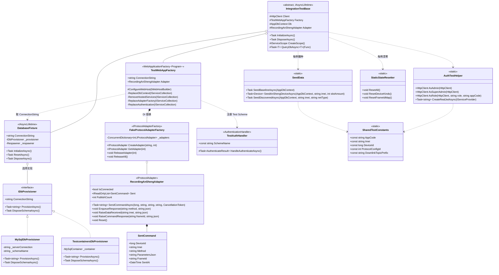
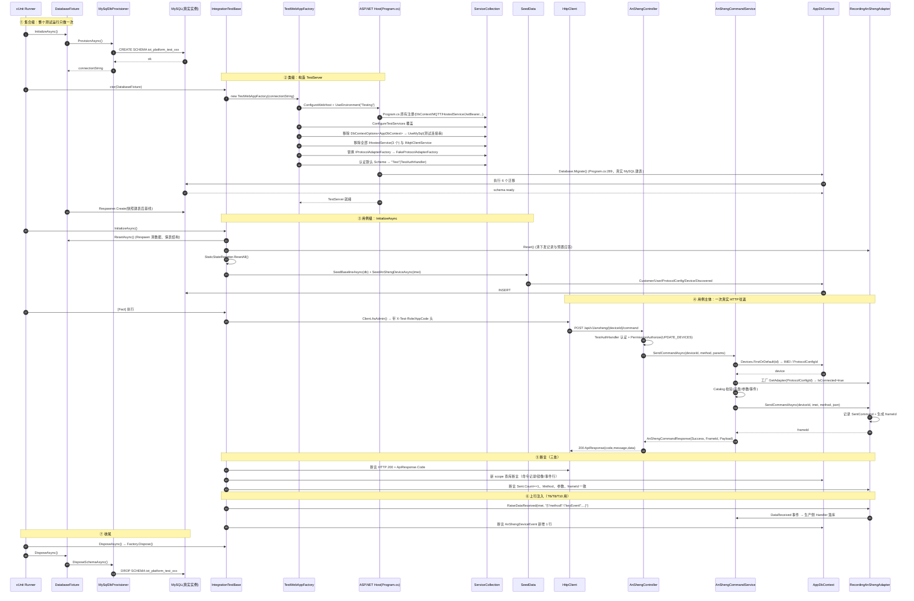
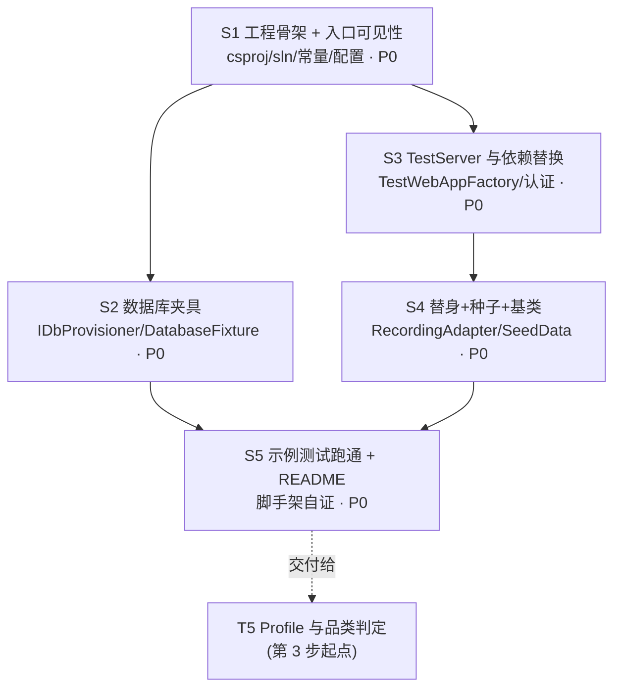

# 安圣二开设备 · 集成测试脚手架技术方案

> **文档定位**：本文是《安圣二开设备 MQTT 协议重构》第 2 步「补测试脚手架（2 人日）」的技术方案，对应
> `docs/phase345-audit-2026-08-03.md` §2.11 与 §5「第 2 步」。
> **作者**：架构师（Gao） · **日期**：2026-08-03 · **状态**：待主理人/用户确认后交工程师实现
> **本文只做设计，不含任何实现代码**。工程师按 §5 任务列表逐项落地。

---

## 0. 一句话结论

在 `tests/IoTPlatform.IntegrationTests/` 新建独立集成测试工程，采用
**`WebApplicationFactory<Program>` + 真实 MySQL 专用测试 schema + 依赖替身（协议适配器工厂 / 认证 Scheme / 托管服务摘除）**；
**不采用 EF InMemory（本代码库下不可用，见 §1.2），Testcontainers 因本机无 Docker 暂缓（探测结论见 §1.3），
但通过 `IDbProvisioner` 抽象预留一行切换**。

---

## 1. 实现方案与框架选型

### 1.1 需要解决的四个难点（均由实读代码得出）

| # | 难点 | 实测事实（文件:行） | 影响 |
|---|---|---|---|
| D1 | **主机启动即连真实外设** | `Program.cs:129-140` 注册 3 个托管服务：`MqttHostedService`、`DataRetentionHostedService`、`AnShengDiscoveryService`；`appsettings.json:AnShengMqtt.Host=120.79.3.248:18883` | TestServer 一起就会连**现网 EMQX**，必须摘除 |
| D2 | **MQTT 客户端不在 DI 里** | `AnShengMqttProtocolAdapter.cs:163-164` 内部 `new MqttFactory().CreateMqttClient()`；`IMqttClient` 从未注册到容器 | **替换 DI 中的 `IMqttClient` 无效**，必须换更上层的接缝（见 §1.4） |
| D3 | **DbContext 强绑 MySQL** | `Program.cs:55-66` `UseMySql(...ServerVersion.AutoDetect...)`；`AppDbContext.cs:202,267` `HasColumnType("json")`；6 个迁移全带 `MySql:CharSet` / `MySql:ValueGenerationStrategy` 注解；`Program.cs:289` 启动即 `Database.Migrate()` | InMemory 不可用（§1.2） |
| D4 | **自定义权限过滤器 + 租户过滤器** | `Filters/PermissionFilter.cs` 的 `PermissionAuthorizeAttribute : AuthorizeAttribute, IAuthorizationFilter`；`AnShengController.cs:22` 类级 `[PermissionAuthorize(VIEW_DEVICES)]`，方法级另有 `CREATE_/UPDATE_/SEND_DEVICE_COMMANDS` | 集成测试必须能造出「已认证 + 带 Role/AppCode claim」的请求 |

### 1.2 数据库策略（核心决策）

#### 结论：**主方案 = 真实 MySQL 上的「一次性专用 schema」**；Testcontainers 为后续升级路径；**InMemory 明确否决**

**为什么否决 EF Core InMemory（逐条给证据，不是口味问题）**

| 否决理由 | 证据 | 后果 |
|---|---|---|
| 启动即执行关系型迁移 | `Program.cs:289` `context.Database.Migrate()` | InMemory 下抛 `InvalidOperationException`（Relational-specific method）。仅当 `Environment==Development` 才被 `Program.cs:297` 吞掉——等于**逼测试跑在 Development 环境**，而 Development 又会触发 `Program.cs:309-334` 的开发种子数据，污染测试基线 |
| 迁移是 T5/T6/T7/T10/T11 的**验收对象** | T5 验收 1「迁移可正向执行与回滚」；T6/T7/T10/T11 均含 `+ Migration` | InMemory 根本不执行迁移，这条验收**永远验不了** |
| Schema 与生产漂移 | InMemory 走 `EnsureCreated` 语义，忽略 `HasColumnType("json")`（`AppDbContext.cs:202,267`）、唯一索引组合、`utf8mb4` | 「聚合表唯一键幂等」（T11 验收 1）、「`RowVersion` 冲突返回 409」（T10 验收 5）这类**依赖关系型约束/并发令牌**的用例会假绿或假红 |
| 无事务/无并发语义 | InMemory 不支持真实事务与行版本 | T10 验收 5（并发 409）无法覆盖 |

> 备注：SQLite in-memory 同样否决——迁移里的 `MySql:*` 注解与 `json` 列类型无法执行，且 `EnsureCreated` 仍绕开迁移验收。

**为什么不是 Testcontainers（今天）**

本机探测（2026-08-03，实测命令与输出）：

```
$ docker --version           → bash: docker: command not found
$ ls "/c/Program Files/Docker"→ 不存在
$ which podman / wsl.exe      → 均无
```

→ **本机未安装 Docker / Podman / WSL**，`Testcontainers.MySql` **当前无法运行**。若强行选它，工程师第一步就会卡死。

**为什么可以选真实 MySQL**

同一次探测：

```
$ (exec 3<>/dev/tcp/192.168.3.7/3306) → REACHABLE   # appsettings.json 里的开发库
$ (exec 3<>/dev/tcp/127.0.0.1/3306)   → REACHABLE   # 本机另有一个 MySQL 实例
$ dotnet --list-runtimes | grep 'AspNetCore.App 8' → 8.0.20 / 8.0.26 均在
```

→ 真实 MySQL 触手可及，且**语义与生产 100% 一致**（json 列、utf8mb4、唯一索引、事务、`RowVersion`），
迁移可以真跑，T5/T10/T11 的关系型验收标准全部可覆盖。

#### 方案定型：`IDbProvisioner` 抽象 + 一次性 schema

```
IDbProvisioner（接口）
 ├── MySqlDbProvisioner        ← 主方案（今天就能跑）
 │     · 从环境变量 IOT_TEST_MYSQL 读服务器（缺省 localhost:3306）
 │     · 每次测试运行创建独立 schema：iot_platform_test_{yyyyMMddHHmmss}_{rand4}
 │     · 由 Program.cs 原生的 Database.Migrate() 建表（顺带验证迁移可执行）
 │     · 运行结束 DROP SCHEMA
 └── TestcontainersDbProvisioner ← 预留（Docker 就位后启用，改一行工厂选择）
```

**切换判据（写死在文档里，避免以后扯皮）**：一旦开发机 / CI 上 `docker info` 可用，
把 `DatabaseFixture` 里的 provisioner 选择从 `MySqlDbProvisioner` 换成 `TestcontainersDbProvisioner`，
**其余文件零改动**——这是引入 `IDbProvisioner` 的唯一目的。

### 1.3 环境探测结论汇总（可复核）

| 探测项 | 结论 | 命令 |
|---|---|---|
| Docker | ❌ **未安装** | `docker --version` → command not found |
| MySQL 192.168.3.7:3306（开发库） | ✅ 可达 | `/dev/tcp` 探测 |
| MySQL 127.0.0.1:3306 | ✅ 可达 | `/dev/tcp` 探测 |
| .NET SDK | 10.0.302；ASP.NET Core 8.0.20/8.0.26 运行时齐备，主工程 `net8.0` | `dotnet --list-runtimes` |
| CI | `.github/workflows/` **是空目录**，当前**无任何 CI 流水线** | `ls -R .github` |

> CI 空缺意味着：脚手架的第一使用者是**本地开发机**。CI 化是后续独立事项（届时优先 Testcontainers）。

### 1.4 MQTT 替身策略（与团队初始设想有出入，以代码为准）

**任务书原设想**：「在 TestServer 的 DI 中替换真实 `IMqttClient`」。
**实读结论：该接缝不存在。** `IMqttClient` 从未注册进容器；适配器在 `ConnectAsync` 内部
`new MqttFactory().CreateMqttClient()` 自建（`AnShengMqttProtocolAdapter.cs:163-164`）。

**正确接缝 = `IProtocolAdapterFactory`**（`Program.cs:46` 注册为 Singleton），因为下发链路是：

```
AnShengController → IAnShengCommandService → IProtocolAdapterFactory.GetAdapter(configId)
                                            → IProtocolAdapter.SendCommandAsync(...)   ← 断言点
```

（依据 `Services/AnShengCommandService.cs:83,136`）

于是脚手架提供：

- **`FakeProtocolAdapterFactory : IProtocolAdapterFactory`** —— 按 `configId` 返回预置替身，`GetAdapter` 永不返回 null（否则 Service 早退为「适配器未运行」）。
- **`RecordingAnShengAdapter : IProtocolAdapter`** —— `IsConnected=true`；记录每次 `SendCommandAsync(deviceId, imei, method, parametersJson)`；
  支持 `EnqueueResponse(method, json)` 预置应答；暴露 `RaiseDataReceived(...)` / `RaiseCommandResponse(...)`
  以**注入上行报文**（T6 的 `keyEvent`、T8 的 `delayEvent`、T10 的 `timeEvent`、T2 的 `close` 遗嘱全靠它）。

**已有的 `FakeMqttClient` 怎么办**：它位于
`tests/IoTPlatform.AnSheng.Tests/AnShengLegacyWhitelistTests.cs:256-323`，是 `private sealed` **嵌套类**，
工作在**更低一层**（`IMqttClient`，验证适配器自身产出的报文字节）。二者**不重叠、都要保留**：

| 层次 | 替身 | 验证什么 | 归属 |
|---|---|---|---|
| 协议层 | `FakeMqttClient`（现有，反射注入 `_mqttClient`） | 报文结构、白名单、节流 | 留在 `AnSheng.Tests` |
| 集成层 | `RecordingAnShengAdapter`（新增） | 端点→Service→DB→是否下发、下发了什么 | 新工程 |

**本次不抽离 `FakeMqttClient`**（遵守纪律，且它是 T4 已过 QA 的资产）。抽离提案见 §8-待明确 5。

### 1.5 认证策略

`PermissionAuthorizeAttribute` 同时是 `AuthorizeAttribute`（触发默认 Scheme = JwtBearer 的鉴权中间件）
和 `IAuthorizationFilter`（自行判 `Identity.IsAuthenticated` + `ClaimTypes.Role`）。
`Roles.SUPER_ADMIN` 直接放行全部权限（`Filters/PermissionFilter.cs`）。

**推荐（默认）**：在 `ConfigureTestServices` 中注册一个 `TestAuthHandler`（`AuthenticationHandler<AuthenticationSchemeOptions>`），
并把 `DefaultAuthenticateScheme/DefaultChallengeScheme` 改为 `"Test"`。claim 由**请求头**驱动，
使同一个 TestServer 能演不同角色：

| 请求头 | 落成的 Claim | 消费方 |
|---|---|---|
| `X-Test-UserId`（默认 `1001`） | `ClaimTypes.NameIdentifier` | `ScopedTenantContextAccessor`（`TenantContextAccessor.cs`） |
| `X-Test-Role`（默认 `admin`） | `ClaimTypes.Role` | `PermissionAuthorizeAttribute` |
| `X-Test-AppCode`（默认 `TEST`） | `"AppCode"` | 控制器内 `User.FindFirst("AppCode")`（`AnShengController.cs:77,152`）+ 租户上下文 |
| `X-Test-CustomerId`（默认 `1`） | `"CustomerId"` | 租户上下文 |

**必须遵守的一条**：即使演 `super_admin`，**也要带 `AppCode`**——T4 已踩过「SuperAdmin 无 AppCode → 500」的坑，
`TenantFilterAttribute` 亦会在 AppCode 缺失时直接 403（`Filters/PermissionFilter.cs`）。

**备选（保留能力，不设为默认）**：`AuthTestHelper.CreateRealJwtAsync()` 用生产 `JwtHelper` + `appsettings` 的 `Jwt:SecretKey`
签发真 token，仅供「鉴权链路本身」的用例；日常业务用例走 Test Scheme，快且稳。

### 1.6 三个必须写进脚手架的「陷阱防护」

> 这三条是本次调研最有价值的产出，工程师如不知情必然踩坑。

**① 全局查询过滤器被 EF 模型缓存「冻结」**
`AppDbContext.ConfigureGlobalQueryFilters`（`AppDbContext.cs:154-189`）在 `OnModelCreating` 里
读 `_tenantContextAccessor.Current.AppCode` 并烘焙进模型；全仓 **无 `IModelCacheKeyFactory` 替换**（已 grep 确认）。
EF 的模型缓存键只含「上下文类型 + 提供程序」，**不含 AppCode** ⇒ **谁先触发建模，谁的 AppCode 就被冻结到整个进程/容器生命周期**。

对测试的硬约束：
- **一个 `WebApplicationFactory` 实例 = 一个 AppCode**（统一 `SharedTestConstants.AppCode = "TEST"`）；
- 若在首个 HTTP 请求**之前**用无 HttpContext 的 scope 播种，模型将以「AppCode 为空 ⇒ 不加过滤器」建成，
  **该 TestServer 全程等于关闭了租户过滤**——这对业务用例是好事（数据可见、断言直观），
  但**租户隔离本身的用例必须另起独立 Factory**并让首个请求带 AppCode。此约定写入 §7 共享知识。
- 这同时暴露了一处**生产缺陷**（多租户下先到先得），已列入 §8-待明确 7，建议单开任务，不在本次范围。

**② 跨用例污染的静态状态**
- `AnShengMqttProtocolAdapter.DeviceKinds`（`static ConcurrentDictionary`，`AnShengMqttProtocolAdapter.cs:74-75`）——
  `AnShengCommandService` 通过 `AnShengMqttProtocolAdapter.GetDeviceKind(imei)` 静态读取（`AnShengCommandService.cs:103-104`），
  **品类会跨用例残留**，直接影响 T5/T7/T8/T10 的「按品类放行/拒绝」断言。
- `AnShengCommandService.FrameIdCommandIdMap`（`static`，`AnShengCommandService.cs:35`）。
⇒ 脚手架必须提供 `StaticStateResetter.ResetAll()`（反射清空），由 `IntegrationTestBase` 在每个用例前调用。

**③ 启动期副作用**
`Program.cs:281-334`：先 `Database.Migrate()`（失败时仅在 Development 吞异常），再在 Development 下跑
`SeedDataForDevelopmentAsync`。⇒ 测试主机 **`UseEnvironment("Testing")`**：跳过开发种子；
迁移在真实 MySQL 上正常执行并**顺带成为「迁移可执行」的回归验证**。

---

## 2. 文件清单（新建工程 `tests/IoTPlatform.IntegrationTests/`）

> 相对路径以仓库根 `H:\IoTPlatform` 为基准。🆕=新建，✏️=修改既有文件。

| # | 路径 | 类型 | 职责 |
|---|---|:--:|---|
| 1 | `tests/IoTPlatform.IntegrationTests/IoTPlatform.IntegrationTests.csproj` | 🆕 | net8.0；引用主工程；包见 §6 |
| 2 | `tests/IoTPlatform.IntegrationTests/SharedTestConstants.cs` | 🆕 | `AppCode="TEST"`、`Imei="864536072949900"`（沿用协议层测试同一 IMEI）、`ProtocolConfigId=9001`、`DeviceId=9001`、topic 前缀 `/iot/server/iot-board/`、`/iot/client/iot-board/`、`X-Test-*` 头名常量 |
| 3 | `tests/IoTPlatform.IntegrationTests/Infrastructure/IDbProvisioner.cs` | 🆕 | `Task<string> ProvisionAsync()` / `Task DisposeSchemaAsync()`；DB 策略唯一抽象点 |
| 4 | `tests/IoTPlatform.IntegrationTests/Infrastructure/MySqlDbProvisioner.cs` | 🆕 | 主方案：建一次性 schema、返回连接串、结束 DROP |
| 5 | `tests/IoTPlatform.IntegrationTests/Infrastructure/TestcontainersDbProvisioner.cs` | 🆕(占位) | 预留；`#if TESTCONTAINERS` 包裹，Docker 就位后启用 |
| 6 | `tests/IoTPlatform.IntegrationTests/Infrastructure/DatabaseFixture.cs` | 🆕 | xUnit `IAsyncLifetime`：选 provisioner → 建 schema → 首次 `Migrate()` → 持有 Respawner → 提供 `ResetAsync()` |
| 7 | `tests/IoTPlatform.IntegrationTests/Infrastructure/TestWebAppFactory.cs` | 🆕 | `WebApplicationFactory<Program>`：`UseEnvironment("Testing")` + 配置覆盖 + DI 替换（DbContext / 托管服务 / 适配器工厂 / 认证） |
| 8 | `tests/IoTPlatform.IntegrationTests/Infrastructure/IntegrationTestBase.cs` | 🆕 | 抽象基类：`HttpClient`、`IServiceScope`、`AppDbContext`、`RecordingAnShengAdapter`、每例前 `Respawn + StaticStateResetter + Seed` |
| 9 | `tests/IoTPlatform.IntegrationTests/Infrastructure/StaticStateResetter.cs` | 🆕 | 反射清空 `AnShengMqttProtocolAdapter.DeviceKinds`、`AnShengCommandService.FrameIdCommandIdMap` |
| 10 | `tests/IoTPlatform.IntegrationTests/Infrastructure/Auth/TestAuthHandler.cs` | 🆕 | `"Test"` 认证方案，按 `X-Test-*` 头造 `ClaimsPrincipal` |
| 11 | `tests/IoTPlatform.IntegrationTests/Infrastructure/Auth/AuthTestHelper.cs` | 🆕 | `HttpClient.AsAdmin()/AsSuperAdmin()/AsRole(...)` 扩展；备选 `CreateRealJwtAsync()` |
| 12 | `tests/IoTPlatform.IntegrationTests/Infrastructure/Mqtt/RecordingAnShengAdapter.cs` | 🆕 | `IProtocolAdapter` 替身：记录下发、预置应答、注入上行事件 |
| 13 | `tests/IoTPlatform.IntegrationTests/Infrastructure/Mqtt/FakeProtocolAdapterFactory.cs` | 🆕 | `IProtocolAdapterFactory` 替身：按 configId 返回上面的替身 |
| 14 | `tests/IoTPlatform.IntegrationTests/Seed/SeedData.cs` | 🆕 | 播种 Customer / User / Role / ProtocolConfig(ANSHENG_MQTT) / Device(已知 IMEI) / DiscoveredAnShengDevice |
| 15 | `tests/IoTPlatform.IntegrationTests/Collections/IntegrationTestCollection.cs` | 🆕 | `[CollectionDefinition(DisableParallelization = true)]` 共享 `DatabaseFixture` |
| 16 | `tests/IoTPlatform.IntegrationTests/appsettings.Testing.json` | 🆕 | 关 Redis、关 DataRetention、MQTT 指向不可达回环地址；`CopyToOutputDirectory` |
| 17 | `tests/IoTPlatform.IntegrationTests/xunit.runner.json` | 🆕 | `parallelizeTestCollections: false`（静态状态 + 模型缓存所迫） |
| 18 | `tests/IoTPlatform.IntegrationTests/Samples/SampleEndpointTests.cs` | 🆕 | **脚手架自证 1**：TestServer 起 → 播种 → `GET /api/v1/ansheng/discovered` → 200 + 数据正确 + 401 未认证用例 |
| 19 | `tests/IoTPlatform.IntegrationTests/Samples/CommandDispatchSampleTests.cs` | 🆕 | **脚手架自证 2**：`POST /api/v1/ansheng/{id}/command` → 断言 `RecordingAnShengAdapter` 收到下发 + 报文正确 |
| 20 | `tests/IoTPlatform.IntegrationTests/README.md` | 🆕 | 如何跑（环境变量 `IOT_TEST_MYSQL`）、如何切 Testcontainers、约定速查 |
| 21 | `IoTPlatform.sln` | ✏️ | **当前 sln 只含主工程**（实读确认，连既有 `AnSheng.Tests` 都没进去）。需把两个测试工程都加进去 |
| 22 | `Program.cs` | ✏️ | **唯一生产文件改动**：文件末尾追加 `public partial class Program { }`（1 行）。见下方说明 |

### 2.1 关于第 22 项（必须让主理人知情）

`Program.cs` 使用顶级语句，编译器生成的 `Program` 类是 **internal**；全仓 grep 确认
**既无 `public partial class Program`，也无 `InternalsVisibleTo`** ⇒ 测试工程写
`WebApplicationFactory<Program>` **无法编译**。二选一：

| 方案 | 改动 | 评价 |
|---|---|---|
| **A（推荐）** | `Program.cs` 末尾加 `public partial class Program { }` | 微软官方文档做法，1 行，零运行时影响 |
| B | 主工程加 `[assembly: InternalsVisibleTo("IoTPlatform.IntegrationTests")]` | 同样要动生产工程，且把内部成员暴露给测试，范围更大 |

⇒ **这是本方案唯一需要触碰生产代码的地方**，属工程师第 3 步执行；架构师本次未改任何 `.cs`。

---

## 3. 数据结构与接口（类图）



**生产侧被替换/被断言的接缝（不新建、不修改，仅引用）**

| 生产类型 | 位置 | 在测试中的角色 |
|---|---|---|
| `Program` | `Program.cs` | `WebApplicationFactory<Program>` 的 TEntryPoint |
| `AppDbContext` | `Data/AppDbContext.cs` | 断言 DB 状态；注意双构造函数，测试内**只从 scope 解析**，不 `new` |
| `IProtocolAdapterFactory` | `Infrastructure/Protocol/ProtocolAdapterFactory.cs` | **被替换**为 `FakeProtocolAdapterFactory` |
| `IProtocolAdapter` | `Infrastructure/Protocol/Adapters/IProtocolAdapter.cs` | `RecordingAnShengAdapter` 实现之 |
| `IMqttClientService` / 3 个 `IHostedService` | `Services/` | **被摘除** |
| `ITenantContextAccessor` | `Infrastructure/Tenant/TenantContextAccessor.cs` | 不替换，由 claim 驱动（见 §1.6①） |

---

## 4. 程序调用流程（时序图）



---

## 5. 任务列表（有序，工程师照做）

> 总量对齐审计报告的 **2 人日**预算。任务按依赖排序，S1 是所有任务的前置。

### S1 — 工程骨架与入口可见性 · P0 · 依赖：无 · 约 0.3 人日

- **文件**：`IoTPlatform.IntegrationTests.csproj`、`SharedTestConstants.cs`、`appsettings.Testing.json`、`xunit.runner.json`、`Collections/IntegrationTestCollection.cs`、✏️`IoTPlatform.sln`、✏️`Program.cs`（+1 行 `public partial class Program { }`）
- **要点**
  1. `net8.0`、`ProjectReference` 主工程、包版本对齐 §6；
  2. `appsettings.Testing.json` 关掉 `Redis:Enabled`、`DataRetention:Enabled`，`AnShengMqtt:Host` 指向 `127.0.0.1:1`（确保任何漏摘的连接尝试立即失败而非挂住现网）；
  3. sln 同时补进 `IoTPlatform.AnSheng.Tests`（现在**不在** sln 里）。
- **出口**：`dotnet build` 通过；`dotnet test` 能跑 0 个用例而不报错。

### S2 — 数据库夹具（provisioner + 迁移 + 清理） · P0 · 依赖：S1 · 约 0.5 人日

- **文件**：`Infrastructure/IDbProvisioner.cs`、`MySqlDbProvisioner.cs`、`TestcontainersDbProvisioner.cs`（占位）、`DatabaseFixture.cs`
- **要点**
  1. 连接串来源优先级：环境变量 `IOT_TEST_MYSQL` → 缺省 `Server=127.0.0.1;Port=3306;User=root;Password=root123;`（凭据待 §8-1 拍板）；
  2. schema 名 `iot_platform_test_{yyyyMMddHHmmss}_{rand4}`，**绝不复用业务库**；
  3. 建库后由 TestServer 启动时的 `Database.Migrate()` 建表；随后 `Respawner.CreateAsync(..., DbAdapter.MySql)` 拍基线；
  4. `DisposeAsync` 必须 `DROP SCHEMA`（含异常路径），避免测试库堆积。
- **出口**：夹具单跑一次，MySQL 中可见 schema 创建→迁移建表→删除全过程。

### S3 — TestServer 与依赖替换 · P0 · 依赖：S1 · 约 0.6 人日

- **文件**：`Infrastructure/TestWebAppFactory.cs`、`Infrastructure/Auth/TestAuthHandler.cs`、`Infrastructure/Auth/AuthTestHelper.cs`
- **要点（按顺序做，缺一不可）**
  1. `UseEnvironment("Testing")`；`ConfigureAppConfiguration` 用内存配置覆写 `ConnectionStrings:DefaultConnection`；
  2. 移除 `DbContextOptions<AppDbContext>` / `AppDbContext` 相关描述符，重注册 `UseMySql(测试串, ServerVersion.Create(...))`——
     **显式版本，别用 `AutoDetect`**（省一次握手，失败信息也更清楚）；
  3. **移除所有 `IHostedService` 描述符**（3 个）与 `IMqttClientService`；
  4. 替换 `IProtocolAdapterFactory`；
  5. `AddAuthentication("Test").AddScheme<...,TestAuthHandler>("Test", _ => {})` 并覆盖默认 Authenticate/Challenge Scheme。
- **出口**：TestServer 能起、`GET /swagger/v1/swagger.json` 返回 200，且**日志中无任何 MQTT/Redis 连接尝试**。

### S4 — 测试替身、种子与基类 · P0 · 依赖：S3 · 约 0.4 人日

- **文件**：`Infrastructure/Mqtt/RecordingAnShengAdapter.cs`、`FakeProtocolAdapterFactory.cs`、`Infrastructure/StaticStateResetter.cs`、`Seed/SeedData.cs`、`Infrastructure/IntegrationTestBase.cs`
- **要点**
  1. `RecordingAnShengAdapter.IsConnected` 恒 true（否则 Service 在 `AnShengCommandService.cs:91` 早退）；
  2. `SendCommandAsync` 生成 16 位 frameId 并原样记录入参，**不做协议构造**（协议正确性归 `AnSheng.Tests`，此处只验链路）；
  3. `SeedData` 播种链：`Customer(AppCode=TEST)` → `Role/User` → `ProtocolConfig(Type/ProtocolType=ANSHENG_MQTT, Id=9001)` → `Device(SerialNumber=IMEI, ProtocolConfigId=9001, AppCode=TEST, Status="offline")`；
     注意 `Device.AppCode/Name/Status` 为 `[Required]`，`Customer.Code`、`Customer.AppCode` 均**唯一索引**；
  4. `IntegrationTestBase.InitializeAsync` 顺序固定：**Respawn → 静态清零 → 播种 → 建 HttpClient**。
- **出口**：基类被一个空用例继承并跑通。

### S5 — 示例测试与说明文档 · P0 · 依赖：S2、S4 · 约 0.2 人日

- **文件**：`Samples/SampleEndpointTests.cs`、`Samples/CommandDispatchSampleTests.cs`、`README.md`
- **要点**
  1. `SampleEndpointTests`：① 未认证 `GET /api/v1/ansheng/discovered` → 401；② `AsAdmin()` → 200 且 `data.items` 含播种的 IMEI；
  2. `CommandDispatchSampleTests`：`POST /api/v1/ansheng/{deviceId}/command`（method 取 Catalog 内已登记项，如 `getDevStatus`）
     → 200，且 `Adapter.Sent` 恰 1 条、`Method`/`Imei` 正确；再对**协议外方法**断言**零下发**（与 T4 白名单语义呼应）；
  3. README 写清：怎么设 `IOT_TEST_MYSQL`、为什么禁并行、怎么切 Testcontainers。
- **出口**：`dotnet test tests/IoTPlatform.IntegrationTests` 全绿，且**重复跑两次结果一致**（证明清理有效）。

### 5.1 任务依赖图



---

## 6. 依赖包列表

| 包 | 建议版本 | 用途 | 备注 |
|---|---|---|---|
| `Microsoft.NET.Test.Sdk` | 17.11.1 | 测试宿主 | 与既有 `AnSheng.Tests` 保持一致 |
| `xunit` | 2.9.2 | 测试框架 | 同上 |
| `xunit.runner.visualstudio` | 2.8.2 | VS/CLI 运行器 | 同上，`PrivateAssets=all` |
| `Microsoft.AspNetCore.Mvc.Testing` | **8.0.11** | `WebApplicationFactory`/TestServer | **必须 8.x**，与主工程 `net8.0` 及 JwtBearer 8.0.11 对齐；用 9.x/10.x 会拖入不匹配的框架引用 |
| `Microsoft.EntityFrameworkCore.Relational` | 8.0.11 | 测试内直接用迁移/关系型 API | 主工程已间接引入，显式声明避免版本漂移 |
| `Pomelo.EntityFrameworkCore.MySql` | 8.0.2 | 测试内自建 `UseMySql` 选项 | 与主工程完全一致 |
| `MySqlConnector` | 2.3.7 | provisioner 建/删 schema、Respawn 适配 | Pomelo 传递依赖，显式声明更稳 |
| `Respawn` | 6.2.1 | 用例间快速清数据（保表结构） | 支持 MySQL adapter |
| `FluentAssertions` | **6.12.2** | 断言可读性 | ⚠ **锁 6.x**：7.0 起改为商业许可，不要升 |
| `Testcontainers.MySql` | 3.10.0 | 未来容器化 DB | **暂不引入**，写进 csproj 注释；Docker 就位后解注释 + 定义 `TESTCONTAINERS` 常量 |
| `coverlet.collector` | 6.0.2 | 覆盖率（可选） | CI 建好再加 |

**版本集中管理**：仓库目前**没有** `Directory.Packages.props`（已确认），各 csproj 各写各的。
本次**不引入**中央包管理（属独立重构，会牵动主工程）；但**建议**在 README 里登记「测试工程包版本须跟随主工程 EF/ASP.NET 大版本」的约束。

---

## 7. 共享知识（跨文件约定，工程师必须遵守）

| 约定 | 内容 | 原因 |
|---|---|---|
| **AppCode 唯一值** | 全测试统一 `"TEST"`（`SharedTestConstants.AppCode`） | EF 模型缓存会冻结租户过滤器（§1.6①），混用 AppCode 会得到随机结果 |
| **一个 Factory 一个租户** | 需要验证租户隔离的用例，**另起** `TestWebAppFactory` 实例，且首个请求必须带目标 AppCode | 同上 |
| **禁用并行** | `xunit.runner.json` 设 `parallelizeTestCollections:false`，DB 集合再加 `DisableParallelization` | 静态字典 + 单一 schema + 模型缓存三重共享状态 |
| **清理策略** | Respawn 清数据（保表），**不**用事务回滚 | HTTP 请求跨 scope，外层事务包不住；Respawn 亦能验证真实提交 |
| **静态状态** | 每例前 `StaticStateResetter.ResetAll()` | `AnShengMqttProtocolAdapter.DeviceKinds`、`AnShengCommandService.FrameIdCommandIdMap` |
| **测试 IMEI** | `864536072949900`（与 `AnShengLegacyWhitelistTests` 同值） | 两层测试的日志/报文可直接比对 |
| **Topic 约定** | 上行 `/iot/server/iot-board/{imei}`、下行 `/iot/client/iot-board/{imei}` | 取自 `AnShengMqttProtocolAdapter` 类注释与 `appsettings.json:AnShengMqtt` |
| **下发断言口径** | 一律断言 `RecordingAnShengAdapter.Sent`（次数 + method + 参数 + frameId），**并对"不应下发"的用例断言 `Sent.Count == 0`** | 与 T4 止血同一口径：协议外方法零外发 |
| **上行注入口径** | 一律走 `Adapter.RaiseDataReceived(imei, json)`，报文原文取自 `asopen.md` | 避免各人手搓不同的伪报文 |
| **响应断言** | 端点统一返回 `ApiResponse{Code,Message,Data}`（`Helpers/ApiResponse.cs`），断言 `Code` 而非仅 HTTP 状态码 | 该项目大量业务失败仍返回 200 + `Code!=200` |
| **认证默认值** | `AsAdmin()` = Role `admin` + AppCode `TEST`；SuperAdmin 场景**也必须带 AppCode** | T4 已踩过 SuperAdmin 无 AppCode → 500 |
| **命名** | 测试类 `{被测对象}Tests`，方法 `Should_{预期}_When_{条件}`；集成用例统一挂 `[Collection("Integration")]` | 与既有协议层测试风格保持一致 |
| **不碰生产代码** | 除 `Program.cs` 那 1 行（§2.1），测试不得为方便而改生产可见性；需要内部状态时用反射（沿用 `AnShengLegacyWhitelistTests` 的做法） | 保持"测试适配代码"而非"代码适配测试" |

---

## 8. 待明确事项（需用户/主理人拍板，未定前工程师不要开工的项已标 ⛔）

| # | 事项 | 现状与影响 | 架构师建议 |
|:--:|---|---|---|
| 1 | ⛔ **测试 MySQL 落点与凭据** | 实测 `127.0.0.1:3306` 与 `192.168.3.7:3306` 均可达；后者是 `appsettings.json` 里的开发库（`root/root123`）。测试需要 **CREATE/DROP SCHEMA 权限** | 用 **本机 `127.0.0.1:3306`**，独立 schema，绝不碰 `iot_platform` 业务库；连接串走环境变量 `IOT_TEST_MYSQL`。请确认本机实例的 root 凭据 |
| 2 | **Docker 何时提供** | 当前**未安装**，Testcontainers 不可用 | 现在按 §1.2 主方案走；装了 Docker 后仅切 provisioner。请确认后续是否要装（CI 化时基本必须） |
| 3 | ⛔ **`Program.cs` 加 1 行 `public partial class Program { }`** | 不加则 `WebApplicationFactory<Program>` 无法编译（§2.1） | 批准方案 A。这是本次唯一生产文件改动，由工程师在 S1 执行 |
| 4 | **认证替身方式** | Test Scheme（推荐）vs 真 JWT | 默认 Test Scheme；`AuthTestHelper` 同时保留真 JWT 能力备用 |
| 5 | **是否把 `FakeMqttClient` 抽成共享 TestKit** | 现为 `AnShengLegacyWhitelistTests` 的 private 嵌套类。抽离需新建 `tests/IoTPlatform.TestKit/` 并**改动 T4 已过 QA 的测试文件** | **本次不抽**。两层替身职责不同（§1.4），无重复实现问题。待第三处需要时再抽 |
| 6 | **是否需要真实 EMQX（容器/本地 broker）** | 端到端 MQTT 验证 | **不需要**。协议层已有 `FakeMqttClient` 验字节，集成层用 `RecordingAnShengAdapter` 验链路；真 broker 只会带来不稳定 |
| 7 | **生产缺陷：租户过滤器被模型缓存冻结** | `AppDbContext.cs:154-189` + 无 `IModelCacheKeyFactory`（§1.6①）⇒ 多租户下先到先得，**这是线上正确性问题，不只是测试问题** | **不在本次范围**。建议单开缺陷任务（加 `IModelCacheKeyFactory` 把 AppCode 纳入缓存键），并在修复后回头放开租户隔离用例 |
| 8 | **CI 建设** | `.github/workflows/` 为空目录，无流水线 | 本次不做。建流水线时优先 Testcontainers（CI 上 Docker 通常可用） |

---

## 9. T5–T14 集成测试入口预留

> 说明：**"验收类型"**列中，`单元` = 现有 `AnSheng.Tests` 可承载；`集成` = 必须依赖本脚手架。
> 本表的用途是让工程师做每个 T 任务时，**直接知道该往哪写测试、断言什么**。

### 9.1 T5 完整示例（品类推断 / Profile）

**T5 验收标准 → 集成测试映射**

| 验收标准 | 类型 | 测试类 / 方法 | 调用入口 | 断言点 |
|---|:--:|---|---|---|
| 1. 迁移可正向执行与回滚 | 集成 | `Migrations/AnShengProfileMigrationTests` | 夹具启动即执行 `Database.Migrate()`；再 `dotnet ef migrations script` 反向校验 | 迁移无异常；`information_schema.tables` 中出现 Profile 表；`Down()` 可执行 |
| 2. 认领后 Profile 四字段非空、`Category` 不再写死 | 集成 | `AnShengClaimTests.Should_Fill_Profile_When_Claim_With_Probe_Success` | `POST /api/v1/ansheng/claim` | DB：`AnShengDeviceProfile{SlotAmount=4,Version="...V4.0.8",NetType="4G",Kind=Switch4G}` 均非空；`Device.Category != "安圣充电桩"` |
| 3. `InferKind` 三条推断 + Manual 不被覆盖 | 单元 | `AnShengDeviceProfileServiceTests` | 直接调 Service | `InferKind("4G",4,"SWITCH-...")==Switch4G`；`InferKind("WiFi",null,null)==SpeakerWiFi`；`KindSource=Manual` 时跳过推断 |
| 4. 探测失败 → `ProbeStatus=ProbeFailed` 且接口报错 | 集成 | `AnShengClaimTests.Should_Return_Error_When_Probe_Fails` | 同上，`Adapter` **不预置应答** | HTTP `ApiResponse.Code != 200`；DB `ProbeStatus=ProbeFailed`；**未创建 Device 行** |

**验收标准 2 的完整用例骨架（伪代码，工程师照此结构写）**

```text
[Collection("Integration")]
public class AnShengClaimTests : IntegrationTestBase
{
  [Fact] Should_Fill_Profile_When_Claim_With_Probe_Success()
  {
    // Arrange —— 基类已完成 Respawn/静态清零/基线播种
    await SeedData.SeedDiscoveredAsync(Db, imei: Const.Imei, netType: "4G");

    //   预置探测应答：认领流程会先发 getDevInfo + getDevStatus
    Adapter.EnqueueResponse("getDevInfo",   """{"method":"getDevInfo","imei":"864536072949900",
                                               "version":"SWITCH-EC618X-R24-O-V4.0.8","iccid":"8986..."}""");
    Adapter.EnqueueResponse("getDevStatus", """{"method":"getDevStatus","imei":"864536072949900",
                                               "netType":"4G","slotAmount":4,"model":"Air780E"}""");

    // Act
    var resp = await Client.AsAdmin()
        .PostAsJsonAsync("/api/v1/ansheng/claim", new { imei = Const.Imei, kind = "Switch4G", name = "测试开关" });

    // Assert ① HTTP
    resp.StatusCode.Should().Be(HttpStatusCode.OK);
    (await resp.ReadApiResponse()).Code.Should().Be(200);

    // Assert ② 下发链路：确实探测过，且只发了这两条
    Adapter.Sent.Select(s => s.Method).Should().Equal("getDevInfo", "getDevStatus");
    Adapter.Sent.Should().OnlyContain(s => s.Imei == Const.Imei);

    // Assert ③ DB —— 新 scope 重新查询，避免读到跟踪缓存
    var profile = await QueryDbAsync(db => db.Set<AnShengDeviceProfile>()
                                             .FirstOrDefaultAsync(p => p.Imei == Const.Imei));
    profile.Should().NotBeNull();
    profile!.Kind.Should().Be(AnShengDeviceKind.Switch4G);   // ← netType=4G && slotAmount>0（§7-R2 关闭结论）
    profile.SlotAmount.Should().Be(4);
    profile.NetType.Should().Be("4G");
    profile.Version.Should().Be("SWITCH-EC618X-R24-O-V4.0.8");
    profile.AppCode.Should().Be(Const.AppCode);

    var device = await QueryDbAsync(db => db.Devices.FirstAsync(d => d.SerialNumber == Const.Imei));
    device.Category.Should().NotBe("安圣充电桩");            // ← 验收标准 2 的核心反向断言
  }
}
```

> 该用例同时覆盖了 §7-R2（`netType` 推断品类）的关闭结论——**R2 的落地正确性由这条集成测试守住**。

### 9.2 T6–T14 入口清单

| 任务 | 验收标准（摘要） | 类型 | 脚手架入口：调什么 → 断言什么 |
|---|---|:--:|---|
| **T6** 事件管道 | 1. 七种报文 `Classify` 全归 Event<br/>2/3. 在途/未知 frameId 分流、`delayEvent` 仍属 Event | 单元 | `AnShengMessageRouter` 直测，无需脚手架 |
| | 4. 注入 `keyEvent` → `AnShengDeviceEvent` 新增 1 行且可触发 DataRule | **集成** | `Adapter.RaiseDataReceived(imei, keyEvent 原文)` → 断言 `AnShengDeviceEvent` 行数 +1、`OccurredAt` 正确、告警记录产生 |
| | 5. `close` 后 30s 内 `connected` → 不置离线 | **集成** | 连续 `RaiseDataReceived(close)` → `RaiseDataReceived(connected)` → 断言 `Device.Status != "offline"`（去抖窗口需可注入时钟，见风险 R-c） |
| | 6. `getDevStatus` 自动上报 → `DeviceDataRecord` 出现 `slot1_voltage` 等 | **集成** | 注入自动上报报文 → 查 `DeviceDataRecords` 字段名集合 |
| **T7** 命令服务重构 | 1. `SpeakerWiFi` 发 `action` → `RejectedByKind` 且 **MQTT 零发布** | **集成** | 播种喇叭设备 → `POST /{id}/command` → 断言 `Adapter.Sent.Count == 0` |
| | 2. `slotAmount=4` 发 `slotNum:9` → `RejectedByValidation` | **集成** | 同上，断言 `Code!=200` + 零下发 |
| | 3. 固件 4.0.8 发 `q` → 拦截或降级 | **集成** | 断言 `Adapter.Sent[0].ParametersJson` 不含 `q`（降级）或 `Code!=200`（拦截） |
| | 4. 两设备同 frameId 不串扰 | **集成** | 两台设备各下发 → `RaiseCommandResponse` 分别回 → 断言两条命令记录状态独立 |
| | 5. 30s 无应答 → `Status=Timeout` 且在途表清空 | **集成** | 需可注入时钟（R-c）；断言 `AnShengCommandRecord.Status` + 在途表计数归零 |
| | 6. `GET /catalog` 返回 36 条 | **集成** | `GET /api/v1/ansheng/catalog` → 断言 `data.Length==36` + 字段完整 |
| **T8** 开关/延时 | 1. `action` 报文与 §1 表 12 一致 | **集成** | `POST /{id}/action` → 断言 `Adapter.Sent[0].ParametersJson` 精确匹配 |
| | 2. `actions` 数组构造 | **集成** | 同上，断言 `slotNums:[1,3]` |
| | 3. `startDelayTask` 后自动回读 | **集成** | 断言 `Sent` 序列为 `startDelayTask` → `getDelayTasks`，且镜像 `SyncedAt` 更新 |
| | 4. 注入 `delayEvent` → 镜像 `Enable=false` | **集成** | `RaiseDataReceived(delayEvent)` → 查镜像表 |
| | 5. 喇叭设备调用 → 400 + `RejectedByKind` | **集成** | 播种喇叭设备 + 零下发断言 |
| **T9** 前端面板 | 1–3（N 路渲染 / 轮询 / 品类隐藏） | 前端 | **不适用本脚手架**（Vitest/RTL 或人工验收） |
| **T10** 定时任务 | 1. 仅 `Switch4G` 放行 | **集成** | 三种品类各发一次，断言放行/拒绝矩阵 |
| | 2. 无 `Confirm=true` → 400 | **集成** | 直接端点断言 |
| | 3. 保存后自动回读、镜像一致 | **集成** | `Sent` 序列 `setTimeTasks`→`getTimeTasks`；镜像比对 |
| | 4. 注入 `timeEvent` → 就地更新且**不额外发命令** | **集成** | `RaiseDataReceived(timeEvent)` → 断言镜像更新 **且 `Sent.Count` 不变** |
| | 5. 并发编辑 → 409 | **集成** | 两个并发请求（需真实 MySQL 的 `RowVersion`，**InMemory 做不到**） |
| | 6. 镜像超 24h 提示 | 前端 | 后端只需断言 `SyncedAt` 可读出 |
| | 7. `slotNum` 越界 → 400 不下发 | **集成** | 依 §7-R3 已关闭结论；零下发断言 |
| | **（§7-R9 新增）`getTimeTasks.tasks[]` 按 index+1 映射 slotNum** | **集成** | 预置 4 项 `tasks[]` 应答 → 断言镜像 `SlotNum` 依次为 1..4；再预置长度 3（≠`SlotAmount`）→ 断言**拒绝入库 + 告警**（继承 R8 护栏） |
| **T11** 电量计 | 1. 唯一键幂等（重复处理 2 次行数不变） | **集成** | 依赖真实唯一索引；注入同一 `getEMStatistics` 两次 |
| | 2. `hourSumData` 48 项、`PeriodKey` `00:00`~`23:30` | **集成** | 查聚合表行集 |
| | 3. 不连续序列不产生空洞行 | **集成** | 注入稀疏数据 → 行数断言 |
| | 4. `clearEMStatistics` 后数据保留 + 新增清零事件 | **集成** | 端点 + 事件表断言 |
| | 5. `getEMRealtime` → `DeviceDataRecord` 出现电压/电流/功率 | **集成** | 注入实时报文 → 查记录字段 |
| | 6. 校准 4 命令仅开关类放行 | **集成** | 品类矩阵 + 零下发断言 |
| **T12** 运维配置 | 1. `setAutoReport` 必填字段 / `getDevStatusSec=15` → 400 | **集成** | 端点 + 报文断言 |
| | 2. `setTime` 秒级且与服务器差 <5s；WiFi → `RejectedByKind` | **集成** | 断言 `Sent[0].ParametersJson.timestamp` |
| | 3. `getLogs{num:10}` 解析 `logs[]` | **集成** | 预置应答 → 断言解析结果 |
| | 4. 多组 topic 并存 | **集成** | 需多 `ProtocolConfig` 播种 + 两个替身适配器（`FakeProtocolAdapterFactory` 天然支持按 configId 多实例） |
| | 5. beta 标注 | 前端 | 后端断言 Catalog `isBeta` |
| **T13** setMqtt 高危 | 1. 无 `ConfirmToken` → 403<br/>2. `subscribeTopic==publishTopic` → 400<br/>3. host 非法 → 400 | **集成** | 端点断言 + **每条都要断言零下发** |
| | 4. `RequestJson` 中 password 为 `***` | **集成** | 查 `AnShengCommandRecord.RequestJson` |
| | 5. 审计日志含操作人 | **集成** | 查操作日志表，claim 中 `UserId` 已由 `TestAuthHandler` 注入 |
| **T14** 协议族隔离 | 1. 二开设备命令列表无 `orderStart/End/Up` | **集成** | `GET /catalog?deviceId=` 断言 |
| | 2. 充电桩 `orderStart` 报文与改造前一致（快照比对） | 单元 | **已有** `AnShengLegacyWhitelistTests` 覆盖，勿重复造 |
| | 3. `close` 在两族下都正确 | **集成** | 两类设备各注入 `close` |

### 9.3 脚手架无法覆盖、需追加能力的三项（提前预警）

| 编号 | 缺口 | 影响的验收标准 | 建议 |
|---|---|---|---|
| **R-a** | **前端类验收**（T9 全部、T10-6、T12-5） | 5 条 | 本脚手架仅覆盖后端；前端测试是**另一件事**，需要时单独立项（Vitest + RTL） |
| **R-b** | **迁移回滚（Down）验证** | T5-1 | `Database.Migrate()` 只验正向。回滚需在 S2 里额外跑一次 `MigrateAsync(targetMigration: 上一个)`，建议 S2 实现时一并做 |
| **R-c** | **时间可控性**（30s 去抖、30s 超时） | T6-5、T7-5 | 生产代码若直接用 `DateTime.UtcNow` / `Task.Delay`，测试只能真等 30s。**建议 T6/T7 实现时引入 `TimeProvider`（.NET 8 内置）**，脚手架侧提供 `FakeTimeProvider` 注入。**这是给 T6/T7 的设计约束，请在做 T6 前确认** |

---

## 附：本方案引用的实读证据索引

| 结论 | 出处 |
|---|---|
| 主工程 net8.0 / Pomelo 8.0.2 / MQTTnet 4.3.7 / 无测试相关包 | `IoTPlatform.csproj:1-49` |
| sln 只含主工程 | `IoTPlatform.sln:6` |
| 既有测试仅 xunit + 主工程引用 | `tests/IoTPlatform.AnSheng.Tests/IoTPlatform.AnSheng.Tests.csproj:12-23` |
| `FakeMqttClient` 为 private 嵌套类 | `tests/IoTPlatform.AnSheng.Tests/AnShengLegacyWhitelistTests.cs:256-323` |
| 3 个托管服务 + Singleton MQTT 服务 | `Program.cs:128-140` |
| DbContext 用 `UseMySql + AutoDetect` | `Program.cs:55-66` |
| 启动即 `Migrate()`，仅 Development 吞异常；Development 另跑种子 | `Program.cs:281-334` |
| 适配器内部自建 MQTT 客户端 | `Infrastructure/Protocol/Adapters/AnShengMqttProtocolAdapter.cs:163-164` |
| 下发链路经 `IProtocolAdapterFactory.GetAdapter` | `Services/AnShengCommandService.cs:83,136` |
| 静态品类字典 / 静态 frameId 映射 | `AnShengMqttProtocolAdapter.cs:74-75`；`AnShengCommandService.cs:35` |
| 租户过滤器在 `OnModelCreating` 烘焙 AppCode；无 `IModelCacheKeyFactory` | `Data/AppDbContext.cs:154-189`；全仓 grep 无命中 |
| `json` 列 | `Data/AppDbContext.cs:202,267` |
| 迁移带 `MySql:*` 注解，共 6 个迁移 | `Migrations/20260330025826_Initial.cs:16-39` 等 |
| 权限/租户过滤器语义 | `Filters/PermissionFilter.cs` |
| 控制器读 `User.FindFirst("AppCode")` | `Controllers/AnShengController.cs:22,77,152` |
| Redis 默认关闭（`Redis:Enabled=false`） | `appsettings.json`；`Infrastructure/Cache/RedisCacheService.cs:56-95` |
| `ApiResponse{Code,Message,Data}` | `Helpers/ApiResponse.cs:7-127` |
| 环境探测（Docker/MySQL/.NET/CI） | 见 §1.3 |
