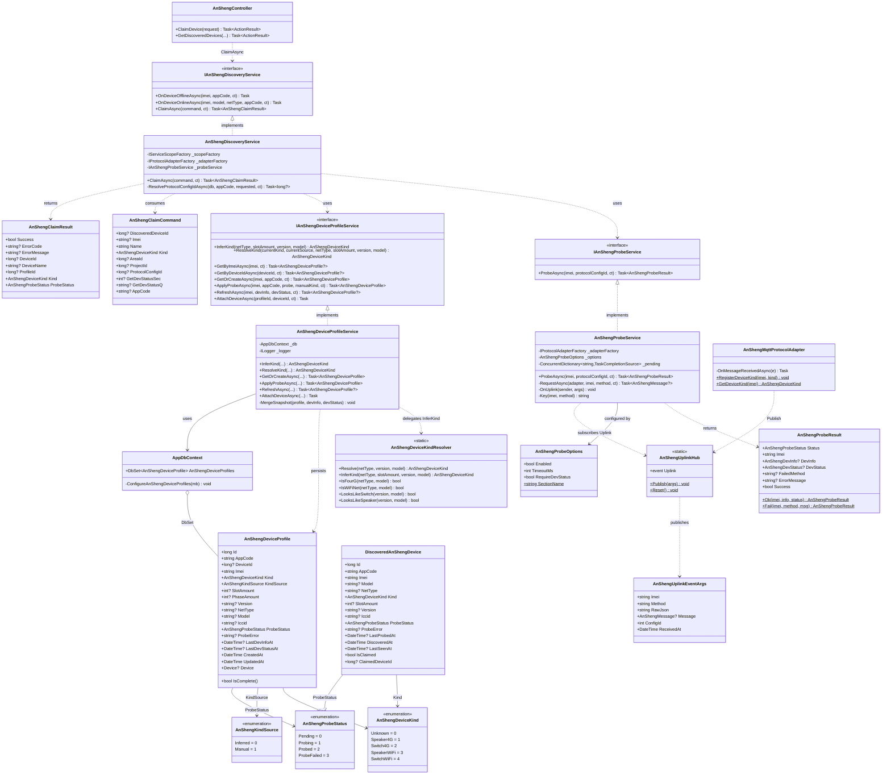
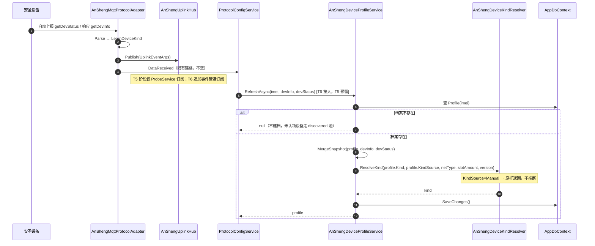
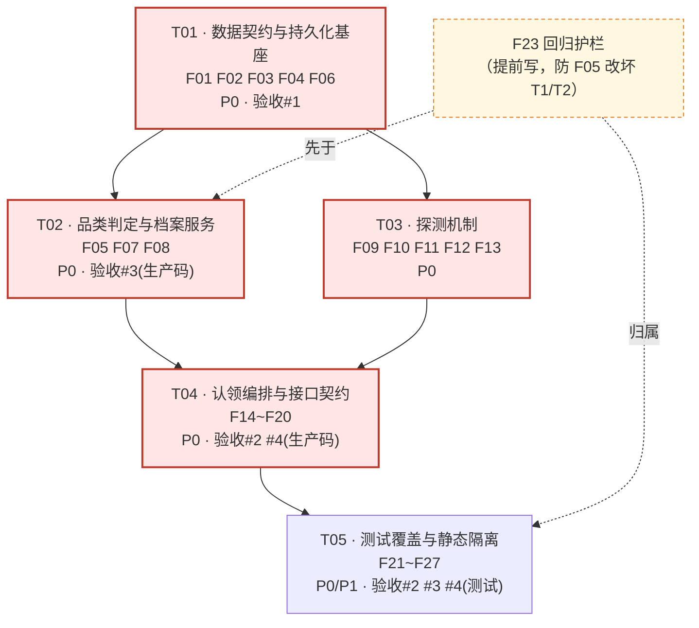

# T5 · 设备能力档案（Profile）与品类判定 — 增量设计方案 + 任务清单

> 架构师：高见远 ｜ 重构线：安圣二开重构线 P2 ｜ 依赖：T1 / T2（已落地）
> 权威规格：`.workbuddy/design/ansheng-open-redesign.md` D3（L271-327）、T5（L1747-1762）
> 测试映射：`.workbuddy/design/ansheng-test-scaffold-design.md` §9.1（L589-651）
> 本文所有结论均基于**实读代码**（见附录 A「现状核实清单」），非纸面推演。

---

## Part A · 系统设计

### 1. 实现方案（Implementation Approach）

#### 1.1 核心技术难点

| # | 难点 | 现状 | 结论 |
|---|---|---|---|
| N1 | **认领时同步探测**：claim 是 HTTP 请求，必须"发命令 → 等应答 → 写档案"，且失败要显式报错 | 现有链路全是 **fire-and-forget**：`adapter.SendCommandAsync` 只返回 frameId，应答走 `DataReceived` / `CommandResponse` 事件异步进 `ProtocolConfigService` | 新增 **上行总线 `AnShengUplinkHub`（静态事件）** + **`AnShengProbeService`（Singleton，TCS 按 `(imei, method)` 关联）**，claim 内 `await` 有超时 |
| N2 | **应答无 frameId**：不能按 frameId 关联 | §9.1 预置的探测应答 `{"method":"getDevInfo","imei":"...","version":"..."}` **不含 frameId**；适配器 `CommandResponse` 事件恰恰要求 `!string.IsNullOrWhiteSpace(message.FrameId)` 才触发 → **走不通** | 关联键定为 **`(Imei, Method)`**，不用 frameId；不复用 `CommandResponse` 事件 |
| N3 | **`InferKind` 与现有 `Resolve` 冲突** | 现有 `AnShengDeviceKindResolver.Resolve("WiFi", null, null)` 返回 `Unknown`（产品线未知），而验收 #3 要求 `SpeakerWiFi` | 保留 `Resolve` 语义不变（T1/T2 调用方零回归），**新增** `InferKind(netType, slotAmount, version, model)` 重载实现二级回退 |
| N4 | **报文字段位置与协议文档不一致** | §9.1 把 `slotAmount` 放在 **getDevStatus** 应答、把 `iccid` 放在 **getDevInfo** 应答；而现有 `AnShengDevStatus` 无 `SlotAmount`、`AnShengDevInfo` 无 `Iccid` → 直接解析会丢字段，验收 #2 的 `SlotAmount=4` 断言必挂 | `AnShengMessageTypes.cs` 补 2 个**容错属性**，Profile 合并时 **双源取值**（详见 §3.4）。**这是原 T5 文件清单遗漏的必改文件** |
| N5 | **枚举形态与设计文档不一致** | 设计 D3 写 `[Flags]`，实际 T1 落地为**顺序值枚举** + 独立的 `[Flags] AnShengDeviceCapability` | **不改枚举**。顺序值 + Capability 位掩码的组合语义等价且已被 Catalog/Builder 全量依赖，改 `[Flags]` 是破坏性重构，收益为零。设计文档以现状为准（本文附「文档回写建议」） |
| N6 | **Singleton 里做请求内编排**：`AnShengDiscoveryService` 是 `BackgroundService`（Singleton） | 其内部已有 `_scopeFactory.CreateScope()` 模式 | `ScopedTenantContextAccessor` 基于 `IHttpContextAccessor`（AsyncLocal），**在 HTTP 请求的异步流内新建 scope 仍能拿到正确 AppCode**，租户过滤器不会失效。方案可行 |

#### 1.2 架构模式

- **分层**：Controller（DTO 校验 + 结果映射）→ Service（编排 / 事务 / 业务校验）→ Infrastructure（协议、纯函数判定）。严格遵循 D3「校验落点 Service 层单点」。
- **品类判定 = 纯函数**：`InferKind` 落在 `Infrastructure/Protocol/AnSheng/AnShengDeviceKindResolver`（静态、无 DI、无 DB），`IAnShengDeviceProfileService` 只做**薄委托 + 一级 Manual 短路**。这样单测（验收 #3）既能直测 Service，也能直测 Resolver。
- **探测 = 请求-应答桥**：静态事件总线（沿用代码库已有的 `AnShengMqttProtocolAdapter.DeviceWill` 静态事件先例）+ `TaskCompletionSource` + 超时，**不引入 MediatR / Channel 等新依赖**。
- **不引入新 NuGet 包**（见 §6）。

#### 1.3 关键取舍

| 取舍点 | 选择 | 理由 |
|---|---|---|
| 探测关联键 | `(Imei, Method)` 而非 `frameId` | 设备应答不保证回传 frameId（§9.1 实证）；同一 IMEI 同一 method 并发探测极罕见，且已用 `ConcurrentDictionary.TryAdd` 做互斥 |
| 探测总线位置 | 新建 `AnShengUplinkHub` 静态类，而非在 `AnShengMqttProtocolAdapter` 上加静态事件 | 适配器由 `ProtocolAdapterFactory` `new` 出来、不走 DI，无法注入接口；独立 Hub 让**集成测试的 Fake 适配器**也能 `Publish`，不依赖真适配器类型。适配器侧只加 1 行调用 |
| 探测失败表达 | **返回结果对象**，不抛异常 | 探测失败是**预期业务分支**（设备离线很常见），不是异常。异常留给 T7 的 `UnsupportedByKindException` |
| Claim 编排位置 | 下沉到 `IAnShengDiscoveryService.ClaimAsync` | 与 T5 设计文件清单一致（`✏️ AnShengDiscoveryService.cs`）；Controller 从 120 行降到约 25 行，符合"Controller 只做 DTO 校验" |
| Profile 唯一键 | `UNIQUE(Imei)` | IMEI 是硬件全局唯一标识，一台设备一份档案。跨租户重复认领已被 claim 的 IMEI 冲突校验挡在前面（备选方案见 §3.2 注） |
| 探测超时 | 每条 5s，串行，最坏 10s | 与 §9.1「只发这两条且有序」断言一致；可配置 |

---

### 2. 文件清单（File List）

> 图例：🆕 新建 ｜ ✏️ 修改 ｜ ⚙️ 生成物（`dotnet ef` 产出，不手写）
> 路径均相对 `H:\IoTPlatform`

#### 2.1 生产代码

| # | 文件 | 状态 | 职责（一句话） | 归属任务 |
|---|---|:--:|---|:--:|
| F01 | `Models/AnShengDeviceProfile.cs` | 🆕 | 设备能力档案实体（动态快照）+ `AnShengKindSource` / `AnShengProbeStatus` 枚举 | T01 |
| F02 | `Models/DiscoveredAnShengDevice.cs` | ✏️ | 待认领池 +`Kind`/`SlotAmount`/`Version`/`Iccid`/`ProbeStatus`/`ProbeError`/`LastProbedAt` | T01 |
| F03 | `Data/AppDbContext.cs` | ✏️ | `DbSet<AnShengDeviceProfile>` + `ConfigureAnShengDeviceProfiles()` + 在 `OnModelCreating` 注册 | T01 |
| F04 | `Migrations/<ts>_AddAnShengProfileAndDiscoveredColumns.cs` | ⚙️ | 建 Profile 表 + 待认领池加列；`Up`/`Down` 双向可执行 | T01 |
| F05 | `Infrastructure/Protocol/AnSheng/AnShengDeviceKind.cs` | ✏️ | `AnShengDeviceKindResolver` 新增 `InferKind(...)` 二级回退；`IsSwitchProduct/IsSpeakerProduct` 提升为 `public LooksLikeSwitch/LooksLikeSpeaker` | T02 |
| F06 | `Infrastructure/Protocol/AnSheng/AnShengMessageTypes.cs` | ✏️ | `AnShengDevStatus` +`SlotAmount`；`AnShengDevInfo` +`Iccid`（容错解析，见 N4） | T02 |
| F07 | `Services/Interfaces/IAnShengDeviceProfileService.cs` | 🆕 | 档案服务契约：`InferKind` / `ResolveKind` / `GetByImeiAsync` / `GetOrCreateAsync` / `RefreshAsync` / `AttachDeviceAsync` | T02 |
| F08 | `Services/AnShengDeviceProfileService.cs` | 🆕 | 档案服务实现（Scoped）：一级 Manual 短路 + 委托 Resolver + 快照落库 | T02 |
| F09 | `Infrastructure/Protocol/AnSheng/AnShengUplinkHub.cs` | 🆕 | 上行报文静态总线 + `AnShengUplinkEventArgs` + `Reset()`（测试隔离） | T03 |
| F10 | `Infrastructure/Protocol/Adapters/AnShengMqttProtocolAdapter.cs` | ✏️ | `OnMessageReceivedAsync` 内 `AnShengUplinkHub.Publish(...)`（**+1 行调用，其余零改动**） | T03 |
| F11 | `Services/Interfaces/IAnShengProbeService.cs` | 🆕 | 探测契约 + `AnShengProbeResult` | T03 |
| F12 | `Services/AnShengProbeService.cs` | 🆕 | 探测实现（Singleton）：TCS 按 `(imei,method)` 等待、超时、结果归并 | T03 |
| F13 | `Configuration/AnShengProbeOptions.cs` | 🆕 | 探测超时/开关配置（绑定 `AnSheng:Probe`） | T03 |
| F14 | `DTOs/Requests/AnShengRequests.cs` | ✏️ | `ClaimAnShengDeviceRequest` +`Kind`（必填）、`Imei`（可选二选一）、`ProtocolConfigId` 改可选 | T04 |
| F15 | `DTOs/Responses/AnShengResponses.cs` | ✏️ | `DiscoveredAnShengDeviceDto` +6 字段 +`SuggestedKind`；`ClaimAnShengDeviceResponse` +`ErrorCode`/`Kind`/`ProfileId` | T04 |
| F16 | `Services/Interfaces/IAnShengDiscoveryService.cs` | ✏️ | +`Task<AnShengClaimResult> ClaimAsync(AnShengClaimCommand, CancellationToken)` | T04 |
| F17 | `Services/AnShengDiscoveryService.cs` | ✏️ | 实现 `ClaimAsync`：强制探测 → 写 Profile → 建 Device（Category 由 Kind 派生）→ 事务提交 | T04 |
| F18 | `Controllers/AnShengController.cs` | ✏️ | `ClaimDevice` 瘦身为 DTO 校验 + 调 `ClaimAsync` + 结果映射；`GetDiscoveredDevices` 投影新增字段 | T04 |
| F19 | `Program.cs` | ✏️ | 注册 `IAnShengDeviceProfileService`(Scoped) / `IAnShengProbeService`(Singleton) / `AnShengProbeOptions` | T04 |
| F20 | `appsettings.json` | ✏️ | `AnSheng:Probe` 配置节 | T04 |

#### 2.2 测试代码

| # | 文件 | 状态 | 职责 | 归属任务 |
|---|---|:--:|---|:--:|
| F21 | `tests/IoTPlatform.AnSheng.Tests/AnShengDeviceProfileServiceTests.cs` | 🆕 | 验收 #3 单元测试（`InferKind` 三条 + Manual 不覆盖） | T05 |
| F22 | `tests/IoTPlatform.AnSheng.Tests/AnShengProbeServiceTests.cs` | 🆕 | 探测超时 / 成功 / 部分失败 / 并发隔离 | T05 |
| F23 | `tests/IoTPlatform.AnSheng.Tests/AnShengKindResolverRegressionTests.cs` | 🆕 | `Resolve` 旧行为零回归（护栏，防 F05 改坏 T1/T2） | T05 |

**文件总计**：🆕 9 + ✏️ 11 + ⚙️ 1 = 21（其中生产代码 20）。相较设计文档 T5 的「6 文件」，新增 4 类必要文件，理由：
1. 探测机制在原设计中只有一句"强制触发"，未定义实现载体 → F09/F11/F12/F13 是其最小落地集；
2. N4 报文字段错位是实读 §9.1 后发现的硬缺陷 → F06 必改，否则验收 #2 无法通过；
3. F14/F15/F18 是"认领必须显式携带 Kind"和"Category 不写死"的必然外溢；
4. F19/F20 是 DI/配置注册，工程惯例。

---

### 3. 数据结构与接口（Data Structures and Interfaces）

#### 3.1 类图



#### 3.2 实体：`Models/AnShengDeviceProfile.cs`（🆕 F01）

```csharp
using IoTPlatform.Data;
using IoTPlatform.Infrastructure.Protocol.AnSheng;
using System.ComponentModel.DataAnnotations;
using System.ComponentModel.DataAnnotations.Schema;

namespace IoTPlatform.Models;

/// <summary>品类来源：一级判定的权威性标记。</summary>
public enum AnShengKindSource
{
    /// <summary>系统自动推断（netType + slotAmount）。可被后续探测刷新覆盖。</summary>
    Inferred = 0,
    /// <summary>管理员认领时人工指定。<b>权威，任何自动推断都不得覆盖。</b></summary>
    Manual = 1
}

/// <summary>设备探测状态。</summary>
public enum AnShengProbeStatus
{
    /// <summary>尚未探测。</summary>
    Pending = 0,
    /// <summary>探测进行中（已下发、等待应答）。</summary>
    Probing = 1,
    /// <summary>探测成功，快照有效。</summary>
    Probed = 2,
    /// <summary>探测失败（超时 / 适配器不可用 / 应答异常）。</summary>
    ProbeFailed = 3
}

/// <summary>
/// 安圣设备能力档案（动态快照）。D3 第二级模型。
/// 用途：slotNum 越界校验、固件门槛判定、前端 N 路渲染、品类权威存储。
/// 生命周期：认领时首次写入（强制探测），此后由 getDevInfo/getDevStatus 上行刷新。
/// </summary>
[Table("ansheng_device_profiles")]
public class AnShengDeviceProfile : IHasAppCode
{
    [Key]
    [DatabaseGenerated(DatabaseGeneratedOption.Identity)]
    public long Id { get; set; }

    [MaxLength(50)]
    public string? AppCode { get; set; }

    /// <summary>关联的正式设备 Id；认领完成后写入，认领前为 null。</summary>
    public long? DeviceId { get; set; }

    /// <summary>设备 IMEI（全局唯一，档案主检索键）。</summary>
    [Required, MaxLength(50)]
    public string Imei { get; set; } = string.Empty;

    /// <summary>设备品类（权威值）。</summary>
    public AnShengDeviceKind Kind { get; set; } = AnShengDeviceKind.Unknown;

    /// <summary>品类来源；Manual 时自动推断一律跳过。</summary>
    public AnShengKindSource KindSource { get; set; } = AnShengKindSource.Inferred;

    /// <summary>插槽数量（getDevInfo.slotAmount，兼容 getDevStatus 上报）。slotNum 越界校验依据。</summary>
    public int? SlotAmount { get; set; }

    /// <summary>相位数量（getDevInfo.phaseAmount）。</summary>
    public int? PhaseAmount { get; set; }

    /// <summary>固件版本，如 SWITCH-EC618X-R24-O-V4.0.8。固件门槛判定依据。</summary>
    [MaxLength(64)]
    public string? Version { get; set; }

    /// <summary>联网类型：4G / WiFi。</summary>
    [MaxLength(50)]
    public string? NetType { get; set; }

    /// <summary>模组型号，如 Air780E。</summary>
    [MaxLength(100)]
    public string? Model { get; set; }

    /// <summary>物联卡 ICCID（4G 款）。</summary>
    [MaxLength(32)]
    public string? Iccid { get; set; }

    /// <summary>探测状态。</summary>
    public AnShengProbeStatus ProbeStatus { get; set; } = AnShengProbeStatus.Pending;

    /// <summary>最近一次探测失败原因（成功时清空）。</summary>
    [MaxLength(255)]
    public string? ProbeError { get; set; }

    /// <summary>最近一次成功解析 getDevInfo 的时间（UTC）。</summary>
    public DateTime? LastDevInfoAt { get; set; }

    /// <summary>最近一次成功解析 getDevStatus 的时间（UTC）。</summary>
    public DateTime? LastDevStatusAt { get; set; }

    public DateTime CreatedAt { get; set; } = DateTime.UtcNow;
    public DateTime UpdatedAt { get; set; } = DateTime.UtcNow;

    [ForeignKey(nameof(DeviceId))]
    public virtual Device? Device { get; set; }

    /// <summary>档案是否完整（验收 #2 的四字段判据）。</summary>
    [NotMapped]
    public bool IsComplete =>
        Kind != AnShengDeviceKind.Unknown
        && SlotAmount.HasValue
        && !string.IsNullOrWhiteSpace(Version)
        && !string.IsNullOrWhiteSpace(NetType);
}
```

**EF 配置（`Data/AppDbContext.cs`，✏️ F03）** — 与既有 `ConfigureAnShengDeviceConfigs` 同风格：

```csharp
public DbSet<AnShengDeviceProfile> AnShengDeviceProfiles { get; set; }   // 放在 DiscoveredAnShengDevices 下一行

// OnModelCreating 中，紧跟 ConfigureDiscoveredAnShengDevices(modelBuilder); 之后：
ConfigureAnShengDeviceProfiles(modelBuilder);

private void ConfigureAnShengDeviceProfiles(ModelBuilder modelBuilder)
{
    modelBuilder.Entity<AnShengDeviceProfile>(entity =>
    {
        entity.HasKey(e => e.Id);
        entity.HasIndex(e => e.Imei).IsUnique();      // 一台硬件一份档案
        entity.HasIndex(e => e.DeviceId).IsUnique();  // MySQL 唯一索引允许多个 NULL → 未认领档案不冲突
        entity.HasIndex(e => e.AppCode);
        entity.HasIndex(e => e.Kind);

        entity.Property(e => e.Kind).HasConversion<int>();
        entity.Property(e => e.KindSource).HasConversion<int>();
        entity.Property(e => e.ProbeStatus).HasConversion<int>();

        entity.HasOne(e => e.Device)
            .WithMany()
            .HasForeignKey(e => e.DeviceId)
            .OnDelete(DeleteBehavior.SetNull);   // 设备删除后档案保留，便于重新认领
    });
}
```

> **`UNIQUE(Imei)` 取舍**：IMEI 是硬件全局唯一号，同一台设备不应在两个租户下各存一份档案。跨租户重复认领在 `ClaimAsync` 里已被 IMEI 冲突校验拦截，不会走到 DB 唯一约束。
> **备选**（若产品明确要求同一 IMEI 可被多租户各自认领）：改为 `HasIndex(e => new { e.AppCode, e.Imei }).IsUnique()` + `HasIndex(e => e.Imei)` 非唯一。注意 MySQL 对 `AppCode = NULL` 的行视为互不相同，届时需把 `AppCode` 落库前兜底为 `"system"`（`ClaimAsync` 已如此处理 Device.AppCode）。**默认采用 `UNIQUE(Imei)`。**

#### 3.3 实体：`Models/DiscoveredAnShengDevice.cs`（✏️ F02）

在现有字段**末尾追加**（不改动已有字段的顺序与语义）：

```csharp
    /// <summary>探测/推断出的品类，认领页默认选中项（D3 第二级）。</summary>
    public AnShengDeviceKind Kind { get; set; } = AnShengDeviceKind.Unknown;

    /// <summary>插槽数量（探测所得）。</summary>
    public int? SlotAmount { get; set; }

    /// <summary>固件版本（探测所得）。</summary>
    [MaxLength(64)]
    public string? Version { get; set; }

    /// <summary>物联卡 ICCID（探测所得）。</summary>
    [MaxLength(32)]
    public string? Iccid { get; set; }

    /// <summary>探测状态；ProbeFailed 时认领接口必须显式报错（验收 #4）。</summary>
    public AnShengProbeStatus ProbeStatus { get; set; } = AnShengProbeStatus.Pending;

    /// <summary>最近一次探测失败原因。</summary>
    [MaxLength(255)]
    public string? ProbeError { get; set; }

    /// <summary>最近一次探测时间（UTC）。</summary>
    public DateTime? LastProbedAt { get; set; }
```

`ConfigureDiscoveredAnShengDevices` 追加：

```csharp
        entity.Property(e => e.Kind).HasConversion<int>();
        entity.Property(e => e.ProbeStatus).HasConversion<int>();
        entity.HasIndex(e => e.ProbeStatus);
```

> `Models` 引用 `Infrastructure.Protocol.AnSheng.AnShengDeviceKind` 需在文件头补 `using IoTPlatform.Infrastructure.Protocol.AnSheng;`。方向为 Models → Infrastructure，与现有 `Models` 引用 `IoTPlatform.Data` 的耦合度同级，无循环依赖（Infrastructure.Protocol.AnSheng 不反向引用 Models，已核实）。

#### 3.4 品类判定：`AnShengDeviceKindResolver`（✏️ F05）

**归并方案（开放问题 #2 的决策）**：
- `Resolve(netType, version, model)` — **语义与实现完全不变**（T1/T2 的 `AnShengMqttProtocolAdapter.LearnDeviceKind` / `AnShengDiscoveryService.OnDeviceOnlineAsync` 两个调用点零回归），仅把两个私有判定方法改名并提升可见性。
- **新增** `InferKind(netType, slotAmount, version, model)` — 承载 D3 的二级回退；`slotAmount` 为 `int?`（验收 #3 要求 `InferKind("WiFi", null, null)`）。
- 一级（Manual 权威）**不在纯函数里**，落在 `IAnShengDeviceProfileService.ResolveKind(...)`。
- 三级（version 前缀）**仅在 `slotAmount` 缺失时**作为提示参与，与 D3「不作为判定依据、R2 已关闭」一致：只要拿到了 `slotAmount`，一律以 `netType + slotAmount` 为准。

```csharp
public static class AnShengDeviceKindResolver
{
    // ── 既有方法保持不变 ──
    public static AnShengDeviceKind Resolve(string? netType, string? version = null, string? model = null) { /* 原样 */ }
    public static bool IsFourG(string? netType, string? model = null) { /* 原样 */ }
    public static bool IsWiFiNet(string? netType, string? model = null) { /* 原样 */ }

    // ── 私有 → 公开（仅改可见性与命名，逻辑原样）──
    public static bool LooksLikeSwitch(string? version, string? model);   // 原 IsSwitchProduct
    public static bool LooksLikeSpeaker(string? version, string? model);  // 原 IsSpeakerProduct

    /// <summary>
    /// D3 三级回退品类推断（二级为主）。
    /// 规则：
    ///   1. netType 未知（既非 4G 也非 WiFi） → 退回 <see cref="Resolve"/>（通常 Unknown）。
    ///   2. netType 已知 且 slotAmount 有值 → slotAmount > 0 判为开关，否则判为喇叭。（权威）
    ///   3. netType 已知 但 slotAmount 缺失 → 用 version/model 前缀做形态提示；仍无提示则判为喇叭。
    /// </summary>
    /// <param name="netType">getDevStatus.netType / getDevInfo.netType，如 "4G" / "WiFi"。</param>
    /// <param name="slotAmount">getDevInfo.slotAmount；null 表示未探测到该字段。</param>
    /// <param name="version">getDevInfo.version，仅在 slotAmount 缺失时作为提示。</param>
    /// <param name="model">模组型号，可选。</param>
    public static AnShengDeviceKind InferKind(
        string? netType, int? slotAmount, string? version = null, string? model = null)
    {
        var is4G   = IsFourG(netType, model);
        var isWiFi = IsWiFiNet(netType, model);

        // 一级信息缺失：联网方式都不知道 → 走旧的字符串兜底
        if (!is4G && !isWiFi) return Resolve(netType, version, model);

        bool isSwitch;
        if (slotAmount.HasValue)
        {
            // 二级（权威）：有插槽 → 开关；明确 0 插槽 → 喇叭
            isSwitch = slotAmount.Value > 0;
        }
        else
        {
            // 三级（提示）：仅在 slotAmount 未知时参考 version/model 前缀
            isSwitch = LooksLikeSwitch(version, model);
        }

        if (is4G) return isSwitch ? AnShengDeviceKind.Switch4G : AnShengDeviceKind.Speaker4G;
        return isSwitch ? AnShengDeviceKind.SwitchWiFi : AnShengDeviceKind.SpeakerWiFi;
    }
}
```

**验收 #3 用例逐条推演（务必与实现一致）**

| 输入 | 路径 | 输出 | 验收要求 | ✓ |
|---|---|---|---|:--:|
| `InferKind("4G", 4, "SWITCH-EC618X-R24-O-V4.0.8")` | is4G ✓ → slotAmount=4>0 → isSwitch | `Switch4G` | `Switch4G` | ✅ |
| `InferKind("WiFi", null, null)` | isWiFi ✓ → slotAmount 缺失 → `LooksLikeSwitch(null,null)=false` | `SpeakerWiFi` | `SpeakerWiFi` | ✅ |
| `KindSource=Manual` | 不进入 `InferKind`，由 `ResolveKind` 短路 | 保持人工值 | 不被覆盖 | ✅ |
| （回归）`InferKind("4G", 0, null)` | slotAmount=0 → 非开关 | `Speaker4G` | D3「slotAmount>0 才是开关」 | ✅ |
| （回归）`InferKind(null, 4, "SWITCH-...")` | netType 未知 → `Resolve(null,"SWITCH-...",null)` | `Unknown` | 保守，不臆断联网方式 | ✅ |

**★ 补充裁决（2026-xx，应工程师提问补写）：三级分支必须是「对称二元」，禁止出现 `Unknown` 出口**

上表第 2 行只钉了 WiFi 一条，实现时曾出现「前缀两边都不像 ⇒ 返回 `Unknown`」的早返回，导致 `InferKind("WiFi", null, null)` 退化回 `Resolve` 的 `Unknown`，验收 #3 未达成。现明确：

| 输入 | 必须输出 | 依据 |
|---|---|---|
| `InferKind("WiFi", null, null)` | `SpeakerWiFi` | 验收 #3 原文 |
| `InferKind("4G", null, null)` | **`Speaker4G`** | 本次裁决，见下 |

**为什么 4G 侧也必须给确定值（不允许 WiFi→Speaker / 4G→Unknown 的不对称规则）**

1. **职责边界**：`InferKind` 是**纯推断函数**，契约是「给出最可能的品类」，不是「给出可安全用于命令网关的品类」。安全考量属于消费侧，塞进推断函数是职责错配。
2. **规格可推导性**：D3 第 3 级规定版本前缀是「兜底提示，**不作为判定依据**」；§7-R2 已关闭确认 `netType` 值域仅 `{4G, WiFi}`。两条合起来推出的必然是对称二元。不对称规则**无法从任何规格条款推导**，只能靠注释解释，属于「代码里的孤例」。
3. **`Unknown` 在此处不是「更安全」，只是「更含糊」**：它同时意味着「联网方式都不知道」（一级失败）和「产品线不确定」（三级失败）两种完全不同的状态，把后者也编码成 `Unknown` 会让调用方无法区分。一级失败已经有 `Resolve` 委托这条明确出口。

**配套约束（消费侧承担安全责任）—— 见 §8.5**

推断值的「不可靠」必须在**写入命令网关**时把关，而不是在推断函数里回避。

#### 3.4bis 推断值的信任边界（★ 强约束，T6 前必须落实）

**实读发现的既有立场**：`AnShengCommandSpec.cs:52-55`

```csharp
public bool IsSupportedBy(AnShengDeviceKind kind)
{
    if (kind == AnShengDeviceKind.Unknown) return true;   // ★ Unknown ⇒ 放行一切，不误拦截
    return (SupportedKinds & kind.ToCapability()) != AnShengDeviceCapability.None;
}
```

配合 `AnShengCommandBuilder.cs:124-127`（不匹配即 `throw NotSupportedException`）与 `AnShengCommandCatalog.cs:210-257`（`GroupSwitchAction` 门控 `action` / `actions` / `getDelayTasks` / `startDelayTask` / `stopDelayTask` / `getEMRealtime` / `getCalParams` / `setCalParams` / `resetCalParams` / `autoCal` 共 10 条下发命令），可得：

> **一个「猜错的具体品类」比 `Unknown` 严格更糟** —— `Unknown` 放行一切，猜错则**确定地拦掉 10 条命令**。

因此 `AnShengDeviceProfileService.SyncDeviceKindCache` **不得无条件**把档案 Kind 推进 `AnShengMqttProtocolAdapter.RegisterDeviceKind`：

| `KindSource` | 判据强度 | 是否写入静态字典 | 理由 |
|---|---|:--:|---|
| `Manual` | 人工权威 | ✅ 写 | 一级权威，管理员为其负责 |
| `Probe` / `Uplink` 且 `profile.SlotAmount.HasValue` | 二级硬事实 | ✅ 写 | 设备自报插槽数，可信 |
| `Probe` / `Uplink` 且 `SlotAmount == null` | 三级前缀猜测 | ❌ **不写** | 仅落档案供 UI 展示；静态字典维持 `Unknown` ⇒ 命中既有 fail-open，放行一切 |
| `Unknown` | — | ❌ 不写 | 现状已如此 |

**T5 现状说明（为何本条不阻塞 T5 交付）**：T5 中 `InferKind` **到不了持久化** ——
`ApplyProbeAsync` 是唯一生产写入方（`AnShengDiscoveryService.cs:451`），而 `ClaimAsync` 步骤 1 强制 `Kind != Unknown`
并原样透传 `command.Kind` ⇒ `ResolveKind` 必定命中一级权威短路；`RefreshAsync` 在 T5 **无任何生产调用点**。
本约束是 **T6 接通上行自学习时的准入门槛**，届时不落实即为缺陷。

**T6 另需对齐的一处设计偏离**：本文档 §4.3 时序图约定「档案不存在 ⇒ 返回 null，不建档」，
而当前 `RefreshAsync` 实现调用了 `GetOrCreateAsync`（会建档）。T6 接通前必须二选一并更新文档，
否则任意未认领设备的一条上行就会凭三级猜测生成一份档案 —— 这正是上表要防的场景。

> ### ✅ 已在 T6 解决（决策 A，主理人裁定）
>
> **裁定结果**：**严格保留 §4.3 的契约** —— `RefreshAsync` 在档案不存在时**返回 `null`，绝不建档**。
>
> **T6 的处理方式**：
> 1. `IAnShengDeviceProfileService.RefreshAsync` 签名改为 `Task<AnShengDeviceProfile?> RefreshAsync(...)`；
> 2. `AnShengDeviceProfileService.RefreshAsync` **删除对 `GetOrCreateAsync` 的调用**，改为 `FirstOrDefaultAsync` 纯查询，查不到直接 `return null`；
> 3. 档案的**唯一创建入口**因此收敛为认领流程（`ClaimAsync` 强制 `getDevInfo` + `getDevStatus`），
>    未认领设备的上行继续只更新 `DiscoveredAnShengDevice` 发现池，不产生"孤儿档案"，
>    上表的三级前缀猜测**永远不会**因为一条上行报文而落库；
> 4. 回归测试：`RefreshAsync_Should_Return_Null_When_Profile_Missing`（单元）+
>    `Unclaimed_Device_AutoReport_Should_Not_Create_Profile`（集成）。
>
> **落地任务**：T6-4「决策 A 落地：`RefreshAsync` 契约修正」，详见
> `.workbuddy/design/t6-event-pipeline-design.md` §5（任务 T6-4）与 §8.1（决策 A）。
> **本条偏差自 T6-4 合入后关闭，不再是未决项。**

#### 3.5 报文容错（✏️ F06，对应 N4）

```csharp
// AnShengDevStatus 追加：部分固件/网关会把 slotAmount 一并放在 getDevStatus 顶层（见测试脚手架 §9.1）
[JsonPropertyName("slotAmount")]
public int? SlotAmount { get; set; }

// AnShengDevInfo 追加：部分固件把 iccid 放在 getDevInfo 顶层
[JsonPropertyName("iccid")]
public string? Iccid { get; set; }
```

**快照合并规则（`AnShengDeviceProfileService.MergeSnapshot`，单点实现，勿散落）**

| Profile 字段 | 取值优先级 | 说明 |
|---|---|---|
| `Version` | `devInfo.Version` → `devStatus.Version` → 保留原值 | |
| `SlotAmount` | `devInfo.SlotAmount` → `devStatus.SlotAmount` → `devStatus.SlotCount > 0 ? SlotCount : null` → 保留原值 | 三源兜底 |
| `PhaseAmount` | `devInfo.PhaseAmount` → 保留原值 | |
| `NetType` | `devStatus.NetType` → `devInfo.NetType` → 保留原值 | 状态报文更实时 |
| `Model` | `devStatus.Model` → `devInfo.Model` → 保留原值 | |
| `Iccid` | `devStatus.Iccid` → `devInfo.Iccid` → 保留原值 | |
| `LastDevInfoAt` / `LastDevStatusAt` | 对应报文解析成功时置 `DateTime.UtcNow` | |

> 合并语义统一为 **"新值非空才覆盖，空值不清零"**，避免一次残缺应答把已有档案洗掉。

#### 3.6 档案服务（🆕 F07 / F08）

```csharp
namespace IoTPlatform.Services.Interfaces;   // ← 注意：与 IAnShengDiscoveryService 的命名空间不同，见 §8 共享约定

public interface IAnShengDeviceProfileService
{
    /// <summary>纯函数：D3 三级回退品类推断。委托 AnShengDeviceKindResolver.InferKind。</summary>
    AnShengDeviceKind InferKind(string? netType, int? slotAmount, string? version = null, string? model = null);

    /// <summary>
    /// 带一级权威判定的品类解析：KindSource=Manual 且 currentKind 非 Unknown 时<b>直接返回 currentKind</b>，
    /// 不做任何推断（验收 #3 第三条）。纯函数，无 DB 访问，可直测。
    /// </summary>
    AnShengDeviceKind ResolveKind(AnShengDeviceKind currentKind, AnShengKindSource currentSource,
        string? netType, int? slotAmount, string? version = null, string? model = null);

    Task<AnShengDeviceProfile?> GetByImeiAsync(string imei, CancellationToken ct = default);
    Task<AnShengDeviceProfile?> GetByDeviceIdAsync(long deviceId, CancellationToken ct = default);

    /// <summary>按 IMEI 取档案，不存在则新建（ProbeStatus=Pending），已保存。</summary>
    Task<AnShengDeviceProfile> GetOrCreateAsync(string imei, string? appCode, CancellationToken ct = default);

    /// <summary>
    /// 认领主入口：把一次探测结果落进档案。
    /// manualKind 非 Unknown → Kind=manualKind、KindSource=Manual；否则按推断结果写 Inferred。
    /// 探测失败时写 ProbeStatus=ProbeFailed + ProbeError，快照字段不动。
    /// </summary>
    Task<AnShengDeviceProfile> ApplyProbeAsync(string imei, string? appCode,
        AnShengProbeResult probe, AnShengDeviceKind manualKind = AnShengDeviceKind.Unknown,
        CancellationToken ct = default);

    /// <summary>运行期刷新：由上行 getDevInfo/getDevStatus 触发（T6 会复用）。档案不存在时返回 null，不建档。</summary>
    Task<AnShengDeviceProfile?> RefreshAsync(string imei, AnShengDevInfo? devInfo, AnShengDevStatus? devStatus,
        CancellationToken ct = default);

    /// <summary>认领成功后回填 DeviceId。</summary>
    Task AttachDeviceAsync(long profileId, long deviceId, CancellationToken ct = default);
}
```

`ResolveKind` 参考实现（**验收 #3 的被测方法**）：

```csharp
public AnShengDeviceKind ResolveKind(AnShengDeviceKind currentKind, AnShengKindSource currentSource,
    string? netType, int? slotAmount, string? version = null, string? model = null)
{
    // 一级：人工指定权威，跳过一切推断
    if (currentSource == AnShengKindSource.Manual && currentKind != AnShengDeviceKind.Unknown)
        return currentKind;

    var inferred = InferKind(netType, slotAmount, version, model);
    // 推断不出来时不要把已有值洗成 Unknown
    return inferred != AnShengDeviceKind.Unknown ? inferred : currentKind;
}
```

**副作用约定**：`ApplyProbeAsync` 成功时额外调用
`AnShengMqttProtocolAdapter.RegisterDeviceKind(imei, profile.Kind)`，
让 T1 的内存品类缓存与档案一致（否则下发 timestamp 注入判断会用旧的 `Resolve` 结果）。

#### 3.7 探测机制（🆕 F09–F13，对应开放问题 #1）

**为什么不复用现有通道（决策依据，务必阅读）**

| 候选 | 结论 | 原因（实读代码） |
|---|---|---|
| 复用 `IAnShengCommandService` | ❌ | 它只负责下发，**没有任何等待应答的能力**；且它要求设备已有 `DeviceId`/`ProtocolConfigId`，而认领前设备**尚未建 Device 行** |
| 复用 `AnShengCommandService.FrameIdCommandIdMap` | ❌ | 该 map 是 `frameId → commandId` 的静态字典，只服务于命令历史状态回写；且探测应答**不带 frameId** |
| 复用 `IProtocolAdapter.CommandResponse` 事件 | ❌ | 触发条件是 `!string.IsNullOrWhiteSpace(message.FrameId) && !message.IsEvent`（`AnShengMqttProtocolAdapter.cs:555-557`），无 frameId 的探测应答**永远不会触发** |
| 复用 `IProtocolAdapter.DataReceived` 事件 | △ | 会触发，但 payload 已被 `NormalizeForSensorData` 改写成传感器格式，且事件被 `ProtocolConfigService` 独占订阅（按 configId 管理订阅字典），**再挂一个订阅者要改它的生命周期管理**，改动面比新增 Hub 更大 |
| **新增 `AnShengUplinkHub` 静态总线** | ✅ | 适配器侧 **+1 行**；与代码库既有 `AnShengMqttProtocolAdapter.DeviceWill` 静态事件先例同构；Fake 适配器可直接 `Publish`，集成测试零 hack |

**F09 `Infrastructure/Protocol/AnSheng/AnShengUplinkHub.cs`**

```csharp
namespace IoTPlatform.Infrastructure.Protocol.AnSheng;

/// <summary>安圣设备上行报文事件参数（原始解析结果，未做任何业务归一化）。</summary>
public class AnShengUplinkEventArgs : EventArgs
{
    public string Imei { get; init; } = string.Empty;
    public string Method { get; init; } = string.Empty;
    public string RawJson { get; init; } = string.Empty;
    public AnShengMessage? Message { get; init; }
    public int ConfigId { get; init; }
    public DateTime ReceivedAt { get; init; } = DateTime.UtcNow;
}

/// <summary>
/// 安圣上行报文总线。
/// 适配器收到并解析每一条上行后 Publish 一次；探测服务（及后续 T6 事件管道）按需订阅。
/// 静态实现的理由：适配器由 ProtocolAdapterFactory 直接 new，不参与 DI，无法注入接口实例。
/// 与既有 AnShengMqttProtocolAdapter.DeviceWill 静态事件保持同一模式。
/// </summary>
public static class AnShengUplinkHub
{
    public static event EventHandler<AnShengUplinkEventArgs>? Uplink;

    /// <summary>发布一条上行报文。订阅方异常被隔离，绝不回传到适配器接收线程。</summary>
    public static void Publish(AnShengUplinkEventArgs args)
    {
        var handlers = Uplink;
        if (handlers == null) return;
        foreach (var h in handlers.GetInvocationList().Cast<EventHandler<AnShengUplinkEventArgs>>())
        {
            try { h(null, args); } catch { /* 订阅方异常隔离 */ }
        }
    }

    /// <summary>清空所有订阅。<b>仅测试隔离使用</b>（对应脚手架"静态清零"要求）。</summary>
    public static void Reset() => Uplink = null;
}
```

**F10 适配器改动（`OnMessageReceivedAsync`，在 `LearnDeviceKind(imei, message);` 之后插入）**

```csharp
            // 广播原始上行，供探测服务 / 事件管道消费（异常已在 Hub 内隔离）
            AnShengUplinkHub.Publish(new AnShengUplinkEventArgs
            {
                Imei = imei,
                Method = message?.Method ?? string.Empty,
                RawJson = rawPayload,
                Message = message,
                ConfigId = _configId
            });
```

> 位置必须在 `LearnDeviceKind` 之后、Will 判定之前，保证 `close` 报文也会被广播（T6 需要）。

**F11 `Services/Interfaces/IAnShengProbeService.cs`**

```csharp
namespace IoTPlatform.Services.Interfaces;

/// <summary>一次认领探测的结果。</summary>
public class AnShengProbeResult
{
    public AnShengProbeStatus Status { get; init; } = AnShengProbeStatus.Pending;
    public string Imei { get; init; } = string.Empty;
    public AnShengDevInfo? DevInfo { get; init; }
    public AnShengDevStatus? DevStatus { get; init; }
    /// <summary>失败发生在哪个方法（getDevInfo / getDevStatus / adapter）。</summary>
    public string? FailedMethod { get; init; }
    public string? ErrorMessage { get; init; }

    public bool Success => Status == AnShengProbeStatus.Probed;

    public static AnShengProbeResult Ok(string imei, AnShengDevInfo? info, AnShengDevStatus? status);
    public static AnShengProbeResult Fail(string imei, string failedMethod, string message);
}

public interface IAnShengProbeService
{
    /// <summary>
    /// 同步探测：依次下发 getDevInfo、getDevStatus，各自等待应答（默认 5s 超时）。
    /// 不写库、不改状态，纯粹的"问一次设备"。持久化由调用方（ClaimAsync）负责。
    /// </summary>
    /// <param name="imei">设备 IMEI。</param>
    /// <param name="protocolConfigId">安圣协议配置 Id，用于取适配器。</param>
    Task<AnShengProbeResult> ProbeAsync(string imei, long protocolConfigId, CancellationToken ct = default);
}
```

**F12 `Services/AnShengProbeService.cs`（Singleton）核心实现要点**

```csharp
public class AnShengProbeService : IAnShengProbeService, IDisposable
{
    private readonly IProtocolAdapterFactory _adapterFactory;
    private readonly AnShengProbeOptions _options;
    private readonly ILogger<AnShengProbeService> _logger;

    // key = $"{imei}|{method}"
    private readonly ConcurrentDictionary<string, TaskCompletionSource<AnShengMessage>> _pending = new(StringComparer.Ordinal);

    public AnShengProbeService(IProtocolAdapterFactory f, IOptions<AnShengProbeOptions> o, ILogger<AnShengProbeService> l)
    {
        _adapterFactory = f; _options = o.Value; _logger = l;
        AnShengUplinkHub.Uplink += OnUplink;          // Singleton 生命周期 = 应用生命周期
    }

    public async Task<AnShengProbeResult> ProbeAsync(string imei, long protocolConfigId, CancellationToken ct = default)
    {
        if (!_options.Enabled)                       // 逃生开关（见 §8 与待明确事项 Q4）
            return AnShengProbeResult.Ok(imei, null, null);

        var adapter = _adapterFactory.GetAdapter((int)protocolConfigId);
        if (adapter == null || !adapter.IsConnected)
            return AnShengProbeResult.Fail(imei, "adapter", $"安圣适配器不可用或未连接（ConfigId={protocolConfigId}）");

        // ① getDevInfo —— 必须成功
        var infoMsg = await RequestAsync(adapter, imei, "getDevInfo", ct);
        if (infoMsg == null)
            return AnShengProbeResult.Fail(imei, "getDevInfo", $"设备 {imei} 在 {_options.TimeoutMs}ms 内未应答 getDevInfo");

        // ② getDevStatus —— 默认必须成功（RequireDevStatus=true）
        var statusMsg = await RequestAsync(adapter, imei, "getDevStatus", ct);
        if (statusMsg == null && _options.RequireDevStatus)
            return AnShengProbeResult.Fail(imei, "getDevStatus", $"设备 {imei} 在 {_options.TimeoutMs}ms 内未应答 getDevStatus");

        var parser = new AnShengMessageParser();
        return AnShengProbeResult.Ok(imei, parser.ParseDevInfo(infoMsg),
                                     statusMsg != null ? parser.ParseDevStatus(statusMsg) : null);
    }

    private async Task<AnShengMessage?> RequestAsync(IProtocolAdapter adapter, string imei, string method, CancellationToken ct)
    {
        var key = Key(imei, method);
        var tcs = new TaskCompletionSource<AnShengMessage>(TaskCreationOptions.RunContinuationsAsynchronously);

        // ★ 先登记再下发，杜绝"应答比登记还快"的竞态
        if (!_pending.TryAdd(key, tcs))
            return null;   // 同一 IMEI 同方法已有在途探测 → 直接判失败，避免串扰

        try
        {
            await adapter.SendCommandAsync(0L, imei, method, string.Empty, ct);   // deviceId=0：认领前无 Device 行

            using var timeoutCts = CancellationTokenSource.CreateLinkedTokenSource(ct);
            timeoutCts.CancelAfter(_options.TimeoutMs);
            await using var _ = timeoutCts.Token.Register(() => tcs.TrySetCanceled()).ConfigureAwait(false);

            return await tcs.Task.ConfigureAwait(false);
        }
        catch (OperationCanceledException) { return null; }      // 超时 / 上游取消
        catch (Exception ex) { _logger.LogWarning(ex, "探测下发失败 IMEI={IMEI} Method={Method}", imei, method); return null; }
        finally { _pending.TryRemove(key, out _); }
    }

    private void OnUplink(object? sender, AnShengUplinkEventArgs e)
    {
        if (e.Message == null || string.IsNullOrEmpty(e.Imei) || string.IsNullOrEmpty(e.Method)) return;
        if (_pending.TryRemove(Key(e.Imei, e.Method), out var tcs)) tcs.TrySetResult(e.Message);
    }

    private static string Key(string imei, string method) => $"{imei}|{method}";

    public void Dispose() => AnShengUplinkHub.Uplink -= OnUplink;
}
```

**关键实现约束（工程师必须遵守）**

| 约束 | 原因 |
|---|---|
| **先 `TryAdd` 登记 TCS，再 `SendCommandAsync`** | MQTT 应答可能在 `await Publish` 返回前就到达 |
| `TaskCreationOptions.RunContinuationsAsynchronously` | 防止 continuation 在 MQTT 接收线程上同步执行、阻塞适配器 |
| `deviceId: 0L` 下发 | 认领前无 Device 行；与 `AnShengDiscoveryService.ScanUnclaimedDevicesAsync:180` 现有做法一致 |
| **串行**发两条，getDevInfo 在前 | §9.1 断言 `Adapter.Sent.Select(s => s.Method).Should().Equal("getDevInfo","getDevStatus")` |
| `getDevInfo` / `getDevStatus` 必须在 `AnShengCommandCatalog` 中 | 否则适配器"默认拒绝"直接抛 `NotSupportedException`（已核实两者均在目录内） |
| `Dispose` 里反订阅 | 避免测试宿主反复构建时事件多重挂载 |

**F13 `Configuration/AnShengProbeOptions.cs`**

```csharp
public class AnShengProbeOptions
{
    public const string SectionName = "AnSheng:Probe";
    /// <summary>是否启用认领强制探测。默认 true。设为 false 会跳过探测直接认领（仅供应急，会导致档案不完整）。</summary>
    public bool Enabled { get; set; } = true;
    /// <summary>单条命令等待应答超时（毫秒）。默认 5000。</summary>
    public int TimeoutMs { get; set; } = 5000;
    /// <summary>getDevStatus 是否为必需项。默认 true（喇叭款也应答该方法）。</summary>
    public bool RequireDevStatus { get; set; } = true;
}
```

`appsettings.json`：

```json
"AnSheng": {
  "Probe": { "Enabled": true, "TimeoutMs": 5000, "RequireDevStatus": true }
}
```

#### 3.8 认领编排（✏️ F14–F18）

**DTO 变更（F14）**

```csharp
public class ClaimAnShengDeviceRequest
{
    /// <summary>待认领设备 ID。与 Imei 二选一，优先使用本字段。</summary>
    public long? DiscoveredDeviceId { get; set; }

    /// <summary>设备 IMEI。当未提供 DiscoveredDeviceId 时必填。</summary>
    [MaxLength(50)]
    public string? Imei { get; set; }

    [Required, MaxLength(100)]
    public string Name { get; set; } = string.Empty;

    /// <summary>
    /// 设备品类，<b>必填且不得为 Unknown</b>（T5 硬要求："认领请求必须显式携带 Kind"）。
    /// 前端默认值取 /discovered 列表返回的 SuggestedKind。
    /// </summary>
    [Required]
    public AnShengDeviceKind Kind { get; set; } = AnShengDeviceKind.Unknown;

    public long? AreaId { get; set; }
    public long? ProjectId { get; set; }

    /// <summary>协议配置 ID。留空时由服务端按 AppCode 解析唯一活跃的 ANSHENG_MQTT 配置。</summary>
    public long? ProtocolConfigId { get; set; }

    public int? GetDevStatusSec { get; set; }
    public string? GetDevStatusQ { get; set; }
}
```

> **破坏性变更提示**：`DiscoveredDeviceId` / `ProtocolConfigId` 由 `[Required] long` 改为 `long?`。
> 现有前端传全量字段仍然可用（向后兼容）；`Kind` 是**新增必填**，前端认领弹窗必须加品类选择器（默认选中 `SuggestedKind`）。此项需同步给前端负责人。

**响应变更（F15）**

```csharp
public class ClaimAnShengDeviceResponse
{
    public bool Success { get; set; }
    public long? DeviceId { get; set; }
    public string? DeviceName { get; set; }
    public string? ErrorMessage { get; set; }
    /// <summary>机器可读错误码：PROBE_FAILED / KIND_REQUIRED / ALREADY_CLAIMED / IMEI_CONFLICT / NOT_FOUND / NO_PROTOCOL_CONFIG。</summary>
    public string? ErrorCode { get; set; }
    public long? ProfileId { get; set; }
    public AnShengDeviceKind Kind { get; set; }
    public AnShengProbeStatus ProbeStatus { get; set; }
}

public class DiscoveredAnShengDeviceDto
{
    // …既有 7 字段不变…
    public AnShengDeviceKind Kind { get; set; }
    /// <summary>认领页默认选中项（D3 第二级推断；与 Kind 相同时前端仍以本字段为默认值）。</summary>
    public AnShengDeviceKind SuggestedKind { get; set; }
    public string? SuggestedKindName { get; set; }   // Kind.ToDisplayName()
    public int? SlotAmount { get; set; }
    public string? Version { get; set; }
    public string? Iccid { get; set; }
    public AnShengProbeStatus ProbeStatus { get; set; }
    public string? ProbeError { get; set; }
}
```

> `/discovered` 列表投影里 `SuggestedKind` 不能在 `Select` 内调静态方法（EF 无法翻译）。做法：先 `ToListAsync()` 拿实体，再在内存中投影；或投影后 `foreach` 补算。**推荐后者**，改动最小。

**`ClaimAsync` 契约（F16 / F17）**

```csharp
// Services/Interfaces/IAnShengDiscoveryService.cs 追加（该接口现位于 namespace IoTPlatform.Services，保持不动）
Task<AnShengClaimResult> ClaimAsync(AnShengClaimCommand command, CancellationToken ct = default);
```

`AnShengClaimCommand` / `AnShengClaimResult` 放在 `Services/Interfaces/IAnShengDiscoveryService.cs` 同文件内（与 `AnShengAutoReportSettings` 的既有做法一致）。

**`ClaimAsync` 执行顺序（★ 顺序即验收，不得调整）**

```
 1. 参数校验：Kind == Unknown → Fail("KIND_REQUIRED")
 2. 定位 discovered：按 DiscoveredDeviceId 或 Imei；不存在 → Fail("NOT_FOUND")
 3. 已认领 → Fail("ALREADY_CLAIMED")
 4. IMEI 冲突（同 AppCode 下已有 Device.SerialNumber） → Fail("IMEI_CONFLICT")
 5. 解析 ProtocolConfigId：请求值 → 按 AppCode 查唯一活跃 ANSHENG_MQTT 配置；都没有 → Fail("NO_PROTOCOL_CONFIG")
 6. 置 discovered.ProbeStatus = Probing，SaveChanges          ← 可观测性，非强制
 7. probe = await _probeService.ProbeAsync(imei, configId, ct)     ← ★ 强制探测
 8. profile = await _profileService.ApplyProbeAsync(imei, appCode, probe, manualKind: command.Kind, ct)
    ├─ 探测成功 → 写快照 + Kind=command.Kind + KindSource=Manual + ProbeStatus=Probed
    └─ 探测失败 → ProbeStatus=ProbeFailed + ProbeError，快照字段不动
 9. 回写 discovered 的 Kind/SlotAmount/Version/Iccid/ProbeStatus/ProbeError/LastProbedAt，SaveChanges
10. if (!probe.Success) return Fail("PROBE_FAILED", probe.ErrorMessage)   ← ★ 此处返回，Device 行绝不创建（验收 #4）
11. ── 事务开始 ──
      建 Device：Category = command.Kind.ToDisplayName()      ← ★ 验收 #2，不再写死"安圣充电桩"
      discovered.IsClaimed = true; ClaimedDeviceId = device.Id
      profile.DeviceId = device.Id
      （若 GetDevStatusSec 允许）建 AnShengDeviceConfig
    ── 事务提交 ──
12. AnShengMqttProtocolAdapter.RegisterDeviceKind(imei, profile.Kind)     ← 同步内存品类缓存
13. fire-and-forget 下发 setAutoReport（保持现状不变）
14. return Ok(deviceId, profileId, kind, ProbeStatus.Probed)
```

**Category 派生方案（开放问题的明确决策）**：**直接用 `command.Kind.ToDisplayName()`**（"4G喇叭"/"4G开关"/"WiFi喇叭"/"WiFi开关"），**不建映射表**。
理由：① `ToDisplayName()` 已在 T1 落地并被日志/错误提示复用，是唯一真源；② 建映射表等于把同一份中文名维护两处；③ `Device.Category` 是 `varchar(100)`，容量充裕。
若产品后续要求 Category 带前缀（如"安圣-4G开关"），只需改 `ClaimAsync` 内一处字符串拼接。

**Controller 瘦身（F18）**

```csharp
[HttpPost("claim")]
[PermissionAuthorize(Permissions.CREATE_DEVICES)]
public async Task<ActionResult<ApiResponse<ClaimAnShengDeviceResponse>>> ClaimDevice(
    [FromBody] ClaimAnShengDeviceRequest request, CancellationToken ct)
{
    if (request.DiscoveredDeviceId is null && string.IsNullOrWhiteSpace(request.Imei))
        return ApiResponse<ClaimAnShengDeviceResponse>.BadRequest("DiscoveredDeviceId 与 Imei 必须提供其一");
    if (request.Kind == AnShengDeviceKind.Unknown)
        return ApiResponse<ClaimAnShengDeviceResponse>.BadRequest("必须显式指定设备品类 Kind");

    var result = await _discoveryService.ClaimAsync(new AnShengClaimCommand
    {
        DiscoveredDeviceId = request.DiscoveredDeviceId,
        Imei               = request.Imei,
        Name               = request.Name,
        Kind               = request.Kind,
        AreaId             = request.AreaId,
        ProjectId          = request.ProjectId,
        ProtocolConfigId   = request.ProtocolConfigId,
        GetDevStatusSec    = request.GetDevStatusSec,
        GetDevStatusQ      = request.GetDevStatusQ,
        AppCode            = User.FindFirst("AppCode")?.Value
    }, ct);

    var payload = new ClaimAnShengDeviceResponse { /* 由 result 映射 */ };
    return result.Success
        ? ApiResponse<ClaimAnShengDeviceResponse>.Success(payload, "设备认领成功")
        : ApiResponse<ClaimAnShengDeviceResponse>.BadRequest(result.ErrorMessage ?? "认领失败");
}
```

**探测失败的对外表现（开放问题 #4 的明确决策）**

| 维度 | 取值 | 理由 |
|---|---|---|
| 异常类型 | **不抛异常**，返回 `AnShengClaimResult.Fail` | 设备离线是高频预期分支；异常留给 T7 的 `UnsupportedByKindException` |
| HTTP StatusCode | **200 OK** | 与全站 `ApiResponse` 约定一致（`ApiResponse<T>.BadRequest` 只改 body 的 `Code`，不改 HTTP 码）；§9.1 成功用例断言 `StatusCode == OK`、失败用例只断言 `Code != 200` |
| `ApiResponse.Code` | **400** | 复用 `ApiResponse<T>.BadRequest`；若产品坚持区分语义，可改 `ApiResponse<T>.Fail(422, msg)`，**但不作为默认** |
| `Message` | `设备 {imei} 探测失败：在 5000ms 内未应答 getDevInfo` | 人类可读，含 IMEI + 失败方法 + 超时值 |
| `Data.ErrorCode` | `"PROBE_FAILED"` | 机器可读，前端据此展示"重试探测"按钮 |
| `Data.ProbeStatus` | `ProbeFailed` | 与 DB 一致 |
| DB 副作用 | `discovered.ProbeStatus=ProbeFailed` + `ProbeError`；`profile` 行存在且 `ProbeStatus=ProbeFailed`；**无 Device 行、无 AnShengDeviceConfig 行** | 验收 #4 |

#### 3.9 迁移设计（⚙️ F04，对应开放问题 #3）

**迁移名**：`AddAnShengProfileAndDiscoveredColumns`
**生成命令**：
```bash
dotnet ef migrations add AddAnShengProfileAndDiscoveredColumns --project IoTPlatform.csproj
dotnet ef migrations script <上一个迁移> AddAnShengProfileAndDiscoveredColumns -o ./artifacts/t5_up.sql
dotnet ef migrations script AddAnShengProfileAndDiscoveredColumns <上一个迁移> -o ./artifacts/t5_down.sql   # 回滚脚本校验
```
上一个迁移为 `20260627085758_AddAnShengIntegration`。

**新表 `ansheng_device_profiles`**

| 列 | 类型（MySQL 5.7） | Null | 默认 | 说明 |
|---|---|:--:|---|---|
| `Id` | `bigint` AUTO_INCREMENT | ✗ | | PK |
| `AppCode` | `varchar(50)` utf8mb4 | ✓ | | 租户 |
| `DeviceId` | `bigint` | ✓ | | FK → `devices.Id`，`ON DELETE SET NULL` |
| `Imei` | `varchar(50)` utf8mb4 | ✗ | | |
| `Kind` | `int` | ✗ | `0` | `AnShengDeviceKind` |
| `KindSource` | `int` | ✗ | `0` | `AnShengKindSource` |
| `SlotAmount` | `int` | ✓ | | |
| `PhaseAmount` | `int` | ✓ | | |
| `Version` | `varchar(64)` utf8mb4 | ✓ | | |
| `NetType` | `varchar(50)` utf8mb4 | ✓ | | |
| `Model` | `varchar(100)` utf8mb4 | ✓ | | |
| `Iccid` | `varchar(32)` utf8mb4 | ✓ | | |
| `ProbeStatus` | `int` | ✗ | `0` | `AnShengProbeStatus` |
| `ProbeError` | `varchar(255)` utf8mb4 | ✓ | | |
| `LastDevInfoAt` | `datetime(6)` | ✓ | | |
| `LastDevStatusAt` | `datetime(6)` | ✓ | | |
| `CreatedAt` | `datetime(6)` | ✗ | | 应用层赋值 |
| `UpdatedAt` | `datetime(6)` | ✗ | | 应用层赋值 |

**索引**

| 名称 | 列 | 唯一 |
|---|---|:--:|
| `PK_ansheng_device_profiles` | `Id` | PK |
| `IX_ansheng_device_profiles_Imei` | `Imei` | ✅ |
| `IX_ansheng_device_profiles_DeviceId` | `DeviceId` | ✅（MySQL 允许多 NULL） |
| `IX_ansheng_device_profiles_AppCode` | `AppCode` | ✗ |
| `IX_ansheng_device_profiles_Kind` | `Kind` | ✗ |
| `FK_ansheng_device_profiles_devices_DeviceId` | `DeviceId` → `devices.Id` | FK / SET NULL |

**`discovered_ansheng_devices` 加列**

| 列 | 类型 | Null | 默认 | 备注 |
|---|---|:--:|---|---|
| `Kind` | `int` | ✗ | `0` | 存量行回填 0（Unknown）——EF 会生成 `defaultValue: 0` |
| `SlotAmount` | `int` | ✓ | | |
| `Version` | `varchar(64)` utf8mb4 | ✓ | | |
| `Iccid` | `varchar(32)` utf8mb4 | ✓ | | |
| `ProbeStatus` | `int` | ✗ | `0` | Pending |
| `ProbeError` | `varchar(255)` utf8mb4 | ✓ | | |
| `LastProbedAt` | `datetime(6)` | ✓ | | |
| 索引 `IX_discovered_ansheng_devices_ProbeStatus` | `ProbeStatus` | | | 新增 |

**MySQL 5.7.26 兼容性检查清单（工程师自查）**

| 项 | 结论 |
|---|---|
| 枚举存储 | 一律 `int`（`HasConversion<int>()`），**禁止** MySQL `ENUM` 类型 |
| `CHECK` 约束 | **禁止**（5.7 解析但静默忽略，8.0 才生效 → 行为不一致） |
| 字符集 | 表级 `.Annotation("MySql:CharSet","utf8mb4")`，与既有迁移一致 |
| 索引前缀长度 | 最长索引列 `Imei varchar(50)` = 200 字节 < 767，无需 `innodb_large_prefix` |
| `DEFAULT CURRENT_TIMESTAMP(6)` | **不使用**，`CreatedAt/UpdatedAt` 由应用层赋值（与 `AnShengDeviceConfig` 一致） |
| 函数索引 / 降序索引 / 窗口函数 | **禁止**（均为 8.0 特性） |
| `ALTER TABLE ADD COLUMN` | 5.7 支持 in-place，`discovered_ansheng_devices` 数据量小，无锁表风险 |
| `Down()` 可执行性 | `DropTable(ansheng_device_profiles)` + 7 次 `DropColumn` + `DropIndex`；FK 需先于表删除（EF 自动处理） |

**回滚验证方式（验收 #1）**：
```bash
dotnet ef database update AddAnShengProfileAndDiscoveredColumns   # Up
dotnet ef database update AddAnShengIntegration                   # Down，必须无异常
```

---

### 4. 程序调用流程（Program Call Flow）

#### 4.1 主流程：认领 + 强制探测（成功路径）

```mermaid
sequenceDiagram
    autonumber
    actor Admin as 管理员/前端
    participant Ctrl as AnShengController
    participant Disc as AnShengDiscoveryService
    participant Db as AppDbContext
    participant Probe as AnShengProbeService
    participant Fac as IProtocolAdapterFactory
    participant Ad as AnShengMqttProtocolAdapter
    participant Dev as 安圣设备(MQTT)
    participant Hub as AnShengUplinkHub
    participant Prof as AnShengDeviceProfileService
    participant Res as AnShengDeviceKindResolver

    Admin->>Ctrl: POST /api/v1/ansheng/claim {imei, kind:Switch4G, name}
    Ctrl->>Ctrl: DTO 校验(Kind != Unknown, Id/Imei 二选一)
    Ctrl->>Disc: ClaimAsync(AnShengClaimCommand, ct)

    Disc->>Db: 查 DiscoveredAnShengDevice(imei)
    Db-->>Disc: discovered(IsClaimed=false)
    Disc->>Db: 查 Devices.SerialNumber == imei (IMEI 冲突)
    Db-->>Disc: null
    Disc->>Db: 解析活跃 ANSHENG_MQTT ProtocolConfig
    Db-->>Disc: configId
    Disc->>Db: discovered.ProbeStatus = Probing; SaveChanges()

    Disc->>Probe: ProbeAsync(imei, configId, ct)
    Probe->>Fac: GetAdapter(configId)
    Fac-->>Probe: adapter(IsConnected=true)

    Note over Probe: ① getDevInfo —— 先登记 TCS 再下发
    Probe->>Probe: _pending.TryAdd("imei|getDevInfo", tcs1)
    Probe->>Ad: SendCommandAsync(0, imei, "getDevInfo", "")
    Ad->>Dev: publish /iot/client/iot-board/{imei}
    Dev-->>Ad: {"method":"getDevInfo","version":"SWITCH-...V4.0.8","iccid":"8986..."}
    Ad->>Ad: Parse + LearnDeviceKind
    Ad->>Hub: Publish(UplinkEventArgs{imei, "getDevInfo", msg})
    Hub->>Probe: OnUplink
    Probe->>Probe: _pending.TryRemove → tcs1.TrySetResult(msg)
    Probe-->>Probe: await tcs1.Task 返回(< 5s)

    Note over Probe: ② getDevStatus —— 同样先登记后下发
    Probe->>Probe: _pending.TryAdd("imei|getDevStatus", tcs2)
    Probe->>Ad: SendCommandAsync(0, imei, "getDevStatus", "")
    Ad->>Dev: publish
    Dev-->>Ad: {"method":"getDevStatus","netType":"4G","slotAmount":4,"model":"Air780E"}
    Ad->>Hub: Publish(UplinkEventArgs{imei, "getDevStatus", msg})
    Hub->>Probe: OnUplink → tcs2.TrySetResult(msg)
    Probe->>Probe: ParseDevInfo / ParseDevStatus
    Probe-->>Disc: AnShengProbeResult{Status=Probed, DevInfo, DevStatus}

    Disc->>Prof: ApplyProbeAsync(imei, appCode, probe, manualKind=Switch4G)
    Prof->>Prof: MergeSnapshot → SlotAmount=4, Version=..., NetType="4G", Iccid=...
    Prof->>Res: (manualKind != Unknown → 跳过 InferKind，一级权威)
    Prof->>Db: Upsert Profile{Kind=Switch4G, KindSource=Manual, ProbeStatus=Probed}; SaveChanges()
    Prof->>Ad: RegisterDeviceKind(imei, Switch4G) [静态缓存同步]
    Prof-->>Disc: profile

    Disc->>Db: 回写 discovered{Kind,SlotAmount,Version,Iccid,ProbeStatus=Probed}; SaveChanges()

    Note over Disc,Db: ── 事务开始 ──
    Disc->>Db: Add Device{Category = Kind.ToDisplayName() = "4G开关"}
    Disc->>Db: discovered.IsClaimed=true; ClaimedDeviceId=deviceId
    Disc->>Db: profile.DeviceId = deviceId
    Disc->>Db: Add AnShengDeviceConfig{GetDevStatusSec}
    Disc->>Db: CommitTransaction()
    Note over Disc,Db: ── 事务提交 ──

    Disc-->>Ctrl: AnShengClaimResult{Success=true, DeviceId, ProfileId, Kind, Probed}
    Ctrl-->>Admin: 200 OK, ApiResponse{Code=200, Data{DeviceId, Kind, ProbeStatus}}
    Disc-)Ad: (fire-and-forget) setAutoReport
```

#### 4.2 失败路径：探测超时（验收 #4）

```mermaid
sequenceDiagram
    autonumber
    actor Admin as 管理员/前端
    participant Ctrl as AnShengController
    participant Disc as AnShengDiscoveryService
    participant Db as AppDbContext
    participant Probe as AnShengProbeService
    participant Ad as AnShengMqttProtocolAdapter
    participant Prof as AnShengDeviceProfileService

    Admin->>Ctrl: POST /claim {imei, kind:Switch4G}
    Ctrl->>Disc: ClaimAsync(cmd)
    Disc->>Db: discovered.ProbeStatus = Probing; SaveChanges()
    Disc->>Probe: ProbeAsync(imei, configId)
    Probe->>Probe: TryAdd("imei|getDevInfo", tcs)
    Probe->>Ad: SendCommandAsync("getDevInfo")
    Note over Ad: 设备离线 / 无应答
    Probe->>Probe: CancelAfter(5000ms) → tcs.TrySetCanceled()
    Probe->>Probe: catch OperationCanceledException → null
    Probe-->>Disc: AnShengProbeResult{Status=ProbeFailed, FailedMethod="getDevInfo", ErrorMessage="…5000ms 内未应答…"}

    Disc->>Prof: ApplyProbeAsync(imei, appCode, probe, Switch4G)
    Prof->>Db: Upsert Profile{ProbeStatus=ProbeFailed, ProbeError="…"}; SaveChanges()
    Prof-->>Disc: profile(ProbeFailed)
    Disc->>Db: discovered{ProbeStatus=ProbeFailed, ProbeError, LastProbedAt}; SaveChanges()

    Note over Disc,Db: ★ 立即返回，绝不进入建 Device 分支
    Disc-->>Ctrl: AnShengClaimResult{Success=false, ErrorCode="PROBE_FAILED", ProbeStatus=ProbeFailed}
    Ctrl-->>Admin: HTTP 200 + ApiResponse{Code=400, Message="设备 xxx 探测失败：…", Data.ErrorCode="PROBE_FAILED"}
    Note over Db: 断言：devices 表无新行、ansheng_device_configs 表无新行
```

#### 4.3 运行期档案刷新（T6 复用入口）



### 5. 待明确事项（Anything UNCLEAR）

> 每条均给出**推荐默认值**，工程师可直接按默认值实现；仅在标注「需拍板」的条目上等确认。

| # | 事项 | 现状（实读） | 推荐默认值 | 影响面 | 是否阻塞 |
|:--:|---|---|---|---|:--:|
| Q1 | Profile 表 `Imei` 唯一性范围 | `DiscoveredAnShengDevice` 有 `IHasAppCode`，全局查询过滤器按 `AppCode` 隔离；但 IMEI 是设备物理唯一标识，跨租户不可能重复 | **`UNIQUE(Imei)` 全局唯一**（不加 AppCode），并在 `(AppCode, Imei)` 上建普通索引供过滤器走索引 | 若未来做「同一设备在多租户间转移」，需先删旧档案 | 否 |
| Q2 | 探测超时 5000ms 是否足够 | 现网无实测数据；4G 模组从空闲态唤醒可能 >5s | **5000ms/条，串行两条，最坏 10s**。已做成配置项，现场压测后调 `AnSheng:Probe:TimeoutMs` | HTTP 请求最长阻塞 ~10s，未超过 Kestrel 默认 | 否 |
| Q3 | 喇叭款是否应答 `getDevStatus` | 协议目录内两款设备都定义了该方法，但无喇叭款实测抓包 | **`RequireDevStatus = true`**（严格）。若现场发现喇叭款不应答，改配置为 `false` 即可降级为「仅 getDevInfo 必需」 | 影响喇叭款认领成功率 | 否 |
| Q4 | 生产环境是否允许关闭强制探测 | 无先例 | **`Enabled` 默认 true，仅作应急逃生开关**；关闭时日志打 `LogWarning`，且 Profile 写入 `ProbeStatus=Pending` 而非 `Probed`，避免污染「已探测」语义 | 关闭后验收 #2 不成立，属于降级运行 | 否 |
| Q5 | 存量已认领设备的档案回填 | 现网已有通过旧 `ClaimDevice` 认领的设备，没有 Profile 行 | **T5 不做回填**。迁移只建表，不写数据。回填留给独立运维任务（可用 T6 的运行期刷新自然补齐） | 存量设备 `Profile == null`，所有读取方必须容忍 null | **需拍板** |
| Q6 | `SlotAmount = 0` 的语义 | `AnShengDevInfo.SlotAmount` 为 `int?`；喇叭款可能上报 `0` 也可能不上报该字段 | **`null` = 未知（不参与推断）；`0` = 明确无插槽（判为喇叭款）**。`InferKind` 中 `slotAmount.Value > 0` 已按此语义实现 | 若设备固件把「未知」上报成 `0`，会把开关款误判为喇叭款——由一级 Manual Kind 兜底 | 否 |
| Q7 | `KindSource` 能否从 `Manual` 退回 `Inferred` | 无接口 | **T5 不提供退回接口**。仅在「管理员再次调用认领/改配置并显式传 Kind」时保持 Manual。退回能力如需，放 T7 设备管理接口 | 一旦人工指定，自动推断永久失效（这正是「一级权威」的定义） | 否 |
| Q8 | `Device.Category` 的取值形态 | 现为 `string`，认领时硬编码 `"安圣充电桩"` | **`Kind.ToDisplayName()` 直出中文字符串**（`"4G开关"`/`"4G喇叭"`/`"WiFi开关"`/`"WiFi喇叭"`），不建映射表 | 前端若按 `Category == "安圣充电桩"` 做过滤会失效，需同步告知前端 | **需拍板** |
| Q9 | 同一 IMEI 并发认领 | 现有 `ClaimDevice` 无并发保护 | **靠 `UNIQUE(Imei)` + 探测在途冲突检测（`_pending.TryAdd` 失败即判失败）双重兜底**，不引入分布式锁 | 并发第二个请求会收到 `PROBE_CONFLICT` 或唯一键冲突 | 否 |
| Q10 | `AnShengUplinkHub` 与 T6 事件管道的订阅冲突 | T6 将新增订阅者 | **Hub 支持多订阅者，异常已隔离**；T5 只挂 ProbeService。T6 接入时无需改 Hub | 无 | 否 |

---

## Part B · 任务分解

### 6. 依赖包清单（Required Packages）

**结论：T5 不引入任何新的第三方生产依赖。** 全部能力由现有包与 BCL 提供。

| 包 | 版本 | T5 中的用途 | 状态 |
|---|---|---|---|
| `Microsoft.EntityFrameworkCore` | 8.x（现有） | `AnShengDeviceProfile` 实体映射、`HasConversion<int>()`、迁移 | ✅ 已在主工程 |
| `Pomelo.EntityFrameworkCore.MySql` | 现有 | MySQL 5.7.26 provider、`MySql:CharSet` 注解、`ServerVersion.AutoDetect` | ✅ 已在主工程 |
| `MQTTnet` | 现有 | 探测下发经由既有 `AnShengMqttProtocolAdapter`，T5 不直接引用 | ✅ 已在主工程 |
| `Microsoft.Extensions.Options` | BCL（`Microsoft.Extensions.Options.ConfigurationExtensions` 现有） | `AnShengProbeOptions` 绑定 `AnSheng:Probe` | ✅ 已在主工程 |
| `System.Collections.Concurrent` | BCL | `ConcurrentDictionary<string, TaskCompletionSource<AnShengMessage>>` | ✅ BCL |
| `System.Threading.Tasks` | BCL | `TaskCompletionSource` / `CancellationTokenSource.CancelAfter` | ✅ BCL |

**测试侧（`tests/` 两个工程均已存在，包已就位，无需新增）**

| 包 | 版本 | 归属工程 |
|---|---|---|
| `xunit` / `xunit.runner.visualstudio` | 2.9.2 / 2.8.2 | AnSheng.Tests + IntegrationTests |
| `Microsoft.NET.Test.Sdk` | 17.11.1 | 两者 |
| `FluentAssertions` | **6.12.2（锁 6.x，7.0 起商业许可，禁止升级）** | IntegrationTests |
| `Respawn` / `MySqlConnector` | 6.2.1 / 2.3.7 | IntegrationTests |

> ⚠️ 若工程师发现 `AnSheng.Tests` 缺 `FluentAssertions`，**允许补该一个包**（版本必须锁 6.12.2），这是 T5 唯一可能的包新增。

---

### 7. 有序任务清单（Task List）

> **粒度说明**：按「层」而非按「文件」切分，共 5 个任务。
> **对 §2 的一处调整**：`F06 AnShengMessageTypes.cs` 由 §2 表中的 T02 **前移至 T01**，理由是它属于纯数据契约、无业务依赖；前移后 **T02 与 T03 可完全并行**，消除线性依赖链。**以本节归属为准。**

#### T01 · 数据契约与持久化基座

| 项 | 内容 |
|---|---|
| **优先级** | **P0** |
| **依赖** | 无（T5 起点） |
| **文件** | `Models/AnShengDeviceProfile.cs` 🆕(F01)<br>`Models/DiscoveredAnShengDevice.cs` ✏️(F02)<br>`Infrastructure/Protocol/AnSheng/AnShengMessageTypes.cs` ✏️(F06)<br>`Data/AppDbContext.cs` ✏️(F03)<br>`Migrations/<ts>_AddAnShengProfileAndDiscoveredColumns.cs` ⚙️(F04) |
| **产出** | ① `AnShengDeviceProfile` 实体（含 `IHasAppCode`）+ `AnShengKindSource` / `AnShengProbeStatus` 两个枚举；② 待认领池 7 个新列；③ `AnShengDevStatus.SlotAmount` / `AnShengDevInfo.Iccid` 容错字段（N4）；④ `DbSet` + `ConfigureAnShengDeviceProfiles()` 并在 `OnModelCreating` 注册；⑤ 迁移文件 |
| **实现顺序** | F01 → F06 → F02 → F03 → `dotnet ef migrations add` 生成 F04 → **人工审查生成的 SQL**（MySQL 5.7 兼容性，见 §3.9 清单） |
| **DoD（完成定义）** | 1. `dotnet build` 通过；<br>2. `dotnet ef migrations add AddAnShengProfileAndDiscoveredColumns` 生成成功且 `Up`/`Down` 均非空；<br>3. `dotnet ef database update` 在**真实 MySQL 5.7.26** 上执行成功；<br>4. `dotnet ef database update <上一个迁移>` 回滚成功、表被删除、加的列被删除；<br>5. 生成的 SQL 中**不含** `ENUM(`、`CHECK (`、函数索引、降序索引；<br>6. 枚举列为 `int` 且实体侧配 `HasConversion<int>()`；<br>7. `AnShengDeviceProfile` 被全局查询过滤器覆盖（在 `ConfigureGlobalQueryFilters` 的 `IHasAppCode` 扫描范围内，无需单独写）。 |
| **验收对应** | **验收 #1（迁移可正向执行与回滚）** 在此任务完成 |
| **风险** | ⚠️ `Database.Migrate()` 在 `Program.cs:289` 启动即执行——迁移写错会导致**整个应用起不来**。生成后必须先在本地 schema 上做一次 up→down→up 三段验证再提交。 |

#### T02 · 品类判定与档案服务

| 项 | 内容 |
|---|---|
| **优先级** | **P0** |
| **依赖** | **T01**（需要 `AnShengDeviceProfile` 实体与两个枚举） |
| **可并行** | ✅ 与 T03 并行 |
| **文件** | `Infrastructure/Protocol/AnSheng/AnShengDeviceKind.cs` ✏️(F05)<br>`Services/Interfaces/IAnShengDeviceProfileService.cs` 🆕(F07)<br>`Services/AnShengDeviceProfileService.cs` 🆕(F08) |
| **产出** | ① `AnShengDeviceKindResolver.InferKind(netType, slotAmount, version, model)` 新重载 —— **`Resolve(...)` 原方法签名与行为一字不改**；② `IsSwitchProduct`/`IsSpeakerProduct` 提升为 `public static LooksLikeSwitch/LooksLikeSpeaker`；③ 档案服务（Scoped）：`GetByImeiAsync` / `GetOrCreateAsync` / `ApplyProbeAsync` / `RefreshAsync` / `AttachDeviceAsync` / `ResolveKind`；④ `MergeSnapshot` 双源归并（DevInfo 与 DevStatus 均可能带 slotAmount/netType/iccid）；⑤ 写库后同步 `AnShengMqttProtocolAdapter.RegisterDeviceKind(imei, kind)` |
| **实现顺序** | F05（先补单测护栏 F23 再改，见 T05 备注）→ F07 → F08 |
| **DoD** | 1. `InferKind("4G", 4, "SWITCH-EC618X-R24-O-V4.0.8", null) == Switch4G`；<br>2. `InferKind("WiFi", null, null, null) == SpeakerWiFi`；<br>3. `ResolveKind(Switch4G, Manual, "WiFi", 0, null) == Switch4G`（Manual 不被覆盖）；<br>4. `Resolve(netType, version, model)` 对 T1/T2 既有用例输出完全不变（回归护栏绿）；<br>5. `netType` 既非 4G 也非 WiFi 时，`InferKind` **委托回 `Resolve`**，不产生新分支行为。 |
| **验收对应** | **验收 #3（三级回退单元测试）** 的生产代码在此任务完成 |
| **风险** | ⚠️ F05 是 T1/T2 在跑的热代码。**只增不改**：新增重载 + 提升可见性，禁止调整 `Resolve` 内部判定顺序。 |

#### T03 · 探测机制（上行总线 + 同步等待）

| 项 | 内容 |
|---|---|
| **优先级** | **P0** |
| **依赖** | **T01**（需要 `AnShengProbeStatus` 枚举 + F06 的报文新字段） |
| **可并行** | ✅ 与 T02 并行 |
| **文件** | `Infrastructure/Protocol/AnSheng/AnShengUplinkHub.cs` 🆕(F09)<br>`Infrastructure/Protocol/Adapters/AnShengMqttProtocolAdapter.cs` ✏️(F10，**仅 +1 处调用**)<br>`Services/Interfaces/IAnShengProbeService.cs` 🆕(F11)<br>`Services/AnShengProbeService.cs` 🆕(F12)<br>`Configuration/AnShengProbeOptions.cs` 🆕(F13) |
| **产出** | ① 静态上行总线 `AnShengUplinkHub.Publish/Uplink/Reset`；② 适配器在 `OnMessageReceivedAsync` 中 `LearnDeviceKind` 之后、Will 判定之前广播一次；③ `IAnShengProbeService.ProbeAsync(imei, protocolConfigId, ct)` + `AnShengProbeResult`；④ Singleton 实现：`(imei, method)` 关联的 TCS 表、先登记后下发、`CancelAfter` 超时、串行 getDevInfo→getDevStatus；⑤ 配置项 |
| **实现顺序** | F13 → F09 → F11 → F12 → **最后**改 F10（把对生产热路径的改动放在最后一步，便于回退） |
| **DoD** | 1. `AnShengUplinkHub.Publish` 在无订阅者时不抛异常；订阅者抛异常不外泄；<br>2. `ProbeAsync` 在无应答时**恰好** `TimeoutMs` 后返回 `Fail`，不抛异常、不挂起；<br>3. 下发顺序严格为 `getDevInfo` → `getDevStatus`；<br>4. 同一 `(imei, method)` 已有在途探测时，第二个请求立即返回失败而非串扰；<br>5. `Dispose` 反订阅，重复构建宿主不产生重复回调；<br>6. **适配器改动 diff ≤ 10 行**，不触碰 Will 判定、`DataReceived`、`CommandResponse` 任何既有分支。 |
| **验收对应** | 验收 #2 / #4 的探测侧能力在此任务完成 |
| **风险** | ⚠️ F10 位于 MQTT 接收线程。`Publish` 必须是同步且极轻的操作；TCS 必须用 `RunContinuationsAsynchronously`，否则档案落库会跑在 MQTT 接收线程上，阻塞整条 broker 链路。 |

#### T04 · 认领编排与接口契约

| 项 | 内容 |
|---|---|
| **优先级** | **P0** |
| **依赖** | **T02 + T03** |
| **文件** | `DTOs/Requests/AnShengRequests.cs` ✏️(F14)<br>`DTOs/Responses/AnShengResponses.cs` ✏️(F15)<br>`Services/Interfaces/IAnShengDiscoveryService.cs` ✏️(F16)<br>`Services/AnShengDiscoveryService.cs` ✏️(F17)<br>`Controllers/AnShengController.cs` ✏️(F18)<br>`Program.cs` ✏️(F19)<br>`appsettings.json` ✏️(F20) |
| **产出** | ① 认领请求 **必填 `Kind`**；② 响应新增 `ErrorCode`/`Kind`/`ProfileId`/`ProbeStatus`；待认领列表投影新增 6 字段 + `SuggestedKind`；③ `ClaimAsync` 编排（§3.8 的 14 步）：置 `Probing` → 探测 → 写 Profile → **失败即返回，绝不建 Device** → 事务内建 Device（`Category = Kind.ToDisplayName()`）+ 回写 discovered + 挂 `Profile.DeviceId` + 建 `AnShengDeviceConfig` → 提交 → fire-and-forget `setAutoReport`；④ Controller 瘦身为「DTO 校验 + 调服务 + 结果映射」；⑤ DI 注册与配置节 |
| **实现顺序** | F14/F15（契约先行）→ F16 → F17（核心）→ F18 → F19 → F20 |
| **DoD** | 1. `Controllers/AnShengController.cs` 中**不再出现字符串** `"安圣充电桩"`（全局搜索为 0 命中）；<br>2. 认领成功后 `AnShengDeviceProfile` 行的 `SlotAmount`/`Version`/`NetType`/`Kind` 均非空；<br>3. 探测失败时：`devices` 表**无新行**、`ansheng_device_configs` 表**无新行**、`discovered.IsClaimed` 仍为 `false`、`ProbeStatus = ProbeFailed`；<br>4. 探测失败的 HTTP 响应体 `ApiResponse.Code = 400` 且 `Data.ErrorCode = "PROBE_FAILED"`（HTTP 状态码仍 200，与全站 `ApiResponse` 约定一致）；<br>5. 建 Device 的四步写入在**同一个 `IDbContextTransaction`** 内；<br>6. `Program.cs` 三处注册齐全：`IAnShengDeviceProfileService`(Scoped)、`IAnShengProbeService`(Singleton)、`Configure<AnShengProbeOptions>`。 |
| **验收对应** | **验收 #2、#4** 的生产代码在此任务完成 |
| **风险** | ⚠️ ①`ClaimAsync` 在 `AnShengDiscoveryService`（**Singleton + BackgroundService**）里，**不能注入 Scoped 的 `AppDbContext`**，必须 `_scopeFactory.CreateScope()`（该服务已有此模式，照抄）。<br>⚠️ ②探测发生在事务**之前**，绝不能把 5~10s 的等待包进数据库事务。 |

#### T05 · 测试覆盖与静态状态隔离

| 项 | 内容 |
|---|---|
| **优先级** | P0（#3 单元）/ P1（#2、#4 集成） |
| **依赖** | **T04**（集成用例）；其中 **F23 回归护栏应在 T02 动 F05 之前先写**（提前但不阻塞） |
| **文件（单元，`tests/IoTPlatform.AnSheng.Tests/`）** | `AnShengKindResolverRegressionTests.cs` 🆕(F23)<br>`AnShengDeviceProfileServiceTests.cs` 🆕(F21)<br>`AnShengProbeServiceTests.cs` 🆕(F22) |
| **文件（集成，`tests/IoTPlatform.IntegrationTests/`，§2 清单的补充）** | `AnSheng/AnShengClaimTests.cs` 🆕(F24)<br>`Infrastructure/Mqtt/RecordingAnShengAdapter.cs` ✏️(F25，+`RaiseAnShengUplink`)<br>`Infrastructure/StaticStateResetter.cs` ✏️(F26，+清理探测在途表)<br>`Infrastructure/IntegrationTestBase.cs` ✏️(F27，复位钩子接线) |
| **实现顺序** | F23（**先于 T02**）→ F21 → F22 → F25/F26/F27（脚手架扩展）→ F24 |
| **DoD** | 1. 验收 #3 的三条断言各有独立用例且全绿；<br>2. `Resolve` 回归护栏覆盖 T1/T2 现有全部输入组合；<br>3. 探测超时用例耗时可控（测试中把 `TimeoutMs` 调到 200ms）；<br>4. 集成用例可**连跑两遍全绿**（证明静态状态已隔离）；<br>5. 全量 `dotnet test` 不出现「单跑绿、连跑红」。 |
| **验收对应** | **验收 #2 / #3 / #4** 的测试侧在此任务完成 |
| **风险** | ⚠️ 集成环境用的是 `RecordingAnShengAdapter`（替换 `IProtocolAdapter`），**它不会触发 F10 的 `AnShengUplinkHub.Publish`**。所以 F25 必须新增 `RaiseAnShengUplink(imei, method, json)` 直接向 Hub 投递，否则探测永远超时。这是本任务最容易踩的坑。 |

---

### 8. 共享约定（Shared Knowledge）

#### 8.1 命名空间归属 —— ⚠️ 对本文档 §3.6 / §3.7 代码块的修订

**实读核实**：`Services/Interfaces/` 目录下 26 个接口文件中，**24 个用 `namespace IoTPlatform.Services;`**，仅 `IControlledDeviceService.cs`、`ITimeSeriesStore.cs` 两个用 `IoTPlatform.Services.Interfaces`。既有 `IAnShengDiscoveryService`（同目录）用的是 `IoTPlatform.Services`。

> **以下表为准**。§3.6 / §3.7 代码块中出现的 `namespace IoTPlatform.Services.Interfaces;` 应改为 `namespace IoTPlatform.Services;`，理由：与同目录的 `IAnShengDiscoveryService`、`IAnShengCommandService` 保持一致，避免 `AnShengDiscoveryService.cs` 里凭空多出一行 using。

| 类型 | 物理路径 | 命名空间 |
|---|---|---|
| `AnShengDeviceProfile`、`AnShengKindSource`、`AnShengProbeStatus` | `Models/AnShengDeviceProfile.cs` | `IoTPlatform.Models` |
| `IAnShengDeviceProfileService` | `Services/Interfaces/IAnShengDeviceProfileService.cs` | **`IoTPlatform.Services`** |
| `AnShengDeviceProfileService` | `Services/AnShengDeviceProfileService.cs` | `IoTPlatform.Services` |
| `IAnShengProbeService`、`AnShengProbeResult` | `Services/Interfaces/IAnShengProbeService.cs` | **`IoTPlatform.Services`** |
| `AnShengProbeService` | `Services/AnShengProbeService.cs` | `IoTPlatform.Services` |
| `AnShengProbeOptions` | `Configuration/AnShengProbeOptions.cs` | `IoTPlatform.Configuration` |
| `AnShengUplinkHub`、`AnShengUplinkEventArgs` | `Infrastructure/Protocol/AnSheng/AnShengUplinkHub.cs` | `IoTPlatform.Infrastructure.Protocol.AnSheng` |
| `AnShengClaimCommand`、`AnShengClaimResult` | 与 `IAnShengDiscoveryService` 同文件 | `IoTPlatform.Services` |

#### 8.2 枚举归属与形态

| 枚举 | 归属文件 | 形态 | 说明 |
|---|---|---|---|
| `AnShengDeviceKind` | `Infrastructure/Protocol/AnSheng/AnShengDeviceKind.cs`（既有） | **顺序枚举**（`Unknown=0 … SwitchWiFi=4`） | ⚠️ 设计文档 D3 写作 `[Flags]` 与实际代码不符。**保持顺序枚举不变**（改 `[Flags]` 是破坏性变更且无收益），文档回写见附录 B |
| `AnShengDeviceCapability` | 同上（既有） | `[Flags]` | 与 Kind 无关，不动 |
| `AnShengKindSource` | `Models/AnShengDeviceProfile.cs` 🆕 | 顺序枚举 `Inferred=0, Manual=1` | **持久化为 `int`**；`Manual` 为一级权威 |
| `AnShengProbeStatus` | `Models/AnShengDeviceProfile.cs` 🆕 | 顺序枚举 `Pending=0, Probing=1, Probed=2, ProbeFailed=3` | 同时用于 `AnShengDeviceProfile` 与 `DiscoveredAnShengDevice` |

> **为什么两个新枚举放 `Models` 而不是 `Infrastructure`**：它们是**持久化字段的取值域**，不是协议概念。放 `Models` 后 `AppDbContext`、DTO、Service 都能直接用，不引入对 `Infrastructure.Protocol` 的反向依赖。

#### 8.3 错误码常量（`AnShengClaimResult.ErrorCode`）

集中声明为 `public static class AnShengClaimErrorCodes`（与 `AnShengClaimResult` 同文件）：

| 常量 | 值 | 触发条件 | `ApiResponse.Code` |
|---|---|---|:--:|
| `NotFound` | `"DISCOVERED_NOT_FOUND"` | 待认领记录不存在或不属于当前租户 | 404 |
| `AlreadyClaimed` | `"ALREADY_CLAIMED"` | `discovered.IsClaimed == true` | 400 |
| `KindRequired` | `"KIND_REQUIRED"` | 请求未携带 `Kind` 或为 `Unknown` | 400 |
| `AdapterUnavailable` | `"ADAPTER_UNAVAILABLE"` | 适配器为 null 或未连接 | 400 |
| `ProbeFailed` | `"PROBE_FAILED"` | 探测超时/无应答（**验收 #4**） | 400 |
| `ProbeConflict` | `"PROBE_CONFLICT"` | 同一 IMEI 同方法已有在途探测 | 409 → 用 400 承载（`ApiResponse` 无 409 工厂，`Code` 直填 409） |
| `PersistFailed` | `"PERSIST_FAILED"` | 事务提交异常 | 500 |

**HTTP 语义统一约定（照抄全站 `ApiResponse` 现状，不要自创）**：
- **HTTP 状态码恒为 200**（`ApiResponse.BadRequest/NotFound/Error` 都由 `Ok(...)` 返回体承载）；
- 业务成败看 **`ApiResponse.Code`**；`Code == 200` 才算成功；
- 机器可读原因看 **`Data.ErrorCode`**；`Message` 只给人看，**测试不得断言 `Message` 文本**。

#### 8.4 其它横切约定

| 约定 | 内容 |
|---|---|
| **时间** | 全部 `DateTime.UtcNow`，列类型 `datetime(6)`，与 `AnShengDeviceConfig` 现状一致 |
| **租户** | 新实体必须实现 `IHasAppCode`；**不要**手写 `Where(x => x.AppCode == ...)`，交给 `ConfigureGlobalQueryFilters` |
| **DI 生命周期** | `IAnShengDeviceProfileService` = **Scoped**（吃 `AppDbContext`）；`IAnShengProbeService` = **Singleton**（订阅静态总线，且不碰 DbContext） |
| **Singleton 取 DbContext** | 一律 `IServiceScopeFactory.CreateScope()`，禁止构造注入 |
| **事务边界** | 探测在事务**外**；「建 Device + 回写 discovered + 挂 ProfileId + 建 Config」在事务**内** |
| **日志前缀** | 探测 `[AnShengProbe]`，档案 `[AnShengProfile]`，认领 `[AnShengClaim]`，便于现场 grep |
| **静态缓存同步** | Profile 的 Kind 一旦确定，必须调 `AnShengMqttProtocolAdapter.RegisterDeviceKind(imei, kind)`，否则指令目录校验会用旧型号 |
| **`deviceId: 0L`** | 认领前下发一律传 0（沿用 `AnShengDiscoveryService.ScanUnclaimedDevicesAsync` 现有做法） |
| **不要断言 frameId** | 探测应答不回带 frameId，关联键是 `(Imei, Method)` |

---

### 9. 任务依赖图（Task Dependency Graph）



**关键路径**：`T01 → (T02 ∥ T03) → T04 → T05`
**并行机会**：T02 与 T03 无相互依赖，可两人并行；单人开发建议 T02 在前（T04 的编排逻辑更依赖档案服务的形状）。

---

### 10. 验收覆盖标注（Acceptance Coverage）

#### 10.1 验收项 → 测试映射

| 验收 | 原文 | 类型 | 承载工程 / 文件 | 用例（建议名） | 断言要点 |
|:--:|---|:--:|---|---|---|
| **#1** | 迁移可正向执行与回滚 | **集成 + 人工** | `IoTPlatform.IntegrationTests`（`DatabaseFixture` 启动即 `Migrate()`）<br>+ 人工 `dotnet ef database update <prev>` | `MigrationSmokeTests.Profile表应在迁移后存在` | ① `information_schema.TABLES` 有 `ansheng_device_profiles`；② `discovered_ansheng_devices` 有 7 个新列；③ 人工回滚后两者消失 |
| **#2** | 认领后 Profile 四字段非空；`Category` 不再写死 | **集成** | `IntegrationTests/AnSheng/AnShengClaimTests.cs`(F24) | `认领成功_应写入完整Profile并按Kind派生Category` | `profile.Kind == Switch4G`<br>`profile.SlotAmount == 4`<br>`profile.NetType == "4G"`<br>`profile.Version == "SWITCH-EC618X-R24-O-V4.0.8"`<br>`device.Category == "4G开关"`（≠ `"安圣充电桩"`）<br>`Adapter.Sent.Select(s=>s.Method).Should().Equal("getDevInfo","getDevStatus")` |
| **#3** | `InferKind` 三条 + Manual 不被覆盖 | **单元** | `AnSheng.Tests/AnShengDeviceProfileServiceTests.cs`(F21) | `InferKind_4G带4插槽_应判为Switch4G`<br>`InferKind_WiFi无插槽信息_应判为SpeakerWiFi`<br>`ResolveKind_KindSource为Manual_不应被推断覆盖` | 纯函数断言，**不碰数据库、不碰 MQTT** |
| **#4** | 探测失败 → `ProbeFailed` + 明确错误 | **集成** | `IntegrationTests/AnSheng/AnShengClaimTests.cs`(F24) | `探测超时_应返回PROBE_FAILED且不创建设备` | `discovered.ProbeStatus == ProbeFailed`<br>`discovered.IsClaimed == false`<br>`db.Devices.Count() == 0`（该 IMEI）<br>`db.AnShengDeviceConfigs.Count() == 0`<br>`body.Code == 400 && body.Data.ErrorCode == "PROBE_FAILED"` |
| **附加** | `Resolve` 零回归 | **单元** | `AnSheng.Tests/AnShengKindResolverRegressionTests.cs`(F23) | `Resolve_旧签名对既有输入组合行为不变` | 护栏，非 T5 验收项，但**必须先写** |
| **附加** | 探测服务行为 | **单元** | `AnSheng.Tests/AnShengProbeServiceTests.cs`(F22) | 超时 / 成功 / 部分失败 / 并发冲突 / 先登记后下发竞态 | 用 Fake `IProtocolAdapterFactory` + 手动 `AnShengUplinkHub.Publish` |

#### 10.2 集成测试可注入点（**工程师照此接线，不要另想办法**）

| 接缝 | 现状（实读脚手架） | T5 需要做什么 |
|---|---|---|
| **替换适配器** | `FakeProtocolAdapterFactory` + `RecordingAnShengAdapter` 已替换 `IProtocolAdapter`；`SendCommandAsync` 录入 `Sent`，返回 frameId | ✅ 直接用，断言 `Sent` 即可验证「发了 getDevInfo + getDevStatus」 |
| **投递上行（关键）** | `RecordingAnShengAdapter` 只有 `RaiseDataReceived` / `RaiseCommandResponse`，**两者都进不了 `AnShengUplinkHub`** —— 因为 Hub 的 `Publish` 写在真实 `AnShengMqttProtocolAdapter` 里，而集成环境里真实适配器根本不参与 | **F25 新增**：`public void RaiseAnShengUplink(string imei, string method, string json)`，内部 `AnShengUplinkHub.Publish(new AnShengUplinkEventArgs{...})`。**不加这个，所有探测集成用例必然超时** |
| **模拟探测超时（验收 #4）** | — | 用例里**什么都不投递**，同时把 `AnSheng:Probe:TimeoutMs` 在 `appsettings.Testing.json` 设为 **200**，让用例在 0.5s 内结束 |
| **调探测配置** | `appsettings.Testing.json` 已存在并被 `TestWebAppFactory` 加载 | 追加 `"AnSheng": { "Probe": { "Enabled": true, "TimeoutMs": 200, "RequireDevStatus": true } }` |
| **静态状态清零** | `StaticStateResetter.ResetAll()` 已清 `AnShengMqttProtocolAdapter.DeviceKinds` 与 `AnShengCommandService.FrameIdCommandIdMap` | **F26 追加**：清 `AnShengProbeService` 的在途 TCS 表（新增 `void ClearPending()` 到 `IAnShengProbeService`，由 `IntegrationTestBase` 从 DI 解析后调用）。<br>⚠️ **禁止**在集成测试里调 `AnShengUplinkHub.Reset()` —— 那会把 Singleton `AnShengProbeService` 的订阅一并清掉，后续用例全部超时。`Reset()` **只给单元测试用** |
| **数据清理** | `Respawn` 已配好，清数据保表结构 | ✅ 新表 `ansheng_device_profiles` 自动纳入，无需改配置 |
| **认证** | `TestAuthHandler` + `AuthTestHelper` 已提供带 `AppCode` 的测试身份 | ✅ 直接用，保证租户过滤器命中 |
| **并行** | `xunit.runner.json` 已 `parallelizeTestCollections: false` | ✅ 探测的静态总线依赖此设置，**不要改** |

#### 10.3 覆盖缺口（明确不覆盖，避免误以为已验）

| 缺口 | 原因 | 兜底 |
|---|---|---|
| 真实 MQTT broker 上的端到端探测 | 集成环境用 Fake 适配器，`AnShengUplinkHub.Publish` 的**真实调用点（F10）未被自动化覆盖** | F10 diff 极小（+8 行），要求 **PR 逐行 review + 一次现网/真机联调**；建议在 `AnShengProtocolConformanceTests` 里加一条反射断言「`OnMessageReceivedAsync` 的 IL 中引用了 `AnShengUplinkHub`」作为弱护栏 |
| 迁移回滚的自动化验证 | `DatabaseFixture` 只做 `Migrate()` 正向 | 验收 #1 的回滚部分由**工程师本地手工执行并在 PR 描述中贴出命令与输出** |
| 存量设备档案回填 | Q5 明确不做 | 所有读取方必须容忍 `Profile == null` |
| 探测的真实耗时分布 | 无现网数据 | 上线后观察 `[AnShengProbe]` 日志，据此调 `TimeoutMs` |

---

## 附录 A · 现状核实清单（Ground Truth）

> 本方案的每条关键决策都锚定在下列**实读**结论上。工程师如发现与实际不符，**先停下来同步**，不要将错就错。

| # | 核实项 | 结论 | 证据位置 |
|:--:|---|---|---|
| A1 | `AnShengDeviceKind` 是否 `[Flags]` | **否**，顺序枚举 `Unknown=0…SwitchWiFi=4` | `Infrastructure/Protocol/AnSheng/AnShengDeviceKind.cs` |
| A2 | `AnShengDeviceKindResolver.Resolve` 是否含 `slotAmount` | **否**，签名为 `(netType, version, model)`，无法做二级回退 | 同上 |
| A3 | `IsSwitchProduct`/`IsSpeakerProduct` 可见性 | `private static`，需提升 | 同上 |
| A4 | `AnShengDevStatus` 是否有 `SlotAmount` | **没有**（有 `NetType`/`Iccid`/`Signal`/`Slots`） | `AnShengMessageTypes.cs` |
| A5 | `AnShengDevInfo` 是否有 `Iccid` | **没有**（有 `Version`/`SlotAmount`/`PhaseAmount`/`Model`/`NetType`） | 同上 |
| A6 | 测试脚手架 §9.1 的报文样例 | `slotAmount` 出现在 **getDevStatus**、`iccid` 出现在 **getDevInfo** ⇒ 与 A4/A5 冲突 ⇒ **必须双向补字段 + 双源归并** | `ansheng-test-scaffold-design.md §9.1` |
| A7 | `CommandResponse` 事件触发条件 | `!string.IsNullOrWhiteSpace(message.FrameId) && !message.IsEvent` ⇒ 无 frameId 的探测应答**永远不触发** | `AnShengMqttProtocolAdapter.cs:555-557` |
| A8 | 认领时 `Category` 是否硬编码 | **是**，`Category = "安圣充电桩"` | `Controllers/AnShengController.cs:145-265` |
| A9 | 认领请求是否含 `Kind` | **否** | `DTOs/Requests/AnShengRequests.cs` |
| A10 | `AnShengDiscoveryService` 生命周期 | **Singleton + HostedService**，用 `IServiceScopeFactory` 取 DbContext | `Program.cs:139-140` |
| A11 | 未认领设备如何下发 | `adapter.SendCommandAsync(0L, imei, "getDevInfo", "", ct)` | `AnShengDiscoveryService.ScanUnclaimedDevicesAsync:180` |
| A12 | `ApiResponse` 的 HTTP 语义 | `BadRequest→Code 400`、`NotFound→404`、`Error→500`，**HTTP 状态码始终 200** | `Helpers/ApiResponse.cs` |
| A13 | 静态事件先例 | `AnShengMqttProtocolAdapter.DeviceWill` 已是静态事件 ⇒ 新增 `AnShengUplinkHub` 同构，非首创 | `AnShengMqttProtocolAdapter.cs` |
| A14 | 全局租户过滤器 | `ConfigureGlobalQueryFilters` 自动扫 `IHasAppCode` ⇒ 新实体只需实现接口 | `Data/AppDbContext.cs:155` |
| A15 | 集成测试替换的是哪一层 | `IProtocolAdapter`（经 `IProtocolAdapterFactory`），**不是** MQTTnet 客户端 ⇒ 真实适配器代码在集成测试中不执行 | `Infrastructure/Mqtt/RecordingAnShengAdapter.cs:29-31` |
| A16 | 现有静态状态清理范围 | 仅 `DeviceKinds` + `FrameIdCommandIdMap`，**不含**探测在途表（T5 需补） | `Infrastructure/StaticStateResetter.cs` |
| A17 | `Services/Interfaces/` 命名空间惯例 | 26 个文件中 24 个用 `IoTPlatform.Services` ⇒ 新接口从众 | `grep -h "^namespace" Services/Interfaces/*.cs` |
| A18 | 两个测试工程与 sln | `IoTPlatform.AnSheng.Tests` 与 `IoTPlatform.IntegrationTests` **均已在 sln 中**，脚手架已落地 | `IoTPlatform.sln:10,12` |
| A19 | MySQL 实测版本 | **5.7.26**（非 8.x）⇒ 无 `ENUM` 建议用法、`CHECK` 被静默忽略、无函数/降序索引 | 项目约束 |

---

## 附录 B · 文档回写建议（提交给文档维护者）

| 目标文档 | 位置 | 现状 | 建议修改 | 理由 |
|---|---|---|---|---|
| `ansheng-open-redesign.md` | §D3 | 将 `AnShengDeviceKind` 描述为 `[Flags]` 位枚举 | 改为「顺序枚举，`Unknown=0 / Speaker4G=1 / Switch4G=2 / SpeakerWiFi=3 / SwitchWiFi=4`；位标志能力另由 `AnShengDeviceCapability` 承载」 | 与实际代码不符，照文档实现会引发破坏性重构（A1） |
| `ansheng-open-redesign.md` | §D3 三级回退 | 未说明 `Resolve` 缺 `slotAmount` 参数 | 补一句「二级回退需新增 `InferKind` 重载，原 `Resolve` 保留不动」 | 避免工程师直接改 `Resolve` 造成 T1/T2 回归（A2） |
| `ansheng-open-redesign.md` | T5 文件数「6」 | 低估 | 改为「生产 20 + 测试 7」 | 实际需触达 DTO/Controller/Program/appsettings/适配器/迁移 |
| `ansheng-test-scaffold-design.md` | §9.1 报文样例 | `slotAmount` 在 getDevStatus、`iccid` 在 getDevInfo | 保留样例，但加注「当前 `AnShengDevStatus` 无 `SlotAmount`、`AnShengDevInfo` 无 `Iccid`，T5 已补齐并做双源归并」 | 让后续读者知道这是**有意为之**而非笔误（A4/A5/A6） |
| `ansheng-test-scaffold-design.md` | §3.5 RecordingAnShengAdapter | 只列 `RaiseDataReceived`/`RaiseCommandResponse` | 补 `RaiseAnShengUplink` | 否则 T5 及之后所有依赖上行总线的用例都无法编写（A15） |

---

## 附录 C · 核心决策速览（交接用）

| 决策 | 选择 | 一句话理由 |
|---|---|---|
| **探测通道** | 新增 `AnShengUplinkHub` 静态总线 | 现有三条通道（CommandService/CommandResponse/DataReceived）分别因「不能等应答」「要求 frameId」「payload 已被改写且订阅被独占」而不可用；新增总线对生产热路径只 +8 行 |
| **应答关联键** | `(Imei, Method)`，**不用 frameId** | 安圣设备的 `getDevInfo`/`getDevStatus` 应答不回带 frameId（A7） |
| **探测同步性** | HTTP 请求内串行等待，`5s × 2` | 验收 #2 要求认领返回时 Profile 已完整；异步补齐无法满足 |
| **探测失败语义** | 返回 `Fail` 结果，**不抛异常**；HTTP 200 + `Code=400` + `ErrorCode=PROBE_FAILED`；**不建 Device 行** | 验收 #4「明确错误而非静默成功」；错误码机器可读，`Message` 仅给人看 |
| **`InferKind` 归并** | **新增重载**，`Resolve` 一字不改；`ResolveKind` 里 `Manual` 短路 | T1/T2 已上线，`Resolve` 是热代码，零回归优先于代码优雅 |
| **枚举形态** | `AnShengDeviceKind` 保持顺序枚举 | 改 `[Flags]` 是破坏性变更且无实际收益 |
| **`Category` 来源** | `Kind.ToDisplayName()` 直出 | 不建映射表，去掉硬编码 `"安圣充电桩"` |
| **服务生命周期** | Profile=Scoped，Probe=Singleton | Profile 吃 DbContext；Probe 订阅静态总线且不碰库 |
| **任务切分** | 5 个任务，T02∥T03 | 首任务收敛全部数据契约与迁移，后续两条支线并行，避免线性依赖链 |

