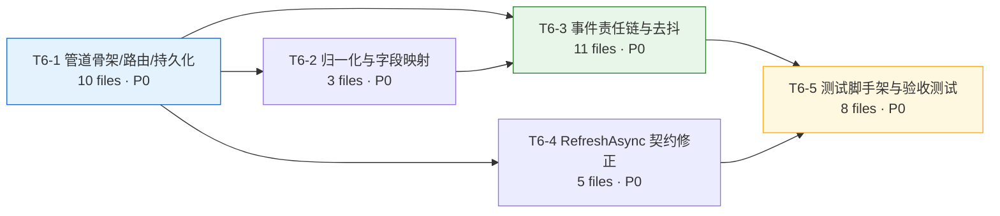

# T6 事件识别与处理管道 —— 增量架构设计与任务分解

| 项 | 值 |
|---|---|
| 任务 ID | **T6 事件识别与处理管道** |
| 所属阶段 | Phase 2 — 能力模型与事件管道 |
| 优先级 | **P0** |
| 依赖 | **T2**（报文结构修正，已落地）、**T5**（设备能力档案 + 品类判定 + 探测链路 + `AnShengUplinkHub`，已落地） |
| 权威规格 | `ansheng-open-redesign.md` §1765-1786（T6）、§331-372（D4）、§2135-2139（A.3 白名单）；`t5-profile-system-design.md` §1266-1290（§4.3 RefreshAsync 契约）、§605-614（偏差登记） |
| 配套图 | `t6-event-pipeline-class.mermaid`、`t6-event-pipeline-sequence.mermaid` |
| 架构师 | 高见远 |
| 版本 | v1.0 |

> **文档定位**：本文是 T6 的**唯一实现依据**。工程师按第 5 章任务列表逐项落地，任何与本文冲突的既有代码行为，以本文的"决策记录"（第 8 章）为准。
> **不做什么**：本文不写代码。所有代码片段仅为契约示意（signature / 伪代码），实现细节由工程师决定。

---

## 1. 实现方案与技术选型

### 1.1 需求本质

T6 要解决的是一个**分类 + 分发 + 双出口落库**问题，难点不在算法，而在**与既有系统的接缝**：

| # | 难点 | 本质 |
|:--:|---|---|
| N1 | **三分支判定语义纠缠** | `Event` / `Response` / `AutoReport` 三者的判据互相牵制：method 白名单要优先于 frameId（`delayEvent` 带 frameId 仍是事件），而"在途 frameId"这张表却是 **T7** 的交付物 —— T6 无法等 T7。 |
| N2 | **`close`（遗嘱）根本不走既有数据通路** | Adapter 的 `HandleWillMessage` 会**早退**，`close` 永远不触发 `DataReceived`。若管道只挂在 `ProtocolConfigService.OnProtocolAdapterDataReceived` 上，`close` 事件与 30s 去抖（验收 #5）**物理上不可能实现**。 |
| N3 | **既有数据桥必须 100% 保留** | D4 §370 明确"**并存而非替换**"。AutoReport 分支不能被管道劫持，否则 P2 数据桥、DeviceSensor 更新、DataRule 触发链全部回归风险。 |
| N4 | **`simCheck` 的白名单冲突** | A.3 白名单（7 个）含 `simCheck`，但 `AnShengCommandCatalog.EventMethodSet` 只有 6 个（不含 `simCheck`），且 `simCheck` 被注册为**可下发命令 Spec**（`IsEvent=false`），现有 `AnShengProtocolConformanceTests` 还断言了"`simCheck` 不是事件"。 |
| N5 | **多租户全局过滤器在后台线程失效** | `AppDbContext.ConfigureGlobalQueryFilters` 依赖 `ITenantContextAccessor.Current`。管道跑在 MQTT 接收线程 / `Task.Run`，**没有 HTTP 上下文** ⇒ `Current` 为 `null` ⇒ 过滤器**不生效**（查询看到全租户数据）。这既是便利（能按 IMEI 全局查设备）也是陷阱（写入时必须自己填对 `AppCode`）。 |
| N6 | **归一化字段与落库列的错配** | 验收 #6 要求 `DeviceDataRecord` 出现 `slot1_voltage` / `slot1_power` / `temperature`，但当前 `NormalizeDevStatus` 产出的是 `total_power` / `em_data`（数组），`SensorFieldMappings` 也没有 `slot{n}_*` 与 `signal`。 |

### 1.2 总体方案

**采用 D4 Option B：Parser 分类 → `AnShengMessageRouter` 三分支 → `IAnShengEventHandler` 责任链 → 双出口（事件溯源表 + DataRule 规则引擎）。**

在此基础上做**两处架构补强**（详见决策 B-1、决策 1）：

```
                       ┌──────────────────────────────────────────────┐
   MQTT Payload        │  AnShengMqttProtocolAdapter                  │
        │              │   Parse → LearnDeviceKind                     │
        └─────────────▶│   ★ AnShengUplinkHub.Publish（Will 判定之前） │
                       │   if (close) → HandleWillMessage → return     │
                       │   else → NormalizeForSensorData → DataReceived│
                       └───────┬───────────────────────┬──────────────┘
                               │                       │
        ┌──────────────────────▼──────────┐   ┌────────▼───────────────────────┐
        │ 【新增旁路】静态总线订阅          │   │ 【既有通路 100% 保留】          │
        │ AnShengUplinkPipeline (Singleton)│   │ ProtocolConfigService           │
        │   → 补 DeviceId/AppCode/Profile  │   │   .OnProtocolAdapterDataReceived│
        │   → AnShengMessageRouter.Route   │   │   → IDataCollectionService      │
        │       ├ Event    → Dispatcher    │   │   → DeviceDataRecord            │
        │       ├ Response → PendingStore  │   │   → DeviceSensor / DataRule     │
        │       └ AutoReport → 只刷 Profile │   └─────────────────────────────────┘
        └──────────────────────────────────┘
```

**核心取舍**：管道的**入口是 `AnShengUplinkHub.Uplink` 静态总线，不是 `ProtocolConfigService`**。

理由（对应 N2 / N3）：
1. `AnShengUplinkHub.Publish` 位于 Adapter 的 **Will 判定之前**，是**唯一 100% 覆盖全部上行报文（含 `close`）** 的挂载点；
2. T5 的 `AnShengProbeService` 已经用同样的方式订阅（构造时挂 `Uplink`），T6 只是**追加一个订阅者**，符合 `t5-profile-system-design.md` §1283"T6 追加事件管道订阅"的预期；
3. `Publish` 内部对每个订阅者做 `try/catch` 隔离，新增订阅者**不会**污染探测链路；
4. 既有 `DataReceived → ProtocolConfigService → IDataCollectionService` 通路**一行不动**，AutoReport 分支天然 100% 复用（满足决策 B）。

> ⚠️ 这不是对"决策 B"的违背，而是对它的**落地细化**：决策 B 要求"AutoReport 走既有通路"，本方案让 AutoReport 分支在管道内**什么都不做**（只刷 Profile），落库完全交给既有通路 —— 比"把既有通路改造成调用 Router"更彻底地满足了"并存而非替换"。见 **决策 B-1**。

### 1.3 技术栈

| 层 | 选型 | 说明 |
|---|---|---|
| 运行时 | **.NET 8** | 沿用，无变更 |
| ORM | **EF Core 8 (Pomelo MySQL)** | 沿用；新表走 Code First Migration |
| 数据库 | **MySQL 5.7.26** | ⚠️ 兼容红线见 §7.1 |
| 并发原语 | `ConcurrentDictionary` + `CancellationTokenSource` + `Task.Delay` | 在途表与离线去抖均为进程内单例，**不引入 Redis / Hangfire / Quartz** |
| 配置 | `IOptions<AnShengEventOptions>` | 沿用 `Configuration/AnShengProbeOptions.cs` 的既有范式，节点 `AnSheng:Event` |
| 测试 | xUnit + `WebApplicationFactory` + Respawn | 复用 T5 测试脚手架（`IntegrationTestBase` / `RecordingAnShengAdapter` / `StaticStateResetter`） |

**架构模式**：责任链（Chain of Responsibility，按 `Method` 索引 O(1) 分发，非线性遍历）+ 策略（`AnShengEventOutcome` 由 Handler 决定双出口行为）+ 管道过滤器（Pipeline）。

### 1.4 新增第三方包

**无新增。** 全部能力由既有依赖（`Microsoft.Extensions.*`、`Pomelo.EntityFrameworkCore.MySql`、`System.Text.Json`）覆盖。

---

## 2. 文件清单

### 2.1 规格标称（12 🆕 + 3 ✏️）

| # | 文件 | 类型 | 说明 |
|:--:|---|:--:|---|
| 1 | `Infrastructure/Protocol/AnSheng/AnShengMessageRouter.cs` | 🆕 | 三分支判定 + 分发 |
| 2 | `Infrastructure/Protocol/AnSheng/AnShengDataNormalizer.cs` | 🆕 | 报文 → 扁平数据点字典 |
| 3 | `Services/AnShengEventDispatcher.cs` | 🆕 | 按 `Method` 索引分发到 Handler |
| 4 | `Services/Interfaces/IAnShengEventHandler.cs` | 🆕 | 责任链接口 + `AnShengEventOutcome` |
| 5 | `Services/AnShengEventHandlers/ConnectedEventHandler.cs` | 🆕 | 上线 + 撤销待离线 |
| 6 | `Services/AnShengEventHandlers/CloseEventHandler.cs` | 🆕 | 遗嘱 + 30s 去抖 |
| 7 | `Services/AnShengEventHandlers/KeyEventHandler.cs` | 🆕 | 按键事件 |
| 8 | `Services/AnShengEventHandlers/DelayEventHandler.cs` | 🆕 | 延时到期 |
| 9 | `Services/AnShengEventHandlers/TimeEventHandler.cs` | 🆕 | 定时到期 |
| 10 | `Services/AnShengEventHandlers/Recv485EventHandler.cs` | 🆕 | 485 透传上行 |
| 11 | `Services/AnShengEventHandlers/SimCheckEventHandler.cs` | 🆕 | SIM 异常 |
| 12 | `Models/AnShengDeviceEvent.cs` | 🆕 | 事件溯源实体 + `AnShengEventKind` / `AnShengEventSeverity` 枚举（沿用 `AnShengDeviceProfile.cs` 把枚举与实体同文件的既有约定） |
| A | `Services/ProtocolConfigService.cs` | ✏️ | 事件旁路接入点（本方案下改动极小，见 §2.3） |
| B | `Services/DataCollectionService.cs` | ✏️ | `SensorFieldMappings` 补 `slot{n}_*` / `temperature` / `signal` |
| C | `Data/AppDbContext.cs` + Migration | ✏️ | `DbSet<AnShengDeviceEvent>` + 表配置 + 迁移 |

### 2.2 决策衍生新增（7 🆕）

| # | 文件 | 类型 | 来源决策 | 说明 |
|:--:|---|:--:|:--:|---|
| 13 | `Infrastructure/Protocol/AnSheng/AnShengUplinkPipeline.cs` | 🆕 | **B-1** | Singleton；订阅 `AnShengUplinkHub.Uplink`；开 Scope、补 `DeviceId`/`AppCode`/`Profile`、调 Router；提供 `DrainAsync` 供集成测试等待异步完成 |
| 14 | `Infrastructure/Protocol/AnSheng/AnShengUplinkContext.cs` | 🆕 | **B-1** | `AnShengUplinkContext` / `AnShengRouteResult` / `AnShengRouteKind`（三个小类型同文件） |
| 15 | `Services/Interfaces/IAnShengPendingCommandStore.cs` | 🆕 | **决策 1** | **T6 建 / T7 增强**，见 §8.3 |
| 16 | `Services/AnShengPendingCommandStore.cs` | 🆕 | **决策 1** | **T6 建 / T7 增强**；进程内 `ConcurrentDictionary`，key = `{imei}:{frameId}` |
| 17 | `Services/AnShengOfflineDebouncer.cs` | 🆕 | **决策 3** | Singleton；`close` 起 30s 定时器，`connected` 撤销 |
| 18 | `Services/AnShengEventHandlers/AnShengEventHandlerBase.cs` | 🆕 | — | 抽象基类，收敛"双出口"公共逻辑（写事件表 + 投递 DataRule），7 个 Handler 只写各自的 `OnHandleAsync` |
| 19 | `Configuration/AnShengEventOptions.cs` | 🆕 | **决策 2/3** | 节点 `AnSheng:Event`，沿用 `AnShengProbeOptions` 范式 |

### 2.3 决策衍生修改（8 ✏️，含 2 个文档/测试）

| # | 文件 | 类型 | 来源 | 改什么 |
|:--:|---|:--:|:--:|---|
| D | `Services/AnShengDeviceProfileService.cs` | ✏️ | **决策 A** | `RefreshAsync` **删除 `GetOrCreateAsync` 调用**，改为纯查询；档案不存在返回 `null` |
| E | `Services/Interfaces/IAnShengDeviceProfileService.cs` | ✏️ | **决策 A** | 签名改 `Task<AnShengDeviceProfile?> RefreshAsync(...)` |
| F | `Services/AnShengDiscoveryService.cs` | ✏️ | **决策 3** | **摘除 `AnShengMqttProtocolAdapter.DeviceWill` 的直连订阅**（`OnAdapterDeviceWill`），改由 `CloseEventHandler` → `AnShengOfflineDebouncer` 驱动 |
| G | `Infrastructure/Protocol/AnSheng/AnShengMessageParser.cs` | ✏️ | **N6** | `NormalizeForSensorData` 内部委托 `AnShengDataNormalizer`，产出 `slot{n}_*` / `signal` / `temperature`；`GetCategory` 保持不变 |
| H | `Program.cs` | ✏️ | — | DI 注册（见 §7.3）；`AnShengUplinkPipeline` 必须 **`AddSingleton` 且在启动时被解析一次**（否则构造函数里的订阅不会发生） |
| I | `appsettings.json` / `appsettings.Testing.json` | ✏️ | **决策 2/3** | 新增 `AnSheng:Event` 节点 |
| J | `.workbuddy/design/t5-profile-system-design.md` §605-614 | ✏️ | **决策 A** | 偏差条目标注"**已在 T6 解决**"，并回填 T6 的处理方式 |
| K | `tests/.../StaticStateResetter.cs`、`RecordingAnShengAdapter.cs`、`AnShengProtocolConformanceTests.cs` | ✏️ | — | 见 §9.2 |

### 2.4 文件数小结

```
🆕 新增 = 12（规格）+ 7（决策衍生）= 19
✏️ 修改 =  3（规格）+ 8（决策衍生，含 1 文档 + 3 测试基建）= 11
新增测试文件 = 4（见 §9.3）
────────────────────────────────────────────
合计触达 34 个文件（规格标称 12 🆕，偏差 +7 🆕 / +8 ✏️，原因逐条见第 8 章）
```

> **对"规格 12 文件"超出的解释**：超出的 7 个新文件中，2 个（`IAnShengPendingCommandStore` / `AnShengPendingCommandStore`）是**从 T7 前移**（T7 文件数相应 -2），2 个（`AnShengUplinkPipeline` / `AnShengUplinkContext`）是 N2 物理约束导致的必要拆分，3 个（`AnShengOfflineDebouncer` / `AnShengEventHandlerBase` / `AnShengEventOptions`）是可测性与去重收益明确的小文件。**没有一个是可选的锦上添花**。

---

## 3. 数据结构与接口

> 完整类图见 **`t6-event-pipeline-class.mermaid`**。本节只做关键契约说明与落库定义。

### 3.1 `AnShengDeviceEvent`（事件溯源表）—— 决策 3

```csharp
public class AnShengDeviceEvent : IHasAppCode
{
    public long     Id                 { get; set; }
    public string   AppCode            { get; set; } = string.Empty; // 多租户；后台线程必须显式赋值
    public string   Imei               { get; set; } = string.Empty; // varchar(32)，设备唯一标识
    public long?    DeviceId           { get; set; }                 // 未认领设备为 null（不阻塞事件记录）
    public string   Method             { get; set; } = string.Empty; // varchar(32)，原始 method，保真
    public AnShengEventKind     Kind     { get; set; }               // int 落库
    public AnShengEventSeverity Severity { get; set; }               // int 落库
    public int?     SlotNum            { get; set; }                 // 位路号；无位路概念的事件为 null
    public string?  FrameId            { get; set; }                 // varchar(64)，delayEvent/recv485 可能带
    public DateTime OccurredAt         { get; set; }                 // ★ 事件发生时刻（业务时间轴，见下）
    public DateTime? DeviceTimestampUtc{ get; set; }                 // 设备原始 timestamp 转 UTC，可为 null
    public DateTime ReceivedAt         { get; set; }                 // 平台收到时刻
    public string?  PayloadJson        { get; set; }                 // longtext，归一化后的数据点快照
    public string?  RawJson            { get; set; }                 // longtext，原始报文，取证用
    public bool     DispatchedToRules  { get; set; }                 // 出口②是否成功投递 DataRule
    public string?  DispatchError      { get; set; }                 // varchar(512)，投递失败原因（截断）
    public DateTime CreatedAt          { get; set; }
}

public enum AnShengEventKind     { Unknown=0, Connected=1, Close=2, Key=3, Delay=4, Time=5, Recv485=6, SimCheck=7 }
public enum AnShengEventSeverity { Info=0, Warning=1, Critical=2 }
```

**`OccurredAt` 取值规则（验收 #4 的"`OccurredAt` 正确"判据）**：

```
OccurredAt = DeviceTimestampUtc ?? ReceivedAt
条件：DeviceTimestampUtc 非 null 且落在 [ReceivedAt - 24h, ReceivedAt + 5min] 区间内
否则：回退 ReceivedAt，并在 PayloadJson 里打 "ts_fallback": true
```

理由：安圣设备时钟漂移是已知现象（T2 已引入 `AnShengTimestampConverter`）。事件时间轴若被脏时间戳污染，运维时间线与 DataRule 的时间窗告警都会失真。**宁可回退到平台时间，也不写入不可信的业务时间**。

**索引（MySQL 5.7 兼容）**：

| 索引 | 列 | 用途 |
|---|---|---|
| `IX_AnShengDeviceEvents_Imei_OccurredAt` | `(Imei, OccurredAt DESC)` | 设备事件时间线（主查询场景） |
| `IX_AnShengDeviceEvents_DeviceId_OccurredAt` | `(DeviceId, OccurredAt DESC)` | 按平台设备查 |
| `IX_AnShengDeviceEvents_AppCode_Kind_OccurredAt` | `(AppCode, Kind, OccurredAt DESC)` | 租户维度按类型统计 |

> ⚠️ 不建分区表（MySQL 5.7 分区 + 外键限制多，且当前无外键需求也无分区运维预案）。保留期用 `AnShengEventOptions.RetentionDays`（默认 90）声明，**清理作业本身不在 T6 范围**，登记为待办 W3。

### 3.2 路由契约

```csharp
public enum AnShengRouteKind { Event, Response, AutoReport, Ignored }

public sealed record AnShengUplinkContext(
    string Imei, AnShengMessage Message, string RawPayload, DateTime ReceivedAt)
{
    public long?  DeviceId { get; init; }              // 未认领为 null
    public string AppCode  { get; init; } = "";        // 由 Pipeline 从 Device / DiscoveredAnShengDevice 解析
    public AnShengDeviceProfile? Profile { get; init; }// 可为 null（决策 A：不建档）
}

public sealed record AnShengRouteResult(
    AnShengRouteKind Kind, string Imei, string Method, string? FrameId, string Reason);
```

**`Classify` 判定顺序（唯一权威，实现必须逐级短路）**：

```
1. method ∈ AnShengCommandCatalog.EventMethods（硬白名单 6 个：
      connected / keyEvent / delayEvent / timeEvent / recv485 / close）
   ⇒ Event                             【frameId 一律忽略 —— 解决 delayEvent 带 frameId 仍为事件】

2. method ∈ AnShengMessageRouter.SoftEventMethods（软白名单 1 个：simCheck）
   ⇒ if (FrameId 非空 && PendingStore.IsInFlight(imei, frameId)) → Response   【用户主动查 SIM 的应答】
     else                                                        → Event      【设备主动上报 SIM 异常】

3. FrameId 非空 && PendingStore.IsInFlight(imei, frameId)  ⇒ Response
4. 其余（含 FrameId 为空、或 FrameId 不在途）             ⇒ AutoReport
5. Method 为空 / 解析失败                                  ⇒ Ignored（只记 Warn 日志，不抛）
```

`SoftEventMethods` 的设计动机见 **决策 4（simCheck 冲突）**。

### 3.3 责任链契约

```csharp
public interface IAnShengEventHandler
{
    string Method { get; }                                        // 用于 Dispatcher 建 O(1) 索引
    Task<AnShengEventOutcome> HandleAsync(AnShengUplinkContext ctx, CancellationToken ct);
}

public sealed record AnShengEventOutcome
{
    public bool PersistEvent     { get; init; } = true;   // 出口① 写 AnShengDeviceEvent
    public bool DispatchToRules  { get; init; } = true;   // 出口② 投递 IDataCollectionService
    public AnShengEventSeverity Severity { get; init; } = AnShengEventSeverity.Info;
    public int? SlotNum          { get; init; }
    public IDictionary<string, object?>? DataPoints { get; init; } // 归一化数据点，null 则由基类调 Normalizer
    public string? Note          { get; init; }
}
```

`AnShengEventHandlerBase.HandleAsync` 的模板方法流程（**所有 Handler 共享，保证双出口一致**）：

```
1. outcome = await OnHandleAsync(ctx)           // 子类各自的业务动作
2. dataPoints = outcome.DataPoints ?? Normalizer.NormalizeEvent(ctx.Message)
3. if (outcome.PersistEvent) → 组装 AnShengDeviceEvent → Db.Add → SaveChangesAsync
4. if (outcome.DispatchToRules && ctx.DeviceId is long id)
       → Collector.ProcessDeviceDataAsync(id, ctx.AppCode, json(dataPoints), OccurredAt)
       → 成功：DispatchedToRules = true；失败：捕获异常，写 DispatchError，★ 不回滚事件行
5. return outcome
```

> **步骤 4 的"不回滚"是刻意设计**：事件溯源的价值在于"发生过"这件事本身。规则引擎投递失败（规则配置错、下游超时）不应导致事件历史丢失。失败在 `DispatchError` 里留痕，可离线重放。

### 3.4 各 Handler 的 `Outcome` 默认值一览

| Handler | Method | Kind | Severity | PersistEvent | DispatchToRules | 附加动作 |
|---|---|:--:|:--:|:--:|:--:|---|
| `ConnectedEventHandler` | `connected` | Connected | Info | ✔ | ✔ | `Debouncer.Cancel(imei)`；`Discovery.OnDeviceOnlineAsync`；触发 Profile 刷新 |
| `CloseEventHandler` | `close` | Close | **Warning** | ✔ | ✔ | `Debouncer.Arm(imei, appCode)` 起 30s 窗口 |
| `KeyEventHandler` | `keyEvent` | Key | Info | ✔ | ✔ | 解析 `slotNum` / `slots` 快照 |
| `DelayEventHandler` | `delayEvent` | Delay | Info | ✔ | ✔ | 更新 slots 快照；延时任务镜像属 **T9**，此处只留 TODO 锚点 |
| `TimeEventHandler` | `timeEvent` | Time | Info | ✔ | ✔ | 定时任务镜像属 **T10**，此处只留 TODO 锚点 |
| `Recv485EventHandler` | `recv485` | Recv485 | Info | **`Options.PersistRecv485`（默认 false）** | ✔ | 见 **决策 2** |
| `SimCheckEventHandler` | `simCheck` | SimCheck | **Warning** | ✔ | ✔ | SIM 异常，交由 DataRule 配告警 |

### 3.5 在途命令表（决策 1，T6 最小版）

```csharp
public interface IAnShengPendingCommandStore
{
    bool TryRegister(string imei, string frameId, PendingCommand cmd);
    bool IsInFlight(string imei, string frameId);
    Task<PendingCommand?> CompleteAsync(string imei, string frameId, AnShengMessage response);
    Task<int> SweepExpiredAsync(CancellationToken ct = default); // T6 提供实现但不挂后台作业
    void ClearAll();                                             // 测试专用
    int Count { get; }
}

public sealed record PendingCommand(long CommandId, string Imei, string FrameId,
                                    string Method, DateTime SentAt, DateTime ExpiresAt)
{
    public bool IsExpired => DateTime.UtcNow > ExpiresAt;
}
```

**key = `$"{imei}:{frameId}"`**（直接满足 T7 验收 #4"两台设备用相同 frameId 互不串扰"）。
**T6 边界**：只做注册 / 查在途 / 摘除 / 惰性过期；**不**做后台清扫作业、**不**写 `AnShengCommandRecord`、**不**唤醒 `TaskCompletionSource`。这三项是 T7 增强点，T7 只需**改这两个文件**，不新建。

---

## 4. 程序调用流程

> 完整时序图见 **`t6-event-pipeline-sequence.mermaid`**（4 条链路：① keyEvent 事件双出口 ② getDevStatus 自动上报 ③ 带在途 frameId 的应答 ④ close 30s 去抖）。本节给出文字判据与关键节点。

### 4.1 链路① `keyEvent` —— 事件旁路（验收 #1 #4）

```
设备 → MQTT → Adapter.OnMessageReceivedAsync
  → Parser.Parse → AnShengMessage{Method:"keyEvent", FrameId:null}
  → LearnDeviceKind
  → ★ AnShengUplinkHub.Publish(imei,"keyEvent",msg,raw)
        └→ [新] AnShengUplinkPipeline.OnUplink
              · 同步回调跑在 MQTT 接收线程 ⇒ 立即 Task.Run 卸载，_inFlight++
              · CreateScope() → 查 Device(SerialNumber==imei) → DeviceId/AppCode
              · 查 AnShengDeviceProfile(imei) → 可为 null
              · Router.RouteAsync(ctx)
                  · Classify → 硬白名单命中 ⇒ Event
                  · Dispatcher.DispatchAsync → O(1) 索引命中 KeyEventHandler
                      · Normalizer.NormalizeEvent → {event:"keyEvent", event_key, slot_num, slot{n}_state}
                      · 出口① Db.Add(AnShengDeviceEvent{Kind:Key, OccurredAt, PayloadJson, RawJson})
                      · 出口② Collector.ProcessDeviceDataAsync(deviceId, appCode, payloadJson, OccurredAt)
                             → 命中 DataRule → 触发告警
                      · UPDATE DispatchedToRules = 1
              · _inFlight--
  → 非 Will ⇒ NormalizeForSensorData → DataReceived
        └→ [既有] ProtocolConfigService → IDataCollectionService → DeviceDataRecord（原始快照）
```

> **两条通路并存会不会写双份 `DeviceDataRecord`？** 会（一条是事件归一化点，一条是原始报文快照）。**T6 默认不抑制**（决策 B-2），并提供 `AnShengEventOptions.SuppressLegacyDataBridge`（默认 `false`）作为逃生开关。理由：D4 §370 定的是"并存而非替换"；在 T6 阶段动既有桥的落库行为，回归面远大于收益。

### 4.2 链路② `getDevStatus` 自动上报 —— AutoReport 100% 走既有通路（验收 #2 #6）

- Router 判定 `AutoReport` 后，**在管道内不落库、不投递**，只做一件事：`IAnShengDeviceProfileService.RefreshAsync(imei, appCode, snapshot)`。
- 落库完全由既有 `DataReceived → ProtocolConfigService → IDataCollectionService` 承担。
- **验收 #6 靠两处改动达成**：
  1. `AnShengMessageParser.NormalizeForSensorData` 内部委托 `AnShengDataNormalizer.Normalize`，把 `EMdata[]` 数组**展平**为 `slot1_voltage` / `slot1_current` / `slot1_power` / `slot1_energy` / `slot{n}_state`，并补 `signal`、`temperature`、`net_type`、`slot_count`；同时**保留**既有的 `total_power` / `total_energy` / `avg_voltage`（向后兼容，不破坏已有 DataRule）。
  2. `DataCollectionService` 新增 `TryResolveSensorField`：先查 `SensorFieldMappings` 精确表（补 `signal`），再走 `SlotFieldRegex = ^slot(\d+)_(state|voltage|current|power|energy)$` 兜底，命中则计入 `mappedFields` 并更新 `DeviceSensor.LastValue`。
- **决策 A 在此链路可见**：`RefreshAsync` 查不到档案时返回 `null`，**不建档**，未认领设备继续留在 `DiscoveredAnShengDevice` 池里等认领。

### 4.3 链路③ 带在途 `frameId` 的 `getDevStatus` —— Response（验收 #2）

```
Classify → 非硬白名单 → FrameId 非空 → PendingStore.IsInFlight("{imei}:{frameId}")
   true  ⇒ Response  → PendingStore.CompleteAsync(imei, frameId, msg)   【T6 到此为止：只摘条目】
                     → RefreshAsync（应答同样是有效状态快照，照刷档案）
   false ⇒ AutoReport                                                   【验收 #2 的"未知 frameId"分支】
```

生产环境的**写入方是 T7 的 `AnShengCommandService`**（下发时 `TryRegister`）。T6 阶段在途表恒为空 ⇒ 所有带 frameId 的非事件报文都判 `AutoReport`，**与当前线上行为完全一致，零回归**。T6 的单元/集成测试直接调 `TryRegister` 构造在途态来覆盖 Response 分支。

### 4.4 链路④ `close` → 30s 去抖 → `connected` 撤销（验收 #5）

| 步骤 | 动作 | 关键点 |
|:--:|---|---|
| 1 | Broker 投递遗嘱 `{"method":"close"}` | |
| 2 | Adapter `Publish` 到 UplinkHub | ★ **在 Will 早退之前**，所以 close 一定进管道 |
| 3 | Adapter `HandleWillMessage` → `DeviceWill` 静态事件 | ⚠️ **T6 必须摘除 `AnShengDiscoveryService.OnAdapterDeviceWill` 订阅**，否则它会立刻置离线，30s 去抖形同虚设 |
| 4 | Pipeline → Router（close ∈ 硬白名单）→ `CloseEventHandler` | 写 `AnShengDeviceEvent{Kind:Close, Severity:Warning}` |
| 5 | `Debouncer.Arm(imei, appCode)` | `ConcurrentDictionary<imei, CTS>`；`Task.Delay(30s, cts.Token)` |
| 6a | 30s 内收到 `connected` | `ConnectedEventHandler` → `Debouncer.Cancel(imei)` → 设备**不**离线 ✔ 验收 #5 |
| 6b | 窗口到期 | 开新 Scope → `IAnShengDiscoveryService.OnDeviceOfflineAsync(imei, appCode)` → `Device.Status="offline"` |

**去抖归属**：定时器由 **`AnShengOfflineDebouncer`（Singleton）** 持有，`CloseEventHandler` 只负责 `Arm`、`ConnectedEventHandler` 只负责 `Cancel`。见 **决策 3**。

---

## 5. 任务分解

> **5 个任务，按依赖排序。** 每个任务给出源文件、依赖、优先级、完成判据。工程师应按 T6-1 → T6-2/T6-4（可并行）→ T6-3 → T6-5 推进。

### T6-1 管道骨架、路由与持久化基础设施　`P0`

| 项 | 内容 |
|---|---|
| **依赖** | 无（T2/T5 已落地） |
| **源文件** | 🆕 `Infrastructure/Protocol/AnSheng/AnShengUplinkPipeline.cs`<br>🆕 `Infrastructure/Protocol/AnSheng/AnShengUplinkContext.cs`<br>🆕 `Infrastructure/Protocol/AnSheng/AnShengMessageRouter.cs`<br>🆕 `Services/Interfaces/IAnShengPendingCommandStore.cs`<br>🆕 `Services/AnShengPendingCommandStore.cs`<br>🆕 `Models/AnShengDeviceEvent.cs`（含 2 个枚举）<br>🆕 `Configuration/AnShengEventOptions.cs`<br>✏️ `Data/AppDbContext.cs` + **EF Migration**<br>✏️ `Program.cs`、`appsettings.json` |
| **做什么** | ① Pipeline 订阅 `AnShengUplinkHub.Uplink`，`Task.Run` 卸载 + `_inFlight` 计数 + `DrainAsync`；② Router 实现 §3.2 五级判定（含 `SoftEventMethods`）；③ 在途表最小实现（key `{imei}:{frameId}`、TTL 惰性过期）；④ 事件表实体 + 表配置 + 3 个索引 + 迁移；⑤ DI 注册并**在启动时强制解析一次 Pipeline** |
| **完成判据** | 迁移正向/回滚可执行；Router 单测覆盖验收 **#1 #2 #3**；`Dispatcher` 尚未接入时 Event 分支只记日志不抛；启动后日志出现"AnShengUplinkPipeline 已订阅上行总线" |

### T6-2 归一化与传感器字段映射　`P0`

| 项 | 内容 |
|---|---|
| **依赖** | T6-1 |
| **源文件** | 🆕 `Infrastructure/Protocol/AnSheng/AnShengDataNormalizer.cs`<br>✏️ `Infrastructure/Protocol/AnSheng/AnShengMessageParser.cs`<br>✏️ `Services/DataCollectionService.cs` |
| **做什么** | ① `Normalize`（DevStatus 全量展平）、`NormalizeEvent`（事件专用）、`NormalizeToJson`；② `NormalizeForSensorData` 委托 Normalizer，**保留** `total_power`/`total_energy`/`avg_voltage` 旧键；③ `SensorFieldMappings` 补 `signal`，新增 `TryResolveSensorField` + `SlotFieldRegex` |
| **完成判据** | 验收 **#6**：`getDevStatus` 上报后 `DeviceDataRecord.SensorData` 含 `slot1_voltage`/`slot1_power`/`temperature`/`signal`，且 `Temperature`/`ElectricPower`/`ElectricKWh` 列非空；既有 DataRule 用 `total_power` 的配置**不失效** |

### T6-3 事件责任链与离线去抖　`P0`

| 项 | 内容 |
|---|---|
| **依赖** | T6-1、T6-2 |
| **源文件** | 🆕 `Services/Interfaces/IAnShengEventHandler.cs`<br>🆕 `Services/AnShengEventHandlers/AnShengEventHandlerBase.cs`<br>🆕 `Services/AnShengEventDispatcher.cs`<br>🆕 `Services/AnShengEventHandlers/{Connected,Close,Key,Delay,Time,Recv485,SimCheck}EventHandler.cs`（7 个）<br>🆕 `Services/AnShengOfflineDebouncer.cs`<br>✏️ `Services/AnShengDiscoveryService.cs`（摘除 `DeviceWill` 直连订阅） |
| **做什么** | ① Dispatcher 用 `Dictionary<string, IAnShengEventHandler>` 建 O(1) 索引，**启动时校验 7 个 Method 全覆盖，缺一即抛**；② 基类模板方法实现双出口（§3.3）；③ 7 个 Handler 按 §3.4 表实现；④ Debouncer `Arm`/`Cancel`/`IsArmed`/`ClearAll` |
| **完成判据** | 验收 **#4**（keyEvent 落 1 行事件 + `OccurredAt` 正确 + DataRule 可触发）、**#5**（close 后 30s 内 connected ⇒ 不离线）；`Recv485EventHandler` 默认不写事件表但仍投递 DataRule |

### T6-4 决策 A 落地：`RefreshAsync` 契约修正　`P0`

| 项 | 内容 |
|---|---|
| **依赖** | T6-1 |
| **源文件** | ✏️ `Services/Interfaces/IAnShengDeviceProfileService.cs`<br>✏️ `Services/AnShengDeviceProfileService.cs`<br>✏️ `Services/ProtocolConfigService.cs`<br>✏️ `tests/.../AnShengDeviceProfileServiceTests.cs`<br>✏️ `.workbuddy/design/t5-profile-system-design.md` §605-614 |
| **做什么** | ① `RefreshAsync` 返回类型改 `Task<AnShengDeviceProfile?>`，**删除 `GetOrCreateAsync` 调用**，改为 `FirstOrDefaultAsync`，查不到直接 `return null`（严格对齐 §4.3 §1266-1290）；② 修正因签名变化受影响的既有调用点与断言；③ `ProtocolConfigService` 加 `ShouldSkipLegacyBridge`（受 `SuppressLegacyDataBridge` 控制，**默认恒 false**，仅留钩子）；④ 把 t5 文档 §605-614 的偏差条目标注为"**已在 T6 解决**"并写明处理方式 |
| **完成判据** | 未认领 IMEI 上报 `getDevStatus` 后，`AnShengDeviceProfiles` 表**不新增行**，`DiscoveredAnShengDevices` 正常更新；`AnShengDeviceProfileServiceTests` 全绿；t5 设计文档已更新 |

### T6-5 测试脚手架扩展与验收测试　`P0`

| 项 | 内容 |
|---|---|
| **依赖** | T6-1、T6-2、T6-3、T6-4 |
| **源文件** | ✏️ `tests/.../Infrastructure/StaticStateResetter.cs`<br>✏️ `tests/.../Infrastructure/Mqtt/RecordingAnShengAdapter.cs`<br>✏️ `tests/.../appsettings.Testing.json`<br>✏️ `tests/.../AnShengProtocolConformanceTests.cs`<br>🆕 `tests/.../Unit/AnShengMessageRouterTests.cs`<br>🆕 `tests/.../Unit/AnShengDataNormalizerTests.cs`<br>🆕 `tests/.../Integration/AnShengEventPipelineTests.cs`<br>🆕 `tests/.../Integration/AnShengCloseDebounceTests.cs` |
| **做什么** | ① `StaticStateResetter` 增加清 `AnShengPendingCommandStore` / `AnShengOfflineDebouncer`（仍**严禁** `AnShengUplinkHub.Reset()`）；② `RecordingAnShengAdapter` 增加 `RaiseFullUplink`（一次调用同时打 UplinkHub 与 DataReceived，模拟真实 Adapter 行为）与 `RaiseWill`（只打 UplinkHub，模拟 close）；③ `appsettings.Testing.json` 加 `AnSheng:Event`（`CloseDebounceSeconds=2`、`PersistRecv485=true`）；④ Conformance 测试**新增** Router 白名单一致性断言（见 §9.2）；⑤ 6 条验收全覆盖 |
| **完成判据** | §9.3 映射表中 6 条验收标准全部有对应测试且全绿；集成测试通过 `Pipeline.DrainAsync(5s)` 消除异步竞态，**不使用 `Thread.Sleep` 轮询** |

### 5.1 任务依赖图



> T6-2 与 T6-4 在 T6-1 完成后**可并行**，两者文件无交集。

---

## 6. 依赖包

**T6 无新增第三方依赖包。**

| 能力 | 使用的既有依赖 |
|---|---|
| ORM / 迁移 | `Microsoft.EntityFrameworkCore` 8.x + `Pomelo.EntityFrameworkCore.MySql` |
| DI / 配置 / 日志 | `Microsoft.Extensions.DependencyInjection` / `.Options` / `.Logging` |
| JSON | `System.Text.Json` |
| 并发 | `System.Collections.Concurrent`（BCL） |
| 测试 | `xunit` / `Microsoft.AspNetCore.Mvc.Testing` / `Respawn` / `FluentAssertions`（测试工程已有） |

> 明确**不引入**：Redis（在途表/去抖跨进程共享暂无需求）、Hangfire/Quartz（30s 去抖用 `Task.Delay` 足够）、MediatR（责任链用 DI 集合注入即可，不值得引框架）。若未来平台走多实例部署，在途表与去抖器需要外置 —— 已登记为待办 **W1**。

---

## 7. 共享知识（工程师必读）

### 7.1 MySQL 5.7.26 兼容红线

| 规则 | 说明 |
|---|---|
| **枚举一律 `int` + `HasConversion<int>()`** | 沿用 `ConfigureAnShengDeviceProfiles` 的既有写法。**禁止** MySQL `ENUM` 类型 |
| **禁止 `CHECK` 约束** | 5.7 会静默忽略，5.7.26 上等于没写；校验放应用层 |
| **禁止函数索引 / 表达式索引** | 8.0 特性 |
| **索引列长** | 复合索引总长受 3072 字节限制（`utf8mb4` 下每字符 4 字节）。`Imei` 用 `varchar(32)`、`Method` `varchar(32)`、`FrameId` `varchar(64)` |
| **`longtext` 不进索引** | `PayloadJson` / `RawJson` 只存不查 |
| **不用 JSON 列类型** | 5.7 的 JSON 函数索引不可用，且既有 `SensorData` 就是 `longtext`，保持一致 |
| **时间列** | 统一 `datetime(6)` 存 **UTC**，禁 `timestamp`（2038 + 时区隐式转换） |

### 7.2 多租户 `AppCode` 陷阱（★ 最容易踩）

- `AnShengDeviceEvent` 实现 `IHasAppCode` ⇒ 会被 `ConfigureGlobalQueryFilters` 自动加 `WHERE AppCode = @current`。
- **但管道跑在后台线程，`ITenantContextAccessor.Current` 为 `null` ⇒ 过滤器不生效**（见 `AppDbContext.cs:170-173` 的 early-return）。
- 因此：
  1. **查**：Pipeline 按 IMEI 查 `Device` / `AnShengDeviceProfile` 时能看到全租户数据 —— 这是我们需要的（设备只认 IMEI）；但**必须以查出来的 `Device.AppCode` 为准**回填 `ctx.AppCode`，不得假设。
  2. **写**：`AnShengDeviceEvent.AppCode` **必须显式赋值**，EF 不会替你填。
  3. `AppCode` 解析优先级：`Device.AppCode` → `AnShengDeviceProfile.AppCode` → `DiscoveredAnShengDevice.AppCode` → `AnShengMqttProtocolOptions` 配置的默认租户 → `""`（并记 Warn）。
  4. HTTP 侧查询事件表时过滤器**会**生效，租户隔离由既有机制保证，无需额外代码。

### 7.3 DI 注册清单（`Program.cs`）

```csharp
builder.Services.Configure<AnShengEventOptions>(builder.Configuration.GetSection("AnSheng:Event"));

builder.Services.AddSingleton<IAnShengPendingCommandStore, AnShengPendingCommandStore>();
builder.Services.AddSingleton<AnShengOfflineDebouncer>();
builder.Services.AddSingleton<AnShengUplinkPipeline>();          // ★ 构造函数内订阅 UplinkHub

builder.Services.AddScoped<AnShengDataNormalizer>();
builder.Services.AddScoped<AnShengMessageRouter>();
builder.Services.AddScoped<AnShengEventDispatcher>();
builder.Services.AddScoped<IAnShengEventHandler, ConnectedEventHandler>();
// … 其余 6 个 Handler 同样 AddScoped 到 IAnShengEventHandler 集合

// ★ 关键：Singleton 是惰性构造的，必须在 app.Run() 之前强制解析一次，否则永远不会订阅
app.Services.GetRequiredService<AnShengUplinkPipeline>();
```

**生命周期约束**：
- `AnShengUplinkPipeline` / `AnShengPendingCommandStore` / `AnShengOfflineDebouncer` = **Singleton**（与 `AnShengProbeService` 一致）。
- Router / Dispatcher / Handler / Normalizer = **Scoped**（要用 `AppDbContext`）。
- **Singleton 绝不可直接注入 Scoped**：Pipeline 与 Debouncer 一律通过 `IServiceScopeFactory.CreateScope()` 取 Scoped 服务。

### 7.4 线程模型与异常边界

| 约束 | 说明 |
|---|---|
| `AnShengUplinkHub.Publish` 是**同步**的 | 回调直接跑在 MQTT 接收线程。Pipeline 的 `OnUplink` 必须**立即 `Task.Run` 卸载**，否则阻塞整个 MQTT 消费 |
| 每个订阅者异常已被 Hub 隔离 | 但 `Task.Run` 内的异常**不会**被 Hub 捕获 ⇒ Pipeline 内部必须自己 `try/catch` 到顶，任何异常只记 `LogError`，**绝不抛出**（否则 `TaskScheduler.UnobservedTaskException` 打崩进程） |
| `_inFlight` 计数 | `Interlocked.Increment/Decrement`；`DrainAsync(timeout)` 供集成测试等待，**生产代码不调用** |
| 单设备报文顺序 | Hub 不保证跨报文串行。`close` 与 `connected` 的竞态由 `AnShengOfflineDebouncer` 的 `ConcurrentDictionary` + CTS 原子替换兜底：`Cancel` 先 `TryRemove` 再 `Cancel` |

### 7.5 事件白名单（唯一事实来源）

```
硬白名单（AnShengCommandCatalog.EventMethods，6 个，本次不改）：
    connected, keyEvent, delayEvent, timeEvent, recv485, close
软白名单（AnShengMessageRouter.SoftEventMethods，1 个，T6 新增）：
    simCheck
```

**"7 种报文 Classify 均为 Event"（验收 #1）= 硬 6 + 软 1。** 详见决策 4。

### 7.6 命名与日志约定

- 日志 scope 统一带 `imei` / `method` / `frameId` 三个字段，便于按设备串链路。
- Router 每次判定输出一条 `LogDebug("[AnShengRouter] {Imei} {Method} => {Kind} ({Reason})")`；`Ignored` 用 `LogWarning`。
- 事件表写入成功输出 `LogInformation("[AnShengEvent] {Imei} {Method} eventId={Id}")`。

---

## 8. 决策记录

### 8.1 决策 A（主理人裁定，必须采纳）—— `RefreshAsync` 严格对齐 §4.3

| 项 | 内容 |
|---|---|
| **裁定** | `IAnShengDeviceProfileService.RefreshAsync` 在档案不存在时**返回 `null`，绝不建档** |
| **现状偏差** | 当前实现调用 `GetOrCreateAsync`，会隐式创建 Profile 行（`t5-profile-system-design.md` §605-614 已登记） |
| **T6 处理** | 签名改 `Task<AnShengDeviceProfile?>`；实现改为 `FirstOrDefaultAsync`，`null` 直接返回；**同步更新 t5 文档 §605-614 标注"已在 T6 解决"** |
| **影响** | 未认领设备上报时不再产生"孤儿档案"，认领流程（T5 强制 `getDevInfo`+`getDevStatus`）成为档案的**唯一**创建入口，`KindSource` 语义不被污染 |
| **落地** | 任务 **T6-4** |

### 8.2 决策 B（主理人裁定，必须采纳）—— AutoReport 100% 复用既有通路

| 项 | 内容 |
|---|---|
| **裁定** | AutoReport 分支必须 100% 复用 `ProtocolConfigService → IDataCollectionService`（D4 §370"并存而非替换"）；事件分支是新增旁路 |
| **B-1 落地细化（我的架构决定）** | 管道入口挂 **`AnShengUplinkHub.Uplink`**，不改 `ProtocolConfigService` 的调用链去反向调用 Router |
| **B-1 理由** | ① `close` 根本不触发 `DataReceived`（Adapter Will 早退），挂 `ProtocolConfigService` 则验收 #5 物理上无法实现；② `Publish` 在 Will 判定之前，是唯一 100% 覆盖点；③ T5 `AnShengProbeService` 已是同款订阅模式，t5 设计 §1283 也预期"T6 追加事件管道订阅"；④ 既有通路**一行不动**，比"改造既有通路调 Router"更彻底地满足"不替换" |
| **B-1 代价** | 引入 `AnShengUplinkPipeline` + `AnShengUplinkContext` 两个规格外文件；事件报文会同时经过两条通路 |
| **B-2 附带决定** | 事件报文在两条通路上会各写一条 `DeviceDataRecord`（事件归一化点 + 原始快照）。**T6 默认不抑制**，留 `AnShengEventOptions.SuppressLegacyDataBridge`（默认 `false`）+ `ProtocolConfigService.ShouldSkipLegacyBridge` 钩子备用 |
| **B-2 理由** | 在 T6 就改既有桥的落库行为，回归面（DeviceSensor、DataRule、历史曲线）远大于"少写一行记录"的收益。等 T6 稳定运行、事件表数据可信后再评估是否开启 |

### 8.3 决策 1（我的决策）—— 在途命令表的时序冲突

| 项 | 内容 |
|---|---|
| **冲突** | D4 的 Response 分支依赖"在途命令表"，但 `IAnShengPendingCommandStore` / `AnShengPendingCommandStore` 是 **T7** 的交付物；而 T6 不依赖 T7 |
| **候选方案** | ① T6 等 T7（打乱阶段顺序，P0 阻塞）；② T6 内联一个私有实现，T7 再抽接口（必然二次重构 + 文件冲突）；③ **T6 前移接口 + 最小实现，T7 增强** |
| **决策** | **采用 ③** |
| **T6 交付** | `IAnShengPendingCommandStore`（6 个成员，§3.5）+ `AnShengPendingCommandStore` 进程内实现：`ConcurrentDictionary`、key `{imei}:{frameId}`、TTL 惰性过期、`ClearAll` 测试钩子 |
| **T7 增强（同文件改，不新建）** | 后台清扫 `IHostedService`、写 `AnShengCommandRecord`、`TaskCompletionSource` 唤醒等待者、超时置 `Status=Timeout` |
| **文件归属标注** | 两个文件头部注释写明：`// 创建于 T6（最小实现），增强于 T7（TTL 清扫/命令记录/唤醒）`。**T7 文件数从 7 调整为 5 新建 + 2 修改**，需回写 `ansheng-open-redesign.md` T7 条目（登记为待办 **W2**） |
| **理由** | ① 接口本就属于"路由需要的能力契约"，由消费方（T6）定义比由实现方（T7）定义更符合依赖倒置；② T6 阶段在途表恒为空，Response 分支自然退化为 AutoReport，**与线上现状完全一致，零回归**；③ 避免同一文件被两个任务先后新建导致的合并冲突 |

### 8.4 决策 2（我的决策）—— `recv485` 的存储去向

| 项 | 内容 |
|---|---|
| **冲突** | D4 §372 明确"对 `recv485` 这类高频数据**不写事件表**，只写专用 485 数据表"；但 T6 规格 12 文件里**没有** 485 数据模型，且 `ansheng-open-redesign.md` 全文**未定义** 485 表结构、寄存器语义、解码方式 |
| **候选方案** | **(a)** T6 新建 `Models/AnShengRs485Data` + 表 + 迁移；**(b)** T6 不建表，`recv485` 经 Normalizer → `IDataCollectionService` → `DeviceDataRecord`，事件表写入由开关控制 |
| **决策** | **采用 (b)**，并把"485 专用表"登记为独立待办 **W4**（建议归入 Phase 3/4，与 `send485` 命令链路一起设计） |
| **具体行为** | `recv485` **仍然 Classify 为 Event**（满足验收 #1）→ `Recv485EventHandler`：<br>· `PersistEvent = Options.PersistRecv485`（**生产默认 `false`**，遵从 §372 的高频顾虑；测试环境置 `true` 以便断言）<br>· `DispatchToRules = true`，数据点为 `{ "rs485_port", "rs485_hex", "rs485_len", "rs485_frame_id" }`，落入 `DeviceDataRecord.SensorData`（`longtext`，无损）<br>· `PersistRecv485=true` 时事件表也留一份，用于现场排障 |
| **理由** | ① **不为未知需求建表**：485 是透传协议，上层寄存器语义完全取决于外接设备（电表/水表/温控器），此刻定表结构必然是废弃迁移；② `DeviceDataRecord.SensorData` 已是任意 JSON，能无损承载十六进制帧，Phase 2 的查询需求（"这台设备最近收到过什么 485 帧"）可满足；③ 迁移一旦上线就难回退，**推迟决策的成本远低于错误决策的成本**；④ 验收 #1 只考核 `Classify` 返回值，本方案完全满足 |
| **回退成本** | 未来建 485 专用表时，可从 `DeviceDataRecord.SensorData` 回灌历史数据（`rs485_hex` 原样保留），无数据丢失 |

### 8.5 决策 3（我的决策）—— `AnShengDeviceEvent` 字段集 与 30s 去抖归属

**3-1 字段集**：见 §3.1。设计要点：

| 决定 | 理由 |
|---|---|
| `DeviceId` **可空** | 未认领设备也要留事件痕迹（尤其 `connected`/`close`），不能因为没认领就丢事件 |
| 同时存 `OccurredAt` 与 `DeviceTimestampUtc` / `ReceivedAt` | 三个时间各有用途：业务时间轴 / 设备原始时钟（用于诊断漂移）/ 平台接收时刻（用于链路延迟分析）。`OccurredAt` 带**合理性校验回退**（§3.1），避免脏时钟污染时间线 |
| `PayloadJson` 与 `RawJson` 并存 | 前者供人看与规则引擎用，后者供取证与未来重放。`RawJson` 是 T2 已保真的原始报文 |
| `DispatchedToRules` + `DispatchError` | 双出口必须**可观测**。出口②失败不回滚出口①（§3.3），失败原因必须落库否则无法追查 |
| `Severity` 独立于 `Kind` | 同一 `Kind` 未来可能按内容分级（如 `simCheck` 的不同错误码），提前留位比后加迁移便宜 |
| **不加** `IsHandled` / `HandledBy` 等工单字段 | T6 是事件溯源，不是工单系统。避免过度设计 |

**3-2 去抖归属**：**定时器由 `AnShengOfflineDebouncer`（Singleton）持有，`CloseEventHandler` 只 `Arm`，`ConnectedEventHandler` 只 `Cancel`。**

| 候选 | 评价 |
|---|---|
| 放 `CloseEventHandler` 内部 | ❌ Handler 是 **Scoped**，Scope 随管道处理结束即销毁，`Task.Delay(30s)` 会跨越 Scope 生命周期，`AppDbContext` 已释放 |
| 放 `AnShengEventDispatcher` | ❌ 同样 Scoped；且分发器不该持有业务状态 |
| 放 `AnShengDiscoveryService`（Singleton，现成） | ⚠️ 可行但耦合：它是"发现/认领"职责，塞进"离线去抖"会让职责继续膨胀，且它当前的 `DeviceWill` 直连订阅正是要摘掉的东西 |
| **独立 `AnShengOfflineDebouncer`（Singleton）** | ✔ **采用**。单一职责、可单测（可注入时钟窗口）、可被 `StaticStateResetter` 清理、`CloseDebounceSeconds` 可配（测试环境设 2s 让集成测试跑得快） |

**连带强制项**：必须摘除 `AnShengDiscoveryService.OnAdapterDeviceWill` 对 `AnShengMqttProtocolAdapter.DeviceWill` 的直连订阅 —— 否则设备会在 `close` 瞬间被置离线，30s 去抖形同虚设，验收 #5 必挂。

### 8.6 决策 4（我的决策）—— `simCheck` 白名单冲突

| 项 | 内容 |
|---|---|
| **冲突** | A.3 白名单（§2135-2139）与 T6 验收 #1 都要求 `simCheck` 判为 Event；但 `AnShengCommandCatalog.EventMethodSet` 只有 6 个（不含 `simCheck`），`simCheck` 被注册为**可下发命令 Spec**（`IsEvent=false`），且 `AnShengProtocolConformanceTests.cs:163-167` **已断言 `simCheck` 不是事件** |
| **候选方案** | **(a)** 把 `simCheck` 加进 `EventMethods` + 改一致性测试；**(b)** 保持 Catalog 不变，Router 引入"软白名单" |
| **决策** | **采用 (b)** |
| **关键理由** | `AnShengCommandCatalog.IsEvent` **不只被 Router 用**：`AnShengMqttProtocolAdapter` 用 `frameId 非空 && !IsEvent` 来决定是否抛 `CommandResponse` 事件。若把 `simCheck` 加进 `EventMethods`，则**用户主动下发 `simCheck` 查询 SIM 状态时，设备应答将不再触发 `CommandResponse`**，T7 的命令应答关联直接断掉。这是一个隐蔽但致命的副作用 |
| **实现** | `AnShengMessageRouter.SoftEventMethods = { "simCheck" }`；判定：带在途 frameId ⇒ Response（用户查询的应答），否则 ⇒ Event（设备主动报 SIM 异常）。见 §3.2 第 2 级 |
| **对验收 #1 的满足** | 单测构造的 `simCheck` 报文**无在途 frameId** ⇒ 走 Event 分支 ✔ |
| **对既有测试的影响** | `AnShengProtocolConformanceTests.cs:163-167` 的断言**保持不变、继续为真**（Catalog 层面 `simCheck` 确实不是事件）。同时**新增**一条断言：`AnShengMessageRouter` 的"硬 ∪ 软"集合必须等于 A.3 的 7 个方法，防止两处白名单漂移 |
| **需回写规格** | `ansheng-open-redesign.md` A.3 建议补注："`simCheck` 为双向方法 —— 下行为查询命令，上行无在途 frameId 时按事件处理"（待办 **W5**） |

### 8.7 待明确事项（Anything UNCLEAR）

| ID | 事项 | 现阶段假设 | 建议归属 |
|:--:|---|---|---|
| **W1** | 平台若走**多实例部署**，进程内的在途表与去抖器会失效（A 实例发命令、B 实例收应答；A 实例 Arm、B 实例收 connected） | T6 假设**单实例**（与当前部署形态一致） | 部署形态确定后评估外置 Redis，Phase 4 |
| **W2** | T7 文件清单需从"7 新建"调整为"5 新建 + 2 修改" | 已在本文 §8.3 标注 | 回写 `ansheng-open-redesign.md` T7 条目 |
| **W3** | 事件表 90 天保留期的**清理作业**未实现 | T6 只声明 `RetentionDays` 配置项，不实现清理 | 独立小任务，Phase 3 |
| **W4** | **485 专用数据表**结构未定义（寄存器语义依赖外接设备） | T6 走 `DeviceDataRecord`（决策 2） | 与 `send485` 命令链路一起设计，Phase 3/4 |
| **W5** | A.3 白名单需补注 `simCheck` 的双向语义 | 已在本文 §8.6 说明 | 回写 `ansheng-open-redesign.md` A.3 |
| **W6** | `delayEvent` / `timeEvent` 的**任务镜像**更新（D4 管道图里提到） | T6 只写事件表 + 投递规则引擎，镜像留 TODO 锚点 | **T9 / T10** |
| **W7** | 事件表的**查询 API**（设备事件时间线）未在 T6 范围 | T6 只写不读 | 建议并入 T7 的 `AnShengController` 扩展或独立小任务 |
| **W8** | `connected` 事件与 `AnShengDiscoveryService.OnDeviceOnlineAsync` 的幂等性 | 假设既有实现幂等（T5 已在用） | 落地时由工程师确认，若不幂等需加保护 |

---

## 9. 测试策略

### 9.1 分层原则

| 层 | 范围 | 判据 |
|---|---|---|
| **单元测试** | 纯判定与纯转换：`AnShengMessageRouter.Classify`、`AnShengDataNormalizer`、`AnShengPendingCommandStore`、`AnShengOfflineDebouncer`（注入短窗口） | 不碰数据库、不起 Host、毫秒级 |
| **集成测试**（`WebApplicationFactory`） | 跨越"报文注入 → 落库 → 可查询"的端到端行为：事件表写入、`DeviceDataRecord` 字段映射、去抖后的设备在线状态 | 复用 T5 脚手架，Respawn 清库 |

**归属规则**：凡是"要断言数据库里有什么"的，一律集成测试；凡是"给定输入判断输出"的，一律单元测试。**不写只为覆盖率的 mock 堆砌测试。**

### 9.2 T5 测试脚手架的复用与扩展

| 组件 | 复用/扩展 | 说明 |
|---|---|---|
| `IntegrationTestBase` | **直接复用** | Respawn → `StaticStateResetter.ResetAll` → `AdapterFactory.Reset` → Seed → Client 的初始化序列不变 |
| `StaticStateResetter` | **扩展** | 新增清理：`IAnShengPendingCommandStore.ClearAll()`、`AnShengOfflineDebouncer.ClearAll()`。⚠️ **依然严禁调用 `AnShengUplinkHub.Reset()`** —— 会摘掉 `AnShengProbeService` 与 `AnShengUplinkPipeline` 的订阅，导致后续用例全挂 |
| `RecordingAnShengAdapter` | **扩展** | 现有 `RaiseDataReceived` / `RaiseAnShengUplink` 是分开的，测试要写两行且容易漏。新增：<br>· `RaiseFullUplink(imei, json)` —— 一次同时打 `AnShengUplinkHub.Publish` + `DataReceived`（模拟非 Will 报文的真实 Adapter 行为）<br>· `RaiseWill(imei, json)` —— **只**打 `Publish`，不打 `DataReceived`（精确模拟 `close`） |
| `TestWebAppFactory.RemoveBackgroundServices` | **直接复用** | 注意**不要**把 `AnShengUplinkPipeline` 当作后台服务移除 —— 它是 Singleton 不是 `IHostedService`，但必须在工厂构建后被解析一次 |
| `appsettings.Testing.json` | **扩展** | 新增 `"AnSheng": { "Event": { "CloseDebounceSeconds": 2, "PersistRecv485": true, "PendingTtlSeconds": 5 } }`（保留既有 `Probe:TimeoutMs=200`） |
| `AnShengProtocolConformanceTests` | **扩展（不改既有断言）** | 新增：`Router_SoftAndHard_EventMethods_Should_Match_SpecWhitelist` —— 断言 `AnShengCommandCatalog.EventMethods ∪ AnShengMessageRouter.SoftEventMethods` 恰为 A.3 的 7 个方法，防白名单漂移 |

**异步竞态的处理**：管道是 `Task.Run` 异步的。集成测试**不得**用 `Thread.Sleep`/轮询，统一用：

```csharp
await Factory.Services.GetRequiredService<AnShengUplinkPipeline>()
             .DrainAsync(TimeSpan.FromSeconds(5));
```

`DrainAsync` 自旋等待 `_inFlight == 0`，超时返回 `false`（测试直接 `Assert.True` 失败并给出明确信息）。

### 9.3 验收标准 → 测试用例映射

| 验收 | 内容 | 层级 | 测试文件 / 用例 |
|:--:|---|:--:|---|
| **#1** | `connected`/`keyEvent`/`delayEvent`/`timeEvent`/`recv485`/`simCheck`/`close` 七种报文 `Classify` 均返回 `Event`，无一落默认分支 | 单元 | `AnShengMessageRouterTests.Classify_All_Seven_Whitelist_Methods_Should_Be_Event`（`[Theory]` 7 条 `InlineData`）<br>+ `Conformance: Router_SoftAndHard_EventMethods_Should_Match_SpecWhitelist` |
| **#2a** | 带**未知** frameId 的 `getDevStatus` → `AutoReport` | 单元 | `AnShengMessageRouterTests.GetDevStatus_With_Unknown_FrameId_Should_Be_AutoReport` |
| **#2b** | 带**在途** frameId 的 `getDevStatus` → `Response` | 单元 | `AnShengMessageRouterTests.GetDevStatus_With_InFlight_FrameId_Should_Be_Response`（先 `TryRegister` 再判定，并断言 `CompleteAsync` 后 `Count==0`） |
| **#2c** | 同 frameId 不同 IMEI 互不串扰（提前覆盖 T7 验收 #4） | 单元 | `AnShengPendingCommandStoreTests.Same_FrameId_Different_Imei_Should_Not_Collide` |
| **#3** | `delayEvent` 虽带 frameId，仍判 `Event` | 单元 | `AnShengMessageRouterTests.DelayEvent_With_FrameId_Should_Still_Be_Event`（**且断言 `PendingStore.IsInFlight` 未被调用** —— 硬白名单必须短路） |
| **#4** | 注入 `keyEvent` 后 `AnShengDeviceEvent` 新增 1 行且 `OccurredAt` 正确；`DataRule` 可配告警并被触发 | 集成 | `AnShengEventPipelineTests.KeyEvent_Should_Persist_Event_And_Trigger_DataRule`<br>· 断言事件行数 = 1、`Kind==Key`、`OccurredAt == 设备 timestamp 转 UTC`、`DispatchedToRules == true`<br>· 另一条 `KeyEvent_With_Skewed_Timestamp_Should_Fallback_To_ReceivedAt` 覆盖时间回退规则 |
| **#5** | `close` 后 30s 内收到 `connected` → 设备**不**被置离线 | 集成 | `AnShengCloseDebounceTests.Connected_Within_Window_Should_Cancel_Offline`（窗口配 2s）<br>+ `AnShengCloseDebounceTests.No_Connected_After_Window_Should_Mark_Offline`（等 2s+ 后断言 `Device.Status=="offline"`）<br>+ `Discovery_Should_Not_Subscribe_DeviceWill_Directly`（反射断言订阅已摘除，防回归） |
| **#6** | `getDevStatus` 自动上报后 `DeviceDataRecord` 出现 `slot1_voltage`/`slot1_power`/`temperature` 等映射字段 | 集成 | `AnShengEventPipelineTests.GetDevStatus_Should_Map_Slot_Fields_To_DeviceDataRecord`<br>· 断言 `SensorData` 含 `slot1_voltage`/`slot1_current`/`slot1_power`/`slot1_energy`/`slot1_state`/`signal`/`temperature`<br>· 断言 `Temperature`/`ElectricPower`/`ElectricKWh` 列已填<br>· **兼容断言**：`total_power`/`avg_voltage` 旧键仍在 |

### 9.4 补充回归测试（非验收项但必须有）

| 用例 | 目的 |
|---|---|
| `RefreshAsync_Should_Return_Null_When_Profile_Missing`（单元） | 决策 A —— 断言返回 `null` |
| `Unclaimed_Device_AutoReport_Should_Not_Create_Profile`（集成） | 决策 A —— 断言 `AnShengDeviceProfiles` 行数不变，`DiscoveredAnShengDevices` 正常更新 |
| `Event_Should_Fill_AppCode_From_Device`（集成） | §7.2 —— 断言后台线程写入的 `AppCode` 正确，HTTP 查询能被租户过滤器命中 |
| `Recv485_Should_Not_Persist_Event_When_Option_Disabled`（集成） | 决策 2 —— `PersistRecv485=false` 时事件表无行，但 `DeviceDataRecord` 有 `rs485_hex` |
| `Dispatcher_Should_Cover_All_Seven_Methods`（单元） | 启动期自检 —— 缺任一 Handler 立即抛，不让缺口漏到运行时 |
| `Pipeline_Handler_Exception_Should_Not_Break_Probe`（集成） | §7.4 —— 故意让一个 Handler 抛异常，断言 `AnShengProbeService` 仍正常收到上行 |
| `SimCheck_With_InFlight_FrameId_Should_Be_Response`（单元） | 决策 4 —— 软白名单的另一半语义 |

---

## 10. 落地检查清单（工程师自检）

- [ ] 迁移可 `Update-Database` 正向执行，也可 `Update-Database <上一个迁移>` 回滚
- [ ] 枚举列在 MySQL 中是 `int`，不是 `enum`/`varchar`
- [ ] `AnShengDeviceEvent.AppCode` 在后台线程写入路径上**非空**
- [ ] `Program.cs` 中 `app.Services.GetRequiredService<AnShengUplinkPipeline>()` 已调用（否则订阅不生效，所有事件用例静默失败）
- [ ] `AnShengDiscoveryService` 对 `DeviceWill` 的直连订阅**已摘除**
- [ ] `RefreshAsync` 中**已无** `GetOrCreateAsync` 调用
- [ ] `NormalizeForSensorData` 的旧输出键（`total_power`/`total_energy`/`avg_voltage`/`em_data`）**仍然存在**
- [ ] Pipeline 的 `Task.Run` 内部 `try/catch` 到顶，无未捕获异常路径
- [ ] `StaticStateResetter` 中**没有** `AnShengUplinkHub.Reset()`
- [ ] `t5-profile-system-design.md` §605-614 已标注"已在 T6 解决"
- [ ] `IAnShengPendingCommandStore` / `AnShengPendingCommandStore` 文件头已标注"T6 建 / T7 增强"
- [ ] 6 条验收标准对应的测试全部存在且全绿

---

## 附录 A：`AnShengEventOptions` 配置样例

```jsonc
// appsettings.json
"AnSheng": {
  "Probe": { "TimeoutMs": 5000, "EnabledOnClaim": true },
  "Event": {
    "CloseDebounceSeconds": 30,      // 决策 3：遗嘱去抖窗口
    "PersistRecv485": false,         // 决策 2：recv485 默认不写事件表（D4 §372）
    "SuppressLegacyDataBridge": false,// 决策 B-2：默认不抑制既有数据桥
    "RetentionDays": 90,             // 声明保留期，清理作业见待办 W3
    "PendingTtlSeconds": 30          // 决策 1：在途条目 TTL
  }
}
```

```jsonc
// appsettings.Testing.json
"AnSheng": {
  "Probe": { "TimeoutMs": 200 },
  "Event": { "CloseDebounceSeconds": 2, "PersistRecv485": true, "PendingTtlSeconds": 5 }
}
```

## 附录 B：归一化字段字典（`AnShengDataNormalizer` 输出契约）

| 键 | 来源 | 类型 | 落 `DeviceDataRecord` 列 |
|---|---|---|---|
| `net_type` | `AnShengDevStatus.netType` | string | — （仅入 `SensorData`） |
| `signal` | `AnShengDevStatus.signal` | int | —（**T6 新增精确映射项**，入 `mappedFields`） |
| `temperature` | `AnShengDevStatus.temperature` | double | `Temperature` |
| `slot_count` | `AnShengDevStatus.slotAmount` | int | — |
| `slot{n}_state` | `slots[n-1]` | int | —（正则命中） |
| `slot{n}_voltage` | `EMdata[n-1].v` | double | —（正则命中） |
| `slot{n}_current` | `EMdata[n-1].c` | double | —（正则命中） |
| `slot{n}_power` | `EMdata[n-1].p` | double | —（正则命中） |
| `slot{n}_energy` | `EMdata[n-1].e` | double | —（正则命中） |
| `total_power` | Σ `EMdata[].p` | double | `ElectricPower` **（旧键，保留）** |
| `total_energy` | Σ `EMdata[].e` | double | `ElectricKWh` **（旧键，保留）** |
| `total_current` | Σ `EMdata[].c` | double | **（旧键，保留）** |
| `avg_voltage` | avg `EMdata[].v` | double | **（旧键，保留）** |
| `event` | `AnShengMessage.Method` | string | —（事件专用） |
| `event_key` / `slot_num` | 事件报文字段 | int | —（事件专用） |
| `rs485_port` / `rs485_hex` / `rs485_len` | `recv485` 报文 | string/int | —（决策 2） |

> `slot{n}` 的 `n` **从 1 开始**（与既有 `NormalizeDevStatus` 的 `slot = i + 1` 约定一致，不要改成 0 基）。

---

**（完）**


