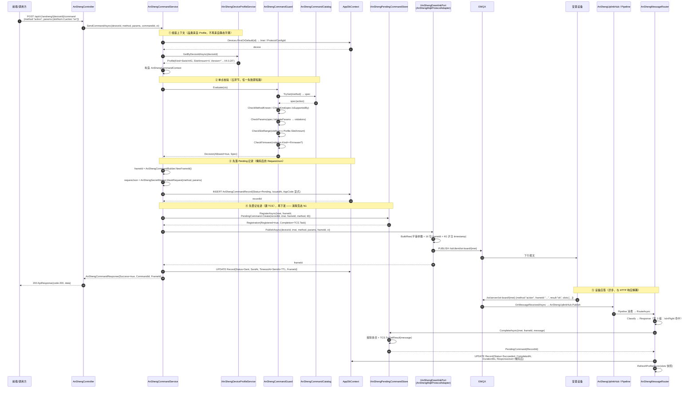
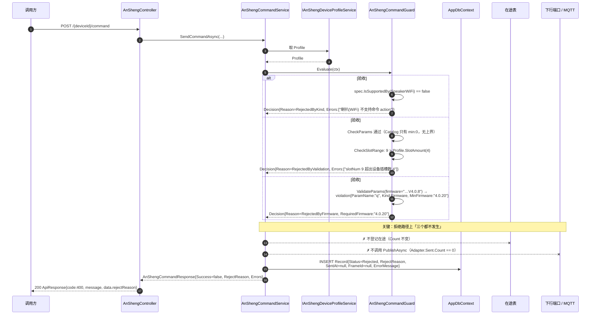
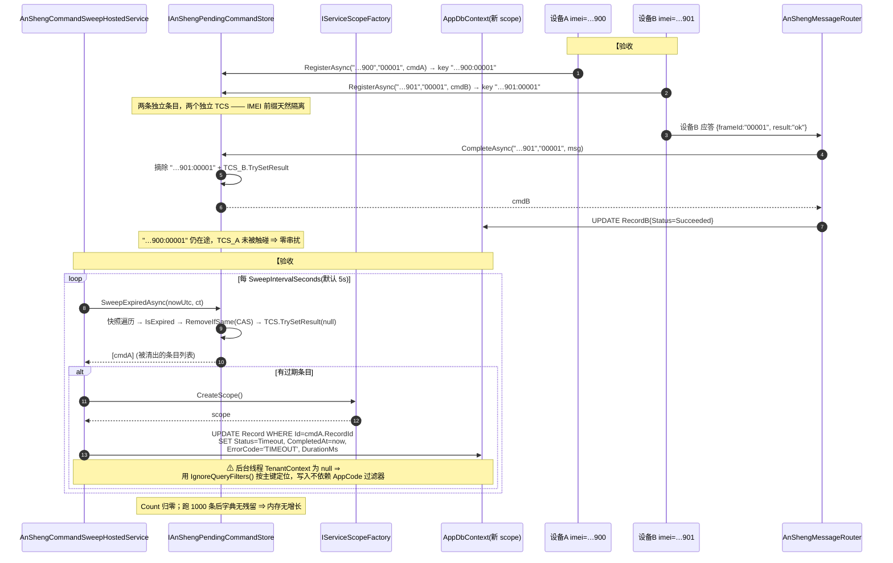
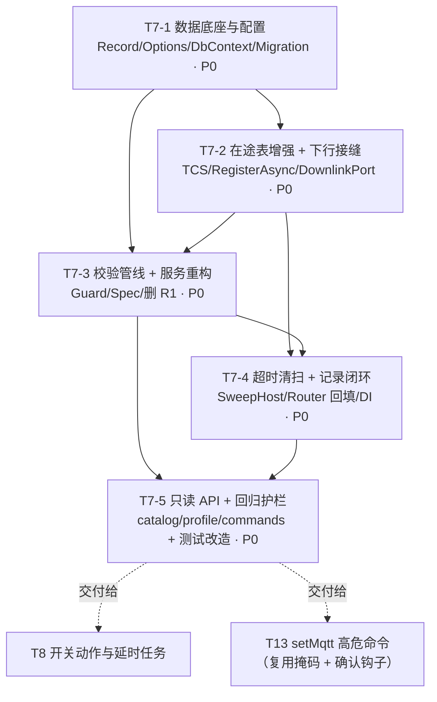

# T7 · 命令服务重构技术方案（增量架构设计 + 任务分解）

> **文档定位**：《安圣二开设备 MQTT 协议重构》**T7 — 命令服务重构：校验 + 在途表 + 命令记录 + Catalog API**
> 的落地技术方案，对应权威规格 `ansheng-open-redesign.md` §1798-1817（T7 条目）、§200-210（缺陷 R1）、
> §428-456（D7 在途表契约）、§741-970（命令类图）、§1014-1099（时序图）。
> **作者**：架构师 高见远 · **日期**：2026-08-04 · **状态**：待主理人确认后交工程师实现
> **本文只做设计，不含任何实现代码。** 所有「现状」结论均由**实读代码**得出并附文件:行号，可复核。
> **依赖**：T1 / T2 / T5 / T6 均已落地；在途命令表两文件已在 **T6 前移交付**（最小内存实现），T7 为**同文件增强**。

---

## 0. 一句话结论

T7 把「命令下发」从**一次性的 fire-and-forget 调用**改造成**有校验、有登记、有记录、有超时兜底的完整生命周期**：
**Catalog 声明规则 → Guard 单点执行校验 → 先登记在途（含 TCS）再下发 → 应答/超时两条路径闭环回填 `AnShengCommandRecord`**；
彻底删除 R1 的静态 `FrameIdCommandIdMap`（实读证实它**只写不读**，是纯内存泄漏）；
**不引入任何新第三方包**，时间可控性靠「TTL 参数化」而非 `TimeProvider`，因此测试无需真等 30 秒。

---

## 1. 实现方案与框架选型

### 1.1 现状实读结论（每条都有出处，工程师可复核）

| # | 实读事实 | 文件:行 | 对 T7 的含义 |
|---|---|---|---|
| F1 | `AnShengCommandService` 持有 `private static readonly ConcurrentDictionary<string,string> FrameIdCommandIdMap` | `Services/AnShengCommandService.cs:34` | R1 本体 |
| F2 | 该字典**只有写入方，没有读取方**：`RegisterFrameIdMapping` 被 `DeviceCommandService.cs:568` 调用；`ResolveCommandId` **在生产代码中零调用**（仅 3 处测试引用） | grep 全仓（排除 obj/bin）：`AnShengCommandService.cs:277/286/295`、`DeviceCommandService.cs:568`、`ScaffoldFalsificationTests.cs:51/55/72` | **删除它不会改变任何生产行为**——R1 的「多实例关联丢失」其实是「关联从未生效」。这把 T7 的风险从「重写关联逻辑」降级为「补上一条本就缺失的链路」 |
| F3 | `AnShengCommandService.SendCommandAsync` 用 `AnShengMqttProtocolAdapter.GetDeviceKind(serialNumber)` 判品类，**不读 Profile** | `Services/AnShengCommandService.cs:103-104` | 品类来源是**静态、上行学习、进程重启即失忆、跨用例泄漏**的字典，与 D3/T5 要求的 `AnShengDeviceProfile.Kind` 不一致 |
| F4 | `IProtocolAdapter.SendCommandAsync(deviceId, serialNumber, commandType, parameters, ct)` 返回 `Task<string>`（frameId），**没有 frameId 入参** | `Infrastructure/Protocol/Adapters/IProtocolAdapter.cs:170` | frameId 在**适配器内部**由 `AnShengCommandBuilder.NewFrameId()` 生成（`AnShengCommandBuilder.cs:63`、`AnShengMqttProtocolAdapter.cs:375-381`），调用方**只能在发布完成后**才知道 frameId ⇒ **「先登记后下发」在当前接口下不可实现**。这是 T7 最关键的接缝问题，见 §1.3 |
| F5 | `AnShengCommandBuilder.BuildRaw` 把 `frameId` 列为 **reserved key** 并剔除调用方传入值 | `AnShengCommandBuilder.cs:191-195` | 「把 frameId 塞进 parameters 透传」这条捷径**走不通** |
| F6 | 适配器 `OnMessageReceivedAsync` 对「带 frameId 且非事件」的报文触发 `CommandResponse` 事件，`CommandId` 直接填 frameId | `AnShengMqttProtocolAdapter.cs:558-570` | 全仓 grep `CommandResponse +=` **无任何订阅者**（`DeviceCommandService.cs:34` 订阅的是 `IMqttClientService.OnCommandResponse`，另一条 Legacy 通道）⇒ 这段是**死代码**，可安全摘除 |
| F7 | `AnShengMessageRouter.HandleResponseAsync` **已经**调用 `_pendingStore.CompleteAsync(ctx.Imei, result.FrameId!, ctx.Message)` | `Infrastructure/Protocol/AnSheng/AnShengMessageRouter.cs`（`HandleResponseAsync`） | 应答侧接线 T6 已完成，T7 只需在其**后面**补「回填 Record + 唤醒 TCS」 |
| F8 | 在途表 T6 实际签名为 `TryRegister` / `IsInFlight` / `CompleteAsync` / `SweepExpiredAsync`(→`Task<int>`) / `ClearAll` / `Count`，**没有** D7 的 `RegisterAsync`，**没有** TCS | `Services/Interfaces/IAnShengPendingCommandStore.cs:1-127`、`Services/AnShengPendingCommandStore.cs:1-214`（内含注释「T7 增强锚点」） | 决策 2 落地方式见 §8-D6 |
| F9 | `AnShengCommandCatalog.BuildCatalog()` 实测 **36 条**（G1=9 / G2=2 / G3=11 / G4=10 / G5=4），`Count` 属性返回 36；`EventMethodSet` 6 个 | `Infrastructure/Protocol/AnSheng/AnShengCommandCatalog.cs`（逐组计数核验） | **验收 #6 的「36 条」已成立**，无需新增 spec，只需暴露端点 |
| F10 | `getDevStatus` 的 `q` 参数已声明 `minFirmware:"4.0.20"`；`AnShengCommandSpec.ValidateParams` 已实现固件门槛校验 | `AnShengCommandCatalog.cs`（getDevStatus spec）、`AnShengCommandSpec.cs:58+` | **验收 #3 的门槛就在 Catalog**，Service 只需把 `Profile.Version` 传进去 |
| F11 | `AnShengCommandSpec.IsSupportedBy(Unknown)` **返回 true**（`if (kind == Unknown) return true;`） | `AnShengCommandSpec.cs:52-56` | 「Profile 缺失 ⇒ Kind=Unknown ⇒ 全部放行」是**既有安全阀**，T7 改用 Profile 时不会把存量无档案设备打死。见 §8-D7 |
| F12 | `action` spec 的 `slotNum` 只有 `min:0`，**无上界** | `AnShengCommandCatalog.cs`（action spec） | 「slotNum ≤ SlotAmount」必须由 Service 层用 `Profile.SlotAmount` 判定（验收 #2） |
| F13 | 在途表已注册为 **Singleton**；`AnShengUplinkPipeline` / `AnShengOfflineDebouncer` 亦为 Singleton；`AnShengMessageRouter` / `AnShengEventDispatcher` 为 Scoped | `Program.cs:156-178` | Store 里**不能**直接注入 `AppDbContext`（Scoped）。落库位置见 §8-D6 |
| F14 | `AnShengDeviceProfile` 配置范式：`HasConversion<int>()` 枚举、`UNIQUE(Imei)`、`(AppCode,Imei)`；`AnShengDeviceEvent` 范式：`longtext` 显式声明、三条复合索引、注释写明 5.7 红线 | `Data/AppDbContext.cs:453-517` | `AnShengCommandRecord` 照抄此范式即可，见 §3.2 |
| F15 | 最近一次迁移 `20260804023839_AddAnShengDeviceEvent`，命名范式 `{yyyyMMddHHmmss}_{PascalCase 动作}` | `Migrations/` 目录 | T7 迁移命名 `{ts}_AddAnShengCommandRecord` |
| F16 | 集成测试脚手架已就绪：`IntegrationTestBase` 每例调 `StaticStateResetter.ResetAll(Factory.Services)`；后者**反射清 `FrameIdCommandIdMap`**，字段消失会记 `LastError`；`SampleEndpointTests:108-113` 与 `ScaffoldFalsificationTests:41-73` 会因此**变红** | `tests/IoTPlatform.IntegrationTests/Infrastructure/StaticStateResetter.cs:181-225` 等 | 删 R1 必须同步改这 3 个测试文件，否则「删缺陷 ⇒ 测试爆红」。列为 T7-5 回归护栏 |
| F17 | `RecordingAnShengAdapter` 已支持 `EnqueueResponse(frameId)` 预置 frameId、`AutoReplyUplink(method, factory)` **同步**回上行 | `tests/.../Mqtt/RecordingAnShengAdapter.cs:186-216` | 「同步回上行」意味着**「先发后登记」的竞态在集成测试里会被稳定放大**，进一步佐证 §1.3 的选型 |
| F18 | 现有 `AnShengCommandResponse` 仅 `Success / FrameId / Payload / SentAt`（无拒绝原因） | `DTOs/Responses/AnShengResponses.cs:9` | 验收 #1/#2/#3 要求断言 `RejectedByKind` / `RejectedByValidation` ⇒ 必须扩展返回模型 |
| F19 | `PendingCommand.Create(commandId, imei, frameId, method, ttl)` **已支持自定义 TTL** | `Services/Interfaces/IAnShengPendingCommandStore.cs`（工厂方法） | 验收 #5 的「30s 超时」可用**短 TTL 注入**验证，**无需引入 `TimeProvider` / `FakeTimeProvider` 包**。见 §8-D4 |

### 1.2 T7 要解决的五个难点

| # | 难点 | 为什么难 | 本方案的解法 |
|---|---|---|---|
| **N1** | **关联时序**：frameId 在适配器内部生成，调用方拿到它时报文已经发出去了（F4） | 「先登记后下发」不可实现；先发后登记则存在竞态窗口，应答可能先于登记到达 ⇒ 被 `Classify` 误判为 AutoReport ⇒ 命令永远超时 | 新增**窄下行接缝** `IAnShengDownlinkPort`（§1.3），把 frameId 生成权上移到 Service |
| **N2** | **校验散落**：品类判定在 Service（读静态字典）、参数校验在 Catalog、越界校验无人做（F3/F12） | T8/T10/T11/T12 若各写一遍，规则必然漂移 | **三层校验分工**（§8-D1）：Catalog 声明静态规则、`AnShengCommandGuard` 执行设备态规则、Builder 负责协议形态 |
| **N3** | **拒绝原因不可区分**：`ValidateParams` 只返回 `bool + string[]`，无法区分「参数非法」与「固件不足」（F10/F18） | 验收 #2 要 `RejectedByValidation`、验收 #3 要能提示「升级固件」 | `ValidateParams` **新增结构化重载**（旧签名保留委托），输出 `AnShengParamViolation{ParamName, Kind, Message, MinFirmware}` |
| **N4** | **落库位置**：Store 是 Singleton，`AppDbContext` 是 Scoped（F13）；且后台线程 `ITenantContextAccessor.Current` 为 null ⇒ 全局租户过滤器失效 | 在 Store 里写库会把它从「纯内存数据结构」退化成「半个仓储」，并把 AppCode 陷阱引进最热路径 | Store **只管内存态 + TCS**；落库交给两个已有 Scope 的位置：应答路径 → `AnShengMessageRouter`（Scoped，F7）；超时路径 → `AnShengCommandSweepHostedService`（自建 scope，**显式赋 AppCode**） |
| **N5** | **删缺陷会打翻测试**：R1 字段被脚手架反射引用（F16） | 「修复缺陷导致 CI 变红」会诱导工程师放弃修复 | T7-5 把三处测试同步改造，作为**验收出口的一部分**，不是可选项 |

### 1.3 关键接缝：`IAnShengDownlinkPort`（解决 N1）

**问题重述**（F4/F5）：

```
现状： Service ──SendCommandAsync(…)──► Adapter ──[内部生成 frameId]──► MQTT Publish
                                                 └──► return frameId   ← 此刻报文已在网上
       Service ──TryRegister(imei, frameId)──►  在途表                 ← 登记晚于发布
```

竞态窗口内到达的应答会被 `AnShengMessageRouter.Classify` 第 3 级（`IsInFlight`）判为 **AutoReport**，
命令记录只能等到超时 ⇒ 偶发「命令其实成功了却记成 Timeout」。
`RecordingAnShengAdapter` 的自动应答是**同步**发布的（F17），集成测试会把这个窗口放大到 100%。

**方案对比**

| 方案 | 做法 | 评价 |
|---|---|---|
| A. 扩 `IProtocolAdapter` | 给公共接口加带 frameId 的重载（默认实现委托旧重载） | 污染跨协议族公共接口（Modbus/OPC UA 与 frameId 毫无关系）；且默认实现会让测试替身**静默走降级路径**，问题被藏起来 |
| B. **窄接口 `IAnShengDownlinkPort`（选定）** | 只由 `AnShengMqttProtocolAdapter` 与 `RecordingAnShengAdapter` 实现；Service 侧 `adapter is IAnShengDownlinkPort port` 命中就走「先登记后下发」，未命中则降级为「先发后登记 + 记 warning」 | 接口隔离原则；不动其它协议族；测试替身实现成本 <10 行（已有 `_plannedFrameIds` 机制）；降级路径保证兼容 |
| C. 先发后登记 | 不加任何接口 | 竞态在集成测试中稳定复现（F17），且这正是 R1 同源的「关联时序错误」，T7 的使命就是把它做对一次 |
| D. frameId 走 parameters 透传 | — | 被 `IsReservedKey` 剔除（F5），且需同时改 Builder + 适配器 + 替身，比 B 更贵 |

**选定 B**。接口只有一个方法：

```
Task<string> PublishAsync(long deviceId, string imei, string method,
                          IReadOnlyDictionary<string,object?> parameters,
                          string frameId, CancellationToken ct)
```

调用方（Service）职责变为：`frameId = AnShengCommandBuilder.NewFrameId()` → `store.RegisterAsync(...)`
→ `port.PublishAsync(..., frameId, ...)` → 失败则 `store.CompleteAsync` 立即摘除并置 `Status=Failed`。

### 1.4 框架与依赖选型

**不引入任何新第三方包。** 逐项说明为什么不需要：

| 诱惑 | 为什么不要 | 替代 |
|---|---|---|
| `Microsoft.Extensions.TimeProvider.Testing`（FakeTimeProvider） | 只为「不真等 30 秒」而加包，且会要求生产代码全面改注入 `TimeProvider` | `PendingCommand.Create(..., ttl)` **已支持自定义 TTL**（F19）：测试传 `TTL=200ms`；「默认 30s」本身用**单测断言配置值**覆盖（`TimeoutAt - SentAt == 30s`），不需要真跑 |
| `Polly`（重试） | T7 不做重试语义（协议侧已有 `AnShengCommandThrottle` ≥100ms 限流） | — |
| `MediatR`（管线） | 校验管线只有 5 个环节且全同步，一个类足够 | `AnShengCommandGuard` |
| 分布式在途表（Redis） | **决策 3：按单实例设计** | `IAnShengPendingCommandStore` 保留为接口，多实例时新增实现类即可（Option B 扩展点） |

复用清单：`System.Collections.Concurrent`、`System.Threading.Tasks.TaskCompletionSource`、`System.Text.Json`、
EF Core 8 + Pomelo 8.0.2、`Microsoft.Extensions.Hosting.BackgroundService`、`IOptions<T>`；
测试侧：xUnit 2.9.2 + FluentAssertions 6.12.2 + 既有 `IntegrationTestBase` / `RecordingAnShengAdapter` / `AnShengUplinkPipeline.DrainAsync`。

### 1.5 架构模式

- **声明式目录 + 执行式管线**（Catalog / Guard 分离）——协议真相单一来源；
- **端口-适配器**（`IAnShengDownlinkPort`）——下行接缝可替换、可测试；
- **内存态与持久态分离**（Store 纯内存 / Record 持久化）——Singleton 与 Scoped 各归其位；
- **双路径闭环**（应答路径 + 旁路清扫）——任何一条命令都有确定终态，不存在「永远 Pending」。

---

## 2. 文件清单

> 相对路径以仓库根 `H:\IoTPlatform` 为基准。🆕=新建，✏️=修改既有文件。

### 2.1 新建（6）

| # | 路径 | 职责 | 归属任务 |
|:--:|---|---|:--:|
| 1 | `Models/AnShengCommandRecord.cs` | 命令生命周期记录实体 + `AnShengCommandStatus` / `AnShengCommandRejectReason` 两个枚举（同文件，与 `AnShengDeviceEvent` 的组织方式一致） | T7-1 |
| 2 | `Configuration/AnShengCommandOptions.cs` | `DefaultTimeoutSeconds=30`、`LongRunningTimeoutSeconds=60`（`getLogs`/`getEMStatistics`）、`SweepIntervalSeconds=5`、`SweepEnabled=true`、`RejectWhenKindUnknown=false`、`RecordRetentionDays=90` | T7-1 |
| 3 | `Migrations/{ts}_AddAnShengCommandRecord.cs`(+`.Designer.cs`) | 建 `AnShengCommandRecords` 表与 5 条索引（范式对齐 `20260804023839_AddAnShengDeviceEvent`） | T7-1 |
| 4 | `Services/Interfaces/IAnShengDownlinkPort.cs` | **frameId 预登记下行接缝**（§1.3），唯一方法 `PublishAsync(..., string frameId, ...)` | T7-2 |
| 5 | `Services/AnShengCommandGuard.cs` | 校验管线执行器（品类 / 参数 / 越界 / 固件 / 高危确认）+ `AnShengCommandDecision` 结果模型 + `AnShengSecretMasker` 掩码器（同文件） | T7-3 |
| 6 | `Services/AnShengCommandSweepHostedService.cs` | 后台清扫宿主：周期调 `SweepExpiredAsync` → 过期条目回填 `Status=Timeout` | T7-4 |

### 2.2 修改 · 在途表增强（2，T6 前移文件的「同文件增强」）

| # | 路径 | 增强内容 | 归属任务 |
|:--:|---|---|:--:|
| 7 | `Services/Interfaces/IAnShengPendingCommandStore.cs` | 新增 `RegisterAsync`（D7 契约，返回带 TCS 的 `AnShengPendingRegistration`）；`SweepExpiredAsync` 新增**返回过期条目集合**的重载；`PendingCommand` 补 `RecordId` / `Ttl` 字段；文件头注释「T6 建 / T7 增强」落实 | T7-2 |
| 8 | `Services/AnShengPendingCommandStore.cs` | 实现上述；`CompleteAsync` 在摘除条目后**置 TCS 结果**（`TrySetResult`）；`ClearAll` 需 `TrySetCanceled` 避免测试间挂起等待者 | T7-2 |

### 2.3 修改 · 既有文件改造（8）

| # | 路径 | 改造内容 | 归属任务 |
|:--:|---|---|:--:|
| 9 | `Data/AppDbContext.cs` | `DbSet<AnShengCommandRecord>` + `ConfigureAnShengCommandRecords()`（照抄 §441-517 范式） | T7-1 |
| 10 | `Infrastructure/Protocol/Adapters/AnShengMqttProtocolAdapter.cs` | 实现 `IAnShengDownlinkPort`（把既有 `SendCommandAsync` 的报文构建与发布抽成带 frameId 入参的私有方法，两个入口共用）；**摘除死代码** `CommandResponse?.Invoke(...)` 分支（F6） | T7-2 |
| 11 | `Infrastructure/Protocol/AnSheng/AnShengCommandSpec.cs` | `ValidateParams` 新增结构化重载（输出 `AnShengParamViolation` 列表，含 `Kind` 与 `MinFirmware`）；旧签名保留并委托新重载 | T7-3 |
| 12 | `Infrastructure/Protocol/AnSheng/AnShengParamSpec.cs` | 新增 `IsSecret`（默认 false）；`Validate` 输出 violation 时携带 `Kind` | T7-3 |
| 13 | `Infrastructure/Protocol/AnSheng/AnShengCommandCatalog.cs` | 仅 1 行改动：`setMqtt` 的 `password` 参数标注 `isSecret: true`（§8-D3）。**36 条 spec 不增不减** | T7-3 |
| 14 | `Services/AnShengCommandService.cs` + `Services/Interfaces/IAnShengCommandService.cs` + `DTOs/Responses/AnShengResponses.cs` | 删 R1 三个静态方法与静态字典；接入 Guard / Store / Record；`AnShengCommandResponse` 补 `RejectReason` / `CommandId` / `Errors` / `MinFirmware` | T7-3 |
| 15 | `Services/DeviceCommandService.cs` | 删 `AnShengCommandService.RegisterFrameIdMapping(...)` 调用（`:568`）；改为把 `DeviceCommand.CommandId` **透传**给 `SendCommandAsync`，使两表用同一 GUID 软关联（§3.2） | T7-3 |
| 16 | `Infrastructure/Protocol/AnSheng/AnShengMessageRouter.cs` + `Program.cs` | Router：`HandleResponseAsync` 在 `CompleteAsync` 之后回填 Record（成功/失败/耗时/ResponseJson 掩码）。Program：注册 `AnShengCommandGuard`(Scoped)、`AnShengCommandOptions`、`AddHostedService<AnShengCommandSweepHostedService>()` | T7-4 |

### 2.4 修改 · 测试与脚手架（4，回归护栏）

| # | 路径 | 改造内容 | 归属任务 |
|:--:|---|---|:--:|
| 17 | `tests/IoTPlatform.IntegrationTests/Infrastructure/StaticStateResetter.cs` | 移除 `ClearFrameIdCommandIdMap()`（字段已不存在，留着会永久记 `LastError`）；补 `ClearPendingCommands` 的 TCS 取消说明 | T7-5 |
| 18 | `tests/.../Samples/ScaffoldFalsificationTests.cs` | 删除对 `RegisterFrameIdMapping` / `ResolveCommandId` 的 3 处引用（`:51/55/72`），改为对**在途表**的污染-清理证伪（语义等价、目标更正确） | T7-5 |
| 19 | `tests/.../Samples/SampleEndpointTests.cs` | `StaticStateResetter.Verify()` 断言保留（清单变更后仍应为 true） | T7-5 |
| 20 | `tests/.../Infrastructure/Mqtt/RecordingAnShengAdapter.cs` | 实现 `IAnShengDownlinkPort`：入参 frameId **优先级高于** `_plannedFrameIds`；`SentCommand` 语义不变 | T7-5 |

### 2.5 ⚠ 与主理人裁定「5 新建 + 2 修改」的口径差异（必须知情）

主理人裁定的「**5 新建 + 2 修改**」是对 `ansheng-open-redesign.md` 原「7 文件」清单的**映射修正**
（原清单中两个在途表文件由 🆕 改判为 ✏️），这一条 **W2 回写照办**（§11）。

但**实读代码后的实施口径**是 **20 处**（6🆕 + 2✏️在途表 + 8✏️既有 + 4✏️测试）。多出来的部分及其**不可省略**的理由：

| 增量 | 为什么不能省 |
|---|---|
| `IAnShengDownlinkPort` + 适配器 + 替身（3 处） | F4 证明「先登记后下发」在现接口下**物理上做不到**；不加就只能接受 N1 竞态，而 T7 的核心使命正是修复关联时序 |
| `AnShengCommandGuard`（1 处） | 验收 #1/#2/#3 被规格明确定为**单元测试**；校验逻辑若留在 `AnShengCommandService` 内，单测就必须拖起 `AppDbContext` + `IProtocolAdapterFactory`，退化成集成测试 |
| `AnShengCommandSpec/ParamSpec/Catalog`（3 处，共约 15 行） | N3：不区分「参数非法」与「固件不足」就无法同时满足验收 #2 与 #3 |
| `AnShengCommandOptions`（1 处） | 30s/60s/5s 三个时间常量若硬编码，验收 #5 只能真等 30 秒 |
| 4 处测试文件 | F16：不改则「删除 R1 缺陷」直接导致既有 CI 变红 |

**结论**：文件数从 7 涨到 20，但**净新增生产代码类只有 4 个**（Record / Options / Guard / SweepHost）+ 1 个单方法接口；
其余均为既有文件的小幅增量。工作量估算 **2.5 人日**（不含 QA）。

---

## 3. 数据结构与接口

### 3.1 类图

```mermaid
classDiagram
    %% ───────── 控制器与服务 ─────────
    class AnShengController {
        <<Controller, api/v1/ansheng>>
        -IAnShengCommandService _commandService
        -IAnShengCommandQueryService _query
        +Task~IActionResult~ SendCommand(long deviceId, SendAnShengCommandRequest req)
        +Task~IActionResult~ GetCatalog(long? deviceId)
        +Task~IActionResult~ GetProfile(long deviceId)
        +Task~IActionResult~ GetCommand(string commandId)
    }

    class IAnShengCommandService {
        <<interface>>
        +Task~AnShengCommandResponse~ SendCommandAsync(long deviceId, string method, IDictionary~string,object~ parameters, string? commandId, CancellationToken ct)
        +Task~AnShengCommandResponse~ ConfigureAutoReportAsync(long deviceId, ...)
        +Task~AnShengCommandResponse~ TriggerDiscoveryAsync(...)
        +Task~AnShengCommandResponse~ RebootDeviceAsync(long deviceId, CancellationToken ct)
    }

    class AnShengCommandService {
        -AppDbContext _db
        -IProtocolAdapterFactory _adapterFactory
        -IAnShengDeviceProfileService _profiles
        -AnShengCommandGuard _guard
        -IAnShengPendingCommandStore _pending
        -AnShengCommandOptions _options
        -ILogger _logger
        +Task~AnShengCommandResponse~ SendCommandAsync(...)
        -Task~AnShengCommandRecord~ CreateRecordAsync(...)
        -Task PersistRejectionAsync(AnShengCommandDecision d)
        -TimeSpan ResolveTtl(string method)
    }

    class AnShengCommandResponse {
        +bool Success
        +string CommandId
        +string? FrameId
        +string? Payload
        +DateTime SentAt
        +AnShengCommandRejectReason? RejectReason
        +IReadOnlyList~string~ Errors
        +string? RequiredFirmware
    }

    %% ───────── 校验管线 ─────────
    class AnShengCommandGuard {
        <<Scoped>>
        -AnShengCommandOptions _options
        -ILogger _logger
        +AnShengCommandDecision Evaluate(AnShengCommandContext ctx)
        -AnShengCommandDecision CheckMethodKnown(ctx)
        -AnShengCommandDecision CheckKind(ctx)
        -AnShengCommandDecision CheckParams(ctx)
        -AnShengCommandDecision CheckSlotRange(ctx)
        -AnShengCommandDecision CheckFirmware(ctx)
    }

    class AnShengCommandContext {
        +long DeviceId
        +string Imei
        +string Method
        +IReadOnlyDictionary~string,object~ Parameters
        +AnShengDeviceKind Kind
        +string? Firmware
        +int? SlotAmount
        +bool KindFromProfile
    }

    class AnShengCommandDecision {
        +bool Allowed
        +AnShengCommandRejectReason? Reason
        +IReadOnlyList~string~ Errors
        +string? RequiredFirmware
        +AnShengCommandSpec? Spec
        +Allow(spec)$ AnShengCommandDecision
        +Reject(reason, errors)$ AnShengCommandDecision
    }

    class AnShengSecretMasker {
        <<static>>
        +string MaskRequest(string method, IReadOnlyDictionary~string,object~ parameters)
        +string? MaskResponse(string method, string? json)
        -bool IsSecret(string method, string paramName)
    }

    %% ───────── 协议目录（既有，T7 小幅增强）─────────
    class AnShengCommandCatalog {
        <<static>>
        +int Count  36
        +bool TryGet(string method, out AnShengCommandSpec? spec)$
        +bool Contains(string method)$
        +IReadOnlyCollection~AnShengCommandSpec~ All()$
    }

    class AnShengCommandSpec {
        +string Method
        +string Group
        +string Description
        +bool IsEvent
        +bool IsBeta
        +string? MinFirmware
        +AnShengDeviceCapability SupportedKinds
        +IReadOnlyList~AnShengParamSpec~ Parameters
        +bool IsSupportedBy(AnShengDeviceKind kind)
        +bool ValidateParams(parameters, firmware, allowUnknown, out IReadOnlyList~AnShengParamViolation~ violations)
    }

    class AnShengParamSpec {
        +string Name
        +bool Required
        +AnShengParamType Type
        +string? MinFirmware
        +bool IsSecret
        +IReadOnlyList~string~? AllowedValues
        +double? Minimum
        +double? Maximum
        +bool Validate(object? value, out AnShengParamViolation? violation)
    }

    class AnShengParamViolation {
        <<record>>
        +string ParamName
        +AnShengViolationKind Kind
        +string Message
        +string? MinFirmware
    }

    %% ───────── 在途表（T6 建 / T7 增强）─────────
    class IAnShengPendingCommandStore {
        <<interface, Singleton>>
        +int Count
        +bool TryRegister(string imei, string frameId, PendingCommand cmd)
        +Task~AnShengPendingRegistration~ RegisterAsync(string imei, string frameId, PendingCommand cmd)
        +bool IsInFlight(string imei, string frameId)
        +Task~PendingCommand?~ CompleteAsync(string imei, string frameId, AnShengMessage? response)
        +Task~int~ SweepExpiredAsync(CancellationToken ct)
        +Task~IReadOnlyList~PendingCommand~~ SweepExpiredAsync(DateTime nowUtc, CancellationToken ct)
        +void ClearAll()
        +string BuildKey(string imei, string frameId)$
    }

    class AnShengPendingCommandStore {
        -ConcurrentDictionary~string,PendingEntry~ _inFlight
        -ILogger _logger
        +... 实现全部接口成员
    }

    class PendingEntry {
        -PendingCommand Command
        -TaskCompletionSource~AnShengMessage?~ Completion
    }

    class PendingCommand {
        <<record>>
        +long CommandId
        +string Imei
        +string FrameId
        +string Method
        +DateTime SentAt
        +DateTime ExpiresAt
        +bool IsExpired
        +Create(commandId, imei, frameId, method, ttl)$ PendingCommand
    }

    class AnShengPendingRegistration {
        +string Imei
        +string FrameId
        +bool Registered
        +Task~AnShengMessage?~ Completion
        +Task~AnShengMessage?~ WaitAsync(TimeSpan timeout, CancellationToken ct)
    }

    %% ───────── 下行接缝 ─────────
    class IAnShengDownlinkPort {
        <<interface>>
        +Task~string~ PublishAsync(long deviceId, string imei, string method, IReadOnlyDictionary~string,object~ parameters, string frameId, CancellationToken ct)
    }

    class AnShengMqttProtocolAdapter {
        <<IProtocolAdapter, IAnShengDownlinkPort>>
        +Task~string~ SendCommandAsync(long, string, string, string, CancellationToken)
        +Task~string~ PublishAsync(..., string frameId, ...)
        -Task~string~ BuildAndPublishAsync(imei, method, flatParams, kind, frameId, ct)
    }

    class RecordingAnShengAdapter {
        <<TestDouble, IProtocolAdapter, IAnShengDownlinkPort>>
        +IReadOnlyList~SentCommand~ Sent
    }

    %% ───────── 持久化 ─────────
    class AnShengCommandRecord {
        <<Entity, IHasAppCode>>
        +long Id
        +string AppCode
        +string CommandId
        +long? DeviceId
        +string Imei
        +string Method
        +string? FrameId
        +AnShengCommandStatus Status
        +AnShengCommandRejectReason? RejectReason
        +string RequestJson
        +string? ResponseJson
        +string? ErrorCode
        +string? ErrorMessage
        +DateTime IssuedAt
        +DateTime? SentAt
        +DateTime? CompletedAt
        +DateTime? TimeoutAt
        +int? DurationMs
        +long? OperatorUserId
    }

    class AnShengCommandStatus {
        <<enum int>>
        Pending 0
        Sent 1
        Succeeded 2
        Failed 3
        Timeout 4
        Rejected 5
    }

    class AnShengCommandRejectReason {
        <<enum int>>
        RejectedByKind 0
        RejectedByValidation 1
        RejectedByFirmware 2
        RejectedByOffline 3
        RejectedByUnknownMethod 4
        RejectedByConfirm 5
    }

    %% ───────── 后台与上行 ─────────
    class AnShengCommandSweepHostedService {
        <<BackgroundService>>
        -IServiceScopeFactory _scopeFactory
        -IAnShengPendingCommandStore _store
        -AnShengCommandOptions _options
        #Task ExecuteAsync(CancellationToken ct)
        -Task SweepOnceAsync(CancellationToken ct)
    }

    class AnShengMessageRouter {
        <<Scoped>>
        -IAnShengPendingCommandStore _pendingStore
        -AppDbContext _db
        -Task HandleResponseAsync(ctx, result, ct)
        -Task CompleteRecordAsync(PendingCommand cmd, AnShengMessage? msg, ct)
    }

    class AnShengCommandOptions {
        +int DefaultTimeoutSeconds  30
        +int LongRunningTimeoutSeconds  60
        +int SweepIntervalSeconds  5
        +bool SweepEnabled  true
        +bool RejectWhenKindUnknown  false
        +int RecordRetentionDays  90
    }

    %% ───────── 关系 ─────────
    IAnShengCommandService <|.. AnShengCommandService
    AnShengController ..> IAnShengCommandService : 下发/查询
    AnShengController ..> AnShengCommandCatalog : GET /catalog
    AnShengCommandService ..> AnShengCommandResponse : 返回
    AnShengCommandService *-- AnShengCommandGuard : 单点校验
    AnShengCommandService o-- IAnShengPendingCommandStore : 先登记
    AnShengCommandService ..> IAnShengDownlinkPort : 后下发
    AnShengCommandService ..> AnShengCommandRecord : 落库
    AnShengCommandService o-- AnShengCommandOptions

    AnShengCommandGuard ..> AnShengCommandContext : 输入
    AnShengCommandGuard ..> AnShengCommandDecision : 输出
    AnShengCommandGuard ..> AnShengCommandCatalog : 查 spec
    AnShengCommandGuard ..> AnShengSecretMasker
    AnShengCommandCatalog *-- AnShengCommandSpec : 36 条
    AnShengCommandSpec *-- AnShengParamSpec
    AnShengCommandSpec ..> AnShengParamViolation : 产出
    AnShengParamSpec ..> AnShengParamViolation

    IAnShengPendingCommandStore <|.. AnShengPendingCommandStore
    AnShengPendingCommandStore *-- PendingEntry
    PendingEntry *-- PendingCommand
    IAnShengPendingCommandStore ..> AnShengPendingRegistration : RegisterAsync 返回

    IAnShengDownlinkPort <|.. AnShengMqttProtocolAdapter
    IAnShengDownlinkPort <|.. RecordingAnShengAdapter

    AnShengCommandRecord *-- AnShengCommandStatus
    AnShengCommandRecord *-- AnShengCommandRejectReason

    AnShengCommandSweepHostedService o-- IAnShengPendingCommandStore : 旁路清扫
    AnShengCommandSweepHostedService ..> AnShengCommandRecord : 置 Timeout
    AnShengMessageRouter o-- IAnShengPendingCommandStore : CompleteAsync
    AnShengMessageRouter ..> AnShengCommandRecord : 置 Succeeded/Failed
```



### 3.2 `AnShengCommandRecord` 字段集与建表约束（决策 2 的落地形态）

| 列 | 类型 | 可空 | 说明 |
|---|---|:--:|---|
| `Id` | `bigint` PK auto | ✗ | 内部主键 |
| `AppCode` | `varchar(50)` | ✗ | 实现 `IHasAppCode`；**后台线程写入必须显式赋值**（T6 §7.2 陷阱） |
| `CommandId` | `varchar(36)` **UNIQUE** | ✗ | 对外稳定标识（GUID）。**与 `DeviceCommand.CommandId` 同值**，两表软关联，避免双份真相；`GET /commands/{commandId}` 用它 |
| `DeviceId` | `bigint` | ✓ | 未认领设备（探测阶段）也允许下发，故可空 |
| `Imei` | `varchar(32)` | ✗ | 未认领时唯一可用标识 |
| `Method` | `varchar(32)` | ✗ | 协议方法名 |
| `FrameId` | `varchar(64)` | ✓ | **拒绝态没有 frameId**，故可空 |
| `Status` | `int` `HasConversion<int>()` | ✗ | Pending/Sent/Succeeded/Failed/Timeout/Rejected |
| `RejectReason` | `int` | ✓ | 仅 `Status=Rejected` 时有值，验收 #1/#2/#3 直接断言此列 |
| `RequestJson` | `longtext` | ✗ | **掩码后**的下发报文（§8-D3） |
| `ResponseJson` | `longtext` | ✓ | **掩码后**的应答原文 |
| `ErrorCode` | `varchar(64)` | ✓ | 设备回包 `result`/错误码，或内部错误码（如 `ADAPTER_OFFLINE`） |
| `ErrorMessage` | `varchar(512)` | ✓ | 人类可读原因；校验失败时存 `Errors` 的拼接（截断至 512） |
| `IssuedAt` | `datetime(6)` | ✗ | 受理时刻（UTC） |
| `SentAt` | `datetime(6)` | ✓ | 实际发布时刻；拒绝态为 null（**验收 #1「MQTT 零发布」的持久化证据**） |
| `CompletedAt` | `datetime(6)` | ✓ | 终态时刻 |
| `TimeoutAt` | `datetime(6)` | ✓ | `= SentAt + TTL`，旁路清扫扫描依据 |
| `DurationMs` | `int` | ✓ | `CompletedAt - SentAt`，存值而非计算列（5.7 函数索引红线） |
| `OperatorUserId` | `bigint` | ✓ | 审计（T13 验收 5 依赖），HTTP 路径取自 claim；后台路径为 null |

**索引**

| 索引 | 目的 |
|---|---|
| `UNIQUE(CommandId)` | 对外主键与幂等 |
| `(Imei, FrameId)` **非唯一** | 应答关联主路径。**刻意不设唯一**：frameId 仅 16 位 hex 且记录长期保留，同一 IMEI 跨月理论上可能重复，设唯一会在生产上偶发写入失败。关联时取 `Status IN (Pending,Sent)` 的最新一条 |
| `(AppCode, IssuedAt)` | 租户维度列表（全局过滤器必加 `WHERE AppCode=?`，AppCode 必须打头） |
| `(DeviceId, IssuedAt)` | 设备详情页命令时间线 |
| `(Status, TimeoutAt)` | 旁路清扫扫「未完成且已超时」 |

**MySQL 5.7.26 红线自检**：枚举一律 `int` + `HasConversion<int>()`（禁原生 ENUM）；无 CHECK 约束；
无降序索引、无函数索引；`longtext` 只存不查、不进索引；时间列 `datetime(6)` 存 UTC，**禁 timestamp 列**；
字符集随全局 `utf8mb4`。

**为什么否决 `Direction` 列**（主理人清单中列出，此处给出裁剪理由）：本表定义是「**平台下发命令**的生命周期」，
上行报文已由 T6 的 `AnShengDeviceEvent` 承载。加一个恒为 `Downlink` 的列既浪费存储又制造
「两表都能查上行」的错觉，属于职责重叠。**若将来真需要合并上下行视图，用视图或联合查询，不用冗余列。**

---

## 4. 程序调用流程（时序图）

### 4.1 时序 ① — 命令下发成功全链路（含先登记后下发）



### 4.2 时序 ② — 三类拒绝（验收 #1 / #2 / #3）：零发布、零在途、只落 Rejected 记录



### 4.3 时序 ③ — 超时旁路清扫（验收 #5）与「两设备同 frameId 不串扰」（验收 #4）



---

## 5. 任务列表（有序，5 个任务，工程师照做）

> 预算约 **2.5 人日**（不含 QA）。所有任务的验收出口都写成**可执行判据**，不写「完成开发」这类空话。

### T7-1 — 数据底座与配置 · P0 · 依赖：无 · 约 0.5 人日

- **文件**（5）
  - 🆕 `Models/AnShengCommandRecord.cs`（实体 + `AnShengCommandStatus` + `AnShengCommandRejectReason`）
  - 🆕 `Configuration/AnShengCommandOptions.cs`
  - ✏️ `Data/AppDbContext.cs`（`DbSet` + `ConfigureAnShengCommandRecords()`）
  - 🆕 `Migrations/{ts}_AddAnShengCommandRecord.cs` + `.Designer.cs`
  - ✏️ `appsettings.json`（`AnShengCommand` 节）
- **要点**
  1. 字段与索引严格按 §3.2；`ConfigureAnShengCommandRecords()` 的**注释必须写明每条索引的理由**（对齐 `ConfigureAnShengDeviceEvents` 的行文规范）；
  2. `AnShengCommandRecord : IHasAppCode`，`AppCode` 加 `[Required]` + `HasMaxLength(50)`；
  3. 迁移生成后**人工检查** `.cs`：不得出现 `ENUM` / `CHECK` / 降序索引 / `timestamp` 列；`longtext` 列不得进任何索引；
  4. 迁移命名 `{yyyyMMddHHmmss}_AddAnShengCommandRecord`（对齐 F15）。
- **验收出口**
  - `dotnet ef database update` 在 MySQL 5.7 上正向执行成功；
  - `dotnet ef migrations script {上一个} {本次}` 与 `Down()` 均可执行（回滚可用）；
  - `information_schema.statistics` 中该表索引数 = 5（含主键则 6）。

### T7-2 — 在途表增强与下行接缝 · P0 · 依赖：T7-1 · 约 0.6 人日

- **文件**（4）
  - ✏️ `Services/Interfaces/IAnShengPendingCommandStore.cs`（+`AnShengPendingRegistration`，+`PendingCommand.RecordId/Ttl`）
  - ✏️ `Services/AnShengPendingCommandStore.cs`（`PendingEntry` 内聚 TCS）
  - 🆕 `Services/Interfaces/IAnShengDownlinkPort.cs`
  - ✏️ `Infrastructure/Protocol/Adapters/AnShengMqttProtocolAdapter.cs`（实现端口 + 摘除死代码 F6）
- **要点**
  1. **保留** T6 全部既有签名（`TryRegister`/`IsInFlight`/`CompleteAsync`/`SweepExpiredAsync(ct)`/`ClearAll`/`Count`）——
     `AnShengMessageRouter.HandleResponseAsync` 已在调用，改名 = 破坏 T6 已过 QA 的代码；
  2. `RegisterAsync` 是 D7 契约的**完整语义**（登记 + 建 TCS），`TryRegister` 退化为它的同步子集，**内部同一实现**，杜绝两份逻辑；
  3. `TaskCompletionSource` **必须**用 `TaskCreationOptions.RunContinuationsAsynchronously`
     —— 否则 `TrySetResult` 会在 Router 的线程上同步跑等待者的续体，把上行管道拖住（这是 TCS 最经典的坑）；
  4. `ClearAll()` 需对每个 TCS `TrySetCanceled()`，否则测试用例间会留下永不完成的等待者；
  5. `SweepExpiredAsync(DateTime nowUtc, ct)` 返回**被清出的条目列表**；旧的 `SweepExpiredAsync(ct)` 保留并委托新重载、返回 `list.Count`；
  6. 适配器把「构建报文 + 发布」抽成 `BuildAndPublishAsync(..., string? frameId, ...)`，`SendCommandAsync`（frameId=null，自生成）与
     `PublishAsync`（frameId 外部指定）**共用同一实现**，避免两条报文构建路径漂移；
  7. 摘除 `OnMessageReceivedAsync` 里的 `CommandResponse?.Invoke(...)` 分支（F6 已证无订阅者），并在类注释记录移除原因。
- **验收出口**
  - **验收 #4 单测绿**：两 IMEI 同 frameId 各登记一条 → `Count==2`；完成其一 → 另一条 `IsInFlight` 仍为 true，其 TCS 未完成；
  - 循环 1000 次「登记 → 完成」后 `Count==0`；循环 1000 次「登记 → 过期 → Sweep」后 `Count==0`；
  - `SendCommandAsync` 与 `PublishAsync` 对同一入参产出**字节级相同**的报文（frameId 除外）。

### T7-3 — 校验管线与命令服务重构（R1 摘除） · P0 · 依赖：T7-1、T7-2 · 约 0.8 人日

- **文件**（7）
  - 🆕 `Services/AnShengCommandGuard.cs`（+`AnShengCommandContext`/`AnShengCommandDecision`/`AnShengSecretMasker`）
  - ✏️ `Infrastructure/Protocol/AnSheng/AnShengCommandSpec.cs`（结构化 `ValidateParams` 重载 + `AnShengParamViolation`）
  - ✏️ `Infrastructure/Protocol/AnSheng/AnShengParamSpec.cs`（`IsSecret` + violation 输出）
  - ✏️ `Infrastructure/Protocol/AnSheng/AnShengCommandCatalog.cs`（**仅 1 行**：`setMqtt.password` 标 `isSecret`）
  - ✏️ `Services/AnShengCommandService.cs`（删 R1；接 Guard/Store/Port/Record）
  - ✏️ `Services/Interfaces/IAnShengCommandService.cs` + `DTOs/Responses/AnShengResponses.cs`
  - ✏️ `Services/DeviceCommandService.cs`（删 `:568` 的静态映射调用；透传 `CommandId`）
- **要点**
  1. **彻底删除** `FrameIdCommandIdMap` 及 `RegisterFrameIdMapping`/`ResolveCommandId`/`RemoveFrameIdMapping` 三个静态方法。
     F2 已证明「只写不读」，删除**不改变任何生产行为**；
  2. 品类来源改为 `AnShengDeviceProfile.Kind`；**降级链**：Profile 缺失 → 回落 `AnShengMqttProtocolAdapter.GetDeviceKind(imei)` → 仍无 → `Unknown`
     （F11：`IsSupportedBy(Unknown)==true`，即**放行 + 记 warning**），是否收紧由 `RejectWhenKindUnknown` 配置（默认 false）。
     **这条不能省**：存量设备大多没有 Profile，直接按 Unknown 拒绝会在上线当天打死全部老设备；
  3. `ValidateParams` 旧签名**保留**并委托新重载，`AnShengCommandBuilder.BuildCommand` 等既有调用方零改动；
  4. Guard 是**纯函数式**的：入参 `AnShengCommandContext`（POCO），不注入 `DbContext` / 适配器工厂 ⇒ 验收 #1/#2/#3 可作**纯单测**；
  5. 掩码只作用于**落库与日志**，下发报文保持明文（§8-D3）；
  6. `SendCommandAsync` 新增可选参数 `string? commandId`：`DeviceCommandService` 传入 `DeviceCommand.CommandId`，
     使 `DeviceCommand` 与 `AnShengCommandRecord` 用**同一 GUID** 关联（替代被删的静态映射，且是持久化的）。
- **验收出口**
  - **验收 #1/#2/#3 单测绿**（三条均断言 `RejectReason` + **零发布**）；
  - 全仓 grep `FrameIdCommandIdMap|RegisterFrameIdMapping|ResolveCommandId|RemoveFrameIdMapping` 在**生产代码**中零命中；
  - `AnShengCommandGuard` 单测不引用 `AppDbContext` / `WebApplicationFactory`（保证它真的是单测）。

### T7-4 — 超时清扫与命令记录闭环 · P0 · 依赖：T7-2、T7-3 · 约 0.4 人日

- **文件**（3）
  - 🆕 `Services/AnShengCommandSweepHostedService.cs`
  - ✏️ `Infrastructure/Protocol/AnSheng/AnShengMessageRouter.cs`（`HandleResponseAsync` 后补回填）
  - ✏️ `Program.cs`（DI：`AnShengCommandGuard` Scoped、`AnShengCommandOptions`、`AddHostedService`）
- **要点**
  1. **AppCode 陷阱**（T6 §7.2）：清扫在后台线程跑，`ITenantContextAccessor.Current` 为 null ⇒ 全局租户过滤器**不会生效**。
     因此更新记录时**按主键 `RecordId` 定位并显式 `IgnoreQueryFilters()`**，绝不依赖过滤器；新写入行必须**显式赋 AppCode**（从 `PendingCommand` 带出来）；
  2. `PendingCommand` 增加 `RecordId`（= `AnShengCommandRecord.Id`），这是内存态与持久态之间**唯一**的关联钥匙；
  3. Router 回填只更新 `Status IN (Pending,Sent)` 的记录（幂等：重复应答不会把 Timeout 改回 Succeeded）；
  4. `ExecuteAsync` 用 `PeriodicTimer`；单次清扫异常必须 `catch` 并记日志，**绝不允许**冒泡终止 BackgroundService（否则整个宿主静默失去清扫能力）；
  5. `SweepEnabled=false` 时宿主直接返回（供集成测试手动 tick）。
- **验收出口**
  - **验收 #5 集成测试绿**：TTL 注入 200ms → 手动触发一次清扫 → `Record.Status==Timeout`、`Store.Count==0`；
  - 另有单测断言「默认 TTL = 30s、`getLogs`/`getEMStatistics` = 60s」（覆盖规格里的 30 秒语义，无需真等）；
  - 1000 条循环后 `Store.Count==0`（内存无增长）。

### T7-5 — 只读 API 与回归护栏 · P0 · 依赖：T7-3、T7-4 · 约 0.4 人日

- **文件**（6）
  - ✏️ `Controllers/AnShengController.cs`（`GET /catalog`、`GET /{deviceId}/profile`、`GET /commands/{commandId}`）
  - ✏️ `DTOs/Responses/AnShengResponses.cs`（`AnShengCommandSpecDto` / `AnShengCommandRecordDto`）
  - ✏️ `tests/.../Infrastructure/StaticStateResetter.cs`（移除 R1 反射清理）
  - ✏️ `tests/.../Samples/ScaffoldFalsificationTests.cs`（改为在途表污染-清理证伪）
  - ✏️ `tests/.../Samples/SampleEndpointTests.cs`（`Verify()` 断言保持绿）
  - ✏️ `tests/.../Infrastructure/Mqtt/RecordingAnShengAdapter.cs`（实现 `IAnShengDownlinkPort`）
- **要点**
  1. `GET /catalog` **默认返回全部 36 条**（含 6 条事件方法，`isEvent=true` 标注），字段：
     `method / group / description / isEvent / isBeta / minFirmware / supportedKinds[] / parameters[{name,type,required,minFirmware,allowedValues,minimum,maximum,isSecret}]`。
     **`isSecret` 只暴露布尔标志，不暴露任何值**；
  2. `GET /catalog?deviceId={id}` 为**过滤视图**（按该设备 Kind + Firmware 计算 `supported` / `blockedReason`），
     供 T9 前端与 T14「二开设备命令列表无 orderStart/End/Up」使用。**注意：加了 deviceId 后条数会 <36，验收 #6 断言必须走不带参数的版本**；
  3. 权限：`GET` 三个端点用 `[PermissionAuthorize(VIEW_DEVICES)]`（与类级一致），不要求 `SEND_DEVICE_COMMANDS`；
  4. `GET /commands/{commandId}` 返回掩码后的 `RequestJson`/`ResponseJson`，**永不返回明文密码**；
  5. `RecordingAnShengAdapter.PublishAsync` 中入参 frameId **优先级高于** `_plannedFrameIds`，且仍走同一套 `EnforceProtocolWhitelist` 护栏。
- **验收出口**
  - **验收 #6 集成测试绿**：`GET /api/v1/ansheng/catalog` → `data.Length == 36`，且随机抽 3 条断言字段齐全；
  - `dotnet test`（`AnSheng.Tests` + `IntegrationTests`）**全绿且连跑两次结果一致**；
  - `StaticStateResetter.Verify()` 仍返回 true（`LastError == null`）。

### 5.1 任务依赖图



**验收标准 → 任务映射**

| 验收标准 | 主要落在 | 佐证任务 |
|---|---|---|
| #1 SpeakerWiFi 发 action → `RejectedByKind` + MQTT 零发布 | T7-3 | T7-5（集成复验） |
| #2 slotAmount=4 发 slotNum:9 → `RejectedByValidation` | T7-3 | T7-1（Profile.SlotAmount 已由 T5 提供） |
| #3 固件 4.0.8 发 `q` → **拦截**（§8-D5） | T7-3 | T7-1 |
| #4 两设备同 frameId 不串扰 | T7-2 | T7-4（记录各自终态） |
| #5 30s 无应答 → Timeout + 在途表清除 + 内存无增长 | T7-4 | T7-1、T7-2 |
| #6 `GET /catalog` 返回 36 条 | T7-5 | —（F9 已核实 Catalog 本身就是 36） |

---

## 6. 依赖包列表

**新增第三方包：0 个。** 全部复用既有依赖。

| 能力 | 用什么 | 来源 |
|---|---|---|
| 并发字典 / CAS 删除 | `System.Collections.Concurrent.ConcurrentDictionary` | BCL |
| 跨 await 唤醒 | `TaskCompletionSource<T>`（`RunContinuationsAsynchronously`） | BCL |
| 周期任务 | `System.Threading.PeriodicTimer` + `BackgroundService` | `Microsoft.Extensions.Hosting`（已引） |
| 配置绑定 | `IOptions<AnShengCommandOptions>` | `Microsoft.Extensions.Options`（已引） |
| JSON | `System.Text.Json`（复用 Builder 的 `MinifiedJson` 选项） | BCL |
| ORM / 迁移 | EF Core 8.0.11 + `Pomelo.EntityFrameworkCore.MySql` 8.0.2 | 主工程既有 |
| 单元测试 | xUnit 2.9.2 | `IoTPlatform.AnSheng.Tests` 既有 |
| 集成测试 | `Microsoft.AspNetCore.Mvc.Testing` 8.0.11 + Respawn 6.2.1 + FluentAssertions **6.12.2**（锁 6.x，7.0 起商业许可） | `IoTPlatform.IntegrationTests` 既有 |

**明确否决**：`Microsoft.Extensions.TimeProvider.Testing`（理由见 §1.4 与 §8-D4）、`Polly`、`MediatR`、`StackExchange.Redis`（分布式在途表）。

---

## 7. 共享知识（跨文件约定，工程师必须遵守）

| 约定 | 内容 | 为什么 |
|---|---|---|
| **命令三态口径** | 一条命令的终态只有四种：`Succeeded` / `Failed`（设备明确回错） / `Timeout`（旁路清扫） / `Rejected`（未出网）。**不存在永远 Pending** | 运维可以只看 `Status != Sent` 判断「有没有卡住」 |
| **拒绝 ⇒ 三零** | 被 Guard 拒绝的命令：**零 MQTT 发布、零在途登记、零 frameId**，只留一条 `Status=Rejected` 记录 | 验收 #1 的「MQTT 无任何发布」；测试统一断言 `Adapter.Sent.Count == 0` |
| **先登记后下发** | 任何走 `IAnShengDownlinkPort` 的下发，**必须**先 `RegisterAsync` 再 `PublishAsync`；发布失败立即 `CompleteAsync` 摘除 | 消除竞态 N1；顺序写反会让集成测试稳定失败（`RecordingAnShengAdapter` 同步回上行） |
| **在途表 key** | 恒为 `{imei}:{frameId}`，由 `IAnShengPendingCommandStore.BuildKey` 生成，**不得手拼** | 验收 #4 的隔离性完全建立在 IMEI 前缀上 |
| **TCS 创建选项** | 一律 `TaskCreationOptions.RunContinuationsAsynchronously` | 否则 `TrySetResult` 会在上行管道线程上同步执行等待者续体，拖慢/死锁整条上行链路 |
| **品类真相** | `AnShengDeviceProfile.Kind`（T5）是唯一权威；适配器静态字典仅作降级回落，**新代码不得直接读它** | F3：静态字典进程重启即失忆、跨用例泄漏 |
| **固件真相** | `AnShengDeviceProfile.Version`，经 `AnShengFirmwareVersion.Satisfies` 比较；**解析不了就放行**（不误拦截） | 存量设备版本号格式不统一 |
| **越界真相** | `slotNum` / `slotNums[]` 的上界是 `Profile.SlotAmount`；Catalog 只声明 `min:0`（F12） | 上界是设备态，不属于静态目录 |
| **AppCode 显式赋值** | 任何**后台线程 / Singleton / HostedService** 中写库，都必须显式设置 `AppCode`，并用 `IgnoreQueryFilters()` 按主键定位 | T6 §7.2 陷阱：后台线程 `ITenantContextAccessor.Current` 为 null，全局过滤器静默失效 |
| **掩码口径** | 掩码只作用于 `RequestJson` / `ResponseJson` / 日志；下发报文明文。掩码值固定 `"***"`（不泄露长度） | 与脚手架 §9.2 T13 验收 4 字面对齐 |
| **CommandId 单一真相** | `AnShengCommandRecord.CommandId` 与 `DeviceCommand.CommandId` **同值**（GUID），由 `DeviceCommandService` 透传 | 取代被删的静态映射，且是持久化的、重启不丢 |
| **枚举持久化** | 全部 `HasConversion<int>()`；新增枚举值**只能追加**，不得改已有值 | MySQL 5.7 禁 ENUM；改值会让历史行含义漂移 |
| **时间统一** | 全链路 UTC；`datetime(6)`；TTL 以 `TimeSpan` 传参不硬编码 | 验收 #5 靠短 TTL 注入，硬编码就只能真等 30 秒 |
| **响应断言口径** | 端点返回 `ApiResponse{Code,Message,Data}`；业务失败仍是 HTTP 200 + `Code!=200`，测试必须断言 `Code` | 项目既有约定（脚手架 §7） |
| **异步等待口径** | 集成测试等待上行处理完成一律用 `AnShengUplinkPipeline.DrainAsync(timeout)`，**禁止 `Thread.Sleep`/`Task.Delay` 轮询** | T6 既定纪律 |
| **不为测试改生产** | 需要内部状态时用反射或既有公开清理入口（`ClearAll()`），不新增仅测试使用的 public 成员 | 脚手架 §7 既定纪律 |

---

## 8. 待明确事项与决策记录（Anything UNCLEAR）

### 8.0 决策索引

| 编号 | 决策主题 | 来源 | 结论一句话 |
|:--:|---|---|---|
| **D1** | 校验责任落点 | 主理人必答 ① | **三层分工**：Catalog 声明静态规则 / `AnShengCommandGuard` 单点执行设备态规则 / Builder 只管协议形态 |
| **D2** | `AnShengCommandRecord` 字段集 | 主理人必答 ② | **19 列 + 5 索引**（§3.2 定稿）；**否决** `Direction` 列 |
| **D3** | `setMqtt.password` 落库前掩码 | 主理人必答 ③ | **掩码**。`AnShengSecretMasker` 在落库/日志前把 `isSecret` 参数替换为 `"***"`；**下发报文明文** |
| **D8** | 后台清扫宿主归属 | 主理人必答 ④ | **新建独立** `AnShengCommandSweepHostedService`，**不**并入 `AnShengOfflineDebouncer` |
| D4 | 时间可控性方案 | 架构自决 | TTL **参数化注入**（`PendingCommand.Create(..., ttl)`），**不引** `TimeProvider` 包 |
| D5 | 固件门槛：拦截 vs 降级 | 验收 #3 二选一 | **拦截**（`RejectedByFirmware` + 返回 `RequiredFirmware`），不做静默降级 |
| D6 | 在途表接口对齐 + 落库职责边界 | 主理人决策 2 | **保留 T6 既有签名 + 新增 D7 契约的 `RegisterAsync` 重载**；Store 只管内存态，**不落库** |
| D7 | Profile 缺失时的降级链 | 架构自决 | `Kind=Unknown ⇒ 放行`（沿用 F11 安全阀），由开关 `RejectWhenKindUnknown`（默认 `false`）控制 |
| D9 | 单实例 vs 分布式 | 主理人决策 3 | **单实例**实现，接口层预留分布式扩展点，**本期不实现** |
| D10 | R1 静态映射的处置方式 | 架构自决 | **直接删除**（非弃用标记），F2 已证明零生产读取点 |

---

### D1 · 校验责任落点（必答 ①）

**备选**

| 方案 | 做法 | 否决理由 |
|---|---|---|
| A | 全部留在 `AnShengCommandService` 内联（现状） | 验收 #1/#2/#3 被规格定为**单元测试**；内联后单测必须拖起 `AppDbContext` + `IProtocolAdapterFactory`，退化为集成测试。且 T8/T10~T13 每加一类命令就要动 Service，规则必然漂移（N2） |
| B | 全部下沉到 Catalog（让 `AnShengCommandSpec` 能读 `Profile`） | Catalog 是**纯静态数据**，`GET /api/ansheng/catalog?deviceId=` 在**不传 deviceId** 时也要能返回 36 条（验收 #6）。一旦 spec 依赖 Profile，无设备查询就无法序列化，验收 #6 直接破功 |
| **C ✅ 采纳** | **三层分工** | 见下 |

**采纳方案 C 的分工边界**

| 层 | 归属文件 | 只负责 | 典型规则 | 是否感知设备 |
|---|---|---|---|:--:|
| **声明层** | `AnShengCommandCatalog` / `AnShengCommandSpec` / `AnShengParamSpec` | **静态规则声明** | 方法是否存在、支持哪些 `AnShengDeviceKind`、参数必填/类型/取值域/`min-max`、`MinFirmware`、`IsSecret` | ✗ |
| **执行层** | `AnShengCommandGuard`（🆕） | **设备态规则执行 + 汇总裁决** | 品类匹配（用 `Profile.Kind` 而非静态字典）、`slotNum ≤ Profile.SlotAmount`、固件比较（`Profile.Version`）、高危命令确认位 | ✓ |
| **形态层** | `AnShengCommandBuilder` | **协议报文形态** | 参数平铺、4G 才注 `timestamp`、reserved key 剔除、`frameId` 16 位 hex、充电桩 legacy `param` 包裹 | 部分（仅网络制式） |

**Guard 的五个环节（顺序即短路顺序）**

```
Evaluate(ctx):
  1. CheckMethodKnown   → RejectedByUnknownMethod
  2. CheckKind          → RejectedByKind          ← 验收 #1
  3. CheckParams        → RejectedByValidation    ← Catalog 静态规则（含固件 violation 分流到 5）
  4. CheckSlotRange     → RejectedByValidation    ← 验收 #2（上界来自 Profile.SlotAmount）
  5. CheckFirmware      → RejectedByFirmware      ← 验收 #3
  (+ CheckConfirm       → RejectedByConfirm       ← 为 T13 setMqtt 预留，本期恒放行)
```

**关键设计约束**：`AnShengCommandGuard.Evaluate(AnShengCommandContext ctx)` 是**同步纯函数**，
入参是**已组装好的**上下文（含 `Kind` / `SlotAmount` / `Version` / `IsOnline`），**不注入 `AppDbContext`、不注入任何 `I*Service`**。
⇒ 单测可 `new AnShengCommandGuard(catalog)` 直接跑，验收 #1/#2/#3 成为**毫秒级单测**。

**影响面**：`AnShengCommandService` 瘦身为「组装上下文 → 调 Guard → 落 Record → 先登记后下发 → 更新 Record」五步。

---

### D2 · `AnShengCommandRecord` 字段集（必答 ②）

**结论：采用 §3.2 的 19 列 + 5 索引定稿。** 此处只补充「为什么是这些、为什么不是那些」。

**必须有的四组字段**

| 分组 | 列 | 被谁强制 |
|---|---|---|
| 身份 | `CommandId`(UNIQUE) / `DeviceId` / `Imei` / `Method` / `FrameId` | 验收 #4（按 `Imei+FrameId` 定位）、验收 #6 之后的 `GET /commands/{commandId}` |
| 状态机 | `Status` / `RejectReason` / `ErrorCode` / `ErrorMessage` | 验收 #1/#2/#3 断言 `RejectReason`；验收 #5 断言 `Status=Timeout` |
| 时间轴 | `IssuedAt` / `SentAt` / `CompletedAt` / `TimeoutAt` / `DurationMs` | 验收 #1「MQTT 零发布」的**持久化证据** = `SentAt IS NULL`；验收 #5 的清扫扫描依据 = `(Status, TimeoutAt)` |
| 载荷/审计 | `RequestJson` / `ResponseJson` / `OperatorUserId` / `AppCode` | D3 掩码落点；T13 验收 5 的审计要求；多租户隔离 |

**明确否决的候选列**

| 候选列 | 否决理由 |
|---|---|
| `Direction` | 本表定义是「**平台下发命令**的生命周期」，上行由 T6 `AnShengDeviceEvent` 承载。恒为 `Downlink` 的列浪费存储且制造「两表都能查上行」的错觉 |
| `RetryCount` / `MaxRetry` | 本期**不做自动重试**（安圣命令多为有状态开关，盲重试有物理风险）。留列不用属于伪需求；将来做重试时用「新记录 + `ParentCommandId`」建链更清晰 |
| `RawRequestJson`（未掩码明文） | 与 D3 直接冲突：留了明文列，掩码就形同虚设 |
| `ProtocolConfigId` | 可由 `DeviceId` 关联得到，冗余；且未认领设备本就没有 |
| `IsDeleted` / 软删 | 命令记录是审计流水，**只增不删**；过期数据靠 `RecordRetentionDays` 归档任务处理（T7 不实现，留配置项） |
| 计算列 / 生成列（`DurationMs` 用 `GENERATED`） | MySQL 5.7.26 红线：禁函数索引/生成列进索引。改为**写入时算好存值** |

**幂等约定**：`CommandId` 由调用方（`DeviceCommandService` 或 Controller）传入，为空则 Service 生成 GUID。
`UNIQUE(CommandId)` 使「同一 CommandId 重复提交」在 DB 层直接失败 ⇒ 天然幂等护栏。

---

### D3 · `setMqtt.password` 落库前掩码（必答 ③）

**结论：掩码。** 具体口径如下（工程师照此实现，T13 复用）。

| 维度 | 规定 |
|---|---|
| **掩码器** | `AnShengSecretMasker`（静态类，与 `AnShengCommandGuard` 同文件），方法 `MaskRequest(spec, parameters)` / `MaskResponse(spec, json)` |
| **识别方式** | 由 `AnShengParamSpec.IsSecret == true` 驱动，**不硬编码参数名**。本期只给 `setMqtt.password` 打标（Catalog 1 行改动） |
| **掩码值** | 固定字符串 `"***"`（三个星号），**不按原文长度补星**（长度也是信息泄露） |
| **作用范围** | ✅ `AnShengCommandRecord.RequestJson` / `ResponseJson`；✅ 所有 `ILogger` 输出；✅ `GET /commands/{id}` 返回体 |
| **不作用范围** | ❌ **实际下发的 MQTT 报文**（必须明文，否则设备配不上 broker）。掩码发生在 `BuildRaw` **之外的旁路**，两者共享同一个 `parameters` 字典时**必须先深拷贝再掩码**，严禁原地改写 |
| **空值/缺失** | 参数不存在时不产生 `"***"` 占位（避免把「没传」记成「传了但隐藏」） |

**实现红线（工程师必读）**：

```csharp
// ✅ 正确：掩码走副本
var masked = AnShengSecretMasker.MaskRequest(spec, parameters);   // 内部 new Dictionary
record.RequestJson = JsonSerializer.Serialize(masked, MinifiedJson);
await port.PublishAsync(deviceId, imei, method, parameters, frameId, ct);  // 明文原字典

// ❌ 错误：原地掩码 → 设备收到 password:"***"，T13 现网事故
parameters["password"] = "***";
```

**为什么不选「加密存储」**：命令记录是运维排障用的流水，加密后排障需解密链路 + 密钥管理，成本远高于收益；
而 `password` 明文本就存在于设备侧配置，平台侧**不需要**可逆保存。掩码是最小充分方案。

---

### D8 · 后台清扫宿主归属（必答 ④）

**备选**

| 方案 | 否决/采纳理由 |
|---|---|
| A. 并入 `AnShengOfflineDebouncer`（既有 Singleton 后台组件） | ❌ **职责污染**：Debouncer 的语义是「设备离线防抖」，其定时周期由离线判定窗口决定（分钟级），与命令超时（秒级，`SweepIntervalSeconds=5`）**周期量级不同**。合并后要么离线判定变敏感，要么命令超时判定被拖慢到分钟级 ⇒ 验收 #5 不可控 |
| B. 在 `AnShengUplinkPipeline` 里搭车 | ❌ 上行管道是**数据面**，清扫是**控制面**；且管道无上行消息时不转动，设备全离线场景下超时永远不触发 |
| C. 用 `IHostedService` + `Timer` 写在 `AnShengPendingCommandStore` 内部 | ❌ Store 是 Singleton 且**不应依赖 `AppDbContext`**（F13）。让它自己开 scope 落库会把「内存态容器」变成「半个仓储」，违反 D6 的职责边界 |
| **D ✅ 采纳** · 新建独立 `AnShengCommandSweepHostedService : BackgroundService` | 见下 |

**采纳形态**

```
AnShengCommandSweepHostedService : BackgroundService
  ├─ 注入：IServiceScopeFactory, IAnShengPendingCommandStore(Singleton), IOptions<AnShengCommandOptions>, ILogger
  ├─ ExecuteAsync: while (await PeriodicTimer(SweepIntervalSeconds).WaitForNextTickAsync(ct))
  │     ├─ var expired = _store.SweepExpiredAsync();          // 返回被摘除的条目集合（D6 新增重载）
  │     ├─ if (expired.Count == 0) continue;                   // 空转零开销、零日志
  │     ├─ using var scope = _scopeFactory.CreateScope();      // Singleton 中取 Scoped DbContext 的唯一正确姿势
  │     └─ foreach: db.AnShengCommandRecords.IgnoreQueryFilters()
  │                   .FirstOrDefault(r => r.Id == item.RecordId)
  │                → Status=Timeout, CompletedAt=UtcNow, DurationMs, ErrorCode="TIMEOUT"
  └─ 异常策略：整轮 try/catch，记 Error 日志后继续下一轮（单轮失败绝不终止宿主）
```

**三条硬性纪律**

1. **`SweepEnabled` 开关**：集成测试中默认 `false`，由用例显式开启或直接手工调 `SweepExpiredAsync`，避免后台线程与断言竞态。
2. **AppCode 显式**：后台线程 `ITenantContextAccessor.Current == null` ⇒ 全局过滤器失效。故查询用 `IgnoreQueryFilters()` **按主键 `RecordId` 定位**（主键定位天然跨租户安全），不做条件查询。
3. **摘除与落库分离**：`SweepExpiredAsync` 在 Store 内**原子地**摘除条目并 `TrySetCanceled` 其 TCS，落库失败不回滚摘除（内存必须释放，否则验收 #5「1000 条无增长」不成立）。落库失败只记日志 —— **内存正确性优先于记录完整性**。

---

### D4 · 时间可控性：TTL 参数化，不引入 `TimeProvider`

脚手架设计 §R-c 曾建议引入 `Microsoft.Extensions.TimeProvider.Testing` 以获得可控时钟。**本期否决**，理由：

1. F19 已证明 `PendingCommand.Create(commandId, imei, frameId, method, ttl)` **本就支持自定义 TTL**，集成测试传 `TimeSpan.FromMilliseconds(200)` 即可在 <1s 内验证超时链路；
2. 引入 `TimeProvider` 需要把 `DateTime.UtcNow` 全链路（Store / Router / SweepHost / Record）替换为 `_clock.GetUtcNow()`，改动面远超 T7 边界，属于**跨任务的横切改造**，应作为独立技改项；
3. **零新增包**是 T7 的自我约束（§1.4）。

**代偿**：默认值（30s / 60s）的正确性由**单元测试**保证 —— `AnShengCommandOptionsTests` 断言
`ResolveTtl("action") == 30s`、`ResolveTtl("getLogs") == 60s`、`ResolveTtl("getEMStatistics") == 60s`；
集成测试只验证**链路**，不验证**具体秒数**。这样「30 秒」这个数字有测试守护，而 CI 不用真等 30 秒。

**遗留**：`U3`（见 §8.9）——若后续 T14/T15 需要更复杂的时间语义（如退避重试），届时统一引入 `TimeProvider`。

---

### D5 · 固件门槛：拦截而非降级（验收 #3 的二选一）

验收 #3 原文允许「**拦截或降级**」二选一。**本设计选择拦截**。

| 方案 | 行为 | 取舍 |
|---|---|---|
| 降级 | 固件 4.0.8 发 `getDevStatus{q:"..."}` 时，**悄悄剔除** `q` 参数后照发 | ❌ 调用方以为按条件查询了，实际拿到全量 —— **静默的语义偏差比失败更危险**；且平台无法解释「为什么返回的数据和我要的不一样」 |
| **拦截 ✅** | 直接 `RejectedByFirmware`，响应体带 `RequiredFirmware:"4.0.20"` + 可读文案「该参数需固件 ≥ 4.0.20，当前 4.0.8，请先升级」 | ✅ 语义明确、可观测、前端能直接提示用户；✅ 与 `RejectReason` 枚举体系一致；✅ 不发布 MQTT，零副作用 |

**边界规则**（写入 Guard 的 `CheckFirmware`）：

| 场景 | 行为 |
|---|---|
| `Profile` 存在且 `Version` 可解析，且 `< MinFirmware` | **拦截** `RejectedByFirmware` |
| `Profile` 存在但 `Version` 为空/解析失败 | **放行**（不误拦截存量格式不统一的设备），记 `Debug` 日志 |
| `Profile` 不存在 | 走 D7 降级链 |
| 参数**未传**该受门槛约束的可选参数 | **放行**（门槛只约束「传了才需要的能力」） |

⇒ 验收 #3 的集成用例断言：`RejectReason == RejectedByFirmware` **且** `Adapter.Sent.Count == 0` **且** 响应体 `RequiredFirmware == "4.0.20"`。

---

### D6 · 在途表接口对齐 + 落库职责边界（主理人决策 2）

**冲突事实**（F8）：D7 契约写的是 `RegisterAsync` / `CompleteAsync` / `SweepExpiredAsync`；
T6 前移实现的是 `TryRegister` / `IsInFlight` / `CompleteAsync` / `SweepExpiredAsync(→Task<int>)` / `ClearAll` / `Count`，**无 TCS**。

**裁定：兼容并存，以 D7 契约为主路径。**

| 成员 | 处置 | 理由 |
|---|---|---|
| `RegisterAsync(imei, frameId, PendingCommand)` → `AnShengPendingRegistration{bool Registered, Task<AnShengUplinkMessage> Completion}` | **🆕 新增**，T7 主路径 | 对齐 D7；返回 TCS 让「同步等待应答」成为可能（为 T8 延时任务预留） |
| `TryRegister(...)` | **保留**，内部委托 `RegisterAsync` 并丢弃 TCS | T6 已有调用方与测试，删除即破坏兼容 |
| `IsInFlight` / `Count` / `ClearAll` | **保留** | 测试与诊断依赖 |
| `CompleteAsync(imei, frameId, message)` | **增强**：摘除后 `TrySetResult(message)` | 唤醒等待者；无等待者时 `TrySetResult` 是无害的 no-op |
| `SweepExpiredAsync()` → `Task<int>` | **保留** | T6 调用方兼容 |
| `SweepExpiredAsync(bool returnItems)` 或 `SweepExpiredDetailedAsync()` → `Task<IReadOnlyList<PendingCommand>>` | **🆕 新增重载** | SweepHost 需要 `RecordId` 才能回填，只拿 `int` 不够 |
| `PendingCommand` | 补 `RecordId`(long) / `Ttl`(TimeSpan) 两字段 | 落库定位 + TTL 可观测 |

**落库职责边界（回答 F13 的悬念）**

| 组件 | 生命周期 | 管什么 | **不**管什么 |
|---|---|---|---|
| `AnShengPendingCommandStore` | **Singleton** | 内存在途表、key 生成、TCS 生命周期、过期摘除 | ❌ **绝不碰 `AppDbContext`** |
| `AnShengMessageRouter` | Scoped | 应答路径回填 Record（`Succeeded`/`Failed`） | ❌ 不管超时 |
| `AnShengCommandSweepHostedService` | Singleton(Hosted) | 超时路径回填 Record（`Timeout`），自建 scope | ❌ 不管应答 |
| `AnShengCommandService` | Scoped | 受理路径（`Pending`→`Sent`/`Rejected`） | ❌ 不管终态 |

**一条不变式**：任一时刻，一条 Record 的终态**只由一个组件**写入 —— 应答路径与超时路径**互斥**，
互斥点在 Store 的 `ConcurrentDictionary.TryRemove`（CAS 语义）：谁先摘除成功，谁负责写终态；摘除失败方直接放弃。
⇒ 这是**单实例下无锁写终态**的正确性基础，也是验收 #5 与验收 #4 能同时成立的原因。

---

### D7 · Profile 缺失时的降级链

**背景**：T7 把「品类真相」从适配器静态字典切换到 `AnShengDeviceProfile.Kind`（T5）。
存量设备中存在**无 Profile 记录**的（尚未上报过 `deviceInfo`），若直接拒绝，会把现网正常设备打死。

**降级链（自上而下取第一个命中）**

```
1. AnShengDeviceProfile.Kind 存在且 != Unknown        → 用它
2. Profile 存在但 Kind == Unknown                     → 视为 Unknown
3. Profile 不存在                                     → 视为 Unknown（记 Warning 日志一次）
   └─ Kind == Unknown 时：
        ├─ options.RejectWhenKindUnknown == false（默认）→ 放行，沿用 F11 既有安全阀
        └─ options.RejectWhenKindUnknown == true         → RejectedByKind（严格模式，现网稳定后再开）
```

**为什么默认放行**：F11 实读证明 `AnShengCommandSpec.IsSupportedBy(Unknown) == true` 是**既有行为**。
T7 是重构，**不得改变存量设备的可用性**。把严格化做成开关，让运维在 Profile 覆盖率达标后自行切换，
是「重构不背功能债」的标准做法。

⇒ 验收 #1 的用例**必须显式插入** `Kind = SpeakerWiFi` 的 Profile，否则会走降级链被放行 —— 这是**用例前置条件**，已写入 §9.2。

---

### D9 · 单实例设计 + 分布式扩展点（主理人决策 3）

**本期实现**：`ConcurrentDictionary` 单进程内存表，与 T6 一致。

**预留的扩展点**（只留缝，不留实现）

| 扩展点 | 形态 | 将来怎么换 |
|---|---|---|
| `IAnShengPendingCommandStore` 是接口 | 已有 | 新增 `RedisAnShengPendingCommandStore` 实现，`Program.cs` 换一行注册 |
| `AnShengPendingRegistration.Completion` 是 `Task<T>` 而非 `TaskCompletionSource<T>` | 返回类型抽象 | 分布式实现可用「Redis Pub/Sub + 本地 TCS」或长轮询兑现同一个 `Task<T>` 契约，调用方零改动 |
| Record 的终态互斥依赖 `TryRemove` CAS | 单机语义 | 分布式版改为 `UPDATE ... WHERE Status IN (Pending,Sent)` 的**乐观并发**（受影响行数 == 1 才写终态），语义等价 |
| `SweepEnabled` 开关 | 已有配置 | 多实例下可只让一个实例开启（或换成分布式锁选主） |

**明确不做**：Redis 依赖、分布式锁、选主、跨实例 frameId 路由。
**明确记录风险**：多实例部署时，**若下发与应答落在不同实例**，应答实例的在途表无对应条目 ⇒ 该命令只能靠超时清扫置 `Timeout`（记录不丢，但状态不准）。这是**已知且被接受**的本期限制，写入 §10 风险登记。

---

### D10 · R1 静态映射：直接删除

`AnShengCommandService.FrameIdCommandIdMap` + `RegisterFrameIdMapping` + `ResolveCommandId` **三者全删**，不做 `[Obsolete]` 过渡。

**删除安全性论证**（F2，可复核）：

| 证据 | 内容 |
|---|---|
| 写入点 | 仅 1 处：`Services/DeviceCommandService.cs:568` |
| **生产读取点** | **0 处**（全仓 grep `ResolveCommandId` 仅命中 3 处**测试**引用） |
| 结论 | 该字典**从未影响过任何生产行为** ⇒ 删除是**行为等价变换**，不是功能变更 |

⇒ T7 的风险等级由「重写核心关联逻辑」**降级**为「补一条从未存在的链路」。这是本设计最重要的一条风险结论。

**唯一副作用**：3 处测试引用会编译失败（F16），由 T7-5 同步改造 —— 见 §9.4 回归护栏。

---

### 8.9 仍需主理人/业务确认的开放问题

| # | 问题 | 我的默认假设（工程师按此实现） | 影响 | 需谁拍板 |
|:--:|---|---|---|---|
| **U1** | `AnShengCommandRecord` 的**保留期与归档**：命令流水会持续增长（按 1 万设备 × 日均 5 条 ≈ 1800 万行/年） | 本期**只加配置项** `RecordRetentionDays=90`，**不实现**清理任务 | 不影响 T7 验收；半年后需运维介入 | 运维/主理人（可放 T16 运维专项） |
| **U2** | `GET /api/ansheng/{deviceId}/commands` 的**分页与查询维度**是否本期交付 | 本期只做 `GET /commands/{commandId}` 单条查询；列表接口留到 T14 前端联调时按真实筛选需求定 | 影响前端排障效率 | 产品/前端 |
| **U3** | 全链路 `TimeProvider` 化 | 本期不做（D4） | 影响将来重试/退避类特性的可测性 | 架构（建议独立技改项） |
| **U4** | 高危命令（`setMqtt` / `reboot` / `upgrade`）是否需要**二次确认**或**审批流** | Guard 已预留 `CheckConfirm` 环节 + `RejectedByConfirm` 枚举，**本期恒放行**，T13 再启用 | T13 的输入 | 产品（T13 前给出清单） |
| **U5** | 未认领设备（`DeviceId == null`）是否允许下发命令 | **允许**（Record 的 `DeviceId` 可空即为此），仅按 `Imei` 下发，用于产线探测 | 若不允许则 Guard 需加一环 | 业务/主理人 |
| **U6** | 多实例部署时间表 | 本期单实例（D9）。若运维计划在 T7 上线后 3 个月内多实例化，建议把分布式在途表提前立项 | 见 §10-R4 | 运维 |

---

## 9. 测试策略（6 条验收逐条落地）

### 9.1 测试分层与归属

| 层 | 工程 | 跑什么 | 依赖 | T7 用例数（预估） |
|---|---|---|---|:--:|
| **单元测试** | `tests/IoTPlatform.AnSheng.Tests` | Guard 裁决、Spec 结构化校验、掩码器、TTL 解析、frameId 生成、在途表 CAS/TCS | **无 DB、无 MQTT**，纯 `new` | **≈ 26** |
| **集成测试** | `tests/IoTPlatform.IntegrationTests` | 端到端：HTTP → Guard → Record → `RecordingAnShengAdapter` → 上行 → 终态 | 真实 MySQL（`IntegrationTestBase`）+ `RecordingAnShengAdapter` 替身 | **≈ 9** |

**分层判据**：凡断言「**决策结果**」的进单测；凡断言「**链路贯通 / 落库 / 零发布**」的进集成测。
验收 #1/#2/#3 **两层都写**（单测保证决策正确、集成保证真的没发出去）。

### 9.2 六条验收标准 → 用例映射

| 验收 | 用例 | 类型 | 前置（Arrange） | 动作 | 断言（Assert） |
|:--:|---|:--:|---|---|---|
| **#1** | `Guard_SpeakerWiFi_Action_RejectedByKind` | 单测 | `ctx.Kind = SpeakerWiFi`，method=`action` | `guard.Evaluate(ctx)` | `Allowed == false` && `Reason == RejectedByKind` && `Errors` 含品类文案 |
| **#1** | `SendCommand_SpeakerWiFi_Action_NoPublish` | **集成** | 插 Device + **`AnShengDeviceProfile{Kind=SpeakerWiFi}`**（D7 要求必须显式插，否则降级放行） | `POST /api/v1/ansheng/{id}/command {method:"action"}` | HTTP 200 && `data.rejectReason == "RejectedByKind"` && **`Adapter.Sent.Count == 0`** && DB 中 Record `Status=Rejected, SentAt IS NULL, FrameId IS NULL` && `Store.Count == 0` |
| **#2** | `Guard_SlotNum_ExceedsSlotAmount_RejectedByValidation` | 单测 | `ctx.SlotAmount = 4`，params `{slotNum:9}` | `Evaluate` | `Reason == RejectedByValidation` && `Errors` 含 `"slotNum"` 与 `"4"` |
| **#2** | `SendCommand_SlotOutOfRange_Rejected` | **集成** | Profile `{Kind=Switch4G, SlotAmount=4}` | `POST … {method:"action", params:{slotNum:9, action:"on"}}` | `rejectReason == "RejectedByValidation"` && `Adapter.Sent.Count == 0` && Record `Status=Rejected` |
| **#2 反向** | `SendCommand_SlotNum_4_Allowed`（边界） | 单测 | `SlotAmount = 4`，`slotNum:4` | `Evaluate` | `Allowed == true`（**上界闭区间**，防止 off-by-one） |
| **#3** | `Guard_Firmware408_GetDevStatusWithQ_RejectedByFirmware` | 单测 | `ctx.Version = "…V4.0.8"`，params `{q:"…"}` | `Evaluate` | `Reason == RejectedByFirmware` && `RequiredFirmware == "4.0.20"` |
| **#3** | `SendCommand_LowFirmware_InterceptedWithHint` | **集成** | Profile `{Version:"…V4.0.8"}` | `POST … {method:"getDevStatus", params:{q:"…"}}` | `rejectReason == "RejectedByFirmware"` && `data.requiredFirmware == "4.0.20"` && `Adapter.Sent.Count == 0` |
| **#3 旁路** | `Guard_UnparsableVersion_Allowed` | 单测 | `Version = "garbage"` | `Evaluate` | `Allowed == true`（D5 边界规则：解析不了不误拦） |
| **#3 旁路** | `Guard_ParamNotProvided_FirmwareGateSkipped` | 单测 | `Version="4.0.8"`，**不传** `q` | `Evaluate` | `Allowed == true` |
| **#4** | `PendingStore_SameFrameId_DifferentImei_Isolated` | 单测 | 两条 `RegisterAsync("imeiA","00001")` / `("imeiB","00001")` | `CompleteAsync("imeiA","00001", msgA)` | A 的 `Completion` 完成且结果为 `msgA`；**B 的 `Completion` 仍未完成**；`Count == 1` |
| **#4** | `TwoDevices_SameFrameId_NoCrossTalk` | **集成** | 两台设备 imeiA/imeiB，`Adapter.EnqueueResponse("00001")` 各一次 | 分别下发 → `AutoReplyUplink` 只回 A → `DrainAsync()` | Record(A) `Status=Succeeded`；Record(B) 仍 `Sent`；A 的 `ResponseJson` 内容属于 A |
| **#5** | `SweepExpired_RemovesAndReturnsItems` | 单测 | `RegisterAsync(..., ttl: 1ms)`，`await Task.Delay(20)` | `SweepExpiredDetailedAsync()` | 返回 1 条且含 `RecordId`；`Count == 0`；其 `Completion` 处于 `Canceled` |
| **#5** | `Timeout_MarksRecordTimeout_AndClearsStore` | **集成** | TTL 注入 `200ms`（`AnShengCommandOptions` 测试覆盖），下发后不回应答 | 等 TTL 过 → 手工触发一轮清扫（`SweepEnabled=false`，避免竞态） | Record `Status=Timeout` && `CompletedAt != null` && `ErrorCode=="TIMEOUT"` && **`Store.Count == 0`** |
| **#5** | `PendingStore_1000Commands_NoMemoryGrowth` | 单测 | 循环 1000 次：`RegisterAsync(ttl:1ms)` | 每 100 条跑一次清扫 | 全程 `Count` 不超过 100；结束 `Count == 0`；**无 `Task` 泄漏**（所有 TCS 已 `Canceled`） |
| **#6** | `Catalog_Has36Specs` | 单测 | — | `AnShengCommandCatalog.All` | `Count == 36`（**F9 已实读核实 `BuildCatalog` 确为 36 条**，此用例是防回归锁） |
| **#6** | `GetCatalog_Returns36Items` | **集成** | 无需设备 | `GET /api/ansheng/catalog` | HTTP 200 && `code == 200` && `data.Length == 36` && 每项含 `method/description/supportedKinds/params` |
| **#6 变体** | `GetCatalog_WithDeviceId_FiltersByKind` | **集成** | Profile `{Kind=Switch4G}` | `GET /api/ansheng/catalog?deviceId={id}` | 返回 ≤36 且每项 `supportedKinds` 含 `Switch4G`（**不传 deviceId 才是 36**，两条语义分开断言） |

### 9.3 补充单测清单（非验收项，但守护关键不变式）

| 用例 | 守护什么 |
|---|---|
| `Masker_SetMqttPassword_MaskedToStars` | D3：`RequestJson` 中 `password == "***"` |
| `Masker_DoesNotMutateOriginalDictionary` | **D3 红线**：掩码后原字典 `parameters["password"]` **仍为明文**（防 T13 现网事故） |
| `Masker_MissingSecretParam_NoPlaceholder` | 不传 `password` 时不产生 `"***"` |
| `Options_ResolveTtl_Defaults` | D4：`action`→30s、`getLogs`→60s、`getEMStatistics`→60s |
| `Store_RegisterAsync_DuplicateKey_ReturnsFalse` | 同 IMEI 同 frameId 重复登记不覆盖前者 |
| `Store_CompleteAsync_UnknownKey_ReturnsFalse` | 陌生应答不抛异常（现网必有噪声报文） |
| `Store_CompleteAsync_SetsTcsResult` | D6：`Completion` 被 `TrySetResult` 兑现 |
| `Store_TcsUsesRunContinuationsAsynchronously` | §7 纪律：续体不在上行线程同步执行 |
| `Store_ClearAll_CancelsPendingTcs` | 测试间不留挂起等待者（脚手架跨用例污染） |
| `Guard_UnknownMethod_RejectedByUnknownMethod` | 拒绝码完整性 |
| `Guard_KindUnknown_DefaultAllows` | D7：`RejectWhenKindUnknown=false` 默认放行 |
| `Guard_KindUnknown_StrictMode_Rejects` | D7 开关生效 |
| `Guard_Offline_RejectedByOffline` | 离线设备不下发 |
| `Guard_ConfirmHook_AlwaysAllowsInT7` | U4：本期恒放行，为 T13 留位 |
| `Spec_ValidateParams_LegacyOverloadDelegates` | N3：旧签名行为不变（兼容） |
| `Spec_Violation_CarriesKindAndMinFirmware` | N3：能区分参数非法 vs 固件不足 |
| `Record_EnumsPersistAsInt` | MySQL 5.7 红线：`HasConversion<int>()` |
| `Builder_FrameId_Is16HexChars` | F5：frameId 形态不变 |
| `DownlinkPort_FrameIdParam_UsedVerbatim` | §1.3：入参 frameId **原样**进报文，不被 reserved key 剔除 |

### 9.4 回归护栏（删除 R1 不得让 CI 变红）

D10 删除 `FrameIdCommandIdMap` 会连带影响 3 个既有测试文件 + 1 个替身（F16）。**T7-5 必须同批改造**：

| 文件 | 现状 | 改造 | 改造后语义 |
|---|---|---|---|
| `Infrastructure/StaticStateResetter.cs` | `ClearFrameIdCommandIdMap()`（:181-225）反射清字段；字段消失会永久写 `LastError` | **移除该方法**；在清理清单中**换成** `IAnShengPendingCommandStore.ClearAll()` | 「清理进程内静态状态」的语义**不变且更正确**（清的是真正会跨用例泄漏的在途表） |
| `Samples/ScaffoldFalsificationTests.cs` | `:51/55/72` 三处引用 `RegisterFrameIdMapping` / `ResolveCommandId` 做「污染-清理」证伪 | 改为对**在途表**做污染-清理证伪：`store.TryRegister(...)` → `Count==1` → `ResetAll()` → `Count==0` | 证伪目标等价（都在验证「重置器真的有效」），且不再依赖被删的缺陷代码 |
| `Samples/SampleEndpointTests.cs` | `:108` 断言 `StaticStateResetter.Verify()` | **断言保留不改** | 清单变更后 `Verify()` 仍应返回 `true`、`LastError == null` —— 这正是护栏本身 |
| `Infrastructure/Mqtt/RecordingAnShengAdapter.cs` | 自行生成或从 `_plannedFrameIds` 取 frameId | 实现 `IAnShengDownlinkPort`：**入参 frameId 优先级最高** > `_plannedFrameIds` > 自生成 | 「先登记后下发」在测试中与生产同构；`SentCommand` 记录语义不变 |

**护栏出口（T7-5 的 DoD）**：
`dotnet test` 全绿 → **连跑两次结果一致**（证明无跨用例状态泄漏）→ `StaticStateResetter.Verify() == true`。

### 9.5 测试纪律（沿用脚手架，此处只列 T7 相关强约束）

1. **禁 `Thread.Sleep` / `Task.Delay` 轮询**等待上行 —— 一律 `AnShengUplinkPipeline.DrainAsync(timeout)`。
   唯一例外：验证 TTL 过期需要 `await Task.Delay(ttl + margin)`，且 `ttl ≤ 200ms`。
2. **集成测试关闭后台清扫**（`SweepEnabled=false`），由用例**手工触发**一轮，杜绝后台线程与断言竞态。
3. **零发布的统一断言**：`Adapter.Sent.Should().BeEmpty()`；**不要**用「没抛异常」间接推断。
4. **多租户**：集成测试所有 Record 断言均需带 `AppCode` 维度校验，防止后台路径漏赋值（T6 §7.2 陷阱）静默通过。
5. **不为测试改生产**：需要窥探内部状态时用反射或既有公开清理入口，不新增仅测试用的 public 成员。
6. **FluentAssertions 锁 6.12.2**（7.0 起商业许可），新用例不得引入 7.x API。

### 9.6 T7 整体 Definition of Done

- [ ] 6 条验收标准对应的 **9 个集成用例 + 对应单测**全绿；
- [ ] `dotnet build` 零警告新增（`TreatWarningsAsErrors` 若开启则必须零错误）；
- [ ] `dotnet test` **连跑两次**结果一致；
- [ ] 迁移可 `Update-Database` 正向执行，且 `Down()` 可回滚（仅 DropTable）；
- [ ] 全仓 grep `FrameIdCommandIdMap` / `RegisterFrameIdMapping` / `ResolveCommandId` **零命中**；
- [ ] 新增第三方包数 = **0**（`git diff` 检查所有 `.csproj`）；
- [ ] `ansheng-open-redesign.md` 的 T7 条目已回写（§11）。

---

## 10. 风险登记

| # | 风险 | 概率 | 影响 | 缓解 |
|:--:|---|:--:|:--:|---|
| **R1'** | 删除静态映射引发未知依赖 | 低 | 高 | F2 已 grep 全仓证明零生产读取点；T7-5 回归护栏兜底（§9.4） |
| **R2** | `IAnShengDownlinkPort` 未被适配器实现（如新增第三方适配器） | 中 | 中 | Service 侧 `is` 模式匹配**降级**为「先发后登记」并记 `Warning`，功能不中断，仅回到 T7 前的竞态水平 |
| **R3** | `RequestJson`/`ResponseJson` 为 `longtext`，大报文（`getLogs`）撑大表 | 中 | 中 | 落库前**截断至 16KB** 并标记 `[truncated]`；`longtext` 不进任何索引（已在 §3.2 约束） |
| **R4** | 多实例部署时下发/应答落在不同实例 ⇒ 状态不准 | 低（本期单实例） | 中 | D9 已登记为**已知限制**；记录不丢（超时兜底为 `Timeout`）；扩展点已留 |
| **R5** | 迁移在生产库执行时锁表 | 低 | 中 | 仅 `CREATE TABLE` + 建索引，**不改既有表**，无在线 DDL 风险 |
| **R6** | `AnShengCommandSweepHostedService` 落库失败导致 Record 长期停在 `Sent` | 中 | 低 | 内存已释放（正确性优先）；补一条 `Warning` 日志 + 建议 T16 运维专项加「僵尸 Sent 记录」巡检 |
| **R7** | 掩码被误用为原地改写 ⇒ 设备收到 `"***"` | 低 | **高** | D3 红线代码示例 + 专项单测 `Masker_DoesNotMutateOriginalDictionary` |

---

## 11. W2 回写记录（主理人决策 1）

**回写目标**：`.workbuddy/design/ansheng-open-redesign.md` 的 T7 任务条目。

| 项 | 回写前 | 回写后 |
|---|---|---|
| 文件数 | 「7 文件」（全部计为新建） | 「**5 新建 + 2 修改**」 |
| 依赖 | T1 / T2 / T5 | T1 / T2 / T5 / **T6** |
| 备注 | — | 加注「**在途命令表（`IAnShengPendingCommandStore` + `AnShengPendingCommandStore`）已在 T6 前移交付最小内存实现，T7 为同文件增强**」 |
| 交叉引用 | — | 指向本文档 `t7-command-refactor-design.md` |

> 实施口径与该「5+2」的差异（实读后为 20 处）已在 §2.5 完整说明，**不修改主线设计文档的口径**，只在 T7 详设中展开。


