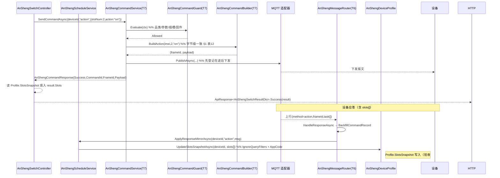
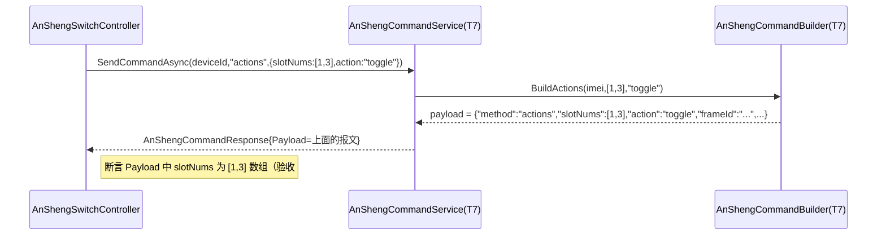
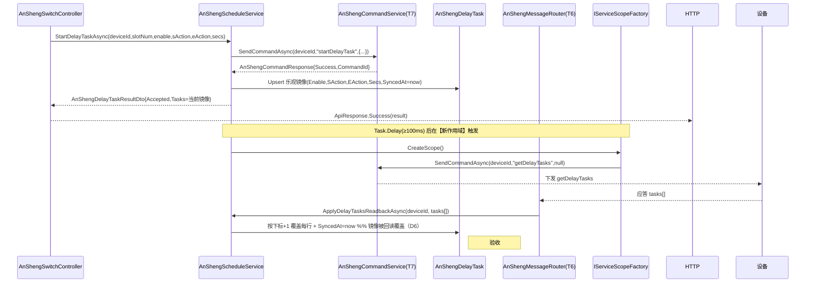
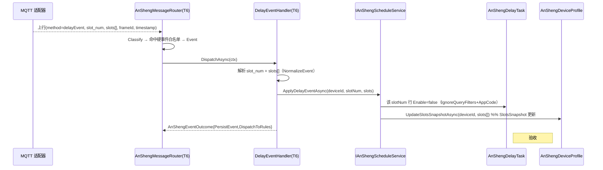
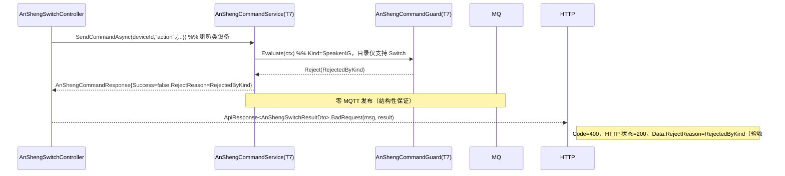
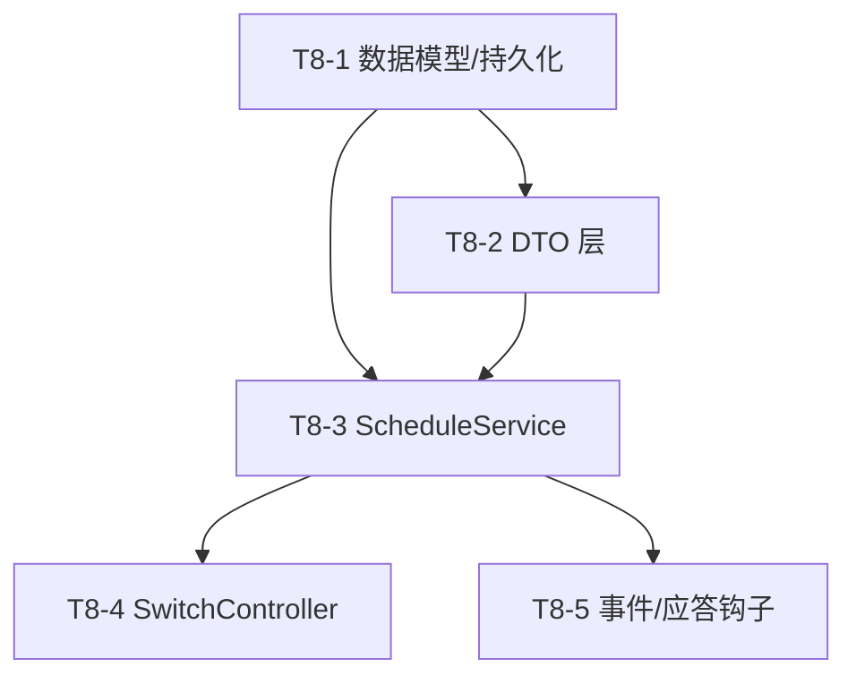

# T8 开关动作与延时任务（后端）— 增量设计文档

> 产品线：IoTPlatform · 安圣（AnSheng）设备开放平台重构线
> 前置阶段：T1–T7 已交付（T7 = 命令下发重构，T6 = 事件管道，T5 = 能力档案）
> 本文档范围：**仅后端**。前端（T9）与定时任务（T10）不在本任务内。
> 语言：简体中文。所有契约以主设计文档 `ansheng-open-redesign.md` 为唯一事实源。

---

## 0. 任务边界与验收标准（回顾）

### 0.1 范围

| 实现项 | 说明 | 是否本任务 |
|---|---|:--:|
| `action` / `actions` 单/多插槽开关动作 | 复用 `AnShengCommandBuilder` | ✅ |
| `getDelayTasks` / `startDelayTask` / `stopDelayTask` | 延时任务下发 + 镜像 | ✅ |
| 延时任务镜像（每设备每插槽一行） | `AnShengDelayTask` | ✅ |
| 写后回读（间隔 ≥100ms） | start/stop 成功后自动 get | ✅ |
| `delayEvent` 更新镜像 | 对接 T6 `DelayEventHandler` | ✅ |
| `Profile.SlotsSnapshot` 插槽快照落点 | action/delayEvent 应答写回 | ✅ |
| 定时任务 `timeEvent` / `timeTask` | **留待 T10** | ❌ |
| 前端 SwitchControlPanel | **留待 T9** | ❌ |

### 0.2 验收标准（5 条，必须可测）

1. `POST /api/v1/ansheng/{id}/action {slotNum:2, action:"on"}` → 设备实收报文与 `ansheng-open-redesign.md` §1 表 12 字节级一致；设备应答 `slots[]` 写入 `Profile.SlotsSnapshot`。
2. `POST /api/v1/ansheng/{id}/actions {slotNums:[1,3], action:"toggle"}` → 正确构造 `{"method":"actions","slotNums":[1,3],"action":"toggle",...}` 数组报文。
3. `startDelayTask` 成功后自动触发一次 `getDelayTasks`，镜像 `SyncedAt` 更新。
4. 注入 `delayEvent` → 对应插槽镜像 `Enable=false`，`Profile.SlotsSnapshot` 按报文 `slots[]` 更新。
5. 喇叭类设备（`Speaker4G` / `SpeakerWiFi`）调用任一端点 → 返回 **`ApiResponse.Code=400` + `Data.RejectReason=RejectedByKind`**（HTTP 状态仍为 200，遵循 T7 拒收信封约定，详见决策 D-D）。

---

## 1. 实现方案 + 框架选型

### 1.1 技术栈（沿用既有，不引入新框架）

| 维度 | 选型 | 说明 |
|---|---|---|
| 语言/运行时 | .NET 8 / ASP.NET Core Web API | 与 T7 一致 |
| ORM | EF Core 8 + MySQL 5.7.26 | 禁原生 ENUM / CHECK / 函数索引；枚举走 `HasConversion<int>()` |
| 命令构造 | 复用 `AnShengCommandBuilder`（T7） | 字节级一致，不新增方法（D-A） |
| 单点校验 | 复用 `AnShengCommandGuard`（T7） | `RejectedByKind` 满足验收 #5 |
| 命令编排 | 复用 `AnShengCommandService.SendCommandAsync`（T7） | 落 `AnShengCommandRecord` + 在途登记复用（D-E） |
| 事件管道 | 扩展 `DelayEventHandler` + `AnShengMessageRouter` 响应钩子（T6） | 镜像写回（D-C / D-H） |
| 后台作用域 | `IServiceScopeFactory.CreateScope()` + `Task.Delay(≥100ms)` | 写后回读（D-F） |

### 1.2 核心难点与对策

| 难点 | 对策 |
|---|---|
| 报文必须与 §1 表 12 字节级一致 | 直接复用 `AnShengCommandBuilder.BuildAction/BuildActions/BuildStartDelayTask/BuildStopDelayTask/BuildGetDelayTasks`，这些方法的输出已被 T7 实现并约定为唯一事实源（D-A） |
| 写后回读不能阻塞 HTTP 响应，且进程重启后延时任务状态须可重建 | start/stop 立即返回「乐观镜像」，`Task.Delay(≥100ms)` 后在**新作用域**触发 `getDelayTasks`；其应答经 `AnShengMessageRouter` 响应钩子覆盖镜像（D-B / D-F） |
| 平台镜像与设备真实态可能不一致 | 采用 D6 Option A「设备权威 + 平台只读镜像 + 显式同步」；镜像带 `SyncedAt`，超 24h 标 `IsStale`（D-B） |
| 上行链路在后台作用域运行，全局租户过滤器使普通查询落空 | 所有从 router / handler / delayed 发起的写，必须 `IgnoreQueryFilters()` + 显式 `(AppCode, DeviceId/Imei)` 定位（共享知识 §6.1） |
| 喇叭类设备必须被拒且不发 MQTT | 五个端点统一经 `SendCommandAsync` → `Guard.CheckKind` 返回 `RejectedByKind`；零发布由 T7 结构性保证 |

### 1.3 架构模式

- **CQRS-lite 分层**：Controller（HTTP 边界）→ `AnShengScheduleService`（业务编排 + 镜像）→ `AnShengCommandService`（命令下发，复用）→ `AnShengCommandBuilder`（报文）。
- **设备权威镜像（Device-as-Source-of-Truth）**：平台只存快照，任何 set 后立即 get 回读覆盖（D6）。
- **事件驱动刷新**：`delayEvent` 就地更新镜像，不额外发命令（D6）。

---

## 2. 文件列表及相对路径

> 相对路径以仓库根 `H:/IoTPlatform/` 为基准。🆕=新建，✏️=修改。

| # | 文件 | 类型 | 说明 |
|---|---|---|---|
| 1 | `Models/AnShengDelayTask.cs` | 🆕 | 延时任务镜像模型（每设备每插槽一行） |
| 2 | `Models/AnShengDeviceProfile.cs` | ✏️ | 增加 `SlotsSnapshot` / `SlotsSnapshotAt` 两个字段 |
| 3 | `Services/Interfaces/IAnShengScheduleService.cs` | 🆕 | 调度服务接口（本任务仅延时部分，定时部分留 TODO 桩） |
| 4 | `Services/AnShengScheduleService.cs` | 🆕 | 延时任务镜像读写 + 写后回读 + slots 快照写回（仅延时部分） |
| 5 | `Services/AnShengEventHandlers/DelayEventHandler.cs` | ✏️ | 扩展：解析 `slot_num`+`slots[]` → 调 `IAnShengScheduleService.ApplyDelayEventAsync` |
| 6 | `Controllers/AnShengSwitchController.cs` | 🆕 | 5 个端点：action / actions / getDelayTasks / startDelayTask / stopDelayTask |
| 7 | `DTOs/Requests/AnShengRequests.cs` | ✏️ | 新增 4 个请求 DTO（Action / Actions / StartDelayTask / StopDelayTask） |
| 8 | `DTOs/Responses/AnShengResponses.cs` | ✏️ | 新增响应 DTO（SwitchResult / DelayTask / DelayTaskResult）+ 扩展 `AnShengDeviceProfileDto` |
| 9 | `Data/AppDbContext.cs` | ✏️ | 增加 `AnShengDelayTasks` DbSet + `ConfigureAnShengDelayTasks` + Profile 的 `SlotsSnapshot` 配置 |
| 10 | `Migrations/<时间戳>_T8DelayTask.cs` + `.Designer.cs` | 🆕 | 由 `dotnet ef migrations add T8DelayTask` 生成（勿手改） |
| 11 | `Migrations/AppDbContextModelSnapshot.cs` | ✏️ | 迁移自动更新 |
| 12 | `Infrastructure/Protocol/AnSheng/AnShengMessageRouter.cs` | ✏️ | `HandleResponseAsync` 增加镜像写回钩子（action/actions/getDelayTasks/getDevStatus 应答含 slots[]/tasks[] 时） |
| 13 | `Program.cs` | ✏️ | 注册 `IAnShengScheduleService`（Scoped） |

---

## 3. 数据结构与接口（Mermaid 类图）

```mermaid
classDiagram
    class AnShengSwitchController {
        +Action(deviceId, req) ApiResponse~AnShengSwitchResultDto~
        +Actions(deviceId, req) ApiResponse~AnShengSwitchResultDto~
        +GetDelayTasks(deviceId) ApiResponse~List~AnShengDelayTaskDto~~
        +StartDelayTask(deviceId, req) ApiResponse~AnShengDelayTaskResultDto~
        +StopDelayTask(deviceId, slotNum) ApiResponse~AnShengDelayTaskResultDto~
    }

    class IAnShengScheduleService {
        <<interface>>
        +StartDelayTaskAsync(deviceId, slotNum, enable, sAction, eAction, secs, ct) Task
        +StopDelayTaskAsync(deviceId, slotNum, ct) Task
        +GetDelayTasksAsync(deviceId, ct) Task~List~AnShengDelayTaskDto~~
        +ApplyDelayTasksReadbackAsync(deviceId, tasks, ct) Task
        +ApplyDelayEventAsync(deviceId, slotNum, slots, ct) Task
        +UpdateSlotsSnapshotAsync(deviceId, slots, ct) Task
    }

    class AnShengScheduleService {
        -IAnShengCommandService _cmd
        -IServiceScopeFactory _scopeFactory
        -TimeProvider _time
        +StartDelayTaskAsync(...) Task
        +StopDelayTaskAsync(...) Task
        +GetDelayTasksAsync(...) Task
        +ApplyDelayTasksReadbackAsync(...) Task
        +ApplyDelayEventAsync(...) Task
        +UpdateSlotsSnapshotAsync(...) Task
        -ScheduleReadback(deviceId) Task
    }

    class AnShengDelayTask {
        +long Id
        +string AppCode
        +long DeviceId
        +int SlotNum
        +bool Enable
        +string SAction
        +string EAction
        +int Secs
        +int Cnt
        +DateTime SyncedAt
    }

    class AnShengDeviceProfile {
        <<T5 已有，本任务扩展>>
        +string SlotsSnapshot
        +DateTime SlotsSnapshotAt
    }

    class DelayEventHandler {
        -IAnShengScheduleService _schedule
        +Method : string = "delayEvent"
        +OnHandleAsync(ctx, ct) Task~AnShengEventOutcome~
    }

    class AnShengMessageRouter {
        -IAnShengScheduleService _schedule
        +HandleResponseAsync(ctx, result, ct) Task
    }

    class AnShengSwitchResultDto {
        +bool Accepted
        +string CommandId
        +string FrameId
        +AnShengCommandRejectReason RejectReason
        +string ErrorMessage
        +int[] Slots
    }

    class AnShengDelayTaskDto {
        +int SlotNum
        +bool Enable
        +string SAction
        +string EAction
        +int Secs
        +int Cnt
        +DateTime SyncedAt
        +bool IsStale
    }

    class AnShengDelayTaskResultDto {
        +bool Accepted
        +string CommandId
        +string FrameId
        +AnShengCommandRejectReason RejectReason
        +string ErrorMessage
        +List~AnShengDelayTaskDto~ Tasks
    }

    AnShengSwitchController --> IAnShengScheduleService : "读/写镜像"
    AnShengSwitchController --> IAnShengCommandService : "下发(复用T7)"
    AnShengScheduleService ..|> IAnShengScheduleService
    AnShengScheduleService --> IAnShengCommandService : "写后回读getDelayTasks"
    AnShengScheduleService --> AnShengDelayTask : "镜像读写"
    AnShengScheduleService --> AnShengDeviceProfile : "写SlotsSnapshot"
    DelayEventHandler --> IAnShengScheduleService : "ApplyDelayEventAsync"
    AnShengMessageRouter --> IAnShengScheduleService : "ApplyResponseMirrorAsync"
    AnShengDelayTaskDto .. AnShengDelayTask : "映射"
    AnShengSwitchResultDto .. AnShengCommandResponse : "包裹"
    AnShengDelayTaskResultDto .. AnShengCommandResponse : "包裹"
```



### 3.1 关键模型定义（C# 伪代码，对齐 §5.2 / §5.3）

```csharp
// Models/AnShengDelayTask.cs  （🆕 镜像，每设备每插槽一行）
[Table("ansheng_delay_tasks")]
public class AnShengDelayTask : IHasAppCode
{
    public long Id { get; set; }
    public string AppCode { get; set; } = string.Empty;
    public long DeviceId { get; set; }
    public int SlotNum { get; set; }            // = tasks[] 下标 + 1
    public bool Enable { get; set; }
    public string SAction { get; set; } = "none"; // on/off/toggle/none
    public string EAction { get; set; } = "off";  // on/off/toggle
    public int Secs { get; set; }
    public int Cnt { get; set; }                  // 快照值，非实时
    public DateTime SyncedAt { get; set; }        // 陈旧判定用
}

// Models/AnShengDeviceProfile.cs  （✏️ 在 T5 模型上新增两列）
// —— 仅新增以下两个属性，其余字段保持 T5 现状 ——
/// <summary>最近一次 slots 的 JSON 快照（int[]，0=关 1=开）。</summary>
public string? SlotsSnapshot { get; set; }

/// <summary>SlotsSnapshot 写入时间（UTC）。</summary>
public DateTime? SlotsSnapshotAt { get; set; }
```

> `AnShengDelayTask.SAction/EAction` 存储为 `varchar`（字符串），**不引入新持久化枚举**（决策 D-G）。

### 3.2 接口定义（C#）

```csharp
// Services/Interfaces/IAnShengScheduleService.cs
public interface IAnShengScheduleService
{
    // 延时任务（本任务实现）
    Task<AnShengDelayTaskResultDto> StartDelayTaskAsync(
        long deviceId, int slotNum, bool enable,
        string sAction, string eAction, int secs, CancellationToken ct = default);
    Task<AnShengDelayTaskResultDto> StopDelayTaskAsync(
        long deviceId, int slotNum, CancellationToken ct = default);
    Task<List<AnShengDelayTaskDto>> GetDelayTasksAsync(
        long deviceId, CancellationToken ct = default);

    // 镜像写回（由上行链路调用）
    Task ApplyDelayTasksReadbackAsync(long deviceId, IReadOnlyList<AnShengDelayTaskItem> tasks, CancellationToken ct = default);
    Task ApplyDelayEventAsync(long deviceId, int slotNum, IReadOnlyList<int>? slots, CancellationToken ct = default);
    Task UpdateSlotsSnapshotAsync(long deviceId, IReadOnlyList<int> slots, CancellationToken ct = default);

    // 定时任务（T10 实现，本任务仅留签名桩，避免后续破坏接口稳定）
    // Task<...> StartTimeTaskAsync(...);
    // Task<...> SetSlotTimeTasksAsync(...);
}
```

### 3.3 DTO 定义（对齐 §5.4）

```csharp
// DTOs/Requests/AnShengRequests.cs  —— 新增
public class AnShengActionRequest {
    public int SlotNum { get; set; }                 // 0=全部插槽
    public string Action { get; set; } = "on";       // on/off/toggle
    public bool? HasStopDelayTask { get; set; }
}
public class AnShengActionsRequest {
    public int[] SlotNums { get; set; } = Array.Empty<int>(); // 1 起，非空
    public string Action { get; set; } = "on";
    public bool? HasStopDelayTask { get; set; }
}
public class AnShengStartDelayTaskRequest {
    public int SlotNum { get; set; }
    public bool Enable { get; set; }
    public string SAction { get; set; } = "on";      // on/off/toggle/none
    public string EAction { get; set; } = "off";     // on/off/toggle
    public int Secs { get; set; }                     // >0
}
public class AnShengStopDelayTaskRequest {
    public int SlotNum { get; set; }
}

// DTOs/Responses/AnShengResponses.cs  —— 新增 / 扩展
public class AnShengSwitchResultDto {
    public bool Accepted { get; set; }
    public string? CommandId { get; set; }
    public string? FrameId { get; set; }
    public AnShengCommandRejectReason? RejectReason { get; set; } // 机器可读，验收 #5 断言点
    public string? ErrorMessage { get; set; }
    public int[]? Slots { get; set; }                // 来自 Profile.SlotsSnapshot（可能 null）
}
public class AnShengDelayTaskDto {
    public int SlotNum { get; set; }
    public bool Enable { get; set; }
    public string SAction { get; set; } = "none";
    public string EAction { get; set; } = "off";
    public int Secs { get; set; }
    public int Cnt { get; set; }
    public DateTime SyncedAt { get; set; }
    public bool IsStale { get; set; }                // SyncedAt 超 24h
}
public class AnShengDelayTaskResultDto {
    public bool Accepted { get; set; }
    public string? CommandId { get; set; }
    public string? FrameId { get; set; }
    public AnShengCommandRejectReason? RejectReason { get; set; }
    public string? ErrorMessage { get; set; }
    public List<AnShengDelayTaskDto>? Tasks { get; set; } // 乐观镜像快照（立即返回）
}
// 扩展既有 AnShengDeviceProfileDto：新增 SlotsSnapshot(int[]?) / SlotsSnapshotAt(DateTime?)
```

---

## 4. 程序调用流程（Mermaid 时序图）

### 4.1 验收 #1 / #2 — `action` / `actions` 下发往返



### 4.2 验收 #2 — `actions` 数组构造（验证点）



### 4.3 验收 #3 — `startDelayTask` 写后回读



### 4.4 验收 #4 — `delayEvent` 更新镜像



### 4.5 验收 #5 — 喇叭类拒绝（零发布 + 信封）



---

## 5. 有序任务列表（含依赖关系、按实现顺序）

> 依赖关系：T8-1（数据层）→ T8-2（DTO）→ T8-3（服务）→ T8-4（控制器）/ T8-5（事件与应答钩子）。
> T8-4 与 T8-5 互不依赖，可并行；二者均依赖 T8-3。

| ID | 任务 | 涉及文件（§2 编号） | 依赖 | 优先级 |
|---|---|---|---|:--:|
| **T8-1** | 数据模型与持久化层 | 1, 2, 9, 10, 11 | — | P0 |
| **T8-2** | DTO 层（请求 + 响应） | 7, 8 | T8-1 | P0 |
| **T8-3** | `AnShengScheduleService`：镜像读写 + 写后回读 | 3, 4, 13 | T8-1, T8-2 | P0 |
| **T8-4** | `AnShengSwitchController`：5 个端点 | 6 | T8-3 | P1 |
| **T8-5** | 事件与应答镜像写回（对接 T6） | 5, 12 | T8-3 | P1 |

### 5.1 任务依赖图



---

## 6. 依赖包列表

本任务**不引入新的 NuGet 包**，完全复用 T7/T6 既有依赖：

```
- Microsoft.EntityFrameworkCore 8.x            （已有，迁移用）
- Microsoft.EntityFrameworkCore.Design 8.x     （已有，dotnet ef 工具）
- Pomelo.EntityFrameworkCore.MySql 8.x         （已有，MySQL 提供器）
- System.Text.Json                             （已有，JSON 序列化）
- Microsoft.Extensions.DependencyInjection     （已有，IServiceScopeFactory）
```

> 写后回读所需的 `Task.Delay` / `IServiceScopeFactory` / `TimeProvider`（.NET 8 内置）均无需额外包。

---

## 7. 共享知识 / 跨文件约定

### 7.1 租户过滤器陷阱（★最高频踩坑）

上行链路（`AnShengMessageRouter`、`DelayEventHandler`、写后回读的延时作用域）运行在 `AnShengUplinkPipeline` 用 `IServiceScopeFactory.CreateScope()` 造出的**后台作用域**里，没有 HTTP 上下文 ⇒ `ITenantContextAccessor.Current` 为 null ⇒ `AppDbContext` 全局查询过滤器会把所有行滤掉。

**约定**：所有从下列路径发起的镜像写，**必须** `IgnoreQueryFilters()` + 用 `(AppCode, DeviceId)` 或 `(AppCode, Imei)` 显式定位（主键定位最安全）：
- `DelayEventHandler.ApplyDelayEventAsync`
- `AnShengMessageRouter` 响应钩子 `ApplyResponseMirrorAsync`
- `AnShengScheduleService.ScheduleReadback`（延时作用域）

而 `AnShengSwitchController`（HTTP 作用域）发起的读写走正常租户过滤器即可。

### 7.2 拒收信封约定（★与 T7 一致）

业务失败**不改变 HTTP 状态码**（恒为 200），靠 `ApiResponse.Code` 表达。`AnShengCommandRejectionEnvelopeTests` 已锁定此行为——**禁止**返回裸 `BadRequest()` / `StatusCode(400)`。
- 统一写法：`return ApiResponse<T>.BadRequest(result.ErrorMessage ?? "...", result);` 其中 `result` 携带 `RejectReason`。
- 验收 #5 的「400」指 `ApiResponse.Code=400` + `Data.RejectReason=RejectedByKind`，**不是** HTTP 400。

### 7.3 命令下发唯一入口

T8 所有下行命令（action/actions/getDelayTasks/startDelayTask/stopDelayTask）**必须**经 `AnShengCommandService.SendCommandAsync(deviceId, method, parameters)`，不得绕过 `Guard` 直连适配器。这保证：
- 品类/参数/插槽/固件校验统一（验收 #5）；
- `AnShengCommandRecord` 落库 + 在途登记 + TTL/清扫语义复用（D-E）。

### 7.4 写后回读间隔

start/stop 成功后触发 getDelayTasks 的延迟 **≥100ms**（满足 R3 节流），用 `Task.Delay(ReadbackDelayMs)`（`ReadbackDelayMs = 120` 留余量）。回读命令在**新作用域**内下发，避免原 HTTP 作用域释放后 `DbContext` 已 Dispose。

### 7.5 镜像陈旧阈值

`AnShengDelayTaskDto.IsStale = (UtcNow - SyncedAt) > 24h`。阈值建议抽成 `AnShengCommandOptions.StaleThreshold`（默认 24h），便于调参。

### 7.6 枚举存储范式（既有）

- 持久化枚举（`AnShengDeviceKind` / `KindSource` / `ProbeStatus` / `CommandStatus` / `RejectReason`）一律 `int` 落库：`entity.Property(e => e.X).HasConversion<int>()`。
- 出网序列化靠全局注册的 `JsonStringEnumConverter`（`Program.cs:264`），**不要**在单个属性上再加 `[JsonConverter]`。
- **只能追加不能重排**枚举值（MySQL 5.7.26 禁 ENUM 类型，但重排 int 值会破坏既有数据语义）。

### 7.7 slots 数组下标约定

`slots[]` / `tasks[]` 均「按插槽 1..n 顺序」，数组下标 `i` 对应 `SlotNum = i + 1`（§A.3）。`tasks[]` 响应**不含** `slotNum` 字段，必须按下标推。

---

## 8. 待明确事项（UNCLEAR）

1. **写后回读在分布式多实例下的幂等**：单实例下 `Task.Delay` 触发 getDelayTasks 唯一；多实例部署时可能重复触发，但回读为覆盖写，幂等可接受。若未来要求严格单次，需引入分布式锁（如基于 `IAnShengPendingCommandStore` 的 Redis 实现）——本任务不做，列为后续增强。
2. **`action` 端点 `Slots` 字段的即时性**：HTTP 响应返回时设备应答可能尚未到达，`result.Slots` 读的是**当前** `Profile.SlotsSnapshot`（可能为 null / 陈旧）。验收 #1 的「应答 slots 写入快照」由异步响应钩子完成，测试需等待设备应答后断言。是否要在端点层同步等待应答（阻塞）？**裁定：不阻塞**，遵循设备权威 + 异步刷新模型。
3. **`hasStopDelayTask` 是否触发读回**：action/actions 带 `hasStopDelayTask=true` 时，设备会顺带停延时任务。本任务**不**为其额外触发 getDelayTasks（避免与 start/stop 的读回逻辑耦合）；其镜像最终由后续 `delayEvent` / 下一次 getDelayTasks 校正。若产品要求 action 后立即刷新，列为可选增强。
4. **`getDelayTasks` GET 端点的「手动从设备同步」**：D6 提到前端「手动同步」按钮。本任务 GET 端点返回**平台镜像**（乐观/已读回），不每次实时查设备。如需「强制实时」，可加 `?force=true` 触发一次 getDelayTasks 并等待——本任务不做，前端按钮逻辑留 T9。
5. **`AnShengDelayTask` 是否需要 `RowVersion` 乐观并发**：D6 提到乐观并发，但 T8 仅延时部分且写回读为覆盖写，冲突概率低。**裁定：本任务不加 RowVersion**（简化为覆盖写）；若 T10 定时任务需要整表覆盖二次确认，再统一评估。
6. **迁移生成环境**：需确认本地能连到测试库以生成 `T8DelayTask` 迁移；若 CI 禁止迁移，改为提供 SQL 脚本。

---

## 9. 决策记录（D1–Dn）

> 其中 D-A~D-G 为任务指派点名裁定，D-H 为本任务补充裁定。

### D-A 命令构造方法：直接复用，不新增
**裁定**：复用 `AnShengCommandBuilder` 既有的 `BuildAction` / `BuildActions` / `BuildStartDelayTask` / `BuildStopDelayTask` / `BuildGetDelayTasks`。这些方法的输出已被 T7 实现，且与 §1 表 12、附录 A.1 字节级一致（平铺参数、`frameId` 16 位、4G 注入秒级 `timestamp`、压缩 JSON）。**T8 不新增任何 Builder 方法**，避免口径分裂。

### D-B 镜像模型 + 写后回读触发点
**裁定**：采用 D6 Option A「设备权威 + 平台只读镜像」。
- 镜像模型：`AnShengDelayTask`，**每设备每插槽一行**，`UQ(DeviceId, SlotNum)`，`SlotNum = tasks[] 下标 + 1`。
- 写后回读：任何 `startDelayTask` / `stopDelayTask` 成功后，经 `IServiceScopeFactory` + `Task.Delay(≥100ms)` 自动追加一次 `getDelayTasks`；其应答 `tasks[]` 由 `AnShengMessageRouter` 响应钩子 `ApplyDelayTasksReadbackAsync` 覆盖镜像并 bump `SyncedAt`。
- `Profile.SlotsSnapshot`（slots[]）由 action/actions/delayEvent/getDelayTasks/getDevStatus 应答写回，落点即 `AnShengDeviceProfile.SlotsSnapshot` / `SlotsSnapshotAt`（验收 #1 / #4 落点）。

### D-C `delayEvent` 镜像更新位置：扩展既有 Handler
**裁定**：**扩展既有 `DelayEventHandler`**（不新增 Handler）。在其 `OnHandleAsync` 中解析 `slot_num` + `slots[]`（复用 `NormalizeEvent`），调 `IAnShengScheduleService.ApplyDelayEventAsync(deviceId, slotNum, slots)`：
1. 将该 `slotNum` 的 `AnShengDelayTask.Enable = false`；
2. 刷新 `Profile.SlotsSnapshot`。
沿用 T6 双出口（出口①落 `AnShengDeviceEvent` 表、出口②投规则引擎），仅替换原 `TODO(W6/T9)` 锚点。

### D-D 单点校验 / 喇叭拒绝：复用 Guard + 信封
**裁定**：T8 五个端点统一经 `AnShengCommandService.SendCommandAsync` 下发，复用 T7 `AnShengCommandGuard` 单点闸门。喇叭类（`Speaker4G`/`SpeakerWiFi`）因 `action`/`actions`/`getDelayTasks`/`startDelayTask`/`stopDelayTask` 在 `AnShengCommandCatalog` 中仅 `IsSupportedBy(Switch*)`，故 `CheckKind` 返回 `RejectedByKind`，**零 MQTT 发布由 T7 结构性保证**。
控制器映射：返回 `ApiResponse<T>.BadRequest(message, result)`，其中 `result.RejectReason = RejectedByKind`。即 **`ApiResponse.Code=400` 且 HTTP 状态=200**（遵循 `AnShengCommandRejectionEnvelopeTests` 锁定的拒收信封），满足验收 #5。**不返回裸 HTTP 400**。

### D-E 命令记录 / 在途复用
**裁定**：`startDelayTask` / `stopDelayTask` / `getDelayTasks` 均经 `SendCommandAsync` 自然落 `AnShengCommandRecord`（Pending→Sent/...），并复用 `IAnShengPendingCommandStore` 的「先登记在途、后下发」、TTL 与超时清扫语义。T8 **不重复实现**命令生命周期，仅在 Success 后编排镜像读写。

### D-F 单实例内存实现足够
**裁定**：写后回读用进程内 `Task.Delay` + `IServiceScopeFactory` 即满足（单实例部署）。`TimeProvider` 可选（T7 遗留 U 系列），不强制引入。分布式多实例下的幂等性见 §8.1，列为后续增强，不影响本任务验收。

### D-G 枚举范式
**裁定**：T8 **不引入新的持久化枚举**。`AnShengDelayTask.SAction` / `EAction` 存为 `varchar` 字符串；动作取值（`on`/`off`/`toggle`/`none`）仅作**请求层校验常量**。若后续确需枚举，遵循既有范式：`HasConversion<int>()` 落库 + 全局 `JsonStringEnumConverter` 出网，且**只能追加不能重排**。

### D-H `Profile.SlotsSnapshot` 写回触发点（补充裁定）
**裁定**：`SlotsSnapshot` 的权威写入来自设备应答（设备权威 D6），触发点两处：
1. **`DelayEventHandler`**（验收 #4）：delayEvent 报文携带 `slots[]` → `ApplyDelayEventAsync`。
2. **`AnShengMessageRouter.HandleResponseAsync`**（验收 #1 / 读回）：在 `BackfillCommandRecordAsync` 之后新增钩子 `ApplyResponseMirrorAsync(deviceId, method, message)`：当 `method ∈ {action, actions, getDelayTasks, getDevStatus}` 且应答含 `slots[]` / `tasks[]` 时，调 `AnShengScheduleService` 更新 `SlotsSnapshot` / 镜像。
所有从后台作用域发起的写，必须遵守 §7.1（`IgnoreQueryFilters` + 显式 AppCode 定位）。

---

## 10. 与 T7 / T6 接口衔接说明

### 10.1 复用 T7（命令下发重构）— 不修改

| T7 资产 | 在 T8 中的用法 |
|---|---|
| `AnShengCommandService.SendCommandAsync(deviceId, method, parameters, ct, commandId)` | T8 全部下行的唯一入口（D-D / D-E） |
| `AnShengCommandBuilder.BuildAction / BuildActions / BuildStartDelayTask / BuildStopDelayTask / BuildGetDelayTasks` | 字节级报文构造（D-A） |
| `AnShengCommandGuard`（`CheckKind`→`RejectedByKind`） | 喇叭类拒绝（验收 #5） |
| `AnShengCommandRecord` 落库 + `IAnShengPendingCommandStore`（TTL/清扫） | start/stop/get 复用（D-E） |
| `ApiResponse<T>.BadRequest(message, data)` 拒收信封 | 控制器返回形状（D-D） |

### 10.2 扩展 T6（事件管道）— 修改两处

| T6 资产 | T8 改动 |
|---|---|
| `DelayEventHandler`（`TODO(W6/T9)` 锚点） | 替换为调 `IAnShengScheduleService.ApplyDelayEventAsync`（D-C） |
| `AnShengMessageRouter.HandleResponseAsync` | `BackfillCommandRecordAsync` 之后新增 `ApplyResponseMirrorAsync` 钩子（D-H） |
| `AnShengEventHandlerBase` 双出口 | 不变；`DelayEventHandler` 沿用 |
| `AnShengEventDispatcher` 责任链 | 不变；`DelayEventHandler` 已在 T6 注册为 `IAnShengEventHandler` |

### 10.3 扩展 T5（能力档案）— 修改一处

| T5 资产 | T8 改动 |
|---|---|
| `AnShengDeviceProfile`（`IHasAppCode`） | 新增 `SlotsSnapshot` / `SlotsSnapshotAt` 两列（落点） |
| `AnShengDeviceProfileDto` | 新增 `Slots` / `SlotsSnapshotAt` 字段 |
| `IAnShengDeviceProfileService` | 不变（镜像写走 `AnShengScheduleService` 直接操作 `db`，遵循 §7.1） |

### 10.4 与 T10（定时任务）的接口预留

`IAnShengScheduleService` 本任务仅实现延时部分；`StartTimeTaskAsync` / `SetSlotTimeTasksAsync` 等定时方法**仅留签名桩**，待 T10 实现，避免破坏接口稳定。`AnShengTimeTask` 模型与 `TimeEventHandler` 不在本任务创建。

---

## 11. 给工程师的独立任务清单（按文件 + 依赖 + 验收自检点）

> 以下为可直接排期的子任务。每个子任务标注：对应文件、依赖前置、验收自检点（完成后逐项核对）。

### 子任务 1 — 数据模型与迁移（对应 T8-1）
- **对应文件**：`Models/AnShengDelayTask.cs`（🆕）、`Models/AnShengDeviceProfile.cs`（✏️ +2 属性）、`Data/AppDbContext.cs`（✏️ +`DbSet<AnShengDelayTask>` + `ConfigureAnShengDelayTasks` + Profile 的 `SlotsSnapshot` 配置）、`Migrations/..._T8DelayTask.cs`（🆕 生成）
- **依赖前置**：无
- **验收自检点**：
  - [ ] `AnShengDelayTask` 配置 `UQ(DeviceId, SlotNum)`，`SlotNum` 下标从 1 起；
  - [ ] `AnShengDeviceProfile` 编译通过且 `SlotsSnapshot(varchar)` / `SlotsSnapshotAt(datetime)` 两列存在；
  - [ ] `dotnet ef migrations add T8DelayTask` 生成成功，SQL 不含 ENUM/CHECK/函数索引；
  - [ ] `Update-Database`（或 CI 迁移）后表 `ansheng_delay_tasks` 与 `ansheng_device_profiles` 新列就绪。

### 子任务 2 — DTO 层（对应 T8-2）
- **对应文件**：`DTOs/Requests/AnShengRequests.cs`（✏️ +4 请求 DTO）、`DTOs/Responses/AnShengResponses.cs`（✏️ +`AnShengSwitchResultDto` / `AnShengDelayTaskDto` / `AnShengDelayTaskResultDto`，扩展 `AnShengDeviceProfileDto`）
- **依赖前置**：子任务 1
- **验收自检点**：
  - [ ] 4 个请求 DTO 字段与 §5.4 完全一致（`SlotNum`/`Action`/`HasStopDelayTask` 等）；
  - [ ] `AnShengDelayTaskDto` 含 `IsStale`；`AnShengSwitchResultDto` 含 `RejectReason`（`AnShengCommandRejectReason?`）；
  - [ ] `AnShengDeviceProfileDto` 新增 `Slots`(int[]?) / `SlotsSnapshotAt`(DateTime?)；
  - [ ] 全局 `JsonStringEnumConverter` 已使 `RejectReason` 以字符串出网（无需额外 `[JsonConverter]`）。

### 子任务 3 — `AnShengScheduleService`（对应 T8-3）
- **对应文件**：`Services/Interfaces/IAnShengScheduleService.cs`（🆕）、`Services/AnShengScheduleService.cs`（🆕）、`Program.cs`（✏️ 注册 Scoped）
- **依赖前置**：子任务 1、2
- **验收自检点**：
  - [ ] `StartDelayTaskAsync` 调 `SendCommandAsync("startDelayTask",...)`；成功后在**新作用域** `Task.Delay(≥100ms)` 触发 `getDelayTasks`；
  - [ ] `ApplyDelayTasksReadbackAsync` 按 `tasks[]` 下标+1 覆盖 `AnShengDelayTask` 每行并 bump `SyncedAt`；
  - [ ] `StopDelayTaskAsync` 调 `SendCommandAsync("stopDelayTask",{slotNum})` + 同样写后回读；
  - [ ] `ApplyDelayEventAsync(deviceId, slotNum, slots)`：该 `slotNum` 行 `Enable=false` + `UpdateSlotsSnapshotAsync`；
  - [ ] 所有后台作用域写均 `IgnoreQueryFilters()` + 显式 `AppCode` 定位（§7.1）；
  - [ ] `GetDelayTasksAsync` 返回镜像并算 `IsStale`（>24h）；
  - [ ] `Program.cs` 注册 `IAnShengScheduleService`（Scoped），`DelayEventHandler` / `AnShengMessageRouter` 可注入。

### 子任务 4 — `AnShengSwitchController`（对应 T8-4）
- **对应文件**：`Controllers/AnShengSwitchController.cs`（🆕）
- **依赖前置**：子任务 3
- **验收自检点（对应 5 条验收）**：
  - [ ] 验收 #1：`POST {id}/action` 返回 `Payload` 与 §1 表 12 字节级一致；`result.Slots` 读自 `Profile.SlotsSnapshot`；
  - [ ] 验收 #2：`POST {id}/actions {slotNums:[1,3],action:"toggle"}` 的 `Payload` 中 `slotNums` 为 `[1,3]` 数组；
  - [ ] 验收 #3：`startDelayTask` 返回 `Accepted=true` 且随后 `getDelayTasks` 被触发、镜像 `SyncedAt` 更新（可注入设备应答验证）；
  - [ ] 验收 #5：喇叭类设备调任一端点 → `ApiResponse.Code=400` 且 `Data.RejectReason=RejectedByKind`，HTTP 状态=200，且**无 MQTT 发布**；
  - [ ] 路由不与 `AnShengController` 冲突（`action`/`actions`/`delay-tasks` 为字面量，与 `{deviceId}/command` 等不重叠）；
  - [ ] 权限：`SEND_DEVICE_COMMANDS`（下发）/`VIEW_DEVICES`（GET）。

### 子任务 5 — 事件与应答镜像写回（对应 T8-5）
- **对应文件**：`Services/AnShengEventHandlers/DelayEventHandler.cs`（✏️）、`Infrastructure/Protocol/AnSheng/AnShengMessageRouter.cs`（✏️ 新增 `ApplyResponseMirrorAsync` 钩子）
- **依赖前置**：子任务 3
- **验收自检点**：
  - [ ] 验收 #4：注入 `delayEvent`（带 `slot_num` + `slots[]`）→ 对应 `AnShengDelayTask.Enable=false`，`Profile.SlotsSnapshot` 按报文 `slots[]` 更新；
  - [ ] `DelayEventHandler` 仍沿用 T6 双出口（出口①落 `AnShengDeviceEvent`、出口②投规则引擎），仅替换原 `TODO(W6/T9)` 锚点；
  - [ ] `AnShengMessageRouter.HandleResponseAsync` 在 `BackfillCommandRecordAsync` 后调用 `ApplyResponseMirrorAsync(deviceId, method, msg)`：当 `method ∈ {action, actions, getDelayTasks, getDevStatus}` 且应答含 `slots[]`/`tasks[]` 时更新镜像/快照；
  - [ ] `DelayEventHandler` 与 `AnShengMessageRouter` 构造函数注入 `IAnShengScheduleService`（DI 解析成功，无循环依赖）；
  - [ ] 后台作用域写遵守 §7.1（`IgnoreQueryFilters` + 显式 AppCode 定位）；
  - [ ] `ApplyDelayTasksReadbackAsync` 由 getDelayTasks 应答触发，覆盖 `AnShengDelayTask` 并 bump `SyncedAt`（支撑验收 #3 的回读闭环）。

---

## 12. 设计自检清单（架构师交付前核对）

- [x] 5 条验收均有明确代码落点与触发路径（§4 时序图 + §11 子任务验收点）
- [x] 未引入新 NuGet 包（§6）
- [x] 未绕开 T7 `SendCommandAsync` 单点下发（D-D / D-E / §7.3）
- [x] 镜像采用设备权威 + 写后回读 + 陈旧标记（D-B / D6）
- [x] 喇叭类拒绝走 `RejectedByKind` + `ApiResponse.Code=400` 信封，非裸 HTTP 400（D-D / §7.2）
- [x] 后台作用域租户过滤器陷阱已写入共享知识（§7.1）并在 3 处写回路径标注
- [x] 定时任务（`timeEvent`/`timeTask`）明确排除，接口预留但不实现（§0.1 / §10.4 / D-G）
- [x] 决策记录 D-A~D-G 全部裁定，并补充 D-H（slots 写回触发点）

> **交付说明**：本文档为增量设计，**未编写任何生产代码、未执行 git commit**（遵循任务约束）。所有代码片段均为接口/模型定义级别的示意，供工程师实现时对齐契约。
