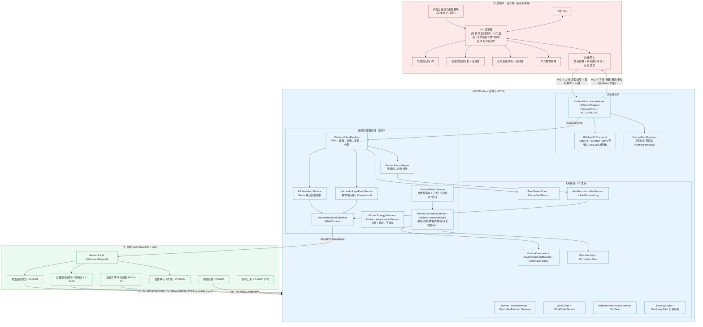
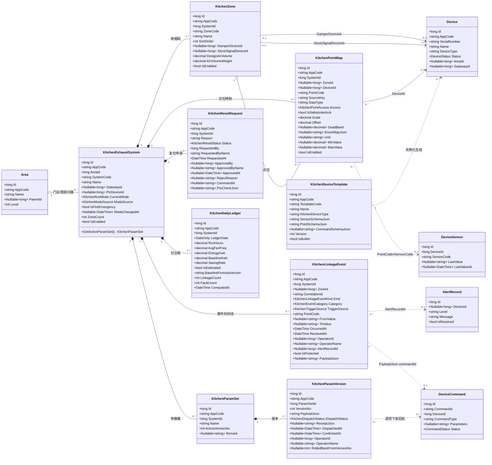
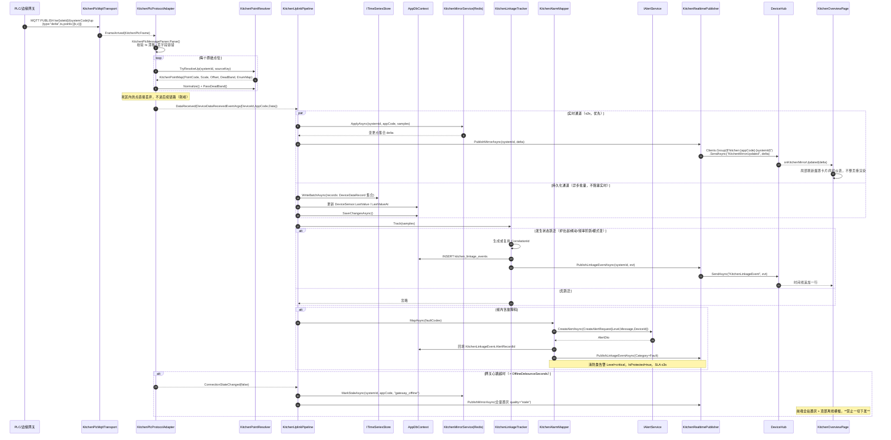
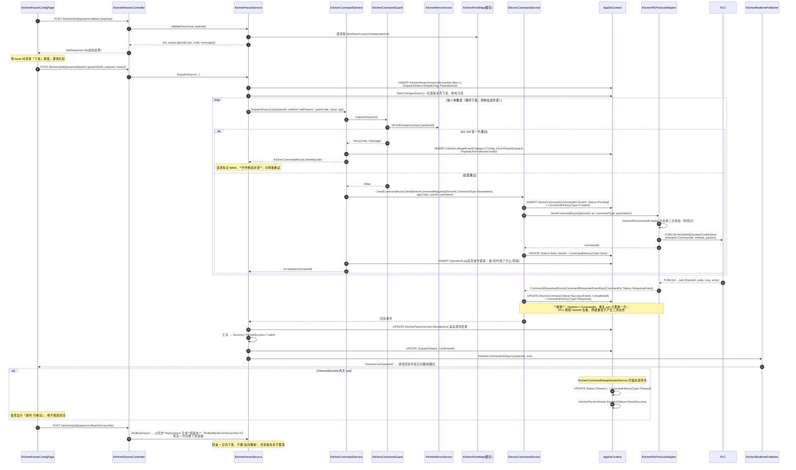
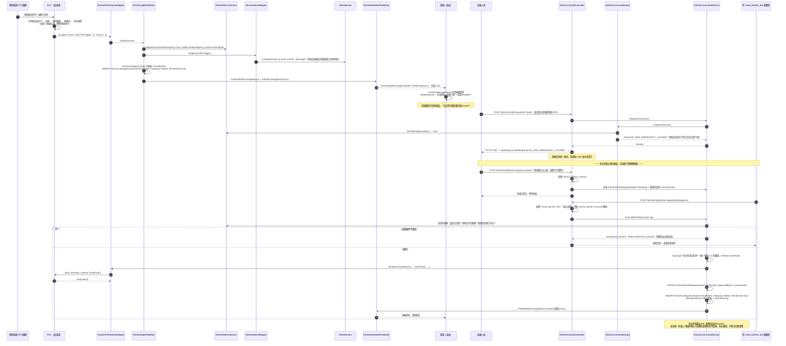
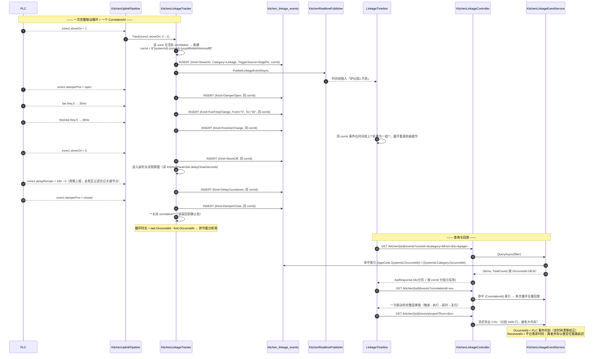
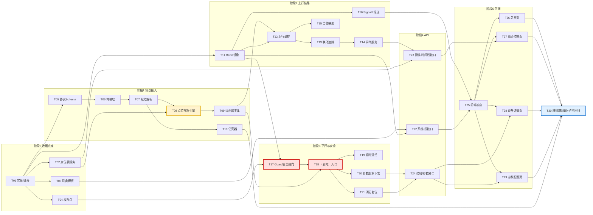

# 商用厨房排烟系统 PLC 分组变频联动控制 —— IoTPlatform 系统架构设计

## 0. 文档信息

| 项 | 内容 |
| --- | --- |
| 文档语言 | 简体中文 |
| 项目代号 | `kitchen_exhaust_linkage`（下文简称 **KE**） |
| 文档类型 | 系统架构设计 + 有序开发任务分解 |
| 撰写人 | 高见远（架构师） |
| 输入 | `docs/kitchen-exhaust-prd.md`（v1.0，54 条需求 / P0 30 条）、`docs/商用厨房排烟系统PLC分组变频联动控制方案.docx`、`docs/_content.txt` |
| 代码基线 | 后端 `H:\IoTPlatform`（.NET 8 / EF Core 8 / MySQL 5.7 / Redis / MQTTnet 4.3.7 / SignalR / Serilog / AutoMapper）；前端 `H:\IoTPlatform\Web`（React 18 + Vite 6 + Tailwind 4 + Radix + MUI 7 + lucide-react + axios，**无 tsconfig，靠 esbuild 转译**） |
| 版本 | v1.0（待评审） |
| 一句话架构 | **边缘 PLC 自治闭环 + 平台垂直域扩展**：在现有 `Device / DeviceSensor / DeviceCommand / AlertRecord / WorkOrder / ProtocolConfig` 底座上，新增 `KitchenZone` 业务实体族、`kitchen_plc` 协议适配器与「点位映射表」，平台只做**参数下发 + 状态镜像 + 事件留痕 + 数据分析**，不抢实时控制权。 |

### 0.1 本设计对 PRD 4 个关键判断的落实

| PM 判断 | 架构落实 |
| --- | --- |
| ① 复用优先，不重造底座 | 新增 9 张表、1 个协议适配器、7 个服务、6 个控制器；**告警走 `AlertRecord`/`IAlertService`，命令走 `DeviceCommand`/`IDeviceCommandService`，设备走 `Device`/`DeviceSensor`，时序走 `ITimeSeriesStore`，工单走 `WorkOrder`，租户走 `IHasAppCode`** —— 零并行体系 |
| ② 两处平台能力缺口 | (a) `DataRule` 阈值模型缺口 → **V2 新增 `KitchenBusinessRule` 子模型 + `BusinessRuleEngine`**（条件组 AND/OR + 动作序列 + 延时/防抖节点），与 `DataRule`/`RuleEngine.cs` 并存不改存量，**代码级硬禁止配置安全联锁动作**；(b) `Area` 缺排烟段语义 → **新建 `KitchenZone` 挂 `Area` 树下**，`Area` 只保留门店/厨房通用层级 |
| ③ 新增 `kitchen_plc` 适配器 | `KitchenPlcProtocolAdapter` 实现 `IProtocolAdapter`，注册进 `ProtocolAdapterFactory`；内部以 `IKitchenPlcTransport` 抽象隔离传输层，V1 只实现 `KitchenPlcMqttTransport`，Modbus TCP / OPC UA 留接口 |
| ④ 安全边界写入设计 | `KitchenPointMap.IsSafetyInterlock=true` 的点位 → 服务端 `KitchenCommandGuard` 硬拒下发（非仅前端置灰）；消防应急模式下 Guard 拒绝**一切**下发；复位为独立权限 `RESET_KITCHEN_FIRE` + 申请/确认两段式 + 全流程留痕 |

---

## 1. 实现方案与框架选型

### 1.1 核心技术挑战与对策

| 挑战 | 对策 |
| --- | --- |
| **C1 安全责任边界** —— 云端一旦介入实时联动，网络抖动即安全事故 | 架构级切分：阀-机-风联动、70℃ 熔断、消防联锁 **100% 由 PLC 本地执行**。平台侧不存在任何「判断炉灶开了就下发开阀」的代码路径。平台可写点位 = 参数类 + 模式类 + 手动类，且经 Guard 白名单 |
| **C2 点位表缺失（前置阻塞）** | 把「PLC 寄存器/主题 ↔ 平台点位 code」抽成**一等公民实体 `KitchenPointMap`**，适配器完全数据驱动。点位表未到位时框架照常开发、联调用仿真器；表到位后只是导入一张 Excel |
| **C3 实时性 SLA**（状态 ≤2s、消防告警 ≤3s） | MQTT 变化上报 + Redis 镜像 + SignalR 推送三段式；镜像写 Redis（毫秒级）与落库（异步批量）解耦，UI 读镜像不读 MySQL |
| **C4 平台无服务端 SignalR 推送能力**（实读确认：全仓 `IHubContext` 零引用，`DeviceHub` 只有客户端调用方法；前端无 `@microsoft/signalr` 依赖） | **本项目补齐**：新增 `KitchenRealtimePublisher`（服务端 `IHubContext<DeviceHub>` 推送）+ `DeviceHub` 增加按系统分组的 Join/Leave + 前端新增 `@microsoft/signalr` 客户端封装。此为平台通用能力增量，非厨房专有 |
| **C5 命令幂等与回执** | 复用 `DeviceCommand.CommandId`（`Guid.ToString("N")`）+ `CommandStatus` 状态机 + `CommandHistory` 流水；新增 `KitchenCommandService` 作为**唯一下发入口**（参考 `AnShengSwitchController` 的「下发唯一入口」铁律），杜绝绕过 Guard |
| **C6 节能率口径可信度** | 基线算法**版本化落库**（`KitchenDailyLedger.BaselineFormulaVersion`），参数变更不回改历史；实测/估算用 `IsEstimated` 严格区分，UI 强制标注 |
| **C7 联动事件时间线的"一次循环"归并** | `KitchenLinkageEvent.CorrelationId`：某排烟段从「炉灶组触发」到「延时结束阀关」为一个 correlation 生命周期，由 `KitchenLinkageTracker` 在镜像状态跃迁时生成/关闭 |

### 1.2 总体架构图



### 1.3 「边缘自治 · 云端辅助」责任边界（硬约定）

| 能力 | 归属 | 平台侧行为 | 依据 |
| --- | --- | --- | --- |
| 炉灶组触发 → 防火阀开 → 风机调速 → 新风跟随 → 延时关闭 | **边缘 PLC** | 只读镜像 + 事件留痕 | Q9 / PRD §0.2.1 |
| 70℃ 防火阀熔断 | **边缘硬回路** | 只读 + 消防紧急告警 | KE-MD-06 |
| 消防联锁（全阀关 / 风机停） | **边缘 PLC + 消防系统** | 只记录与通知，**不承担执行责任**（合同免责） | Q11 |
| 电气保护（过载/过流/短路/过热/欠压） | **变频器 + PLC** | 只读保护字 → 严重告警 | KE-AL-02 |
| 传感器故障屏蔽某组 | **边缘 PLC** | 只读 → 警告告警 + 降级运行标记 | KE-AL-03 |
| 参数整定（分组数/延时/额定风量/风量曲线/新风系数/阈值） | **平台下发 → PLC 存储执行** | 写 + 回读校验 + 版本 | KE-OP-01 |
| 模式切换（自动 ⇄ 手动） | **平台可写（受权限+二次确认）**；本地 HMI/物理按钮优先级更高 | 写 + 冲突提示 | KE-MO-02/05 |
| 手动逐段控制（开/关阀、启停风机、设频率） | **平台可写，仅手动模式下** | 写 + 回读反馈 | KE-MO-03 |
| 消防复位 | **平台可写，独立高危权限 + 两段式** | 写 + 全流程留痕 | KE-MO-04 |
| 业务级联动（时段参数集切换、跨设备告警联动） | **平台**（V2 `BusinessRuleEngine`） | 写（白名单动作） | KE-LK-06 / Q10 |

**模式优先级（代码与文档一致，`KitchenCommandGuard` 内单点实现）**：
`FireEmergency(消防) > LocalHmi(本地HMI/物理按钮) > RemoteManual(平台手动) > Auto(自动)`
高优先级态存在时，低优先级来源的下发一律拒绝并返回可读文案（`ApiResponse.BadRequest`，HTTP 恒 200，遵循现有拒收信封约定）。

### 1.4 复用项 / 新增项清单

**直接复用（零改造）**

| 复用对象 | 实际路径 | 用于 |
| --- | --- | --- |
| `IHasAppCode` + 全局 `HasQueryFilter` | `Data/AppDbContext.cs:15,167-201` | 所有新增实体的多租户行级隔离 |
| `Area`（`ParentId` 树） | `Models/Area.cs` | 门店 → 厨房 两级；`KitchenZone` 挂其下 |
| `Device` / `DeviceSensor` | `Models/Device.cs` / `Models/DeviceSensor.cs` | 9 类设备与点位实例 |
| `ControlledDevice` | `Models/ControlledDevice.cs` | 可控设备快捷入口（风机/阀/新风） |
| `Gateway` | `Models/Gateway.cs` | 边缘网关登记与在线状态 |
| `DeviceCommand` / `CommandHistory` / `IDeviceCommandService` | `Models/DeviceCommand.cs`、`Services/DeviceCommandService.cs` | 下行命令幂等/超时/重试/留痕 |
| `AlertRecord` / `AlertProcessLog` / `IAlertService` | `Models/AlertRecord.cs`、`Services/AlertService.cs` | 四级告警与处置闭环 |
| `WorkOrder` / `IWorkOrderService` | `Models/WorkOrder.cs` | 告警转工单、计划性运维 |
| `ITimeSeriesStore` / `MySqlTimeSeriesStore` | `Services/Interfaces/ITimeSeriesStore.cs` | 遥测写入与区间查询 |
| `IProtocolAdapter` / `ProtocolAdapterFactory` / `ProtocolConfig` | `Infrastructure/Protocol/**` | 适配器注册与生命周期 |
| `ProtocolConfigNormalizer` | `Data/ProtocolConfigNormalizer.cs` | 连接配置 PascalCase 归一（需加 `kitchen_plc` schema） |
| `DataRetentionHostedService` / `Archive` | `Services/DataRetentionHostedService.cs` | KE-OP-08 保留与归档 |
| `OperationLog` + `PermissionFilter` + `Permissions` | `Models/OperationLog.cs`、`Filters/PermissionFilter.cs`、`Configuration/PermissionConfig.cs` | 审计与权限点 |
| `DictionaryItem` / `DictionaryTypeConfig` | `Models/DictionaryItem.cs` | 告警码→中文文案、故障码映射表 |
| `Attachment` / `FileStorageService` | `Models/Attachment.cs` | 巡检照片与检测记录（V2） |
| `AnShengCommandGuard` / `AnShengSwitchController` 范式 | `Services/AnShengCommandGuard.cs`、`Controllers/AnShengSwitchController.cs` | **参考范式**：下发唯一入口 + 默认拒绝白名单 + 拒收信封 |
| `AnShengDeviceProfile` / `AnShengDeviceEvent` / `AnShengEmStatistic` 范式 | `Models/AnSheng*.cs` | **参考范式**：枚举以 int 落库、后台作用域 `IgnoreQueryFilters`、UPSERT 唯一键 |

**新增（V1）**

| 类别 | 数量 | 明细 |
| --- | --- | --- |
| 实体 / 表 | 9 | `KitchenExhaustSystem`、`KitchenZone`、`KitchenPointMap`、`KitchenDeviceTemplate`、`KitchenLinkageEvent`、`KitchenParamSet`、`KitchenParamVersion`、`KitchenResetRequest`、`KitchenDailyLedger` |
| 协议适配器 | 1 | `KITCHEN_PLC`（MQTT 传输，Modbus/OPC UA 留接口） |
| 服务 | 9 | Zone / Template / PointMap / Uplink / Mirror / LinkageEvent / Command(+Guard) / Param / Energy |
| HostedService | 2 | `KitchenLedgerHostedService`（日台账）、`KitchenCommandSweepHostedService`（命令超时清扫，参考 `AnShengCommandSweepHostedService`） |
| 控制器 | 6 | Exhaust / Linkage / Control / Params / Energy / PointMap |
| 平台通用增量 | 2 | `KitchenRealtimePublisher`（服务端 SignalR 推送，填补 C4 缺口）、`DeviceHub` 分组扩展 |
| 前端页面 | 5 | 总览 / 分组联动 / 设备详情 / 参数配置 / （V2）能耗 |
| 权限点 | 5 | `view_kitchen_exhaust` / `control_kitchen_manual` / `dispatch_kitchen_params` / `reset_kitchen_fire` / `manage_kitchen_template` |

**V2/V3 新增（本文只出概要）**：`KitchenBusinessRule` + `BusinessRuleEngine`、设备发现认领、一致性校验 HostedService、能耗报告 PDF、门店模板批量下发、计划性运维、多店总览、大屏 Token 看板。

---

## 2. 文件列表（相对 `H:\IoTPlatform`）

> 约定：`[新]` = 新增文件，`[改]` = 修改存量文件。V1 范围内共 **新增 58 个文件 / 修改 9 个文件**。

### 2.1 后端 · 实体与数据层

| 路径 | 类型 | 说明 |
| --- | --- | --- |
| `Models/Kitchen/KitchenExhaustSystem.cs` | [新] | 排烟系统（1 厨房 1 系统，Q8 预留多系统） |
| `Models/Kitchen/KitchenZone.cs` | [新] | 排烟段/炉灶组（KE-MD-01，Q5/Q7） |
| `Models/Kitchen/KitchenPointMap.cs` | [新] | 点位映射表（KE-MD-03 核心，Q4） |
| `Models/Kitchen/KitchenDeviceTemplate.cs` | [新] | 9 类设备物模型模板（KE-MD-02） |
| `Models/Kitchen/KitchenLinkageEvent.cs` | [新] | 联动事件时间线（KE-LK-02、KE-AL-05） |
| `Models/Kitchen/KitchenParamSet.cs` | [新] | 参数集主表（KE-OP-01） |
| `Models/Kitchen/KitchenParamVersion.cs` | [新] | 参数集版本与回执（KE-OP-01/02） |
| `Models/Kitchen/KitchenResetRequest.cs` | [新] | 消防复位申请流程（KE-MO-04） |
| `Models/Kitchen/KitchenDailyLedger.cs` | [新] | 日运行/能耗台账（KE-EN-02/03） |
| `Models/Kitchen/KitchenEnums.cs` | [新] | `KitchenRunMode` / `KitchenModeSource` / `KitchenPointAccess` / `KitchenReportMode` / `KitchenLinkageEventKind` / `KitchenEventCategory` / `KitchenTriggerSource` / `KitchenDispatchStatus` / `KitchenResetStatus`（**全部以 int 落库**） |
| `Data/AppDbContext.cs` | [改] | 新增 9 个 `DbSet` + `ConfigureKitchen*()` 索引/唯一键配置 + 注册到 `OnModelCreating` |
| `Data/ProtocolConfigNormalizer.cs` | [改] | `BuildSchemas()` 增加 `kitchen_plc` schema（PascalCase 归一 + 数值矫正） |
| `Data/SeedData/SeedKitchenTemplates.cs` | [新] | 9 类设备模板 JSON 种子 |
| `Data/SeedData/DataSeeder.cs` | [改] | 挂载 `SeedKitchenTemplates` |
| `Migrations/2026xxxx_KE1AddKitchenExhaustDomain.cs` | [新] | 一次性建 9 张表（MySQL 5.7 兼容：无原生 ENUM、无 CHECK、无函数索引） |

### 2.2 后端 · 协议适配器（`kitchen_plc`）

| 路径 | 类型 | 说明 |
| --- | --- | --- |
| `Infrastructure/Protocol/Adapters/KitchenPlcProtocolAdapter.cs` | [新] | 实现 `IProtocolAdapter`，`ProtocolType = "KITCHEN_PLC"`；连接/重连指数退避/健康检查/离线防抖（参考 `AnShengMqttProtocolAdapter.cs`） |
| `Infrastructure/Protocol/Adapters/KitchenPlcProtocolOptions.cs` | [新] | PascalCase 选项：`Host/Port/Username/Password/ClientIdPrefix/QosLevel/TimeoutSeconds/KeepAliveSeconds/UplinkTopicPattern/DownlinkTopicTemplate/CommandMinIntervalMs/OfflineDebounceSeconds/TransportKind` |
| `Infrastructure/Protocol/KitchenPlc/IKitchenPlcTransport.cs` | [新] | 传输层抽象（Connect/Subscribe/Publish/Events），隔离 MQTT/Modbus/OPC UA |
| `Infrastructure/Protocol/KitchenPlc/KitchenPlcMqttTransport.cs` | [新] | V1 唯一实现，基于 MQTTnet 4.3.7 |
| `Infrastructure/Protocol/KitchenPlc/KitchenPlcModbusTransport.cs` | [新] | **接口桩**（`NotImplementedException` + 明确注释"待 Q1 拍板"），不写假数据 |
| `Infrastructure/Protocol/KitchenPlc/KitchenPlcMessageTypes.cs` | [新] | 上下行报文契约：`snapshot` / `delta` / `event` / `heartbeat` / `cmdAck` |
| `Infrastructure/Protocol/KitchenPlc/KitchenPlcMessageParser.cs` | [新] | 报文解析 + 时间戳换算 + 防御式校验 |
| `Infrastructure/Protocol/KitchenPlc/KitchenPointResolver.cs` | [新] | **点位映射引擎**：`SourceKey ↔ PointCode` 双向解析、`Scale/Offset` 换算、枚举映射、死区过滤、只读点位标记透出 |
| `Infrastructure/Protocol/KitchenPlc/KitchenPlcCommandBuilder.cs` | [新] | 下行报文构建（`frameId` 幂等键 + 参数平铺 + 压缩 JSON） |
| `Infrastructure/Protocol/KitchenPlc/KitchenPlcCommandCatalog.cs` | [新] | **默认拒绝、显式放行**的命令白名单：`openDamper/closeDamper/setFanFreq/startFan/stopFan/startFreshAir/stopFreshAir/setMode/setParams/resetFault` |
| `Infrastructure/Protocol/ProtocolAdapterFactory.cs` | [改] | switch 增加 `"KITCHEN_PLC"` 分支 + `CreateKitchenPlcAdapter()` |

### 2.3 后端 · 服务层

| 路径 | 类型 | 说明 |
| --- | --- | --- |
| `Services/Interfaces/IKitchenZoneService.cs` | [新] | 系统/排烟段 CRUD 与总览快照 |
| `Services/Kitchen/KitchenZoneService.cs` | [新] | 同上实现（软删除保护） |
| `Services/Interfaces/IKitchenTemplateService.cs` | [新] | 模板查询与一键实例化 |
| `Services/Kitchen/KitchenTemplateService.cs` | [新] | 模板 → `Device` + `DeviceSensor` + `KitchenPointMap` 批量生成 |
| `Services/Interfaces/IKitchenPointMapService.cs` | [新] | 点位表 CRUD / Excel 导入导出 / 校验 |
| `Services/Kitchen/KitchenPointMapService.cs` | [新] | 同上实现（ClosedXML） |
| `Services/Kitchen/KitchenUplinkPipeline.cs` | [新] | 上行主链路：解析 → 归一 → `ITimeSeriesStore` + `DeviceSensor.LastValue` → 镜像 → 事件 → 告警 → 推送 |
| `Services/Interfaces/IKitchenMirrorService.cs` | [新] | 联动状态镜像读写契约 |
| `Services/Kitchen/KitchenMirrorService.cs` | [新] | Redis Hash 存储（key: `ke:mirror:{appCode}:{systemId}`）+ 断线重连全量补齐 |
| `Services/Kitchen/KitchenLinkageTracker.cs` | [新] | 状态跃迁检测与 `CorrelationId` 生命周期管理 |
| `Services/Interfaces/IKitchenLinkageEventService.cs` | [新] | 事件写入/查询/导出 |
| `Services/Kitchen/KitchenLinkageEventService.cs` | [新] | 同上实现（批量写、消防事件 `IsProtected`） |
| `Services/Kitchen/KitchenCommandGuard.cs` | [新] | **安全闸门**：命令白名单 / 只读点位拦截 / 模式优先级校验 / 消防态全禁 / 参数范围校验 / 权限二次校验 |
| `Services/Interfaces/IKitchenCommandService.cs` | [新] | 下发唯一入口契约 |
| `Services/Kitchen/KitchenCommandService.cs` | [新] | Guard → `IDeviceCommandService.SendCommandAsync` → 在途登记 → 回执关联 → `OperationLog` |
| `Services/Kitchen/KitchenCommandSweepHostedService.cs` | [新] | 超时命令清扫与失败告警（参考 `AnShengCommandSweepHostedService.cs`） |
| `Services/Interfaces/IKitchenParamService.cs` | [新] | 参数集版本 / 校验 / 下发 / 回读 / 回滚 |
| `Services/Kitchen/KitchenParamService.cs` | [新] | 同上实现（逐项回执、部分失败可单独重试） |
| `Services/Kitchen/KitchenAlarmMapper.cs` | [新] | 故障码 → `AlertRecord`（四级 + 标准文案 + 定位到段/设备），走 `IAlertService.CreateAlertAsync` |
| `Services/Interfaces/IKitchenEnergyService.cs` | [新] | 能耗、台账、基线、节能率 |
| `Services/Kitchen/KitchenEnergyService.cs` | [新] | 同上实现（实测优先，无表则频率-功率曲线估算并置 `IsEstimated`） |
| `Services/Kitchen/KitchenLedgerHostedService.cs` | [新] | 每日 T+1 生成台账，支持回溯重算 |
| `Services/Kitchen/KitchenRealtimePublisher.cs` | [新] | **平台通用增量**：`IHubContext<DeviceHub>` 服务端推送封装 |
| `Hubs/DeviceHub.cs` | [改] | 新增 `JoinKitchenSystem(long systemId)` / `LeaveKitchenSystem(long systemId)` 分组方法 |
| `Program.cs` | [改] | 注册 9 个 Scoped 服务 + 2 个 HostedService + Guard |

### 2.4 后端 · API 与 DTO

| 路径 | 类型 | 说明 |
| --- | --- | --- |
| `Controllers/Kitchen/KitchenExhaustController.cs` | [新] | `/api/v1/kitchen/systems`、`/zones`、`/overview`（KE-MD-01、KE-UI-01） |
| `Controllers/Kitchen/KitchenLinkageController.cs` | [新] | `/api/v1/kitchen/{systemId}/mirror`、`/events`、`/events/export`（KE-LK-01/02） |
| `Controllers/Kitchen/KitchenControlController.cs` | [新] | `/mode`、`/manual/**`、`/reset-requests`（KE-MO-02/03/04，高危） |
| `Controllers/Kitchen/KitchenParamsController.cs` | [新] | `/params`、`/params/validate`、`/params/dispatch`、`/params/versions`、`/rollback`（KE-OP-01/02） |
| `Controllers/Kitchen/KitchenEnergyController.cs` | [新] | `/energy/summary`、`/energy/ledger`、`/energy/export`（KE-EN-02/03） |
| `Controllers/Kitchen/KitchenPointMapController.cs` | [新] | `/point-maps`、`/point-maps/import`、`/point-maps/template.xlsx`（KE-MD-03） |
| `DTOs/Requests/KitchenRequests.cs` | [新] | `CreateKitchenSystemRequest` / `CreateKitchenZoneRequest` / `SwitchKitchenModeRequest` / `KitchenManualCommandRequest` / `KitchenParamDispatchRequest` / `KitchenResetRequestDto` / `ImportPointMapRequest` |
| `DTOs/Responses/KitchenResponses.cs` | [新] | `KitchenOverviewDto` / `KitchenMirrorDto` / `KitchenZoneMirrorDto` / `KitchenLinkageEventDto` / `KitchenParamVersionDto` / `KitchenDispatchReceiptDto` / `KitchenEnergySummaryDto` / `KitchenLedgerDto` |
| `DTOs/Profiles/MappingProfile.cs` | [改] | 新增厨房域映射 |
| `Configuration/PermissionConfig.cs` | [改] | 新增 5 个权限常量 |
| `Data/SeedData/SeedRoles.cs` | [改] | 权限点绑定到运维/店长/管理员角色 |

### 2.5 前端（相对 `H:\IoTPlatform\Web`）

| 路径 | 类型 | 说明 |
| --- | --- | --- |
| `src/app/pages/kitchen/KitchenOverviewPage.tsx` | [新] | 排烟监控总览（KE-UI-01） |
| `src/app/pages/kitchen/KitchenZoneControlPage.tsx` | [新] | 分组联动控制 + 时间线（KE-UI-02） |
| `src/app/pages/kitchen/KitchenDeviceDetailPage.tsx` | [新] | 设备详情/手动控制（KE-UI-03） |
| `src/app/pages/kitchen/KitchenParamConfigPage.tsx` | [新] | 参数配置（KE-UI-06） |
| `src/app/pages/kitchen/KitchenEnergyPage.tsx` | [新] | 能耗分析（KE-UI-05，V2 完善，V1 出骨架） |
| `src/app/components/kitchen/HoodZoneCard.tsx` | [新] | 分段烟罩卡片（1–N 自适应、五色语义） |
| `src/app/components/kitchen/FanGaugePanel.tsx` | [新] | 风机/新风仪表 |
| `src/app/components/kitchen/ModeSwitcher.tsx` | [新] | 模式切换（权限 + 二次确认 + 原因备注） |
| `src/app/components/kitchen/FireEmergencyBanner.tsx` | [新] | 消防应急红色横幅 + 全局禁控 |
| `src/app/components/kitchen/LinkageTimeline.tsx` | [新] | 联动事件时间线 |
| `src/app/components/kitchen/AirflowCurveEditor.tsx` | [新] | 风量匹配曲线编辑 + recharts 预览 |
| `src/app/components/kitchen/SafetyReadonlyBadge.tsx` | [新] | 「边缘自治 · 平台只读」标识 |
| `src/app/components/kitchen/CommandConfirmDialog.tsx` | [新] | 二次确认 + 下发中/成功/失败三态 |
| `src/app/components/kitchen/DispatchReceiptList.tsx` | [新] | 参数逐项回执 |
| `src/app/services/api/kitchenApi.ts` | [新] | 厨房域 API（沿用 `httpClient`，BASE 只写资源路径） |
| `src/app/services/api/types/kitchen.types.ts` | [新] | 前端类型（枚举与后端字符串值严格一致） |
| `src/app/services/api/index.ts` | [改] | 导出 `kitchenApi` |
| `src/app/services/realtime/deviceHub.ts` | [新] | **平台通用增量**：SignalR 客户端封装（连接/重连/分组/事件订阅） |
| `src/app/components/Sidebar.tsx` | [改] | `PageType` 增加 `kitchen-overview` / `kitchen-zone-control` / `kitchen-params` / `kitchen-energy`，菜单分组「厨房排烟」 |
| `src/app/App.tsx` | [改] | `renderPage()` switch 挂载新页面 |
| `src/app/pages/AlertCenterPage.tsx` | [改] | 增加排烟段筛选与告警码下钻到时间线 |
| `package.json` | [改] | 新增 `@microsoft/signalr` |

### 2.6 测试与工具

| 路径 | 类型 | 说明 |
| --- | --- | --- |
| `tests/IoTPlatform.Kitchen.Tests/KitchenCommandGuardTests.cs` | [新] | **护栏测试**：只读点位必拒、消防态必拒、白名单外方法必拒 |
| `tests/IoTPlatform.Kitchen.Tests/KitchenPointResolverTests.cs` | [新] | 映射/换算/死区/枚举映射 |
| `tests/IoTPlatform.Kitchen.Tests/KitchenLinkageTrackerTests.cs` | [新] | CorrelationId 生命周期与时间线还原 |
| `tests/IoTPlatform.Kitchen.Tests/KitchenEnergyBaselineTests.cs` | [新] | 基线版本化不篡改历史 |
| `tools/KitchenPlcSimulator/` | [新] | 点位仿真器（点位表未到位时的联调替身，Q4 风险缓释） |

## 3. 数据结构与接口

### 3.1 领域类图（新增实体 + 与存量实体的关系）



> 图例：实线菱形 = 组合（级联软删除），空心菱形 = 聚合，虚线 = 逻辑引用（**不建外键**，仅存 Id，避免跨模块耦合与迁移锁表）。
> `Nullable~T~` 表示 C# 可空类型 `T?`（Mermaid classDiagram 不接受 `?` 字符，故借用泛型语法表达）。

### 3.2 关键枚举（`Models/Kitchen/KitchenEnums.cs`，全部 int 落库、JSON 出参为字符串）

| 枚举 | 取值 | 说明 |
| --- | --- | --- |
| `KitchenRunMode` | `Auto=0` / `RemoteManual=1` / `LocalHmi=2` / `FireEmergency=3` / `Maintenance=4` | 运行模式，**数值即优先级**，大者压制小者 |
| `KitchenModeSource` | `Platform=0` / `Hmi=1` / `Plc=2` / `FireSignal=3` | 模式变更来源，用于「谁改的」溯源 |
| `KitchenPointAccess` | `Read=0` / `Write=1` / `ReadWrite=2` | 平台侧访问权限；与 `IsSafetyInterlock` 联合判定 |
| `KitchenReportMode` | `OnChange=0` / `Periodic=1` / `Hybrid=2` | 上报策略 |
| `KitchenLinkageEventKind` | `StoveOn=0` / `StoveOff=1` / `DamperOpen=2` / `DamperClose=3` / `FanFreqChange=4` / `FanStart=5` / `FanStop=6` / `FreshAirChange=7` / `ModeChange=8` / `FireTrigger=9` / `FireReset=10` / `Fault=11` / `DelayCountdown=12` / `ParamDispatch=13` | 事件类型 |
| `KitchenEventCategory` | `Linkage=0` / `Manual=1` / `Safety=2` / `Fault=3` / `Config=4` | 事件分类（时间线筛选维度） |
| `KitchenTriggerSource` | `EdgePlc=0` / `Platform=1` / `Hmi=2` / `FireSystem=3` / `Schedule=4` | 触发方 |
| `KitchenDispatchStatus` | `Draft=0` / `Validating=1` / `Dispatching=2` / `PartialSuccess=3` / `Success=4` / `Failed=5` / `RolledBack=6` | 参数下发状态机 |
| `KitchenResetStatus` | `Pending=0` / `Approved=1` / `Rejected=2` / `Executed=3` / `Expired=4` | 复位申请状态机 |

### 3.3 数据库索引与唯一键（MySQL 5.7 兼容：无原生 ENUM / 无 CHECK / 无函数索引）

| 表 | 唯一键 | 普通索引 |
| --- | --- | --- |
| `kitchen_exhaust_systems` | `(AppCode, SystemCode)` | `(AppCode, AreaId)`、`(AppCode, IsFireEmergency)` |
| `kitchen_zones` | `(AppCode, SystemId, ZoneCode)` | `(SystemId, SortOrder)` |
| `kitchen_point_maps` | `(AppCode, SystemId, PointCode)`、`(AppCode, SystemId, SourceKey)` | `(SystemId, ZoneId)`、`(SystemId, IsSafetyInterlock)` |
| `kitchen_device_templates` | `(AppCode, TemplateCode, Version)` | `(KitchenDeviceType)` |
| `kitchen_linkage_events` | — | `(AppCode, SystemId, OccurredAt)`、`(CorrelationId)`、`(SystemId, Category, OccurredAt)`、`(AppCode, IsProtected)` |
| `kitchen_param_sets` | `(AppCode, SystemId, Name)` | — |
| `kitchen_param_versions` | `(AppCode, ParamSetId, VersionNo)` | `(ParamSetId, DispatchStatus)` |
| `kitchen_reset_requests` | — | `(AppCode, SystemId, Status)`、`(RequestedAt)` |
| `kitchen_daily_ledgers` | `(AppCode, SystemId, LedgerDate)` | `(AppCode, LedgerDate)` |

> **归档策略**：`kitchen_linkage_events` 是唯一高增长表（估算单系统 3–8k 行/日）。保留 90 天热数据，`IsProtected=true`（消防/安全类）**永不自动清理**，其余走既有 `IArchiveService` 归档链路。

### 3.4 核心接口签名

**协议适配器**（对齐实读的 `IProtocolAdapter`，签名一字不改）

```csharp
public sealed class KitchenPlcProtocolAdapter : IProtocolAdapter
{
    public string ProtocolType => "KITCHEN_PLC";
    public bool IsConnected { get; }
    public int ConfigId { get; }

    public Task<bool> ConnectAsync(string connectionString, CancellationToken ct = default);
    public Task DisconnectAsync();
    public Task StartDataCollectionAsync(CancellationToken ct = default);
    public Task StopDataCollectionAsync();
    // commandType 必须命中 KitchenPlcCommandCatalog 白名单，否则直接抛 InvalidOperationException
    public Task<string> SendCommandAsync(long deviceId, string serialNumber, string commandType,
                                         string parameters, CancellationToken ct = default);
    public Task ReadDataPointsAsync(long deviceId, string serialNumber,
                                    IEnumerable<string> dataPoints, CancellationToken ct = default);

    public event EventHandler<DeviceDataReceivedEventArgs>? DataReceived;
    public event EventHandler<DeviceCommandResponseEventArgs>? CommandResponse;
    public event EventHandler<bool>? ConnectionStateChanged;
}

// 传输层抽象：V1 只落 MQTT，Modbus/OPC UA 为桩，待 Q1 拍板
public interface IKitchenPlcTransport : IAsyncDisposable
{
    string Kind { get; }                 // "mqtt" | "modbustcp" | "opcua"
    bool IsConnected { get; }
    Task<bool> ConnectAsync(KitchenPlcProtocolOptions options, CancellationToken ct);
    Task SubscribeAsync(IEnumerable<string> topicsOrNodes, CancellationToken ct);
    Task PublishAsync(string topicOrNode, ReadOnlyMemory<byte> payload, CancellationToken ct);
    event EventHandler<KitchenPlcFrame>? FrameArrived;
    event EventHandler<bool>? ConnectionStateChanged;
}
```

**点位映射引擎**（Q4 风险缓释的核心，完全数据驱动）

```csharp
public interface IKitchenPointResolver
{
    Task WarmUpAsync(long systemId, string appCode, CancellationToken ct);   // 预热到内存缓存
    bool TryResolveUp(long systemId, string sourceKey, out KitchenPointMap map);   // PLC → 平台
    bool TryResolveDown(long systemId, string pointCode, out KitchenPointMap map); // 平台 → PLC
    object? Normalize(KitchenPointMap map, object rawValue);                 // Scale/Offset/枚举映射
    bool PassDeadBand(KitchenPointMap map, object? last, object? now);       // 死区过滤
    void Invalidate(long systemId);                                          // 点位表变更后失效
}
```

**状态镜像**（Redis Hash，UI 只读镜像不读 MySQL，保障 ≤2s SLA）

```csharp
public interface IKitchenMirrorService
{
    // key: ke:mirror:{appCode}:{systemId}  field: {pointCode}  value: {v,ts,q}
    Task ApplyAsync(long systemId, string appCode, IReadOnlyList<KitchenPointSample> samples, CancellationToken ct);
    Task<KitchenMirrorDto?> GetAsync(long systemId, string appCode);
    Task<IReadOnlyList<KitchenMirrorDto>> GetManyAsync(IEnumerable<long> systemIds, string appCode);
    Task MarkStaleAsync(long systemId, string appCode, string reason);       // 网关离线 → 全量置灰
    Task<bool> IsFireEmergencyAsync(long systemId, string appCode);          // Guard 高频调用，走镜像
}
```

**下发唯一入口 + 安全闸门**（参考 `AnShengSwitchController` 的「下发唯一入口 + 默认拒绝白名单 + 拒收信封」铁律）

```csharp
public interface IKitchenCommandService
{
    Task<KitchenCommandResult> DispatchAsync(KitchenCommandContext ctx, CancellationToken ct);
    Task<KitchenCommandResult> SwitchModeAsync(long systemId, KitchenRunMode target, string reason,
                                               KitchenOperator op, CancellationToken ct);
    Task<KitchenDispatchReceiptDto> DispatchParamsAsync(long paramVersionId, KitchenOperator op, CancellationToken ct);
    Task<KitchenCommandResult> ExecuteResetAsync(long resetRequestId, KitchenOperator op, CancellationToken ct);
}

public interface IKitchenCommandGuard
{
    // 任一不通过 → GuardDecision.Deny(code, message)，控制器以 ApiResponse.BadRequest 包装（HTTP 200 拒收信封）
    Task<GuardDecision> InspectAsync(KitchenCommandContext ctx, CancellationToken ct);
}

// Guard 六道闸门，顺序固定、短路返回
// G1 白名单：ctx.Method ∈ KitchenPlcCommandCatalog          → 否则 KE_CMD_NOT_ALLOWED
// G2 消防态：mirror.IsFireEmergency == true                 → 一律 KE_FIRE_EMERGENCY_LOCKED（复位命令亦不例外，复位走独立通道）
// G3 只读点：map.IsSafetyInterlock || Access == Read        → KE_POINT_READONLY
// G4 模式优先级：(int)current > (int)requestMode            → KE_MODE_PRIORITY_DENIED
// G5 参数范围：value ∈ [map.MinValue, map.MaxValue]         → KE_PARAM_OUT_OF_RANGE
// G6 权限二次校验：op.Permissions ⊇ required                → KE_PERMISSION_DENIED
```

**实时推送**（平台通用增量，填补 C4 缺口）

```csharp
public interface IKitchenRealtimePublisher
{
    Task PublishMirrorAsync(long systemId, KitchenMirrorDeltaDto delta);      // → "KitchenMirrorUpdated"
    Task PublishLinkageEventAsync(long systemId, KitchenLinkageEventDto evt); // → "KitchenLinkageEvent"
    Task PublishModeChangedAsync(long systemId, KitchenModeChangedDto dto);   // → "KitchenModeChanged"
    Task PublishCommandAckAsync(long systemId, KitchenCommandAckDto dto);     // → "KitchenCommandAck"
}
// 组名约定：$"kitchen:{appCode}:{systemId}"，由 DeviceHub.JoinKitchenSystem 加入
```

### 3.5 主要 API 端点（全部前缀 `/api/v1`，前端 `httpClient` 的 `baseURL` 已含前缀，`BASE` 只写资源路径）

| 方法 | 路径 | 权限 | 说明 |
| --- | --- | --- | --- |
| GET | `/kitchen/systems` | `view_kitchen_exhaust` | 系统列表（按 Area 过滤） |
| POST | `/kitchen/systems` | `manage_kitchen_template` | 建系统 |
| GET | `/kitchen/systems/{id}/zones` | `view_kitchen_exhaust` | 排烟段列表 |
| POST | `/kitchen/systems/{id}/zones` | `manage_kitchen_template` | 建段（1–N 自适应） |
| GET | `/kitchen/overview` | `view_kitchen_exhaust` | 总览卡片（多系统聚合） |
| GET | `/kitchen/{systemId}/mirror` | `view_kitchen_exhaust` | 联动状态镜像全量（首屏 / 重连补齐） |
| GET | `/kitchen/{systemId}/events` | `view_kitchen_exhaust` | 时间线分页查询（段/类型/时间范围/CorrelationId） |
| GET | `/kitchen/{systemId}/events/export` | `view_kitchen_exhaust` | 导出 CSV |
| POST | `/kitchen/{systemId}/mode` | `control_kitchen_manual` | 模式切换（二次确认 + 原因） |
| POST | `/kitchen/{systemId}/manual/damper` | `control_kitchen_manual` | 手动开关阀（**安全联锁阀位直接拒收**） |
| POST | `/kitchen/{systemId}/manual/fan` | `control_kitchen_manual` | 手动启停/调频 |
| POST | `/kitchen/{systemId}/reset-requests` | `control_kitchen_manual` | 发起消防复位申请 |
| POST | `/kitchen/{systemId}/reset-requests/{rid}/approve` | `reset_kitchen_fire` | 审批并执行复位（高危，独立权限） |
| GET/POST | `/kitchen/{systemId}/params` | `dispatch_kitchen_params` | 参数集读写（草稿） |
| POST | `/kitchen/{systemId}/params/validate` | `dispatch_kitchen_params` | 下发前范围/互斥校验 |
| POST | `/kitchen/{systemId}/params/dispatch` | `dispatch_kitchen_params` | 生成版本并逐项下发 |
| GET | `/kitchen/{systemId}/params/versions` | `dispatch_kitchen_params` | 版本历史 + 回执 |
| POST | `/kitchen/{systemId}/params/rollback/{versionNo}` | `dispatch_kitchen_params` | 回滚到指定版本 |
| GET | `/kitchen/{systemId}/energy/summary` | `view_kitchen_exhaust` | 能耗概览（含 `isEstimated` 标记） |
| GET | `/kitchen/{systemId}/energy/ledger` | `view_kitchen_exhaust` | 日台账列表 |
| GET/POST | `/kitchen/{systemId}/point-maps` | `manage_kitchen_template` | 点位表 CRUD |
| POST | `/kitchen/{systemId}/point-maps/import` | `manage_kitchen_template` | Excel 批量导入（ClosedXML） |
| GET | `/kitchen/point-maps/template.xlsx` | `manage_kitchen_template` | 下载点位表模板 |

> **统一出参**：沿用平台 `ApiResponse<T>` = `{ code, data, message }`。**业务拒收一律 `ApiResponse.BadRequest(code, message)` + HTTP 200**（与 `AnShengSwitchController` 一致），HTTP 4xx/5xx 只用于鉴权失败与系统异常。

---

## 4. 程序调用流程

### 4.1 上行主链路：PLC 上报 → 建模 → 存储 → 镜像 → SignalR → 看板（KE-DC-01/02、KE-LK-01，SLA ≤2s）



### 4.2 下行链路：参数/模式/手动指令的幂等下发 + 回执 + 审计（KE-MO-02/03、KE-OP-01/02）



### 4.3 消防应急：模式切换、全局禁控与两段式复位（KE-MO-04、KE-AL-03，最高优先级）



### 4.4 联动事件时间线：CorrelationId 生命周期与查询回放（KE-LK-02、KE-AL-05）



---

## 5. 任务列表（有序 · 含依赖 · 按实现顺序）

> 粒度约定：单任务 **1–3 人天**，可独立提测。`PRD` 列为对应需求编号。
> 并行度建议：**3 人**（1 后端协议 + 1 后端业务 + 1 前端），关键路径见 5.4 依赖图。

### 5.1 V1（P0，30 条需求）—— 30 个开发任务，合计 **69 人天**

#### 阶段 0 · 数据底座（T01–T04，8 人天）

| ID | 任务 | PRD | 涉及文件 | 依赖 | 人天 | 验收标准 |
| --- | --- | --- | --- | --- | --- | --- |
| **T01** | 厨房域实体与枚举 + DbContext 注册 + 迁移脚本 | KE-MD-01/02/03 | `Models/Kitchen/*.cs`（10 个）、`Data/AppDbContext.cs`[改]、`Migrations/*_KE1AddKitchenExhaustDomain.cs` | — | 3 | 9 张表在 MySQL 5.7 建成；全部实现 `IHasAppCode` 且被全局查询过滤器覆盖（跨租户查询实测返回 0 行）；枚举以 int 落库、API 出参为字符串；`dotnet ef database update` 与回滚均通过 |
| **T02** | 点位映射服务 + Excel 导入导出 + 校验 | KE-MD-03 | `Services/Interfaces/IKitchenPointMapService.cs`、`Services/Kitchen/KitchenPointMapService.cs` | T01 | 2 | 模板 xlsx 可下载；导入 200 行 <2s；重复 `PointCode`/`SourceKey`、越界 `Scale`、非法 `EnumMapJson` 逐行报错并给出行号；`IsSafetyInterlock` 列缺省为 `true`（**安全默认**） |
| **T03** | 9 类设备模板与种子数据 + 一键实例化 | KE-MD-02 | `Data/SeedData/SeedKitchenTemplates.cs`、`Data/SeedData/DataSeeder.cs`[改]、`Services/Kitchen/KitchenTemplateService.cs` | T01 | 2 | 9 类设备模板入库；选模板 + 段号可一次性生成 `Device` + `DeviceSensor` + `KitchenPointMap` 三件套；重复实例化幂等不产生脏数据 |
| **T04** | 5 个权限点定义与角色绑定 | KE-MO-02/03/04 | `Configuration/PermissionConfig.cs`[改]、`Data/SeedData/SeedRoles.cs`[改] | T01 | 1 | `reset_kitchen_fire` **不默认绑定**到任何非管理员角色；权限缺失时接口返回 403；权限矩阵文档化 |

#### 阶段 1 · 协议接入（T05–T10，13 人天）

| ID | 任务 | PRD | 涉及文件 | 依赖 | 人天 | 验收标准 |
| --- | --- | --- | --- | --- | --- | --- |
| **T05** | `kitchen_plc` 协议配置 Schema 与归一化 | KE-DC-01 | `Infrastructure/Protocol/Adapters/KitchenPlcProtocolOptions.cs`、`Data/ProtocolConfigNormalizer.cs`[改] | T01 | 1 | 配置项全部 PascalCase；小写/驼峰混写的存量 JSON 可被归一；数值越界自动矫正并写 warning 日志 |
| **T06** | 传输层抽象 + MQTT 实现（Modbus/OPC UA 桩） | KE-DC-01 | `Infrastructure/Protocol/KitchenPlc/IKitchenPlcTransport.cs`、`KitchenPlcMqttTransport.cs`、`KitchenPlcModbusTransport.cs` | T05 | 2 | MQTT 连接/订阅/发布/断线指数退避重连通过；桩实现抛 `NotImplementedException` 并注明「待 Q1 拍板」，**不返回假数据** |
| **T07** | 上下行报文契约与解析器 | KE-DC-01/02 | `KitchenPlcMessageTypes.cs`、`KitchenPlcMessageParser.cs` | T06 | 2 | `snapshot/delta/event/heartbeat/cmdAck` 五类报文解析正确；缺字段/类型错/时间戳漂移 >5min 均降级处理不抛异常；单测覆盖 ≥12 个异常报文样本 |
| **T08** | 点位解析引擎（映射/换算/死区/枚举） | KE-MD-03、KE-DC-02 | `KitchenPointResolver.cs`、`tests/.../KitchenPointResolverTests.cs` | T02, T07 | 3 | 双向解析正确；`Scale/Offset` 换算精度符合预期；死区过滤实测削峰 ≥60%；点位表变更后 `Invalidate` 生效 <1s；单测覆盖率 ≥80% |
| **T09** | `KitchenPlcProtocolAdapter` 主体 + 工厂注册 | KE-DC-01 | `KitchenPlcProtocolAdapter.cs`、`ProtocolAdapterFactory.cs`[改] | T08 | 3 | 实现 `IProtocolAdapter` 全部成员；健康检查/离线防抖生效；`ProtocolType="KITCHEN_PLC"` 可被工厂创建；与 `AnShengMqttProtocolAdapter` 行为范式一致 |
| **T10** | PLC 点位仿真器（联调替身） | 风险缓释 Q4 | `tools/KitchenPlcSimulator/` | T07 | 2 | 可按点位表模拟 1–N 段联动全流程（炉灶起→开阀→升频→延时→关阀）、消防触发、故障码注入；无真实 PLC 亦可完成端到端联调 |

#### 阶段 2 · 上行链路（T11–T16，14 人天）

| ID | 任务 | PRD | 涉及文件 | 依赖 | 人天 | 验收标准 |
| --- | --- | --- | --- | --- | --- | --- |
| **T11** | Redis 状态镜像服务 | KE-LK-01 | `Services/Interfaces/IKitchenMirrorService.cs`、`Services/Kitchen/KitchenMirrorService.cs` | T01 | 2 | Hash 读写 P99 <10ms；`MarkStaleAsync` 全量置灰；Redis 不可用时降级读 MySQL 且日志告警（**不静默失败**） |
| **T12** | 上行主链路编排（存储 + 镜像双通道） | KE-DC-02/03 | `Services/Kitchen/KitchenUplinkPipeline.cs` | T09, T11 | 3 | 实时通道与持久化通道解耦，落库慢不拖累推送；单系统 50 点位 1s 上报压测无积压；`DeviceSensor.LastValue` 与 `DeviceDataRecord` 均正确写入 |
| **T13** | 联动追踪与 CorrelationId 生命周期 | KE-LK-02 | `Services/Kitchen/KitchenLinkageTracker.cs`、`tests/.../KitchenLinkageTrackerTests.cs` | T12 | 3 | 一次完整联动循环归并到同一 `CorrelationId`；跨天/重叠循环/异常中断三种场景均正确开闭；单测覆盖 |
| **T14** | 联动事件写入/查询/导出 | KE-LK-02、KE-AL-05 | `IKitchenLinkageEventService.cs`、`KitchenLinkageEventService.cs` | T13 | 2 | 批量写入 1000 条 <500ms；按段/类型/时间/corrId 查询命中索引（`EXPLAIN` 无全表扫）；CSV 流式导出 10 万行不 OOM |
| **T15** | 故障码 → `AlertRecord` 告警映射 | KE-AL-01/02/03 | `Services/Kitchen/KitchenAlarmMapper.cs` | T12 | 2 | 故障码字典化配置；四级分级正确；消防类 `Level=critical` 且端到端 ≤3s；告警可下钻定位到段/设备；复用 `IAlertService.CreateAlertAsync`，无并行告警体系 |
| **T16** | 服务端 SignalR 推送 + Hub 分组扩展 | KE-LK-01、KE-UI-01 | `Services/Kitchen/KitchenRealtimePublisher.cs`、`Hubs/DeviceHub.cs`[改]、`Program.cs`[改] | T11 | 2 | 4 类事件按组精准推送，跨租户零串台；100 并发连接推送延迟 P95 <500ms；**此为平台通用增量，需单独出使用说明** |

#### 阶段 3 · 下行链路与安全（T17–T21，12 人天）

| ID | 任务 | PRD | 涉及文件 | 依赖 | 人天 | 验收标准 |
| --- | --- | --- | --- | --- | --- | --- |
| **T17** | 命令白名单 + 安全闸门 Guard（**最高优先级**） | KE-MO-01/02、KE-AL-03 | `KitchenPlcCommandCatalog.cs`、`Services/Kitchen/KitchenCommandGuard.cs`、`tests/.../KitchenCommandGuardTests.cs` | T11, T04 | 3 | G1–G6 六道闸门顺序短路；**护栏测试必过**：白名单外方法必拒、`IsSafetyInterlock` 点位必拒、消防态一切下发必拒、低优先级模式抢占必拒；测试覆盖率 100%（安全代码不打折） |
| **T18** | 下发唯一入口 `KitchenCommandService` | KE-MO-02/03 | `IKitchenCommandService.cs`、`KitchenCommandService.cs`、`KitchenPlcCommandBuilder.cs` | T17, T09 | 3 | 所有下发必经 Guard，代码检索确认无第二条路径；复用 `IDeviceCommandService.SendCommandAsync`；`CommandId≡frameId` 幂等；每次下发均写 `OperationLog` |
| **T19** | 在途命令超时清扫 | KE-MO-02 | `Services/Kitchen/KitchenCommandSweepHostedService.cs` | T18 | 1 | 超时命令置 `Timeout` 并写 `CommandHistory`；后台作用域使用 `IgnoreQueryFilters` 跨租户扫描；超时率异常时产生运维告警 |
| **T20** | 参数集版本化 + 逐项下发回执 + 回滚 | KE-OP-01/02 | `IKitchenParamService.cs`、`KitchenParamService.cs` | T18 | 3 | 先落版本再下发，服务重启可续；部分失败不中断其余项且可单项重试；回滚以「生成新版本正向下发」实现，历史版本零篡改 |
| **T21** | 消防复位两段式流程 | KE-MO-04 | `KitchenResetRequest` 流程、`KitchenCommandService.ExecuteResetAsync` | T17, T18 | 2 | 申请/审批双人留痕；审批需 `reset_kitchen_fire` 独立权限；前置条件（温度回落/信号撤销/检查项）不满足时拒绝并列出未满项；24h 未审批自动过期；全流程记录永不归档清理 |

#### 阶段 4 · API 层（T22–T24，6 人天）

| ID | 任务 | PRD | 涉及文件 | 依赖 | 人天 | 验收标准 |
| --- | --- | --- | --- | --- | --- | --- |
| **T22** | 系统/排烟段 CRUD + 总览接口 | KE-MD-01、KE-UI-01 | `KitchenExhaustController.cs`、`IKitchenZoneService.cs`、`KitchenZoneService.cs`、`DTOs/*` | T03, T11 | 2 | 排烟段 1–N 自适应；软删除保护（有在线设备的段不可删）；总览接口聚合多系统 P95 <300ms |
| **T23** | 镜像/时间线/点位表接口 | KE-LK-01/02、KE-MD-03 | `KitchenLinkageController.cs`、`KitchenPointMapController.cs` | T14, T02 | 2 | 首屏镜像全量 + 增量推送衔接无空窗；时间线分页/筛选/导出可用；点位表导入导出闭环 |
| **T24** | 控制/参数接口（高危） | KE-MO-02/03/04、KE-OP-01/02 | `KitchenControlController.cs`、`KitchenParamsController.cs` | T20, T21 | 2 | 拒收一律 `ApiResponse.BadRequest` + HTTP 200；每个高危接口均有权限特性标注；Swagger 注释含安全说明 |

#### 阶段 5 · 前端（T25–T29，13 人天）

| ID | 任务 | PRD | 涉及文件 | 依赖 | 人天 | 验收标准 |
| --- | --- | --- | --- | --- | --- | --- |
| **T25** | 前端基座：类型 + API + SignalR 客户端 + 路由菜单 | KE-UI-* | `kitchen.types.ts`、`kitchenApi.ts`、`services/realtime/deviceHub.ts`、`Sidebar.tsx`[改]、`App.tsx`[改]、`package.json`[改] | T16, T22 | 2 | 枚举字符串值与后端严格一致；SignalR 断线自动重连 + 重连后拉全量镜像补齐；无 tsconfig 环境下 esbuild 转译通过 |
| **T26** | 排烟监控总览页 | KE-UI-01 | `KitchenOverviewPage.tsx`、`HoodZoneCard.tsx`、`FanGaugePanel.tsx`、`SafetyReadonlyBadge.tsx` | T25 | 3 | 1–N 段自适应布局；五色状态语义一致；实时刷新 ≤2s 且仅局部重渲染；离线整体置灰 |
| **T27** | 分组联动控制页 + 事件时间线 | KE-UI-02、KE-LK-02 | `KitchenZoneControlPage.tsx`、`LinkageTimeline.tsx`、`ModeSwitcher.tsx`、`FireEmergencyBanner.tsx` | T25, T23 | 3 | 同 `corrId` 事件折叠成组可展开；消防态红色横幅置顶且所有控制 disabled；模式切换二次确认 + 原因必填 |
| **T28** | 设备详情与手动控制页 | KE-UI-03 | `KitchenDeviceDetailPage.tsx`、`CommandConfirmDialog.tsx` | T25, T24 | 2 | 安全联锁点位显示「边缘自治·平台只读」徽标且不可操作；下发中/成功/失败三态清晰；服务端拒收信封的 `code` 映射为中文提示 |
| **T29** | 参数配置页（校验 + 下发 + 版本 + 回滚） | KE-UI-06、KE-OP-01/02 | `KitchenParamConfigPage.tsx`、`AirflowCurveEditor.tsx`、`DispatchReceiptList.tsx` | T25, T24 | 3 | 下发前逐项校验并阻断；风量曲线可视化编辑与预览；逐项回执实时翻绿/翻红；版本历史可对比可回滚 |

#### 阶段 6 · 收口（T30，3 人天）

| ID | 任务 | PRD | 涉及文件 | 依赖 | 人天 | 验收标准 |
| --- | --- | --- | --- | --- | --- | --- |
| **T30** | 端到端联调 + 护栏回归 + 现场验收清单 | 全部 P0 | `tests/IoTPlatform.Kitchen.Tests/*`、`docs/kitchen-exhaust-acceptance.md` | T26–T29, T10 | 3 | 仿真器跑通 4 张时序图全部路径；**断网演练**：切断云端，PLC 联动/熔断/消防照常执行，恢复后镜像自动补齐；安全护栏回归 100% 通过；输出现场验收清单 |

### 5.2 V2（P1，15 条需求）任务概要

| 序 | 任务 | 说明 | 预估 |
| --- | --- | --- | --- |
| V2-01 | `KitchenBusinessRule` + `BusinessRuleEngine` | 条件组 AND/OR + 动作序列 + 延时/防抖节点，与存量 `DataRule`/`RuleEngine.cs` **并存不改存量**；代码级硬禁止配置任何安全联锁动作 | 5 |
| V2-02 | 能耗分析与节能率完善 | 基线版本化、实测/估算区分、`KitchenEnergyPage` 图表、日/周/月台账 | 4 |
| V2-03 | 设备自动发现与认领 | 参考 `IAnShengDiscoveryService`，新装设备自动上报待认领池 | 3 |
| V2-04 | 点位表一致性校验 HostedService | 定期比对 PLC 实际点位与平台点位表，漂移告警 | 2 |
| V2-05 | 巡检与工单联动 | 复用 `WorkOrder` + `Attachment`，故障告警一键转工单，巡检拍照留档 | 3 |
| V2-06 | 门店模板批量下发 | 一套参数模板下发到多门店，逐店回执 | 3 |
| V2-07 | 能耗报告导出（PDF/Excel） | 月度节能报告，含基线口径说明 | 2 |

### 5.3 V3（P2，9 条需求）任务概要

| 序 | 任务 | 说明 | 预估 |
| --- | --- | --- | --- |
| V3-01 | 多门店总览与横向对标 | 集团视角排名、异常门店下钻 | 4 |
| V3-02 | 大屏看板（Token 免登） | 只读大屏，独立短时 Token，不复用用户会话 | 3 |
| V3-03 | 计划性运维与保养提醒 | 运行时长/启停次数触发保养工单 | 3 |
| V3-04 | AI 风量优化建议（只出建议不自动下发） | 基于历史联动与能耗给参数建议，**人工确认后方可下发** | 5 |
| V3-05 | 移动端适配 | 总览与告警的移动端视图 | 3 |

### 5.4 任务依赖图



> **关键路径**：`T01 → T05 → T06 → T07 → T08 → T09 → T12 → T13 → T14 → T23 → T27 → T30`，合计约 **26 人天**，即 3 人并行下 V1 最短工期约 **5–6 周**（不含 PLC 现场联调窗口）。
> **红色节点 T17/T18 为安全关键任务**：必须先于任何前端控制页完成并通过护栏测试，不接受"先做界面后补校验"。

---

## 6. 依赖包列表

### 6.1 后端（.NET 8）—— 复用为主，**仅新增 1 个**

| 包 | 版本 | 状态 | 用途 |
| --- | --- | --- | --- |
| `MQTTnet` | 4.3.7 | **已有** | `KitchenPlcMqttTransport` 直接复用，不升级（升级会波及 `AnShengMqttProtocolAdapter`） |
| `Microsoft.EntityFrameworkCore` / `Pomelo.EntityFrameworkCore.MySql` | 8.x | **已有** | 9 张新表 |
| `Microsoft.AspNetCore.SignalR` | 内置 | **已有** | `IHubContext<DeviceHub>` 服务端推送（本项目首次使用，见 C4） |
| `StackExchange.Redis` | 已有 | **已有** | 状态镜像 Hash |
| `AutoMapper` | 已有 | **已有** | DTO 映射 |
| `Serilog` | 已有 | **已有** | 结构化日志 |
| `ClosedXML` | `^0.104.0` | **新增** | 点位表 Excel 导入/导出与模板下载（T02）。若团队倾向零新增依赖，**降级方案：改用 CSV**，则本项零新增包 |

> **明确不引入**：Modbus/OPC UA 的第三方库在 V1 **不引入**（Q1 未拍板前引入即技术债）；MediatR / MassTransit 等中间件不引入（当前规模用不上，徒增心智负担）。

### 6.2 前端（React 18 + Vite 6）—— 新增 1 个

| 包 | 版本 | 状态 | 用途 |
| --- | --- | --- | --- |
| `@microsoft/signalr` | `^8.0.7` | **新增** | 实时推送客户端（`services/realtime/deviceHub.ts`）。版本需与后端 ASP.NET Core 8 对齐 |
| `recharts` | 已有 | **已有** | 风量匹配曲线、能耗趋势 |
| `@mui/material` / `@radix-ui/*` / `tailwindcss` / `lucide-react` / `axios` | 已有 | **已有** | UI 与请求 |

> 前端**无 `tsconfig.json`**，靠 esbuild 转译。因此：**禁止使用仅类型层面的高级特性**（如 `const type parameters`、`decorator`、`enum` 的 `const enum` 形态）；类型定义只用作 IDE 提示，运行时不依赖类型擦除之外的行为。

---

## 7. 共享知识（Engineer 必读的跨文件约定）

### 7.1 平台既有铁律（沿用，不得另起炉灶）

| 约定 | 内容 |
| --- | --- |
| **统一响应信封** | 所有接口返回 `ApiResponse<T>` = `{ code, data, message }`。**业务拒绝用 `ApiResponse.BadRequest(code, message)` + HTTP 200**；HTTP 4xx/5xx 仅用于鉴权失败与未捕获异常。前端按 `code` 分支，不解析 `message` 文案 |
| **多租户隔离** | 新实体一律实现 `IHasAppCode`，由 `AppDbContext.ConfigureGlobalQueryFilters()` 自动追加 `WHERE AppCode = @current`。**后台服务（HostedService）跨租户扫描时必须显式 `IgnoreQueryFilters()` 并手动带 `AppCode` 条件**，参考 `AnShengCommandSweepHostedService` |
| **枚举落库** | MySQL 5.7 无原生 ENUM → 枚举一律 **int 落库**；`JsonStringEnumConverter` 已全局注册，**API 出参自动为字符串**。前端类型定义必须与 C# 枚举名逐字符一致（区分大小写） |
| **协议配置命名** | `ProtocolConfig.ConnectionString` 内的 JSON 键**一律 PascalCase**，新增协议必须在 `ProtocolConfigNormalizer.BuildSchemas()` 注册 schema，容忍历史小写写法并归一 |
| **下发唯一入口** | 参考 `AnShengSwitchController` / `AnShengCommandGuard`：**一个域只允许一个下发入口方法**，任何 Controller 不得直接调 `IProtocolAdapter.SendCommandAsync`。Code Review 硬性检查项 |
| **命令幂等** | `DeviceCommand.CommandId = Guid.NewGuid().ToString("N")` 即下行报文的 `frameId`；PLC 侧按 `frameId` 去重。重复 ack 只更新一次状态 |
| **前端 API 基址** | `httpClient` 的 `baseURL` **已含 `/api/v1`**，各 api 模块的 `BASE` 常量**只写资源路径**（如 `'/kitchen'`），切勿重复拼前缀 |
| **时间存储** | 后端一律 `DateTime.UtcNow` 落库，前端按浏览器时区展示。`KitchenLinkageEvent` 例外地**同时保留** `OccurredAt`（PLC 时刻）与 `ReceivedAt`（平台时刻） |

### 7.2 本项目新增约定

| 约定 | 内容 |
| --- | --- |
| **点位编码命名** | `{zoneCode}.{deviceKind}.{metric}`，全小写点分，如 `zone1.damper.position`、`fan.main.freq`、`freshair.freq`、`sys.mode`。系统级点位用 `sys.` 前缀，不带段号 |
| **安全默认（Fail-Safe）** | `KitchenPointMap.IsSafetyInterlock` **缺省为 `true`**、`Access` 缺省为 `Read`。即：**点位表没写清楚的点，一律当作安全联锁只读点**，宁可少下发不可误下发 |
| **Guard 六道闸门顺序** | G1 白名单 → G2 消防态 → G3 只读点 → G4 模式优先级 → G5 参数范围 → G6 权限。顺序固定、短路返回，新增校验只能追加到 G6 之后 |
| **错误码前缀** | 厨房域业务错误码统一 `KE_` 前缀：`KE_CMD_NOT_ALLOWED` / `KE_FIRE_EMERGENCY_LOCKED` / `KE_POINT_READONLY` / `KE_MODE_PRIORITY_DENIED` / `KE_PARAM_OUT_OF_RANGE` / `KE_PERMISSION_DENIED` / `KE_RESET_PRECONDITION_FAILED` / `KE_GATEWAY_OFFLINE` |
| **模式优先级** | `FireEmergency(3) > LocalHmi(2) > RemoteManual(1) > Auto(0)`，`Maintenance(4)` 为独立检修态（仅现场可置）。**数值即优先级**，低优先级不得抢占高优先级 |
| **SignalR 事件命名** | 组名 `kitchen:{appCode}:{systemId}`；事件名 PascalCase：`KitchenMirrorUpdated` / `KitchenLinkageEvent` / `KitchenModeChanged` / `KitchenCommandAck` |
| **Redis Key 规范** | `ke:mirror:{appCode}:{systemId}`（Hash，TTL 7d 滑动）、`ke:pointmap:{appCode}:{systemId}`（点位表缓存，TTL 1h + 主动失效）、`ke:inflight:{commandId}`（在途命令，TTL = TimeoutSeconds×2） |
| **数据过滤维度** | 排烟相关的设备/告警/工单查询，统一支持 `areaId`（门店）+ `systemId`（系统）+ `zoneId`（排烟段）三级过滤。`Area` 只承载门店/厨房层级，**排烟段语义一律走 `KitchenZone`，不得往 `Area` 树上塞** |
| **能耗口径** | 任何对外展示的节能率必须携带 `isEstimated` 与 `baselineFormulaVersion`。**估算值 UI 必须显式标注"估算"**，不得与实测值混排展示 |
| **事件留痕不可变** | `KitchenLinkageEvent` / `KitchenParamVersion` / `KitchenResetRequest` **只增不改**（除状态机字段与回执字段）。参数回滚 = 生成新版本正向下发，绝不修改历史版本 |
| **日志规范** | 下发链路日志必须带 `{SystemId} {CommandId} {PointCode} {Operator}` 四要素；Guard 拒绝必须记 `Warning` 级并含拒绝码；消防相关一律 `Error` 级 |

### 7.3 安全红线（写进 Code Review Checklist）

1. **平台代码中不得出现任何"感知炉灶状态后下发开阀/启风机"的逻辑分支** —— 这是 PLC 的职责，云端介入即安全事故。
2. **不得为了"方便调试"给 Guard 加开关或环境变量绕过** —— 需要绕过时改点位表 `IsSafetyInterlock`，且该变更本身有审计。
3. **前端 `disabled` 只是体验层，服务端 Guard 才是防线** —— 任何仅在前端做的限制视为未做。
4. **`reset_kitchen_fire` 权限不得并入任何组合角色** —— 必须单独授予、单独审计。
5. **断网演练是 V1 验收硬门槛** —— 切断云端后 PLC 联动、70℃ 熔断、消防联锁必须照常执行。

---

## 8. 待明确事项

### 8.1 会实质改变设计的阻塞项（需业务/现场尽快拍板）

| # | 问题 | 当前假设（已按此实现） | 若结论不同的设计影响 | 期望澄清时点 |
| --- | --- | --- | --- | --- |
| **Q1** | PLC 与平台之间的**通信协议**：MQTT / Modbus TCP / OPC UA？ | 边缘网关做协议转换，平台侧只对接 **MQTT**；Modbus/OPC UA 留接口桩 | 若必须由平台直连 Modbus TCP 或 OPC UA：`IKitchenPlcTransport` 需补完整实现（+3～5 人天），且**轮询模式下 ≤2s SLA 需重新评估**，死区过滤策略、离线判定逻辑均要改写 | T06 开工前（第 1 周内） |
| **Q4** | **PLC 点位表 / 寄存器地址表**何时提供？ | 已用 `KitchenPointMap` + Excel 导入把它降级为"配置数据"，框架不阻塞 | 点位表本身不改设计；但若点位**语义与假设不符**（例如阀位只有开关无中间态、频率是百分比而非 Hz），`KitchenPointResolver` 的换算与枚举映射需逐条调整（约 1～2 人天），且前端展示粒度要跟着变 | T08 提测前（第 3 周内） |
| **Q2** | 排烟段数量上限与**是否存在跨段共用风机**？ | 单系统 1–N 段自适应（N ≤ 8），**一系统一台主排烟风机 + 一台新风机** | 若出现"多段共用多台风机"或"一段对多风机"，`KitchenZone` 与风机的关系需从隐式（挂系统）改为**显式多对多关联表**，总览页布局与风量分配算法同步重做（约 +3 人天） | T01 建表前（第 1 周内） |
| **Q3** | **炉灶信号采集方式**：干接点 / 电流互感器 / 温度阈值？ | 按 **干接点高低电平**建模，`zoneN.stove.on` 为布尔点 | 若为电流/温度阈值，则该点变为**模拟量 + 阈值判定**，`KitchenPointMap` 需支持"派生点"（原始模拟量 → 布尔状态），`KitchenLinkageTracker` 的跃迁检测要加滞回，避免临界抖动刷屏事件表（约 +2 人天） | T08 开工前（第 2 周内） |
| **Q9** | **消防复位**是否允许远程执行？现场是否强制双人确认？ | 允许远程，但走**两段式（申请 + 独立权限审批）**+ 前置条件校验 + 全程留痕 | 若消防规范要求**必须现场复位**：`ExecuteResetAsync` 整条链路降级为"平台只记录申请与现场结果"，`resetFault` 命令从白名单中移除（简化约 -1 人天，但需与消防验收方书面确认） | T21 开工前（第 4 周内） |
| **Q13** | **电能计量**是否有独立电表？计量点在变频器还是总配电？ | 优先读实测电表；无表则按"频率-功率曲线"估算并置 `IsEstimated=true` | 若确认全线无电表且业务要求节能率必须"可审计"：V1 能耗页只能出**运行时长与频率统计**，节能率整体推迟到 V2 并需先补装电表；`KitchenDailyLedger` 的 `EnergyKwh`/`SavingRate` 字段 V1 空置 | T22 开工前（第 4 周内） |

### 8.2 已按推荐立场实现假设、待业务拍板后微调（不阻塞开发）

> 以下 14 项（Q5–Q8、Q10–Q12、Q14–Q20）均已在本设计中采用 PRD 推荐立场落地，**结论变化只影响配置或局部实现，不改架构**：

| # | 已实现假设 | 调整成本 |
| --- | --- | --- |
| Q5 | 排烟段命名由用户自定义（`ZoneCode` + `Name` 双字段） | 配置级，0 |
| Q6 | 延时关闭时长做成可配参数（`KitchenParamSet.delayCloseSeconds`），默认 180s | 配置级，0 |
| Q7 | 炉灶组与排烟段 **1:1** 绑定 | 若需 N:1，加中间表约 1 人天 |
| Q8 | 一厨房一系统，`SystemCode` 已预留多系统扩展 | 架构已兼容，0 |
| Q10 | 手动模式有**自动回落**（超时 30min 回 Auto，可配） | 配置级，0 |
| Q11 | 告警四级：`info` / `warning` / `critical` + 消防独立标记 `IsProtected` | 字典级，0.5 人天 |
| Q12 | 告警通知渠道 V1 仅站内 + SignalR，短信/企微留 V2 | V2 范围，0 |
| Q14 | 节能基线取"改造前定频满载"，**版本化落库** | 算法配置，0.5 人天 |
| Q15 | 数据保留：时序 90d、事件 90d（消防类永久）、台账永久 | 配置级，0 |
| Q16 | 权限模型复用平台 RBAC，新增 5 个权限点 | 配置级，0 |
| Q17 | 前端 UI 沿用平台现有设计语言（MUI + Tailwind + Radix） | 0 |
| Q18 | 多门店在 V3 做，V1 单店视角 | 范围划分，0 |
| Q19 | 大屏看板 V3，Token 免登 | 范围划分，0 |
| Q20 | AI 优化建议 V3，**只出建议不自动下发**（安全底线） | 范围划分，0 |

### 8.3 架构层面的自认风险（非业务问题，需团队知悉）

| 风险 | 说明 | 缓释 |
| --- | --- | --- |
| **服务端 SignalR 为平台首次使用** | 全仓 `IHubContext` 零引用，无既有踩坑经验；连接数、背压、跨实例扩散（多副本部署）均未验证 | T16 单独做 100 并发压测；多副本部署时需接 Redis Backplane（V1 单副本，**部署文档中必须写明此约束**） |
| **`kitchen_linkage_events` 高增长** | 单系统 3–8k 行/日，10 系统 = 年 2000 万行，MySQL 5.7 单表压力 | 已建复合索引 + 90 天归档；若门店数超 30，建议 V2 迁移到时序存储（`ITimeSeriesStore` 抽象已预留切换能力） |
| **点位表与现场漂移** | 现场改线不通知平台，点位表失效导致数据错位 | V2-04 一致性校验 HostedService；V1 靠 `KitchenPlcSimulator` 联调 + 上线前逐点对表签字 |
| **前端无 tsconfig** | 类型错误不会在构建期暴露，只在运行时炸 | 厨房域类型文件保持极简；关键接口出参在 `kitchenApi.ts` 内做运行时字段存在性校验 |

---

## 9. 结语：一句话总结

**总体架构**：边缘 PLC 自治闭环 + 平台垂直域扩展 —— 阀-机-风联动、70℃ 熔断、消防联锁 100% 由 PLC 本地实时执行（断网不降级），IoTPlatform 在现有 `Device / DeviceSensor / DeviceCommand / AlertRecord / WorkOrder / ProtocolConfig` 底座上新增 `KitchenZone` 实体族、`kitchen_plc` 协议适配器与数据驱动的点位映射表，只做**参数下发 + 状态镜像 + 事件留痕 + 数据分析**四件事，绝不抢实时控制权。

**工作量**：V1（P0 30 条需求）拆为 **30 个任务、合计 69 人天**，关键路径 26 人天，3 人并行下最短工期 **5–6 周**（不含 PLC 现场联调窗口）；V2 约 22 人天，V3 约 18 人天。

**最关键的 3 个架构决策**：
1. **安全边界写进代码而非文档** —— `KitchenCommandGuard` 六道闸门（白名单 → 消防态 → 只读点 → 模式优先级 → 参数范围 → 权限）作为服务端唯一下发通道的强制前置，`IsSafetyInterlock` 缺省为 `true` 的 Fail-Safe 默认值，配合 100% 覆盖率的护栏测试；前端置灰只是体验层。
2. **点位表升格为一等公民实体** —— 把「PLC 寄存器 ↔ 平台点位」抽成 `KitchenPointMap` + `KitchenPointResolver` 数据驱动引擎，使最大的前置阻塞（点位表未到位）从"卡住开发"降级为"导一张 Excel"，配合仿真器实现零 PLC 依赖的端到端联调。
3. **补齐平台服务端实时推送能力** —— 实读确认全仓 `IHubContext` 零引用，本项目新增 `KitchenRealtimePublisher` + `DeviceHub` 分组 + 前端 `@microsoft/signalr` 封装，这是**平台通用增量而非厨房专有**，同时也是唯一"无既有经验"的技术风险点。

**会实质改变设计的待确认问题**：**Q1（PLC 通信协议）** 若从 MQTT 变为平台直连 Modbus TCP / OPC UA，传输层需补完整实现且 ≤2s 实时性 SLA 要重新评估（+3～5 人天）；**Q2（跨段共用风机）** 若存在多对多关系，段-风机关联需从隐式改为显式关联表，总览布局与风量分配算法重做（+3 人天）；**Q3（炉灶信号采集方式）** 若为电流/温度阈值而非干接点，点位模型需支持"模拟量派生布尔点 + 滞回判定"（+2 人天）。其余 17 项已按 PRD 推荐立场落地，结论变化只影响配置或局部实现。

---

*文档结束 · 高见远 · 架构设计 v1.0*

