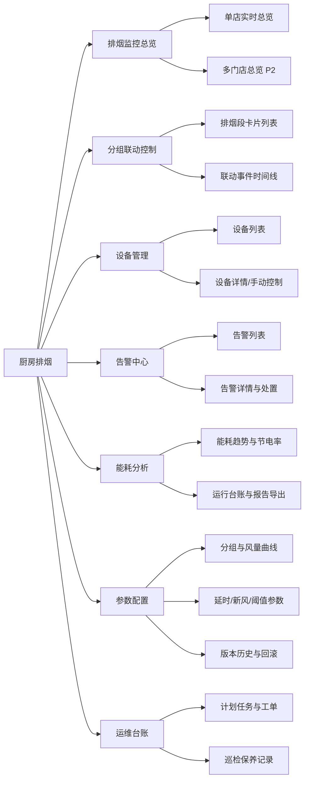

# 商用厨房排烟系统 PLC 分组变频联动控制 —— IoTPlatform 软件化 PRD

## 0. 项目信息

| 项 | 内容 |
| --- | --- |
| 文档语言 | 简体中文 |
| 项目代号 | `kitchen_exhaust_linkage` |
| PRD 类型 | 简单 PRD（不含竞品/市场分析） |
| 撰写人 | 许清楚（产品经理） |
| 输入来源 | `docs/商用厨房排烟系统PLC分组变频联动控制方案.docx`（纯文本底稿 `docs/_content.txt`） |
| 目标平台 | IoTPlatform 多租户 IoT SaaS（.NET 8 / EF Core 8 / MySQL / Redis / MQTTnet / SignalR） |
| 前端仓库 | `H:\IoTPlatform\Web`（React18 + Vite + Tailwind + Radix + MUI + lucide-react + axios） |
| 版本 | v1.0（初稿，待架构师评审） |

### 0.1 原始需求复述

业务方提供了一份**硬件/PLC 控制方案**：在商用厨房场景下，将 1.5–2 米/段的分段式烟罩与炉灶分组一一对应，通过信号采集模块采集每组炉灶开/关状态送入 PLC，由 PLC 执行「炉灶分组触发 → 信号处理与风量累计 → 防火阀同步开启 → 变频排烟主风机按需调速 → 新风协同补风 → 延时关闭复位」的闭环控制，并具备自动/手动/消防应急三种运行模式、全链路电气保护、传感器容错、防火阀状态监控、消防联锁与声光报警，案例节电率达 60%。

**本 PRD 的任务不是重复硬件方案，而是把它翻译为 IoTPlatform 上需要建设的软件能力**：即平台侧的设备建模、协议接入、分组与联动规则、运行模式管理、告警与故障管理、Web 监控看板与手动控制、能耗台账与节能分析、参数配置与运维记录。

### 0.2 边界与设计前提（重要）

1. **实时闭环控制留在边缘 PLC，平台不抢控制权。** 毫秒级的阀-机-风联动、70℃ 熔断、消防联锁必须由 PLC/硬回路自主完成，断网时功能不降级。平台承担的是**参数下发、状态可视、越权兜底、数据沉淀与分析**。
2. **平台侧规则引擎面向"业务级联动"**，例如：跨设备告警联动、按营业时段切换参数集、异常工况下发限速指令、批量门店策略下发。不承担安全联锁职责。
3. **复用优先。** 平台已具备多租户 AppCode 行级隔离（`IHasAppCode` + `HasQueryFilter`）、`Device`/`DeviceSensor`/`ControlledDevice`/`Gateway`/`Area`(树形，`ParentId`) 模型、`DeviceCommand` 命令下发、`AlertRecord`/`AlertService` 告警、`DataRule` + `Services/Rules/RuleEngine.cs` 规则、`WorkOrder` 工单、协议适配器框架（`ansheng_mqtt` 为参考实现）、定时任务(T10)、电量/能耗统计(T11)。本方案**新增的是"厨房排烟"这一垂直业务域的建模、联动与看板**，而非重造底座。
4. **待补齐的平台通用能力**（本 PRD 会显式提出）：设备**分组/分区业务建模**（现有 `Area` 为通用层级树，缺少"排烟段/炉灶组"语义与组内设备角色）、**多条件联动规则引擎**（现有 `DataRule` 仅支持 min/max 阈值型，不支持"多设备状态组合 → 多动作序列 + 延时"）、**HMI 风格实时看板**、**故障分级与容错策略管理**、**能耗台账与节能率分析**。

---

## 1. 产品目标

> 把物理控制逻辑映射为平台软件能力，用 5 条目标界定交付范围。

**G1 —— 把一套厨房排烟系统完整"建模上云"。**
在 IoTPlatform 中沉淀「门店 → 厨房 → 排烟段（炉灶组）→ 设备」四层业务模型，并定义 PLC 网关、信号采集模块、电控防火阀、变频排烟主风机、风机变频器、新风变频风机、新风变频器、HMI、报警模块 9 类设备的**标准物模型（属性/遥测/状态/命令点位）**，实现一套"照着模板 10 分钟建好一家门店"的配置化接入能力。

**G2 —— 让联动闭环在平台侧"可视、可配、可追溯"。**
平台不替代 PLC 执行实时联动，但必须做到：闭环的每一环（哪组炉灶开 → 哪段防火阀开 → 风机跑到多少 Hz → 新风补多少 → 何时延时关闭）都有**实时状态展示 + 全链路联动事件时间线**；分组数量、延时时长（3–5 分钟可调）、单段额定风量、风量匹配曲线、新风联动系数等参数**可在平台配置并下发至 PLC**，无需现场改程序。

**G3 —— 建立面向消防与设备安全的告警闭环。**
覆盖电气保护（过载/过流/短路/过热/欠压）、传感器故障容错（屏蔽异常组并报警）、防火阀开关状态异常/熔断、PLC 通讯中断、消防联锁触发五类故障源，实现「采集 → 分级（提示/警告/严重/消防紧急）→ 实时推送（SignalR + 短信/微信）→ 确认处置 → 转工单 → 归档复盘」的完整链路，消防级事件 **≤3 秒**到达值班人手机。

**G4 —— 用数据证明节能收益。**
自动采集风机/新风的运行频率、功率、电量，建立**运行台账与能耗台账**；以"传统恒速满负荷运行"为基线，自动计算日/月/年**节电量与节电率**（对标方案中 60% 的目标），并输出分组开启时长分布、风机负载率分布、投资回收期测算，为门店与集团提供可对外汇报的节能报告。

**G5 —— 交付多租户、可复制、低运维成本的连锁化能力。**
所有数据基于 `AppCode` 行级隔离；支持**门店模板/参数集**批量下发到同品牌多门店，支持跨门店排行与集团级能耗对比；将月度清洁、季度巡检、年度消防检测等运维动作沉淀为**计划性任务与保养记录**，与现有 `WorkOrder` 工单打通。

---

## 2. 用户故事

### 角色定义

| 角色 | 说明 |
| --- | --- |
| **门店运营 / 后厨管理人员** | 店长、后厨主管。关注排烟是否正常、环境是否舒适、电费是否下降，不懂 PLC。 |
| **运维工程师** | 集成商/物业设备工程师。负责安装调试、参数整定、故障排查、巡检保养。 |
| **平台管理员 / 集团能源管理者** | 品牌方或平台方。关注多门店统一配置、节能总账、合规与权限。 |

### 用户故事清单（12 条）

**门店运营 / 后厨管理人员**

- **US-01**｜作为后厨管理人员，我希望在一块大屏总览上看到每段排烟区的炉灶开关状态、防火阀开闭、风机当前频率与新风补风量，以便一眼判断排烟系统是否正常工作。
- **US-02**｜作为后厨管理人员，我希望在烟罩清洁或设备检修时，能从平台把系统切到手动模式并单独开关某一段防火阀/风机，以便安全地完成作业。
- **US-03**｜作为店长，我希望收到"防火阀未正常开启""风机过载"这类严重告警的即时推送（含具体是第几段/哪台设备），以便第一时间叫人处理而不是等客人投诉。
- **US-04**｜作为店长，我希望看到本店本月的排烟系统用电量、相比传统恒速模式节省了多少度电和多少钱，以便向老板证明这套改造的价值。
- **US-05**｜作为后厨管理人员，我希望能按营业时段（备餐/午市高峰/闲时/打烊）设置不同的延时关闭时间与最低待机风量，以便兼顾排烟效果与电费。

**运维工程师**

- **US-06**｜作为运维工程师，我希望用一套"厨房排烟"设备模板快速完成一家新门店的分组、设备、点位配置，以便把单店上线时间从半天压缩到 1 小时内。
- **US-07**｜作为运维工程师，我希望在平台上直接修改分组数量、延时时间（3–5 分钟）、单段额定风量、风量匹配曲线与新风联动系数并下发到 PLC，且有下发结果回执与版本记录，以便远程完成参数整定、避免每次都跑现场。
- **US-08**｜作为运维工程师，我希望当某组信号采集模块故障时，平台明确告诉我"第 3 组信号中断，已被 PLC 屏蔽，其余 4 组正常运行"，以便精准定位故障点而不用全场排查。
- **US-09**｜作为运维工程师，我希望查看任意时间段的联动事件时间线（炉灶组触发 → 阀开 → 风机调速 → 新风跟随 → 延时关阀），并能与实时曲线对照，以便在调试和事后复盘时验证联动是否精准。
- **US-10**｜作为运维工程师，我希望月度清洁、季度巡检、年度消防检测到期时自动生成待办工单，完成后可上传照片与检测记录，以便留痕并应对消防检查。

**平台管理员 / 集团能源管理者**

- **US-11**｜作为平台管理员，我希望不同品牌/门店的数据严格隔离，并能按角色控制"只读看板/手动控制/参数下发/消防复位"等敏感操作权限，以便避免误操作引发安全事故。
- **US-12**｜作为集团能源管理者，我希望横向对比旗下所有门店的节电率、单位营业时长能耗、告警数量并排名，以便识别运行不佳的门店并推动整改。

---

## 3. 需求池

优先级定义：**P0 = 必须有**（首个可交付版本的最小闭环，缺失则方案不成立）；**P1 = 应该有**（体现方案核心价值，第二迭代交付）；**P2 = 可以有**（增强/规模化能力）。

需求 ID 前缀：`KE`(Kitchen Exhaust) + 维度码。维度码：`MD` 建模接入 / `LK` 分组联动 / `MO` 运行模式 / `AL` 告警故障 / `UI` 看板交互 / `EN` 能耗分析 / `OP` 运维配置。

### 3.1 设备建模与协议接入（KE-MD）

| 需求ID | 维度 | 描述 | 优先级 | 验收要点 |
| --- | --- | --- | --- | --- |
| KE-MD-01 | 业务层级建模 | 扩展/复用 `Area` 树，落地「租户(AppCode) → 门店 → 厨房 → 排烟段」四级业务层级；新增 `KitchenZone`（排烟段/炉灶组）实体，字段含：分组编号、烟罩长度(1.5–2m)、单段额定风量(m³/h)、关联炉灶列表、关联防火阀设备、启用状态、排序。 | **P0** | 1) 可创建/编辑/删除排烟段，分组数量不固定（示例 5 组，支持 1–N）；2) 一个排烟段可挂多台炉灶与恰好 1 套防火阀；3) 所有实体实现 `IHasAppCode`，跨租户查询返回空；4) 删除排烟段时对存量历史数据做软删除保护。 |
| KE-MD-02 | 设备物模型 | 定义 9 类设备的标准物模型模板：PLC 控制器、信号采集模块、变频排烟主风机、电控防火阀、风机变频器、新风变频风机、新风变频器、HMI、报警模块。每类明确：遥测点（如风机频率/电流/功率/累计电量、防火阀开度反馈、炉灶组高低电平）、状态点（在线/离线/故障/模式）、命令点（开阀/关阀/设定频率/启停/复位）、单位与量程。 | **P0** | 1) 提供 JSON 形式的设备模板，可一键实例化生成设备与点位；2) 每个点位有 `code / 名称 / 数据类型 / 单位 / 读写属性 / 上下限`；3) 与现有 `Device`/`DeviceSensor`/`ControlledDevice` 模型兼容，不新造并行体系。 |
| KE-MD-03 | PLC 网关接入适配器 | 新增 `kitchen_plc` 协议适配器，参考 `ansheng_mqtt` 实现：支持 PLC 侧经边缘网关以 **MQTT（首选）** 上报点位快照与变化事件；预留 **Modbus TCP 轮询** 与 **OPC UA** 两种接入模式的适配层接口（具体选型见待确认问题 Q1）。 | **P0** | 1) 适配器可注册进现有协议适配器框架并在 `ProtocolConfig` 中配置；2) 支持点位映射表配置（PLC 寄存器/主题 ↔ 平台点位 code）；3) 上行数据落 `DeviceDataRecord`/时序存储；4) 网关断连触发离线判定（含防抖）。 |
| KE-MD-04 | 设备发现与认领 | 复用安圣设备发现与认领流程范式：新网关上线后进入待认领列表，运维工程师选择所属门店/厨房并绑定设备模板，一键完成设备与点位实例化。 | P1 | 1) 未认领网关不产生业务数据污染；2) 认领后自动按模板生成全部子设备与点位；3) 认领操作有操作日志。 |
| KE-MD-05 | 命令下行通道 | 复用 `DeviceCommand` + `DeviceCommandService` 打通下行控制：开/关指定防火阀、设定风机目标频率、启停新风、模式切换、故障复位。要求**幂等 + 超时重试 + 执行回执 + 命令留痕**。 | **P0** | 1) 每条命令有唯一 ID、下发时间、执行结果、耗时；2) 超时未回执标记为失败并告警；3) 命令记录可按设备/操作人/时间检索。 |
| KE-MD-06 | 边缘离线自治声明 | 在设备模型中显式标注"安全联锁类点位为 PLC 本地执行、平台只读"，平台 UI 对这些点位禁用写操作。 | **P0** | 1) 70℃ 熔断、消防联锁、电气保护动作在平台侧不可写，仅可读与告警；2) UI 上有明确"边缘自治"标识。 |
| KE-MD-07 | 数据上报策略 | 支持按点位配置上报模式：变化上报（状态量）+ 周期上报（遥测量，默认 5s/30s 可调）+ 心跳；支持死区过滤减少无效流量。 | P1 | 1) 状态量变化 ≤2s 内到达平台；2) 周期与死区可按点位配置；3) 单店日数据量在可控范围（提供估算）。 |

### 3.2 分组与联动控制逻辑（KE-LK）

| 需求ID | 维度 | 描述 | 优先级 | 验收要点 |
| --- | --- | --- | --- | --- |
| KE-LK-01 | 联动状态镜像 | 平台建立排烟联动的**实时状态镜像**：每组炉灶触发状态、对应防火阀开/关/异常、当前开启段数、累计需求风量、风机目标/实际频率、新风目标/实际频率、延时倒计时剩余秒数。经 SignalR 实时推送前端。 | **P0** | 1) 现场炉灶开→平台状态刷新 ≤2s；2) 延时关闭倒计时在 UI 上逐秒回读；3) 断线重连后状态自动补齐。 |
| KE-LK-02 | 联动事件时间线 | 将闭环每一环记录为结构化联动事件：`炉灶组触发 / 阀开始开 / 阀开到位 / 风机调速指令 / 风机频率到达 / 新风跟随 / 延时启动 / 延时结束 / 阀关闭 / 风机降速或待机`，含时间戳、触发源、前后值。 | **P0** | 1) 一次完整开-关循环可还原为一条可读时间线；2) 支持按门店/排烟段/时间范围查询导出；3) 时间线与实时曲线可对照查看。 |
| KE-LK-03 | 风量匹配曲线配置 | 平台侧维护"开启段数 → 目标风量 → 目标频率"的匹配表/曲线（含单段额定风量、叠加系数、上下限、最低待机频率），并可下发到 PLC。 | **P0** | 1) 支持 1–N 段的曲线配置与图形化预览；2) 修改后可下发并回执确认；3) 保留历史版本可回滚。 |
| KE-LK-04 | 延时关闭参数管理 | 延时关闭时间（默认 3–5 分钟，可调范围与步长可配）支持按门店/按排烟段配置并下发；平台侧展示剩余延时。 | **P0** | 1) 参数范围校验（不允许配置为 0 或超出安全上限）；2) 下发成功后 PLC 回读值与平台一致。 |
| KE-LK-05 | 新风协同参数 | 配置新风跟随策略：排风量→新风量的比例系数、微正压目标、最小/最大新风频率、跟随延迟。 | P1 | 1) 可配置并下发；2) 看板展示排风/新风实时比值与偏差；3) 偏差超阈值触发提示级告警。 |
| KE-LK-06 | 平台侧业务规则引擎 | 扩展现有 `DataRule` + `RuleEngine`，支持**多条件组合触发 + 多动作序列 + 延时/防抖**的业务级联动规则（IF 多设备状态/遥测组合 THEN 下发命令/发告警/写台账/调用 Webhook）。用于跨设备业务联动，**不承担安全联锁**。 | P1 | 1) 规则可视化配置（条件组 AND/OR、动作列表、延时节点）；2) 规则命中有执行日志与失败重试；3) 规则可启停、可仿真测试；4) 明确禁止把消防/熔断类逻辑配置为平台规则（UI 强提示）。 |
| KE-LK-07 | 联动一致性校验 | 平台周期比对"应然状态 vs 实然状态"（如：第 2 组炉灶在开但第 2 段阀反馈为关、开启 3 段但风机仍在低速），发现不一致即告警。 | P1 | 1) 校验周期可配（默认 30s）；2) 不一致持续 N 个周期才告警（防抖）；3) 告警内容定位到具体段与设备。 |
| KE-LK-08 | 按时段的参数集切换 | 支持定义营业时段参数集（备餐/午高峰/闲时/打烊），结合定时任务(T10)自动切换延时时间、最低待机风量、新风系数。 | P2 | 1) 支持周计划与节假日例外；2) 切换动作有事件记录；3) 与手动/消防模式互斥优先级明确。 |

### 3.3 运行模式与模式切换（KE-MO）

| 需求ID | 维度 | 描述 | 优先级 | 验收要点 |
| --- | --- | --- | --- | --- |
| KE-MO-01 | 模式状态可视 | 平台实时显示系统当前运行模式：`自动 / 手动 / 消防应急`，以及模式来源（平台下发 / HMI 本地 / 物理按钮 / 消防信号）与切换时间。 | **P0** | 1) 模式变化 ≤2s 同步到看板；2) 消防应急模式全局强提示（红色横幅+声音）；3) 记录每次切换的操作人或触发源。 |
| KE-MO-02 | 远程模式切换 | 支持从平台下发"自动 ⇄ 手动"模式切换命令，需二次确认 + 权限校验 + 操作原因备注。 | **P0** | 1) 无权限用户按钮置灰；2) 切换需输入原因，写入操作日志；3) 下发失败有明确错误提示与重试。 |
| KE-MO-03 | 手动控制面板 | 手动模式下，平台可逐段/逐设备控制：开/关指定防火阀、启停风机并设定频率、启停新风。每个操作独立权限与确认。 | **P0** | 1) 仅在手动模式下可操作，自动模式下禁用；2) 操作后 UI 回读实际反馈状态；3) 操作超时/失败明确提示。 |
| KE-MO-04 | 消防应急模式只读与复位 | 消防应急模式下平台**禁止一切控制下发**，仅展示状态、告警与处置指引；恢复需现场确认后由高权限角色执行"复位申请 → 二次确认 → 下发复位"。 | **P0** | 1) 消防态下所有控制按钮硬禁用；2) 复位为独立高危权限；3) 复位全流程留痕（申请人/确认人/时间/现场检查项）。 |
| KE-MO-05 | 模式优先级与冲突处理 | 明确优先级：消防应急 > 本地物理按钮/HMI 手动 > 平台远程手动 > 自动。本地操作发生时平台状态同步更新并提示"已被本地接管"。 | **P0** | 1) 优先级在文档与代码中一致；2) 本地接管时平台不再重复下发；3) 冲突场景有可读提示文案。 |
| KE-MO-06 | 应急演练与巡检模式 | 提供"演练/调试模式"标记：期间产生的动作与告警单独标记，不计入正式告警统计与节能基线。 | P2 | 1) 可开启/关闭并记录时间窗；2) 期间数据带标记且可在报表中排除。 |

### 3.4 告警与故障保护（KE-AL）

| 需求ID | 维度 | 描述 | 优先级 | 验收要点 |
| --- | --- | --- | --- | --- |
| KE-AL-01 | 告警分级模型 | 定义四级告警：`消防紧急(P0)` / `严重(P1)` / `警告(P2)` / `提示(P3)`。消防联锁触发、防火阀熔断归为消防紧急；风机过载/短路/PLC 通讯中断归为严重；传感器故障、阀反馈异常、排风新风失衡归为警告；参数偏离、保养到期归为提示。 | **P0** | 1) 每类故障有唯一告警码与标准文案；2) 分级可在字典中维护；3) 复用 `AlertRecord`/`AlertService`，不新造告警体系。 |
| KE-AL-02 | 电气保护类告警接入 | 接入并展示过载、过流、短路、过热、欠压保护动作事件（来自变频器/PLC 保护字），定位到具体设备与回路。 | **P0** | 1) 保护动作 ≤3s 内产生告警；2) 告警含设备、回路、故障码、原始值；3) 支持故障码到中文说明的映射表。 |
| KE-AL-03 | 传感器故障容错可视 | 当某组信号采集模块故障/信号中断被 PLC 屏蔽时，平台生成"第 N 组已屏蔽"告警，并在看板上将该段标记为"降级运行"，同时明确提示其余分组正常。 | **P0** | 1) 被屏蔽分组在总览上有独立视觉状态；2) 告警文案含分组号与屏蔽起始时间；3) 恢复后自动闭环并记录持续时长。 |
| KE-AL-04 | 防火阀状态监控 | 实时监控每套防火阀的开/关反馈与熔断信号；出现"指令与反馈不符""超时未到位""熔断关闭"时立即告警并联动展示当前风机状态。 | **P0** | 1) 到位超时阈值可配（默认 30s）；2) 熔断即触发消防紧急级告警；3) 告警可下钻到该段的完整联动时间线。 |
| KE-AL-05 | 消防联锁事件记录 | 记录消防信号接入、全阀关闭、风机与新风停机的完整事件链与时间戳，形成可导出的消防事件报告。 | **P0** | 1) 事件链完整且时间戳精确到秒；2) 可导出 PDF/Excel 供消防检查；3) 事件不可被删除，仅可归档。 |
| KE-AL-06 | 实时推送与通知 | 告警经 SignalR 实时推送到 Web 端；严重及以上支持短信/企业微信/邮件外呼，按门店配置接收人与升级策略（N 分钟未确认则升级）。 | **P0** | 1) 消防紧急级 ≤3s 送达；2) 通知渠道与接收人可按租户/门店配置；3) 升级策略可配置并有送达记录。 |
| KE-AL-07 | 告警处置闭环 | 支持确认、认领、备注、挂起、关闭；可一键转 `WorkOrder` 工单派单；记录 MTTA/MTTR。 | P1 | 1) 状态流转完整且有操作人留痕；2) 转工单后双向关联可跳转；3) 报表可统计响应/修复时长。 |
| KE-AL-08 | 声光报警器联动与静音 | 平台可查看现场声光报警器状态，并在有权限时远程静音（不清除告警）；静音需记录原因与自动恢复时间。 | P1 | 1) 静音不改变告警状态；2) 静音有时限并自动恢复；3) 消防紧急级不允许远程静音。 |
| KE-AL-09 | 告警抑制与合并 | 同一设备同一故障码在时间窗内合并为一条（含发生次数）；上级故障（PLC 通讯中断）自动抑制下级衍生告警，避免告警风暴。 | P1 | 1) 合并窗口可配；2) 抑制关系可维护；3) 抑制的告警可展开查看。 |
| KE-AL-10 | 故障知识库 | 每个告警码关联标准处置步骤与常见原因，运维在告警详情页直接可见。 | P2 | 1) 支持富文本与图片；2) 可按告警码检索；3) 处置结果可反哺知识库。 |

### 3.5 看板与人机交互（KE-UI）

| 需求ID | 维度 | 描述 | 优先级 | 验收要点 |
| --- | --- | --- | --- | --- |
| KE-UI-01 | 排烟监控总览页 | 单店总览：分段式烟罩示意图（按实际段数动态渲染）+ 每段炉灶/防火阀/延时倒计时状态 + 风机与新风实时仪表 + 当前模式 + 未处理告警条。SignalR 实时刷新。 | **P0** | 1) 段数 1–N 自适应布局；2) 关键状态色彩语义统一（绿运行/灰待机/黄降级/红故障）；3) 首屏加载 ≤2s，实时刷新无闪烁。 |
| KE-UI-02 | 分组联动控制面板 | 每个排烟段一张卡片：炉灶列表与开关状态、防火阀开关与反馈、该段额定风量、贡献风量占比、延时倒计时；手动模式下卡片内可直接控制。 | **P0** | 1) 卡片内操作受模式与权限双重约束；2) 显示指令下发中/成功/失败三态；3) 可点击下钻到该段时间线。 |
| KE-UI-03 | 设备详情与手动控制页 | 单设备页：基础信息、实时点位、历史曲线、命令下发区、告警历史、维保记录。风机页额外展示频率-功率曲线与负载率。 | **P0** | 1) 历史曲线支持时间范围与多点位叠加；2) 命令区按点位读写属性自动禁用只读点；3) 页面可从总览与告警直达。 |
| KE-UI-04 | 告警中心 | 列表 + 筛选（门店/分段/等级/状态/时间）+ 详情抽屉（时间线、关联设备、处置步骤、转工单）+ 统计卡片。 | **P0** | 1) 支持批量确认；2) 严重及以上置顶并高亮；3) 支持导出。 |
| KE-UI-05 | 能耗分析看板 | 展示日/周/月能耗曲线、节电量与节电率、分组开启时长分布、风机负载率分布、与传统恒速基线的对比柱状图、费用换算。 | P1 | 1) 基线算法可配置并在页面注明口径；2) 支持时间粒度切换与导出；3) 数据缺失区间明确标注不臆造。 |
| KE-UI-06 | 参数配置页 | 集中配置分组定义、延时时间、单段额定风量、风量匹配曲线、新风联动参数、告警阈值；支持"编辑 → 校验 → 预览 → 下发 → 回执"流程与版本历史。 | **P0** | 1) 越界参数拒绝提交并提示安全范围；2) 下发结果逐项回执；3) 可对比与回滚历史版本。 |
| KE-UI-07 | 集团/多门店总览 | 地图或列表形式展示多门店运行状态、告警数、节电率排名，可下钻单店。 | P2 | 1) 严格遵守 AppCode 隔离；2) 支持按品牌/区域筛选；3) 下钻路径清晰。 |
| KE-UI-08 | 现场大屏模式 | 提供适配后厨/控制室大屏的免登录只读看板（Token 授权），大字号、高对比度、自动轮播。 | P2 | 1) 只读无控制入口；2) Token 可撤销与限时；3) 长时间运行无内存泄漏。 |
| KE-UI-09 | 移动端适配 | 总览、告警中心、告警处置在手机浏览器上可用（响应式）。 | P1 | 1) 主要页面在 375px 宽度下可用；2) 告警推送点击可直达详情。 |

### 3.6 能耗数据采集与节能分析（KE-EN）

| 需求ID | 维度 | 描述 | 优先级 | 验收要点 |
| --- | --- | --- | --- | --- |
| KE-EN-01 | 能耗数据采集 | 采集排烟主风机、新风风机的运行频率、电流、功率、累计电量；无电表时支持按"频率-功率曲线 + 运行时长"估算并明确标注为估算值。 | **P0** | 1) 复用现有电量/能耗统计(T11)能力；2) 实测值与估算值在数据与 UI 上可区分；3) 缺数区间不做线性臆造填充。 |
| KE-EN-02 | 运行台账 | 按天/段汇总：各分组开启次数与时长、风机各频段运行时长、启停次数、模式占比、故障次数。 | **P0** | 1) 每日自动生成台账并可回溯重算；2) 可按门店/时间导出 Excel；3) 与联动事件数据一致。 |
| KE-EN-03 | 节能率计算 | 以"传统恒速满负荷运行"为基线（额定功率 × 营业时长），对比实际耗电，计算日/月/年节电量、节电率与电费节省；基线参数（额定功率、营业时长、电价）可配置。 | **P0** | 1) 算法在页面注明公式与口径；2) 参数变更后历史数据不被篡改（按版本计算）；3) 对标方案目标 60% 给出达成度。 |
| KE-EN-04 | 空调关联节能估算 | 基于排风-新风平衡度与运行时长，按可配置系数估算空调侧节能（方案称 30%–40%），**明确标注为估算模型而非实测**。 | P2 | 1) 系数可配且默认保守；2) UI 明确"估算"标识与免责说明；3) 支持接入真实空调电表后切换为实测。 |
| KE-EN-05 | 节能报告导出 | 一键生成月度/年度节能报告（PDF/Excel）：能耗趋势、节电量、节电率、告警统计、改造投资回收期测算。 | P1 | 1) 模板可含品牌 Logo；2) 数据与看板一致；3) 生成 ≤30s。 |
| KE-EN-06 | 设备健康与寿命指标 | 统计风机满负荷时长占比、启停次数、累计运行小时，输出设备磨损指数与保养建议（对应方案"寿命延长 30%+"主张）。 | P2 | 1) 指标定义文档化；2) 超阈值触发提示级告警与保养工单建议。 |

### 3.7 运维与参数配置（KE-OP）

| 需求ID | 维度 | 描述 | 优先级 | 验收要点 |
| --- | --- | --- | --- | --- |
| KE-OP-01 | 参数下发与回执 | 所有可调参数（分组数量、延时时间、单段额定风量、风量匹配、新风联动、故障阈值）走统一"配置下发"通道，支持单项/批量下发、回读校验、失败重试。 | **P0** | 1) 下发后回读值与平台一致方判成功；2) 部分失败可单独重试；3) 全流程留痕含操作人。 |
| KE-OP-02 | 配置版本与回滚 | 参数集版本化，记录变更人/时间/差异，可对比与一键回滚。 | P1 | 1) 差异高亮展示；2) 回滚同样走下发+回读流程；3) 保留至少最近 20 个版本。 |
| KE-OP-03 | 门店模板与批量下发 | 定义"厨房排烟标准模板"（设备结构 + 默认参数），支持新店一键套用，支持向多门店批量下发参数集。 | P1 | 1) 套用后仅需填写差异项；2) 批量下发有逐店结果清单；3) 支持灰度（先下发 N 家）。 |
| KE-OP-04 | 计划性运维任务 | 内置月度清洁、季度巡检、年度消防合规检测三类计划任务，到期自动生成工单/待办；支持自定义周期。 | P1 | 1) 复用定时任务(T10)与 `WorkOrder`；2) 到期与逾期均有提醒；3) 可按门店配置例外。 |
| KE-OP-05 | 巡检与保养记录 | 记录每次清洁/巡检/检测的执行人、时间、检查项结果、照片与附件，形成设备档案。 | P1 | 1) 支持自定义检查项模板；2) 附件走现有 `Attachment`/文件存储；3) 可按设备查看全生命周期记录。 |
| KE-OP-06 | 权限与审计 | 细分权限点：只读看板 / 手动控制 / 参数下发 / 消防复位 / 模板管理；所有控制与配置操作写入 `OperationLog`。 | **P0** | 1) 权限点可分配到角色；2) 无权限操作被服务端拦截（非仅前端置灰）；3) 审计日志不可篡改且可检索。 |
| KE-OP-07 | 调试与验收辅助 | 提供调试清单页，覆盖方案要求的单组联动、多组同步、全负荷、新风协同、延时关闭、故障报警与消防联动测试项，逐项打勾并自动抓取对应时间段数据作为证据。 | P2 | 1) 清单项可配置；2) 每项可关联证据数据/截图；3) 生成 72 小时试运行验收报告。 |
| KE-OP-08 | 数据保留与归档 | 明确遥测/事件/告警/台账的保留周期与降采样归档策略（复用 `DataRetentionHostedService`/`Archive`）。 | P2 | 1) 策略可按租户配置；2) 归档后仍可查询聚合数据；3) 消防事件永不自动删除。 |

### 3.8 需求统计

| 维度 | P0 | P1 | P2 | 小计 |
| --- | --- | --- | --- | --- |
| KE-MD 设备建模与协议接入 | 5 | 2 | 0 | 7 |
| KE-LK 分组与联动控制 | 4 | 3 | 1 | 8 |
| KE-MO 运行模式 | 5 | 0 | 1 | 6 |
| KE-AL 告警与故障保护 | 6 | 3 | 1 | 10 |
| KE-UI 看板与人机交互 | 5 | 2 | 2 | 9 |
| KE-EN 能耗与节能分析 | 3 | 1 | 2 | 6 |
| KE-OP 运维与参数配置 | 2 | 4 | 2 | 8 |
| **合计** | **30** | **15** | **9** | **54** |

> **P0 = 30 条**，构成首个可交付版本（V1）的最小闭环：**建模接入 → 联动状态可视 → 三模式管理 → 告警闭环 → 单店看板 → 能耗台账与节能率 → 参数下发与权限审计**。

---

## 4. UI / 看板设计稿

### 4.0 信息架构



### 4.1 页面一：厨房排烟监控总览（P0，主入口）

**核心目标**：3 秒内让人判断"系统是否正常、哪一段有问题、现在耗多少电"。

```
┌──────────────────────────────────────────────────────────────────────────────┐
│  XX门店 / 一号后厨        模式:[ 自动 ]   ⚠ 未处理告警 2       2026-07-12 11:32│
├──────────────────────────────────────────────────────────────────────────────┤
│  ⛔ 消防应急横幅（仅消防模式下出现，红底闪烁 + 全局禁控提示）                  │
├──────────────────────────────────────────────────────────────────────────────┤
│  【分段式烟罩示意 · 按实际段数动态渲染】                                      │
│   段1 1.8m      段2 1.8m      段3 1.8m      段4 1.8m      段5 1.8m           │
│  ┌─────────┐  ┌─────────┐  ┌─────────┐  ┌─────────┐  ┌─────────┐            │
│  │ 炉灶1-2 │  │ 炉灶3-4 │  │ 炉灶5-6 │  │ 炉灶7-8 │  │炉灶9-10 │            │
│  │ ●● 开   │  │ ○○ 关   │  │ ●○ 开   │  │ ○○ 关   │  │ ⚠ 屏蔽  │            │
│  │ 阀:全开 │  │ 阀:关闭 │  │ 阀:全开 │  │ 阀:关闭 │  │ 阀:关闭 │            │
│  │3600m³/h │  │    —    │  │3600m³/h │  │延时02:47│  │ 信号中断│            │
│  │  ■ 绿   │  │  ■ 灰   │  │  ■ 绿   │  │  ■ 黄   │  │  ■ 红   │            │
│  └─────────┘  └─────────┘  └─────────┘  └─────────┘  └─────────┘            │
├─────────────────────────────────┬────────────────────────────────────────────┤
│ 排烟主风机 15kW                  │ 新风变频风机                               │
│   频率 [====28.5Hz====    ] 50Hz │   频率 [===25.0Hz===     ] 50Hz            │
│   功率 6.1kW   电流 12.4A        │   送风量 6800 m³/h                         │
│   风量 7200/18000 m³/h (40%)     │   排/送比 1.06   微正压 ✔ 正常             │
│   状态 ● 变频运行                 │   状态 ● 跟随运行                          │
├─────────────────────────────────┴────────────────────────────────────────────┤
│ 今日能耗 46.2 kW·h │ 基线 180 kW·h │ 节电 133.8 kW·h │ 节电率 74.3% │ 省 ¥93.7 │
├──────────────────────────────────────────────────────────────────────────────┤
│ 最近告警  ⚠严重 第5组信号采集模块中断，已屏蔽   11:05   [确认] [详情]         │
│           ⚠警告 排风新风比偏离目标 8%          10:41   [确认] [详情]         │
└──────────────────────────────────────────────────────────────────────────────┘
```

- **核心信息**：每段的炉灶/防火阀/风量贡献/延时倒计时；风机与新风实时参数；当日节能速览；未处理告警。
- **核心操作**：点击段卡片下钻分组控制面板；点击风机进入设备详情；点击告警进入详情；右上角模式切换（权限 + 二次确认）。
- **色彩语义**：绿=正常运行，灰=待机/关闭，黄=延时中/参数偏离，红=故障/屏蔽/消防，蓝=指令下发中。

### 4.2 页面二：分组联动控制面板（P0）

**核心目标**：手动模式下逐段安全操作，并可复盘联动是否精准。

```
┌───────────────────── 分组联动控制 · 一号后厨 ─────────────────────────────┐
│  模式: [自动] [手动] [消防]    当前:自动   ⓘ 自动模式下控制按钮不可用      │
├───────────────────────────────────────────────────────────────────────────┤
│ ▸ 排烟段 03  |  炉灶 5、6  |  烟罩 1.8m  |  额定风量 3600 m³/h            │
│   炉灶信号: 5号 ● 开    6号 ○ 关           采集模块 ● 在线                │
│   防火阀:  指令[开]  反馈[全开]  到位耗时 4.2s   熔断 ○ 正常              │
│   贡献风量: 3600 m³/h（占当前总需求 50%）   延时关闭: —                   │
│   [ 开阀 ] [ 关阀 ] ← 手动模式启用，二次确认       [查看时间线 →]         │
├───────────────────────────────────────────────────────────────────────────┤
│ ▸ 排烟段 04  |  炉灶 7、8  |  状态: 延时关闭中 ⏱ 02:47                    │
│   （同结构，延时段以黄色进度条展示剩余时间）                              │
├───────────────────────────────────────────────────────────────────────────┤
│ 全局: 开启段数 2/5   总需求风量 7200 m³/h   目标频率 28.5Hz               │
│       [ 风机启停 ] [ 设定频率 ▁▂▃ ] [ 新风启停 ]  ← 手动模式 + 权限       │
└───────────────────────────────────────────────────────────────────────────┘

【联动事件时间线 · 下钻视图】
11:28:03  炉灶组03 触发开启（信号采集模块 高电平）
11:28:04  防火阀03 收到开启指令
11:28:08  防火阀03 反馈全开（到位耗时 4.2s）
11:28:08  风机目标频率 18.0Hz → 28.5Hz（开启段数 1→2，需求风量 3600→7200 m³/h）
11:28:15  风机实际频率到达 28.5Hz
11:28:16  新风频率 15.0Hz → 25.0Hz（跟随系数 0.94）
11:52:30  炉灶组03 全部关闭 → 启动延时程序（4 分钟）
11:56:30  延时结束 → 防火阀03 关闭 → 风机降速至 18.0Hz
```

### 4.3 页面三：设备详情 / 手动控制（P0）

```
┌── 设备: 排烟主风机 EF-01 (15kW 变频) ─────────── [在线] [自动] ────────┐
│ Tab: 概览 | 实时点位 | 历史曲线 | 命令记录 | 告警 | 维保                │
├────────────────────────────────────────────────────────────────────────┤
│ 概览: 型号/位号/所属厨房/接入网关/协议 kitchen_plc/最近通信 2s 前       │
│       累计运行 1284h  │  启停 3120 次  │  满负荷时长占比 6.2%           │
├────────────────────────────────────────────────────────────────────────┤
│ 实时点位: 频率 28.5Hz │ 电流 12.4A │ 功率 6.1kW │ 累计电量 4821 kW·h    │
│           变频器状态字 0x0000 正常 │ 过载 ○ │ 过热 ○ │ 欠压 ○           │
├────────────────────────────────────────────────────────────────────────┤
│ 历史曲线: [频率][功率][电流] 多点位叠加  范围[今日/7天/30天/自定义]     │
│           ▁▂▃▅▇▅▃▂▁▂▃▅▇▇▅▃▂▁                                          │
├────────────────────────────────────────────────────────────────────────┤
│ 命令下发（手动模式可用）: [启动] [停止]  目标频率 [ 28.5 ] Hz [下发]    │
│   ⓘ 只读点位（70℃熔断 / 消防联锁）标记「边缘自治 · 平台只读」不可操作   │
└────────────────────────────────────────────────────────────────────────┘
```

### 4.4 页面四：告警中心（P0）

```
┌─ 告警中心 ───────────────────────────────────────────────────────────────┐
│ 统计: 消防紧急 0 │ 严重 1 │ 警告 3 │ 提示 5     MTTA 4.2min  MTTR 38min  │
│ 筛选: [门店▾][排烟段▾][等级▾][状态▾][时间▾]        [批量确认] [导出]     │
├────┬────────┬────────────────────────┬───────┬──────────┬─────┬────────┤
│等级│ 门店   │ 告警内容                │ 对象  │ 首次时间 │次数 │ 状态   │
├────┼────────┼────────────────────────┼───────┼──────────┼─────┼────────┤
│严重│ 望京店 │ 第5组信号采集模块中断   │ SS-05 │ 11:05:12 │ 1   │ 待处理 │
│警告│ 望京店 │ 排风/新风比偏离目标 8%  │ FA-01 │ 10:41:07 │ 3   │ 已确认 │
│提示│ 中关村 │ 防火阀季度巡检到期      │ FD-02 │ 09:00:00 │ 1   │ 已派单 │
└────┴────────┴────────────────────────┴───────┴──────────┴─────┴────────┘

【详情抽屉】告警码 KE-AL-SENSOR-LOST ｜ 严重
  ├ 影响面: 第5组已被 PLC 屏蔽，降级运行；第1–4组正常
  ├ 时间线: 11:05:12 信号中断 → 11:05:14 PLC 屏蔽该组 → 11:05:15 平台告警
  ├ 关联数据: 该组最近 1h 信号曲线（断点高亮）
  ├ 处置建议: ① 检查采集模块供电 ② 清洁模块表面油污 ③ 检查接线端子
  └ 操作: [确认] [认领] [静音(消防级禁用)] [转工单] [关闭并填写处置结果]
```

### 4.5 页面五：能耗分析看板（P1）

```
┌─ 能耗与节能分析 · 望京店 · 2026-06 ──────────────────────────────────────┐
│ [日] [周] [月] [年]     对比基线: 传统恒速满负荷（15kW × 12h/日）        │
├───────────────┬───────────────┬───────────────┬─────────────────────────┤
│ 实际用电      │ 基线用电      │ 节电量        │ 节电率                  │
│ 2160 kW·h     │ 5400 kW·h     │ 3240 kW·h     │ 60.0%  ✔ 达成目标       │
├───────────────┴───────────────┴───────────────┴─────────────────────────┤
│ 日能耗趋势（实际 vs 基线）                                               │
│ 180 ┤▔▔▔▔▔▔▔▔▔▔▔▔▔▔▔▔▔▔▔▔▔▔▔▔  基线                                   │
│  90 ┤                                                                   │
│  72 ┤▃▄▃▅▄▃▄▅▆▄▃▄▃▅▄▃▄▅▄▃▄▃▄▅  实际                                    │
│     └─1───5───10───15───20───25───30 日                                 │
├───────────────────────────────┬──────────────────────────────────────────┤
│ 风机频段运行时长分布           │ 各排烟段开启时长 Top                     │
│ 待机<15Hz ████████ 38%         │ 段1 ███████████ 6.2 h/日                │
│ 15–25Hz   ██████ 27%           │ 段3 ████████ 4.8 h/日                   │
│ 25–35Hz   ████ 21%             │ 段2 █████ 3.1 h/日                      │
│ 35–50Hz   ██ 14%               │ 段4 ██ 1.4 h/日                         │
├───────────────────────────────┴──────────────────────────────────────────┤
│ 电费节省 ¥2,268/月（电价 0.7 元/kW·h，可配）                             │
│ 空调侧关联节能（估算 · 非实测）约 30%  ⓘ 基于排风新风平衡度模型          │
│ 改造投资回收期测算: 约 8.2 个月                    [导出月度节能报告]    │
└──────────────────────────────────────────────────────────────────────────┘
```

### 4.6 页面六：参数配置（P0）

```
┌─ 参数配置 · 望京店/一号后厨 ──────────── 版本 v7（2026-06-28 张工）─────┐
│ Tab: 分组定义 | 风量匹配曲线 | 延时与新风 | 告警阈值 | 版本历史          │
├─────────────────────────────────────────────────────────────────────────┤
│ 【分组定义】分组数量 [5]                             (+ 新增排烟段)      │
│   段1  炉灶[1,2]  烟罩[1.8]m  额定风量[3600]m³/h  防火阀[FD-01]         │
│   段2  炉灶[3,4]  烟罩[1.8]m  额定风量[3600]m³/h  防火阀[FD-02]         │
│   ...                                                                   │
│ 【风量匹配曲线】开启段数 → 目标风量 → 目标频率                          │
│   1段 3600→18.0Hz  2段 7200→28.5Hz  3段 10800→36.0Hz                    │
│   4段 14400→43.0Hz 5段 18000→50.0Hz     待机最低 [12.0] Hz              │
│   [曲线预览图]                                                          │
│ 【延时与新风】延时关闭 [4] 分钟（允许 3–5）  新风跟随系数 [0.94]         │
│               微正压目标 [5] Pa   新风频率上下限 [10]–[50] Hz           │
├─────────────────────────────────────────────────────────────────────────┤
│ 变更差异: 延时关闭 3min → 4min ； 段3额定风量 3400 → 3600               │
│ [ 校验 ] [ 预览下发内容 ] [ 下发到 PLC ] [ 回滚到 v6 ]                  │
│ 下发回执: ✔ 延时参数 成功(回读一致)  ✔ 段3风量 成功  ⏳ 曲线 下发中...   │
└─────────────────────────────────────────────────────────────────────────┘
```

### 4.7 页面七：运维台账（P1）

列表 + 日历双视图，展示**月度清洁 / 季度巡检 / 年度消防合规检测**的计划与执行情况。每条记录包含：执行人、执行时间、检查项勾选结果、照片与附件、关联工单号、下次到期日。支持按设备查看全生命周期维保历史，支持逾期高亮与批量派单。

---

## 5. 待确认问题（Open Questions）

> 以下问题**直接影响架构选型与工作量**，建议在架构设计评审前由业务方/集成商给出答复。已标注推荐倾向供讨论。

### 5.1 通信与接入（最高优先级，阻塞架构设计）

| 编号 | 问题 | 影响 | 推荐倾向 |
| --- | --- | --- | --- |
| **Q1** | PLC 上行到平台采用什么协议？MQTT（经边缘网关转换）/ Modbus TCP 轮询 / OPC UA / 厂商私有网关？PLC 具体品牌型号（西门子 S7-200 SMART？汇川？台达？信捷？） | 决定适配器实现方式、是否需要边缘网关软件、实时性上限 | 推荐 **PLC + 边缘网关 → MQTT 上云**，复用平台 MQTTnet 与 `ansheng_mqtt` 范式；若只能 Modbus，则需新增轮询型适配器与边缘侧缓存 |
| **Q2** | 现场是否已有/愿意部署**边缘网关**（工控机或网关盒子）？还是要求平台直连 PLC？ | 决定断网自治、数据缓存补传、协议转换责任归属 | 强烈推荐部署边缘网关：断网可缓存补传，且不把 PLC 直接暴露到公网 |
| **Q3** | 平台是否需要**下发写入**到 PLC（参数、模式、手动控制）？现场是否允许云端写权限？ | 若不允许写，KE-MD-05 / KE-MO-02/03 / KE-OP-01 需降级为"只读监控 + 现场 HMI 操作" | 建议允许写，但对安全联锁类点位硬性只读，并做双重确认与审计 |
| **Q4** | PLC 侧点位表（IO 表 / 寄存器地址表 / 数据块定义）能否提供？是否已有标准化命名？ | 直接决定 KE-MD-02/03 的工期，无点位表无法建模 | 需要业务方提供 Excel 点位表；若无，需现场配合导出 |

### 5.2 业务建模

| 编号 | 问题 | 影响 | 推荐倾向 |
| --- | --- | --- | --- |
| **Q5** | 「一段排烟区」在平台如何建模？扩展现有 `Area` 树增加 `Type=exhaust_zone`，还是新建独立 `KitchenZone` 实体？ | 影响数据模型与查询过滤复杂度 | 推荐**新建 `KitchenZone` 实体并挂在 `Area` 树下**：`Area` 保留通用层级（门店/厨房），`KitchenZone` 承载排烟段业务语义（额定风量、烟罩长度、阀绑定） |
| **Q6** | 多租户下的层级到底是几层？`AppCode(品牌) → 门店 → 厨房 → 排烟段`，还是还有"区域/城市公司"层？一个租户下门店规模量级？ | 影响 `Area` 层级设计、权限模型、多店总览性能 | 需要业务方明确组织架构与规模（10 店 / 100 店 / 1000 店 的方案不同） |
| **Q7** | 「炉灶」是否需要作为独立设备建模（有自己的点位与档案），还是仅作为排烟段下的一个状态位（组内高/低电平）？ | 方案文档中信号采集是**按组**采集高低电平，不是按单台炉灶 | 倾向：V1 按**组**建模（与硬件一致，不臆造单灶粒度）；若后续要单灶能耗，再扩展 |
| **Q8** | 一个厨房是否可能有**多台排烟主风机 / 多套系统**？多个厨房是否共用一台风机？ | 影响风量汇总算法与模型基数（1:N 还是 M:N） | 需确认；模型上建议预留 `系统(ExhaustSystem)` 概念，V1 按"1 厨房 1 系统 1 主风机 + 1 新风"实现 |

### 5.3 控制逻辑归属

| 编号 | 问题 | 影响 | 推荐倾向 |
| --- | --- | --- | --- |
| **Q9** | 联动闭环（阀-机-风）由**边缘 PLC 执行**还是**平台规则引擎执行**？ | 这是本方案最关键的架构分歧点，决定 KE-LK-06 的定位与实时性 SLA | **强烈建议：安全与实时联动全部由 PLC 本地执行**，平台只做参数下发 + 状态镜像 + 业务级规则（时段策略、跨设备告警联动）。理由：断网不能停排烟，消防联锁不容许云端延迟 |
| **Q10** | 平台侧规则引擎是否需要支持"下发控制指令"这类写动作？还是只允许告警/通知类动作？ | 影响安全边界与合规风险 | 建议 V1 仅允许"告警/通知/写台账"，写控制指令走白名单 + 高危权限 |
| **Q11** | 消防联锁信号是否需要上报平台？平台是否承担任何消防责任（如通知消防中心）？ | 涉及合规责任边界 | 建议：平台**只记录与通知，不承担消防联动执行责任**，需在合同/文档中明确免责 |
| **Q12** | 「延时关闭」倒计时由 PLC 维护并上报剩余秒数，还是平台根据关闭事件自行推算？ | 影响 UI 倒计时准确性 | 优先要求 PLC 上报剩余秒数；若 PLC 不支持，平台按事件推算并标注为"估算" |

### 5.4 数据与业务口径

| 编号 | 问题 | 影响 | 推荐倾向 |
| --- | --- | --- | --- |
| **Q13** | 能耗数据来源：风机/新风回路是否加装**独立电表**？还是只能用变频器输出功率/累计电量？还是完全靠"频率-功率曲线"估算？ | 直接决定 KE-EN-01 的数据可信度与节能报告的说服力 | 强烈建议加装独立电表（至少排烟主回路一块）；否则节能报告只能标注"估算" |
| **Q14** | 节能率的**基线口径**如何认定？按风机额定功率 × 营业时长（方案示例口径），还是取改造前实测数据？营业时长如何取（固定 12h 还是按实际开店时长）？ | 影响节能率数字与对外汇报可信度 | 建议支持两种口径可配：默认"额定功率×实际营业时长"，有改造前实测数据时优先用实测 |
| **Q15** | 电价如何取？固定单价还是分时电价（峰平谷）？是否需要按门店配置？ | 影响费用换算准确性 | 建议支持按门店配置固定电价（V1）+ 分时电价（P2） |
| **Q16** | 空调侧节能 30%–40% 是否需要在平台呈现？如需要，是否会接入空调侧真实能耗数据？ | 若无实测数据，只能给估算模型，存在夸大风险 | 建议 V1 弱化展示或明确标注"估算"，避免合规/信任风险 |

### 5.5 交互与运营

| 编号 | 问题 | 影响 | 推荐倾向 |
| --- | --- | --- | --- |
| **Q17** | 现场 7 寸 HMI 与平台 Web 是**功能对等**还是**分工**？平台是否需要 100% 复刻 HMI 的所有操作？ | 影响 UI 工作量 | 建议分工：HMI 负责现场应急与本地操作；平台负责远程监控、参数管理、数据分析、多店管理 |
| **Q18** | 告警通知渠道：短信 / 企业微信 / 钉钉 / 邮件 / App 推送，实际需要哪些？是否已有可用的通道账号与额度？ | 影响 KE-AL-06 集成工作量 | 需业务方确认并提供通道资源 |
| **Q19** | 是否需要**现场大屏/免登录看板**？后厨是否具备展示条件？ | 决定 KE-UI-08 是否纳入范围 | 待确认，暂列 P2 |
| **Q20** | 试点范围与验收标准：先做几家门店？验收以什么为准（72 小时试运行 + 节电率达标？） | 影响项目节奏与 V1 范围裁剪 | 建议先 1–2 家试点跑通全链路，再规模化推广 |

---

## 6. 交付节奏建议（供架构师参考，非强约束）

| 阶段 | 范围 | 说明 |
| --- | --- | --- |
| **V1 · 最小闭环**（P0 30 条） | 建模接入 + 联动状态镜像 + 三模式 + 告警闭环 + 单店看板 + 能耗台账与节能率 + 参数下发 + 权限审计 | 目标：1 家试点门店可上线运行并出具节能数据 |
| **V2 · 能力增强**（P1 15 条） | 设备发现认领、业务规则引擎、联动一致性校验、告警处置闭环与抑制、能耗报告、配置版本与模板批量下发、计划性运维 | 目标：具备多店复制能力与运维闭环 |
| **V3 · 规模化**（P2 9 条） | 多门店总览、大屏模式、时段参数集、空调关联估算、设备健康指标、调试验收辅助、数据归档 | 目标：集团级能源管理与规模化运营 |

---

## 7. 风险提示

1. **安全责任边界风险（最高）**：一旦平台承担了消防/安全联锁的执行职责，网络抖动即可能演变为安全事故。必须在架构与合同层面明确"边缘自治、云端辅助"，见 Q9/Q11。
2. **数据可信度风险**：无独立电表时节能率仅为估算，对外汇报存在夸大风险，需在 UI 与报告中显著标注口径，见 Q13/Q14/Q16。
3. **点位表缺失风险**：无 PLC 点位表则 KE-MD 全部需求无法启动，属于**前置阻塞项**，需尽早催办，见 Q4。
4. **现场改造依赖**：信号采集模块、防火阀反馈信号、电表等硬件到位情况直接决定平台能拿到多少数据，软件无法凭空补齐。
5. **多租户规模未知**：若单租户门店数达千级，多店总览与实时推送需提前做分片与降频设计，见 Q6。

---

*文档结束 · v1.0 · 待架构师评审*
