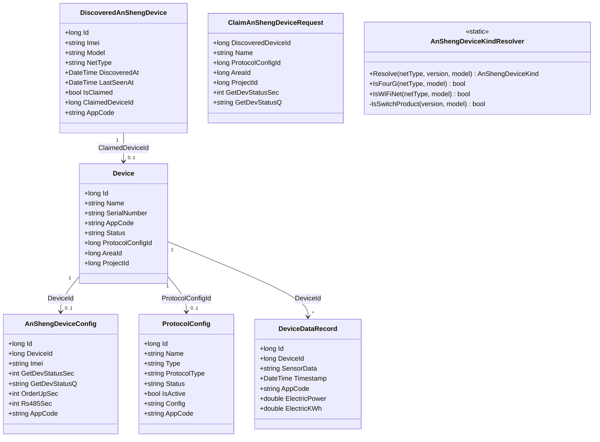
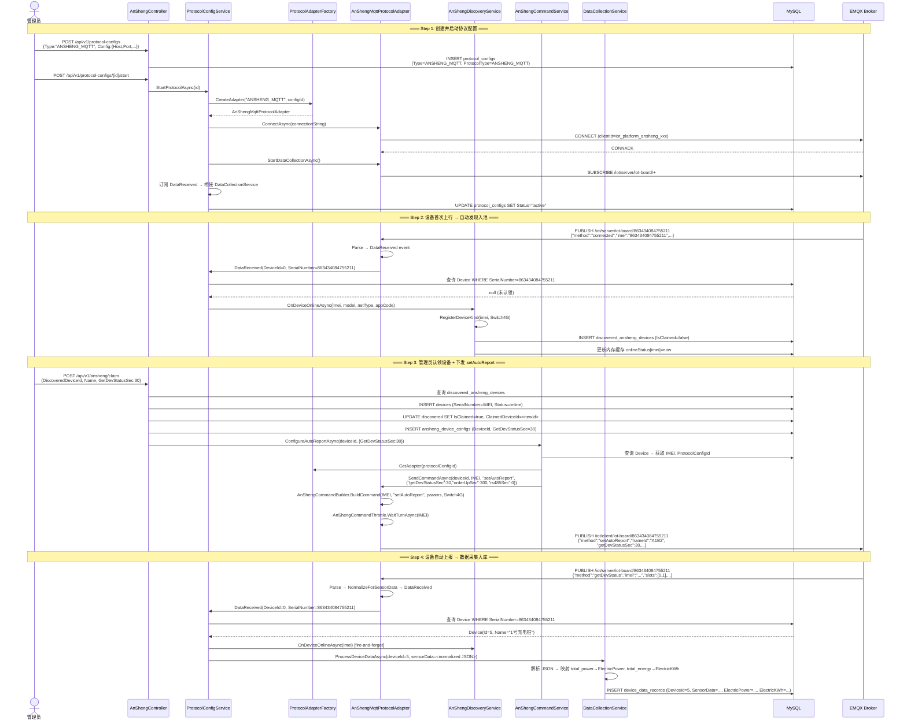

# 安圣 4G 开关 Phase 2 端到端链路 — 系统设计

## Part A: 系统设计

### 1. Implementation Approach

**核心策略：最小变更、最大复用。**

Phase 2 的基础设施在 Phase 1 已基本就绪——协议适配器事件桥接、设备自动发现入池、数据采集管道均已实现。Phase 2 的核心工作是**修一个 Bug + 补齐一个功能点 + 打通整条链路**：

1. **修复 DeviceKind 识别**：`AnShengDeviceKindResolver.IsFourG()` 未覆盖 EC7 前缀模组（真机 Air780EPM / EC718EPM），导致品类误判为 Unknown，影响 timestamp 注入逻辑。修复方案：新增 `EC7` 前缀匹配。
2. **认领流程补齐 setAutoReport**：当前 `ClaimDevice` 接口只创建设备记录，不下发 `setAutoReport`。需在认领成功后自动下发自动上报配置（`getDevStatusSec=30`），让设备开始周期性推送。
3. **端到端链路贯通**：创建 ANSHENG_MQTT 协议配置 → 启动适配器 → 设备上行 → 自动发现入池 → 认领 → 下发 setAutoReport → 自动上报数据 → DataCollectionService 解析入库。

**技术选型**：无新增框架/库，完全复用现有 .NET 8 / EF Core 8 / MQTTnet / MySQL 栈。

---

### 2. File List

#### 2.1 修改文件

| 文件路径 | 变更类型 | 说明 |
|---------|---------|------|
| `Infrastructure/Protocol/AnSheng/AnShengDeviceKind.cs` | 修改 | `IsFourG()` 新增 EC7 前缀匹配 |
| `Controllers/AnShengController.cs` | 修改 | `ClaimDevice` 认领后自动下发 setAutoReport |
| `DTOs/Requests/AnShengRequests.cs` | 修改 | `ClaimAnShengDeviceRequest` 新增 autoReport 参数 |
| `Services/Interfaces/IAnShengCommandService.cs` | 修改 | (可选) 新增 `ClaimAndConfigureAsync` 方法签名 |
| `Services/AnShengCommandService.cs` | 修改 | (可选) 实现 `ClaimAndConfigureAsync` |

#### 2.2 新增文件

无。Phase 2 不需要新增文件。

#### 2.3 不变文件（但关键链路）

| 文件路径 | 说明 |
|---------|------|
| `Infrastructure/Protocol/Adapters/AnShengMqttProtocolAdapter.cs` | 上行/下行适配器，已完整 |
| `Infrastructure/Protocol/AnSheng/AnShengMessageParser.cs` | 报文解析，已完整 |
| `Services/ProtocolConfigService.cs` | 适配器→DiscoveryService 桥接，已实现 |
| `Services/AnShengDiscoveryService.cs` | 设备发现/自动入池，已实现 |
| `Services/DataCollectionService.cs` | 数据解析入库，已实现 |

---

### 3. Data Structures and Interfaces



---

### 4. Program Call Flow

#### 4.1 端到端主流程



---

### 5. Anything UNCLEAR

| # | 问题 | 当前假设 |
|---|------|---------|
| 1 | `ProtocolConfig.Type` 字段的值约定：工厂匹配 "ANSHENG_MQTT"，但 `CreateProtocolConfigRequest` 中传入的 `Type` 究竟填什么？ | 假设前端传入 `Type="ANSHENG_MQTT"`，`ProtocolType` 由后端自动设置为 `"ANSHENG_MQTT"` |
| 2 | 认领时 `setAutoReport` 的默认参数：`getDevStatusSec` 设为 30（联调验证值），`orderUpSec=300`，`rs485Sec=0` | 使用 appsettings.json 中 `AnShengMqtt.DefaultAutoReport` 配置（当前 getDevStatusSec=60），可通过请求参数覆盖 |
| 3 | `ClaimDevice` 需不需要等待 `setAutoReport` 设备应答后才返回？ | 不下发等应答——`setAutoReport` 异步 fire-and-forget，认领接口立即返回成功 |
| 4 | `ProtocolConfigService.StartProtocolAsync` 中 `protocolType = config.Type.ToUpperInvariant()`，如果 Type 填了 "ANSHENG_MQTT" 但实际应该匹配哪个 key？ | 工厂中 key="ANSHENG_MQTT" 已注册，一致即可 |

---

## Part B: 任务分解

### 6. Required Packages

无新增第三方包。Phase 2 完全复用现有依赖：
```
- Microsoft.EntityFrameworkCore@8.x (已有)
- MQTTnet@4.x (已有)
```

---

### 7. Task List (ordered by dependency)

| Task ID | Task Name | Source Files | Dependencies | Priority |
|---------|-----------|-------------|-------------|----------|
| **T01** | 修复 DeviceKind 识别 + 认领链路增强 | `Infrastructure/Protocol/AnSheng/AnShengDeviceKind.cs`, `Controllers/AnShengController.cs`, `DTOs/Requests/AnShengRequests.cs` | 无 | P0 |
| **T02** | 端到端冒烟测试 | 无代码（操作手册） | T01 | P1 |

---

### T01 详细说明

**任务名称**：修复 DeviceKind 识别 + 认领链路增强

**目标**：
1. `AnShengDeviceKindResolver.IsFourG()` 新增 `EC7` 前缀匹配规则，使 EC718EPM 真机被正确识别为 4G 品类
2. `ClaimDevice` API 在认领成功后自动创建 `AnShengDeviceConfig` 并下发 `setAutoReport`

**具体变更**：

#### 变更 1：`AnShengDeviceKind.cs` — `IsFourG()` 添加 EC7 规则

```csharp
// 修改前
if (model.Contains("EC618", StringComparison.OrdinalIgnoreCase)) return true;

// 修改后
if (model.Contains("EC618", StringComparison.OrdinalIgnoreCase)) return true;
if (model.Contains("EC7", StringComparison.OrdinalIgnoreCase)) return true;  // EC718EPM 等
```

同样的规则在 `IsSwitchProduct()` 中也要确认：当前 `version.StartsWith("SWITCH")` 已覆盖 "SWITCH-EC718EPM-O-V4.0.21"，无需改动。

#### 变更 2：`AnShengRequests.cs` — `ClaimAnShengDeviceRequest` 新增字段

```csharp
public class ClaimAnShengDeviceRequest
{
    // ... 现有字段不变 ...
    
    /// <summary>自动上报间隔（秒），0=不开启。默认 30</summary>
    public int? GetDevStatusSec { get; set; }
    
    /// <summary>自动上报查询参数</summary>
    public string? GetDevStatusQ { get; set; }
}
```

#### 变更 3：`AnShengController.cs` — `ClaimDevice` 增加 autoReport 逻辑

认领流程末段（创建设备 + 更新 discovered 后），新增：

```csharp
// 5. 如果请求了自动上报，创建配置并下发 setAutoReport
if (request.GetDevStatusSec is > 0 or null)
{
    var sec = request.GetDevStatusSec ?? 30;
    var config = new AnShengDeviceConfig
    {
        DeviceId = device.Id,
        AppCode = device.AppCode,
        Imei = discovered.Imei,
        GetDevStatusSec = sec,
        GetDevStatusQ = request.GetDevStatusQ,
        OrderUpSec = 300,
        Rs485Sec = 0
    };
    _db.Set<AnShengDeviceConfig>().Add(config);
    await _db.SaveChangesAsync();

    // 下发 setAutoReport（fire-and-forget，不阻塞认领响应）
    _ = _commandService.ConfigureAutoReportAsync(device.Id, new AnShengAutoReportSettings
    {
        GetDevStatusSec = sec,
        GetDevStatusQ = request.GetDevStatusQ,
        OrderUpSec = 300,
        Rs485Sec = 0
    });
}
```

---

### T02 详细说明

**任务名称**：端到端冒烟测试

**目标**：验证从协议配置创建到数据入库的完整链路。

**测试步骤**（操作手册形式，不需要代码）：

1. **创建协议配置**
   - 调用 `POST /api/v1/protocol-configs`，body:
     ```json
     {
       "name": "安圣4G开关-MQTT",
       "type": "ANSHENG_MQTT",
       "protocolType": "ANSHENG_MQTT",
       "config": {
         "Host": "120.79.3.248",
         "Port": 18883,
         "Username": "admin",
         "Password": "public",
         "ClientIdPrefix": "iot_platform_ansheng",
         "CleanSession": true,
         "QosLevel": 1,
         "PublishTopicPattern": "/iot/server/iot-board/+",
         "WillTopicPattern": "/iot/server/iot-board/+",
         "SubscribeTopicTemplate": "/iot/client/iot-board/{imei}",
         "CommandMinIntervalMs": 100,
         "TimeoutSeconds": 30,
         "KeepAliveSeconds": 60
       }
     }
     ```
   - 验证：返回 200，记录返回的 `id`

2. **启动协议**
   - 调用 `POST /api/v1/protocol-configs/{id}/start`
   - 验证：日志显示 "安圣 MQTT 协议适配器连接成功"、"已订阅安圣数据主题"

3. **验证设备自动发现**
   - 让设备上电/上线（确认 MQTT 已连接）
   - 调用 `GET /api/v1/ansheng/discovered`
   - 验证：返回列表包含 IMEI=863434084755211，IsClaimed=false，Model/NetType 已填充

4. **认领设备**
   - 调用 `POST /api/v1/ansheng/claim`，body:
     ```json
     {
       "discoveredDeviceId": <上一步返回的id>,
       "name": "1号充电桩-4G",
       "protocolConfigId": <协议配置id>,
       "getDevStatusSec": 30
     }
     ```
   - 验证：返回 200，DeviceId > 0
   - 验证：日志显示 "安圣命令已发送: Method=setAutoReport"

5. **验证自动上报数据入库**
   - 等待 60 秒（给设备 2 个上报周期）
   - 调用 `GET /api/v1/data-records?deviceId=<deviceId>&pageSize=5`
   - 验证：返回至少 1 条记录，SensorData 包含 `method:"getDevStatus"`、`slots`、`total_power` 等字段
   - 验证：`ElectricPower` / `ElectricKWh` 字段已从 `total_power` / `total_energy` 正确映射

6. **验证品类识别正确**
   - 查看日志：应包含 "识别安圣设备品类: IMEI=863434084755211, Kind=4G开关"
   - 若日志显示 "未知品类"，则 T01 的 EC7 修复未生效

---

### 8. Shared Knowledge

```
- ProtocolConfig.Type 字段：工厂匹配规则以 ToUpperInvariant() 为准，"ANSHENG_MQTT" → AnShengMqttProtocolAdapter
- IMEI 存储规范：Device.SerialNumber = 设备 IMEI（15 位数字字符串）
- 时序要求：同一 IMEI 两条下行命令间隔 ≥100ms（AnShengCommandThrottle 保证）
- 品类识别链：上行报文 netType/model/version → AnShengDeviceKindResolver.Resolve() → DeviceKinds 缓存
- 离线判定：只看 method=="close"，不看 topic 前缀
- AppCode 隔离：通过 IHasAppCode + EF Core Global Query Filter 实现（已有）
- setAutoReport 参数：getDevStatusSec 为 0 表示关上报，非 0 时不能小于 30
- EMQX 特性：重叠订阅不去重，同一 pattern 只订阅一次
- 遗嘱 topic：与数据 topic 相同（/iot/server/iot-board/+），适配器已处理去重
```

---

### 9. Task Dependency Graph


---

## 附录：关键设计决策（需拍板）

| # | 决策点 | 推荐方案 | 备选方案 |
|---|--------|---------|---------|
| 1 | 认领时 `setAutoReport` 的默认间隔 | **30 秒**（联调验证值，快速验证） | 60 秒（appsettings 默认），或由调用方决定 |
| 2 | `setAutoReport` 应答处理 | **fire-and-forget**（不等待设备应答） | 阻塞等待 result="ok" 后才返回（可能超时） |
| 3 | `ProtocolConfig.Type` 字段语义 | 前端传 `"ANSHENG_MQTT"`，后端 `ProtocolType` 自动同步 | 前端传 `"mqtt"`，靠 `ProtocolType` 区分 |
| 4 | 是否需要新 Migration | **不需要**（所有表已在 Phase 1 创建，无 schema 变更） | — |
| 5 | `IsFourG` 修复范围 | 仅在 `AnShengDeviceKind.cs` 添加 EC7 匹配 | 同时检查 firmware version 中的 EC7 前缀 |
